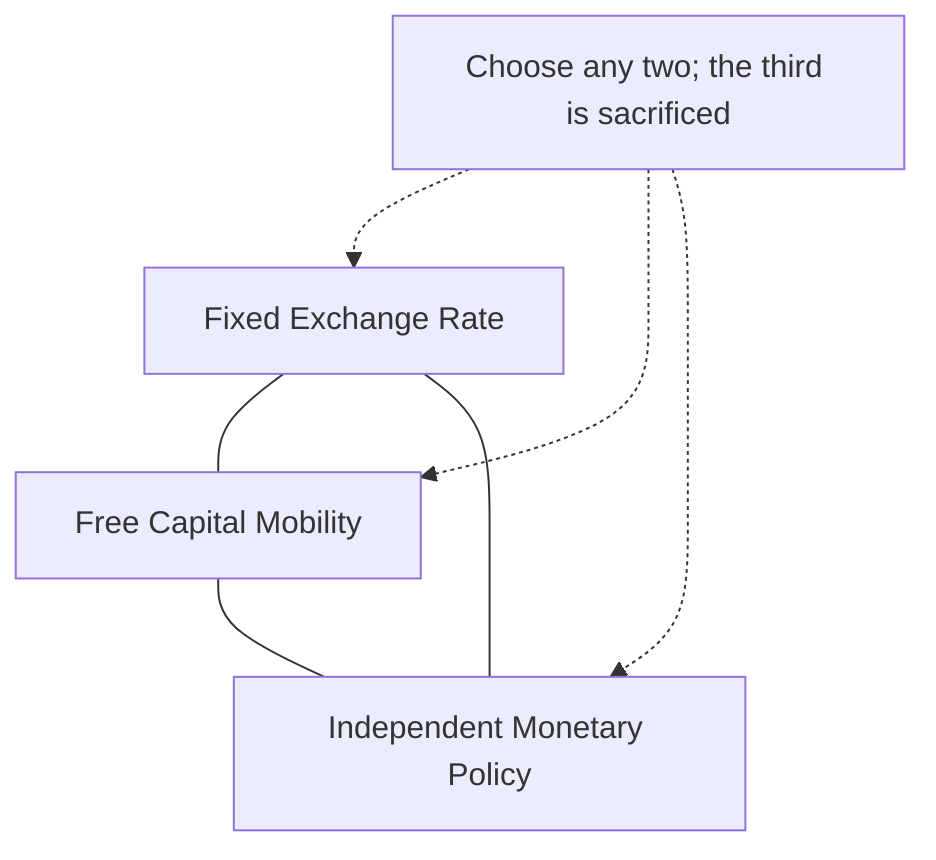

## Exchange Rate Targeting

### Definition and Role

Exchange rate targeting is a monetary policy framework in which a central bank commits to maintaining the value of its domestic currency at, or within a specified band around, a fixed level relative to a reference currency (or basket of currencies), using monetary policy instruments — chiefly interest rates and direct foreign exchange market intervention — to defend that parity rather than pursuing an independent domestic objective such as an inflation or monetary target. Exchange rate targeting effectively imports the monetary policy stance (and, if credible, the inflation performance) of the anchor country or currency area.

### Theoretical Rationale

**Key Points**

- **Imported credibility**: a country with a history of high or volatile inflation, or weak institutional central bank credibility, can anchor domestic inflation expectations by credibly pegging to the currency of a low-inflation, high-credibility economy, effectively borrowing that country's monetary policy discipline
- **Trade and price stability for small open economies**: for economies with a very high trade share relative to GDP or heavy dependence on a dominant trading partner's currency for invoicing, exchange rate stability can reduce transaction costs, hedging needs, and price volatility for traded goods
- **Simplicity and transparency**: an exchange rate target is easily observable by the public and financial markets in real time, in contrast to inflation targets, which depend on forecasts and index methodology that are harder for the average person to verify directly

$$e_t = \bar{e} \quad \text{(fixed peg)} \quad \text{or} \quad \bar{e} - b \leq e_t \leq \bar{e} + b \quad \text{(band/crawling peg)}$$

where $e_t$ is the exchange rate, $\bar{e}$ is the announced central parity, and $b$ is the permitted band width.

### Taxonomy of Exchange Rate Regimes

| Regime Type | Description | Degree of Commitment |
| --- | --- | --- |
| **Hard peg / Currency board** | Domestic currency fully backed by, and freely convertible into, the anchor currency at a fixed rate, often by law | Very high (institutionally rigid) |
| **Conventional fixed peg** | Currency pegged to a single currency or basket, with occasional realignment possible | High but adjustable |
| **Crawling peg** | Parity adjusted at a pre-announced, gradual rate (often to accommodate an inflation differential with the anchor country) | Moderate-high |
| **Target zone / Band** | Currency permitted to float within an announced band around a central parity | Moderate |
| **Managed float** | Authorities intervene periodically without a pre-announced target level or band | Low-moderate |
| **Free float** | No target level; exchange rate determined by market forces, central bank does not target it | None (not exchange rate targeting) |

### The Impossible Trinity Constraint

**Key Points**

- Exchange rate targeting is fundamentally constrained by the Mundell-Fleming **impossible trinity (trilemma)**: a country cannot simultaneously maintain (1) a fixed exchange rate, (2) free capital mobility, and (3) an independent monetary policy
- A country pursuing exchange rate targeting with open capital markets must set its domestic interest rate to whatever level is needed to defend the peg, regardless of domestic cyclical conditions — sacrificing monetary policy independence
- A country wishing to retain both a fixed exchange rate and monetary policy independence must restrict capital mobility (capital controls)

### Historical Case Study: Hong Kong's Currency Board

**Example**

The Hong Kong Monetary Authority has operated a currency board arrangement since 1983, pegging the Hong Kong dollar to the US dollar within a narrow band (7.75–7.85 HKD per USD since 2005), backed by a legal requirement that the monetary base be fully covered by US dollar reserves. This arrangement sacrifices independent monetary policy entirely: Hong Kong's interest rates track US interest rate movements closely, since the currency board mechanism relies on arbitrage-driven capital flows (rather than discretionary central bank intervention) to maintain the peg automatically.

### Historical Case Study: The European Exchange Rate Mechanism and Its 1992 Crisis

**Example**

The European Exchange Rate Mechanism (ERM), established in 1979 as a precursor to European monetary union, required member currencies to maintain bilateral exchange rates within specified bands around a central parity grid. In September 1992, the ERM experienced a severe crisis (widely termed "Black Wednesday" in the UK context) when speculative pressure — driven partly by German reunification-related interest rate divergence and doubts about the sustainability of several countries' pegs — forced the UK and Italy to withdraw from the ERM and other members to realign parities. This episode is frequently cited in the literature as a canonical illustration of the trilemma in action: countries attempting to maintain fixed parities with open capital accounts while pursuing domestically-inconsistent interest rate policies became vulnerable to speculative attack once markets judged the peg unsustainable.

### Historical Case Study: Crawling Pegs in Disinflation Programs

**Example**

Several Latin American economies (for example, in stabilization programs in Chile and other economies with historically high inflation) have used **crawling peg** or pre-announced exchange-rate-based disinflation programs (sometimes termed the "tablita" approach), gradually reducing the rate of currency depreciation on a pre-announced schedule as a nominal anchor to bring down domestic inflation expectations. [Inference] Exchange-rate-based stabilization programs of this type have historically carried a documented risk: because the exchange rate adjusts more slowly than domestic prices during a disinflation, the real exchange rate can appreciate substantially over the program's life, eroding external competitiveness and increasing vulnerability to a subsequent currency crisis if the peg is not eventually exited in an orderly fashion.

### Speculative Attacks and Crisis Models

**Key Points**

- **First-generation models** (Krugman, 1979): a fixed exchange rate becomes unsustainable when a government persistently finances fiscal deficits through money creation, gradually depleting foreign exchange reserves until a speculative attack forces abandonment of the peg once reserves fall below a critical threshold
- **Second-generation models** (Obstfeld and others): speculative attacks can occur even absent unsustainable fundamentals, driven by self-fulfilling expectations — if enough market participants believe a peg will be abandoned, the costs of defending it (e.g., high interest rates depressing domestic activity) may become politically or economically unbearable, validating the initial expectation
- These models are central to understanding why exchange rate targeting can be vulnerable to crisis even when a country's underlying policy is broadly sound, particularly under full capital mobility

### China's Managed Float: A Contemporary Hybrid

**Key Points**

- The Chinese renminbi operates under a managed floating regime, with the PBOC setting a daily central parity rate (partly informed by, but not mechanically determined by, a reference basket of currencies) and permitting trading within a band around that parity
- This arrangement allows the PBOC to retain a meaningful degree of monetary policy autonomy (via continued capital account restrictions) while still actively managing the exchange rate level — an intermediate position on the exchange-rate-targeting spectrum rather than either a hard peg or a genuinely free float
- [Unverified] The specific width of the trading band and methodology for the daily central parity fixing have been adjusted by the PBOC at various points; current parameters should be verified against the PBOC's latest published methodology rather than assumed fixed

### Exchange Rate Targeting vs. Inflation Targeting: Trade-offs

| Consideration | Exchange Rate Targeting | Inflation Targeting |
| --- | --- | --- |
| Transparency to the public | High (observable in real time) | Lower (depends on forecasts, index methodology) |
| Monetary policy independence | Sacrificed (under free capital mobility) | Retained |
| Vulnerability to speculative attack | High (if peg seen as unsustainable) | Not directly applicable (no fixed level to attack) |
| Suitability for small, highly open economies | Often favored | Can still be used, but exchange rate given less direct weight |
| Response to asymmetric domestic shocks | Limited (interest rate tied to peg defense) | Flexible (interest rate can respond to domestic conditions) |
| Historical trajectory among advanced economies | Largely abandoned in favor of floating/inflation targeting since the 1990s (with the euro area representing currency union rather than a peg) | Dominant framework since the 1990s |

### Exchange Rate Targeting and the Euro Area: A Special Case

**Key Points**

- Euro area membership represents an extreme, irrevocable form of exchange rate fixing among member states — a full currency union rather than an adjustable peg — eliminating exchange rate risk entirely among members but also eliminating any possibility of an independent national monetary policy response to asymmetric shocks
- This structural feature is central to ongoing debates about "optimal currency area" criteria (following Mundell's original theory) and the euro area's vulnerability to asymmetric shocks absent sufficient labor mobility, fiscal transfers, or wage flexibility to substitute for the lost exchange rate adjustment channel

### Conclusion

Exchange rate targeting offers a transparent, easily monitored nominal anchor that can import credibility from a low-inflation anchor currency, but does so at the cost of domestic monetary policy independence under conditions of open capital mobility, as formalized by the impossible trinity. Its history includes durable successes (Hong Kong's currency board), instructive crises (the 1992 ERM crisis), and cautionary tales about disinflation via crawling pegs, and it persists today in hybrid forms — most notably China's managed float — that seek to retain partial monetary autonomy through continued capital account management rather than full capital mobility. Its near-total abandonment among large advanced economies since the 1990s, in favor of floating exchange rates paired with inflation targeting, reflects the accumulated weight of this historical crisis experience and the trilemma's binding constraint.

**Related Topics**

- The Mundell-Fleming trilemma (impossible trinity) in depth
- First- and second-generation currency crisis models (Krugman, Obstfeld)
- The 1992 European Exchange Rate Mechanism crisis
- Currency boards and hard pegs: Hong Kong and historical Argentina comparison
- Mundell's optimal currency area theory and the euro area
- China's managed floating exchange rate regime and capital controls
- Exchange-rate-based stabilization programs and real exchange rate appreciation risk
- Capital controls as a policy tool for retaining monetary autonomy under a peg