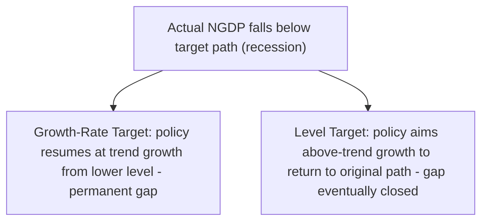
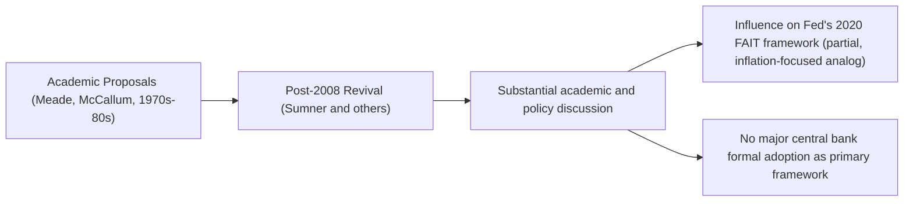

## Nominal GDP Targeting

### Definition and Role

Nominal GDP (NGDP) targeting is a proposed monetary policy framework in which a central bank commits to a target path — either a growth rate or a specific level — for nominal gross domestic product, rather than targeting inflation or a monetary aggregate directly. Because nominal GDP growth decomposes into real output growth plus inflation, an NGDP target implicitly allows inflation to fluctuate in response to real supply-side shocks while still anchoring the combined nominal variable, a property its advocates argue makes it superior to strict inflation targeting in responding appropriately to supply shocks.

### Theoretical Decomposition

$$\hat{Y}^{N} = \hat{Y} + \hat{P}$$

where $\hat{Y}^{N}$ is nominal GDP growth, $\hat{Y}$ is real GDP growth, and $\hat{P}$ is the inflation rate (GDP deflator growth). An NGDP target fixes the sum $\hat{Y} + \hat{P}$ at a target value, without specifying how that sum divides between its two components.

$$\hat{Y}^{N}_t = g^* \quad \text{(growth-rate target)} \quad \text{or} \quad Y^{N}_t = Y^{N}_0 (1+g^*)^t \quad \text{(level target)}$$

### Growth-Rate Targeting vs. Level Targeting

**Key Points**

- **Growth-rate targeting**: the central bank aims for nominal GDP to grow at a constant rate (e.g., 4-5% per year) each period, with no attempt to correct for past misses — a miss in one period is not compensated for in subsequent periods
- **Level targeting**: the central bank aims to keep the *level* of nominal GDP on a pre-specified growth path over time, meaning that if nominal GDP falls below the target path in one period (e.g., during a recession), policy subsequently aims for above-trend growth to return to the original path, and vice versa for an overshoot
- Level targeting is generally favored by NGDP-targeting advocates over growth-rate targeting, on the argument that it provides a stronger commitment device: because market participants know that a below-target period will be followed by deliberate catch-up growth, expectations of future nominal income are anchored more firmly, which can itself help stabilize spending during a downturn (an expectations channel operating similarly to a "make-up strategy")

### Theoretical Rationale: The Supply Shock Argument

**Key Points**

- A key argument for NGDP targeting is its behavior under adverse supply shocks (e.g., an oil price shock reducing potential output and simultaneously raising the price level)
- Under strict inflation targeting, a central bank facing a supply shock that raises inflation would be compelled to tighten policy to bring inflation back to target, even though the shock is simultaneously depressing real output — a policy response that can exacerbate the output contraction
- Under NGDP targeting, because the target is on the *sum* of real growth and inflation, a supply shock that raises inflation but lowers real growth by a roughly offsetting amount would leave nominal GDP growth close to target, requiring little or no policy tightening — allowing the central bank to "look through" the inflationary component of a supply shock without necessarily worsening the real downturn

[Inference] This supply-shock argument is the centerpiece of the theoretical case for NGDP targeting and is generally presented by its advocates as its principal advantage over inflation targeting; however, it depends on the specific assumption that the inflationary and real-output effects of a given supply shock are of comparable magnitude, which may not hold for all types of shocks, and the framework's behavior under demand shocks (where inflation and output move in the same direction) is less differentiated from inflation targeting's response.

### Prominent Advocates and Academic History

**Key Points**

- NGDP targeting traces its intellectual lineage substantially to proposals by economists including James Meade and Bennett McCallum from the 1970s-1980s, predating the framework's more recent prominence
- The framework received substantial renewed attention following the 2008 financial crisis, particularly through the advocacy of economist Scott Sumner, whose analysis argued that the Federal Reserve's implicit tightening bias (reflected in a sharp fall in NGDP growth relative to trend in 2008) had substantially worsened the Great Recession, and that an NGDP level target would have prompted more aggressive monetary easing
- This post-2008 advocacy contributed to broader academic and policy discussion of NGDP targeting as an alternative framework, though it has not been formally adopted as the primary framework by any major central bank

### Comparison with Inflation Targeting

| Feature | NGDP Targeting | Inflation Targeting |
| --- | --- | --- |
| Target variable | Nominal GDP (growth or level) | Price level growth (inflation rate) |
| Response to positive supply shocks (e.g., productivity surge) | Allows disinflation without accommodative tightening pressure | May require accommodative easing to keep inflation from falling below target, even amid a "good" shock |
| Response to negative supply shocks (e.g., oil price shock) | Can "look through" the inflationary component if real growth falls correspondingly | Requires tightening to offset the inflationary impulse, exacerbating output loss |
| Communication and public understanding | Less intuitive (few people track nominal GDP directly) | More intuitive (inflation is a familiar, widely-tracked concept) |
| Measurement basis | GDP data (measured with a lag, subject to substantial revision) | CPI/PCE data (measured more frequently, with less revision) |
| Adoption by major central banks | None as primary framework (as of this writing) | Widespread (Fed, BOE, RBNZ, Bank of Canada, Sweden, BOJ, and others) |

### Practical Implementation Challenges

**Key Points**

- **Data timeliness and revision**: nominal GDP is typically measured quarterly and subject to significant subsequent revision, in contrast to inflation data, which is available monthly with comparatively minor revisions — a practical disadvantage for using NGDP as the operating target for a forward-looking, high-frequency policy process
- **Estimating potential/trend growth**: setting an appropriate NGDP growth target requires an estimate of sustainable long-run real GDP growth (itself uncertain and subject to structural shifts, e.g., productivity slowdowns or demographic change) plus a chosen inflation component, compounding measurement uncertainty relative to a pure inflation target
- **Communication complexity**: nominal GDP is a less intuitive concept for the general public than a familiar inflation rate, potentially undermining the expectations-anchoring benefit that transparent numerical targets are intended to provide, since public understanding and buy-in are a key channel through which announced targets influence behavior
- **No historical operational track record**: unlike inflation targeting (with over three decades of practical central bank experience to draw upon, including refinements through real-world crises), NGDP targeting has not been implemented as a primary framework by any major central bank, leaving open questions about how it would perform in practice under conditions inflation targeting has already been tested against

[Inference] The absence of any major central bank adoption of NGDP targeting as a primary framework, despite over a decade of substantial academic and public discussion following the 2008 crisis, likely reflects a combination of the practical implementation challenges described above and the institutional costs and risks of a fundamental framework change relative to incremental modifications (such as the Federal Reserve's adoption of Flexible Average Inflation Targeting in 2020, which retains inflation as the target variable while incorporating some of the make-up-strategy logic associated with NGDP level targeting).

### NGDP Targeting and the Effective Lower Bound

**Key Points**

- A key argument advanced for NGDP level targeting is its potential effectiveness in a low-interest-rate environment where conventional policy rate cuts are constrained by the effective lower bound
- Because a credible NGDP level target commits the central bank to make up for any shortfall with above-trend future growth, it can, in principle, generate more powerful expectational effects during a liquidity-trap-like episode than conventional inflation targeting, by shifting expectations of future nominal income and spending upward even while the current policy rate is constrained
- This argument parallels, and is sometimes considered a more powerful variant of, the rationale behind the Federal Reserve's adoption of average inflation targeting in 2020, which incorporates a similar "make-up" logic but applied to the inflation rate rather than the broader nominal income concept

### Partial and Related Applications

**Example**

While no major central bank has adopted NGDP targeting as its formal primary framework, elements of NGDP-targeting logic have appeared in adjacent policy discussions and quasi-implementations: some economists have proposed NGDP-linked government bonds as a complementary fiscal-monetary tool, and central bank communications occasionally reference nominal spending or nominal income growth as one input among several in assessing the overall stance of policy, even without adopting it as the formal target variable. [Unverified] The specific degree to which any given central bank incorporates NGDP-related metrics into its internal analysis (as distinct from its formal target) is generally not fully disclosed in public communications and would need to be verified against that institution's specific research publications.

### Conclusion

Nominal GDP targeting remains a prominent academic and policy proposal rather than an implemented central banking framework, valued theoretically for its distinct response to supply shocks and its potential expectational power under level targeting, particularly as a tool for addressing effective-lower-bound constraints. Its practical adoption has been limited by data timeliness and revision issues, communication complexity relative to a familiar inflation rate, and the absence of any operational track record comparable to inflation targeting's three-decade history — though its logic has visibly influenced adjacent policy innovations, most notably the Federal Reserve's 2020 shift to Flexible Average Inflation Targeting.

**Related Topics**

- Scott Sumner's market monetarism and post-2008 NGDP targeting advocacy
- Level targeting vs. growth-rate targeting as a general monetary policy design choice
- The Federal Reserve's Flexible Average Inflation Targeting (FAIT) as a related "make-up" framework
- Supply shocks and optimal monetary policy response (comparison across frameworks)
- The effective lower bound and unconventional monetary policy tools
- NGDP-linked bonds as a fiscal-monetary policy proposal
- Market monetarism as a broader school of monetary thought
- Data revision and measurement issues in real-time monetary policy decision-making