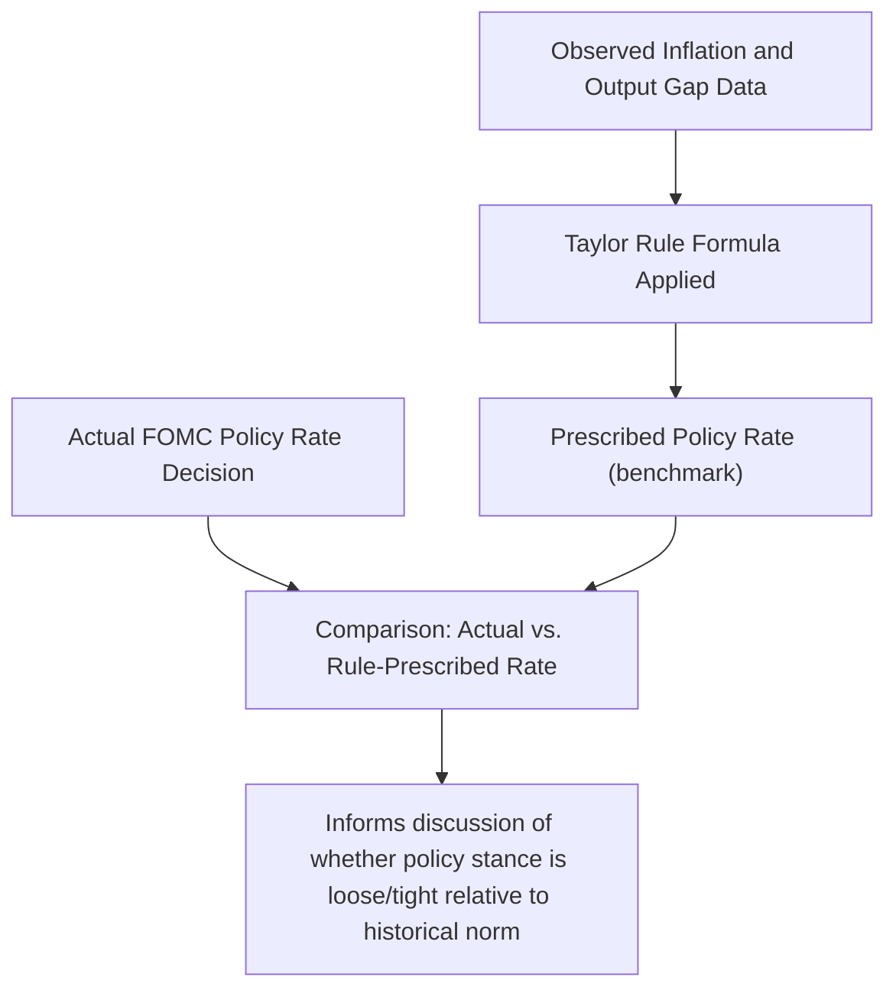

## The Taylor Rule and Interest Rate Feedback Rules

### Definition and Role

An interest rate feedback rule is a formula that prescribes a central bank's policy interest rate as a systematic function of observable macroeconomic variables — typically inflation and a measure of real economic activity — rather than leaving the rate decision to unconstrained period-by-period discretion. The **Taylor Rule**, proposed by John Taylor in 1993, is the most widely referenced such rule, both as a positive (descriptive) model of historical Federal Reserve behavior and as a normative benchmark for evaluating whether a given policy stance is appropriately calibrated.

### The Original Taylor Rule Specification

$$i_t = r^* + \pi_t + 0.5(\pi_t - \pi^*) + 0.5(y_t - y_t^*)$$

where:

- $i_t$ = the nominal federal funds rate
- $r^*$ = the equilibrium (neutral) real interest rate
- $\pi_t$ = the current inflation rate (Taylor's original specification used a four-quarter average of the GDP deflator)
- $\pi^*$ = the target inflation rate
- $(y_t - y_t^*)$ = the output gap, expressed as the percentage deviation of real GDP from an estimate of potential GDP

Taylor's original 1993 paper used $r^* = 2\%$, $\pi^* = 2\%$, and response coefficients of $0.5$ on both the inflation gap and output gap, calibrated to approximate actual Fed behavior reasonably well over the 1987–1992 period he examined.

### Intuition Behind the Rule's Structure

**Key Points**

- The rule prescribes raising the nominal rate by more than one-for-one with an increase in inflation above target (since the inflation gap term is added on top of the $\pi_t$ term already embedded in the rate), ensuring that the **real** interest rate rises when inflation rises above target — this is the celebrated **Taylor Principle**
- The output gap term prescribes higher rates when output is above potential (an overheating economy) and lower rates when output is below potential (a slack economy), providing a countercyclical stabilization function
- The rule is fundamentally a description of systematic, rule-like behavior — an attempt to formalize "what a sensible, forward-looking central banker would do" as a reproducible formula rather than a mechanical constraint literally followed

### The Taylor Principle

**Key Points**

- The Taylor Principle states that a central bank should raise its **nominal** policy rate by *more than* the increase in inflation, so that the **real** interest rate rises in response to higher inflation
- If the coefficient on the inflation gap in a Taylor-type rule is greater than zero (formally, if the total response to inflation, inclusive of the $\pi_t$ pass-through term, exceeds one-for-one), the rule is said to satisfy the Taylor Principle
- Satisfying the Taylor Principle is widely regarded in modern macroeconomic theory (particularly in New Keynesian models) as a necessary condition for a policy rule to deliver a **unique, stable, non-explosive equilibrium** for inflation — a rule that raises the nominal rate by less than one-for-one with inflation (an "accommodative" or "passive" rule) can permit self-fulfilling inflationary or deflationary spirals in standard New Keynesian frameworks

$$\frac{\partial i_t}{\partial \pi_t} > 1 \quad \Longrightarrow \quad \frac{\partial r_t}{\partial \pi_t} > 0 \quad \text{(real rate rises with inflation — Taylor Principle satisfied)}$$

[Inference] The theoretical link between the Taylor Principle and equilibrium determinacy in New Keynesian models is a well-established result in the academic monetary economics literature; the empirical question of whether historical central bank behavior in any specific episode actually satisfied the principle (e.g., debates over whether pre-Volcker Fed policy in the 1970s violated it, contributing to the era's high and unstable inflation) remains a subject of ongoing econometric estimation and is more appropriately labeled as an empirical finding subject to specification and data uncertainty.

### Positive vs. Normative Use of the Rule

**Key Points**

- **Positive (descriptive) use**: estimating a Taylor-type rule against historical policy rate data to characterize how a central bank has actually behaved, including estimating implicit response coefficients, and to compare behavior across different periods (e.g., pre- and post-Volcker Fed policy)
- **Normative (prescriptive) use**: calculating what the rule *would* prescribe given current data, to serve as one benchmark input (among several) for assessing whether an actual or contemplated policy rate stance appears too loose or too tight relative to a systematic historical reaction function
- Central banks, including the Federal Reserve, routinely publish or reference Taylor-rule-style calculations in official communications (e.g., in the Fed's semi-annual Monetary Policy Report) as one of several reference benchmarks, explicitly not as a mechanical decision rule

### Variants and Extensions of the Basic Rule

| Variant | Key Modification | Rationale |
| --- | --- | --- |
| **Forward-looking Taylor Rule** | Uses expected future inflation and output gap rather than current/lagged values | Reflects that policy affects the economy with a lag, so a forward-looking central bank should respond to the expected future state, not only current conditions |
| **Interest rate smoothing / partial adjustment rule** | $i_t = \rho \, i_{t-1} + (1-\rho)\, i_t^{Taylor}$, where $0 < \rho < 1$ | Captures the empirically observed tendency of central banks to adjust rates gradually rather than jumping immediately to the level a simple rule would prescribe, reducing financial market disruption and accommodating uncertainty about real-time data |
| **Balanced-approach rule** | Increases the weight on the output gap relative to the original 0.5 coefficient | Reflects a policy preference giving relatively more weight to output/employment stabilization |
| **First-difference rule** | Prescribes the *change* in the policy rate as a function of the inflation gap and change in the output gap, rather than the rate *level* | Reduces sensitivity to uncertain, hard-to-estimate levels such as $r^*$ and potential output, focusing instead on more reliably estimated changes |

$$i_t = \rho\, i_{t-1} + (1-\rho)\left[r^* + \pi_t + \alpha(\pi_t - \pi^*) + \beta(y_t - y_t^*)\right] \quad \text{(interest rate smoothing form)}$$

### The Challenge of Estimating $r^*$ and the Output Gap

**Key Points**

- The equilibrium real interest rate ($r^*$, sometimes denoted $r$-star) is not directly observable and must be estimated using structural or statistical models (e.g., the widely-cited Laubach-Williams model), with estimates subject to substantial uncertainty and revision as new data arrives
- Similarly, potential output (and hence the output gap) is unobservable and must be estimated, typically using statistical filters (e.g., the Hodrick-Prescott filter) or structural production-function-based approaches, both of which are subject to significant real-time measurement error and later revision as more data becomes available
- This measurement uncertainty is widely regarded as one of the most significant practical limitations of applying Taylor-type rules in real time, since the rule's prescribed rate can shift materially simply due to revisions in these unobservable inputs, independent of any change in actual economic conditions

[Inference] The real-time unreliability of output gap and $r^*$ estimates is frequently cited in the literature as a central practical argument for why central banks use Taylor-rule calculations as one input among several in a broader deliberative process, rather than as a mechanical, binding decision rule — since a rule mechanically applied to noisy, frequently-revised inputs could generate unstable or misleading rate prescriptions.

### Historical Application: The Rule and the Great Inflation

**Example**

A substantial body of empirical research (including influential work by Richard Clarida, Jordi Galí, and Mark Gertler) has estimated Taylor-type reaction functions for the Federal Reserve across different historical periods, finding that the estimated response coefficient on inflation during the pre-Volcker era (roughly the late 1960s through the 1970s) was below the threshold required to satisfy the Taylor Principle, while the post-1979 (Volcker and subsequent) era exhibited a coefficient consistent with satisfying the principle. This finding has been influential in the broader academic narrative attributing the high and volatile inflation of the 1970s ("the Great Inflation") partly to an inadequately aggressive systematic policy response to rising inflation, in contrast to the more disciplined, rule-consistent response that followed. [Inference] This remains an active area of empirical debate, and alternative explanations for the 1970s inflation (including oil supply shocks and shifting inflation expectations dynamics not fully captured by a simple reaction-function estimate) are also prominent in the literature, so the reaction-function-based explanation should be understood as one significant strand of the debate rather than a fully settled consensus account.

### Rules vs. Discretion Debate

**Key Points**

- The Taylor Rule sits within the broader "rules versus discretion" debate in monetary economics, connecting to the Kydland-Prescott time-inconsistency literature: a credible, systematic rule can, in principle, avoid the inflationary bias that can emerge under unconstrained discretionary policy, by making policy predictable and anchoring expectations
- In practice, essentially no major central bank follows a fully mechanical rule; the dominant real-world approach is often described as **"constrained discretion"** — a framework in which the central bank retains discretionary judgment but is guided, and its credibility partly sustained, by a systematic and broadly rule-consistent pattern of behavior communicated transparently to the public
- Advocates of formal rule-based approaches (including some proposals for Congress to require the Fed to report against a specified reference rule, without mandating strict adherence) argue this would enhance accountability and predictability; critics argue that mechanical rule-following is poorly suited to structural breaks, financial crises, and other circumstances a simple formula cannot anticipate

### Comparative Summary: Taylor Rule vs. Other Frameworks

| Feature | Taylor Rule / Feedback Rules | Inflation Targeting (framework) | Monetary Targeting |
| --- | --- | --- | --- |
| Nature | A specific formula/reaction function | A broader institutional and communication framework | A broader institutional framework |
| Primary use | Descriptive benchmark and/or normative reference input | The overarching policy objective-setting framework | Historical framework using money growth as intermediate target |
| Mechanical vs. discretionary | Can be applied mechanically, though rarely is in practice | Inherently forecast- and judgment-based ("constrained discretion") | Historically closer to mechanical rule-following (e.g., Friedman's k-percent rule) |
| Relationship | Often used as one input/reference *within* an inflation-targeting framework | Encompasses the use of Taylor-rule-style benchmarks as a communication and self-assessment tool | Distinct, largely superseded framework |

### Conclusion

The Taylor Rule and related interest rate feedback rules provide a systematic, formula-based benchmark for policy rate setting, most valuable not as a mechanical substitute for central bank judgment but as a disciplined reference point for assessing the stance of policy and for structuring the broader "rules versus discretion" debate in monetary economics. Its central theoretical contribution — the Taylor Principle, requiring more-than-proportional nominal rate response to inflation to ensure real rate increases and equilibrium stability — remains a foundational concept in modern monetary theory, even as practical application is complicated by the substantial real-time measurement uncertainty surrounding key unobservable inputs such as the equilibrium real rate and the output gap.

**Related Topics**

- The Taylor Principle and equilibrium determinacy in New Keynesian models
- Estimating $r^*$: the Laubach-Williams model and related approaches
- Output gap estimation methods (Hodrick-Prescott filter, production function approaches)
- Interest rate smoothing and gradualism in central bank behavior
- The "rules versus discretion" debate and Kydland-Prescott time inconsistency
- Clarida-Galí-Gertler estimates of historical Fed reaction functions
- Constrained discretion as a practical monetary policy operating philosophy
- The Great Inflation of the 1970s and competing explanations