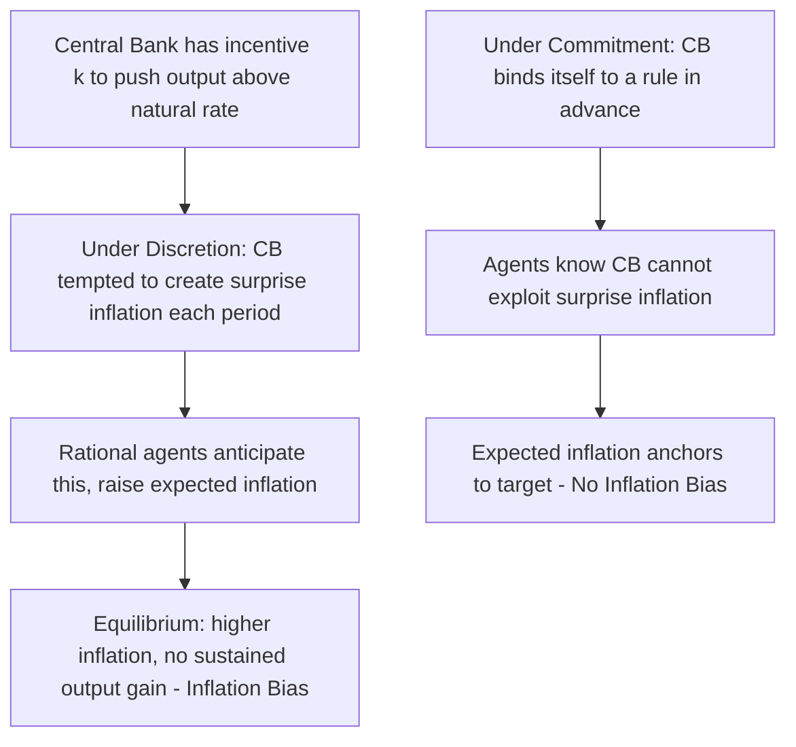

## Commitment, Discretion, and Rule-Based Policy Design

### Definition and Role

The commitment-versus-discretion debate concerns whether a central bank should bind itself to a pre-announced, systematic rule for setting policy, or retain full period-by-period freedom to respond to circumstances as they arise using its best contemporaneous judgment. This distinction sits at the theoretical core of modern monetary policy design, since the two approaches carry fundamentally different implications for how private agents form inflation expectations and, consequently, for the economy's actual inflation and output outcomes.

### The Time-Inconsistency Problem: Kydland and Prescott

**Key Points**

- Finn Kydland and Edward Prescott's foundational 1977 paper demonstrated that even a well-intentioned, benevolent central bank operating under pure discretion can generate systematically worse outcomes than a central bank committed to a rule, because optimal policy chosen sequentially, period by period, can be **time-inconsistent** with the policy that would have been optimal to announce in advance
- The core mechanism: private agents form inflation expectations based on what they believe the central bank will do; once those expectations are locked in (e.g., embedded in wage contracts), a discretionary central bank faces a temptation to generate a short-term output gain by delivering inflation higher than expected, since this can temporarily lower the real wage and boost employment
- Rational agents anticipate this temptation and adjust their expectations upward accordingly, so in equilibrium, the discretionary central bank delivers no output gain but does deliver excess inflation — a result known as the **inflation bias** of discretionary policy

### The Barro-Gordon Formalization

Robert Barro and David Gordon (1983) formalized Kydland and Prescott's insight using a central bank loss function and a Phillips-curve-style relationship. A stylized version:

$$L = \frac{1}{2}(\pi_t - \pi^*)^2 + \frac{\lambda}{2}(y_t - y_t^* - k)^2$$

$$y_t = y_t^* + a(\pi_t - \pi_t^e)$$

where $k > 0$ represents a central bank desire to push output above its natural level (e.g., due to labor market distortions), $\pi_t^e$ is expected inflation, and $a > 0$ captures the short-run Phillips curve slope. Under discretion, solving for the time-consistent (Nash) equilibrium yields an inflation bias:

$$\pi^{discretion} = \pi^* + \lambda a k$$

Under commitment to a fixed rule (e.g., $\pi_t = \pi^*$), no such bias arises, since the central bank never faces the temptation to exploit unexpected inflation, and rational agents know this in advance — so $\pi^e = \pi^*$ and the inflation bias term vanishes.

$$\pi^{commitment} = \pi^* \quad < \quad \pi^{discretion} = \pi^* + \lambda a k$$

### Why Discretion Fails Even With Good Intentions

[Inference] A key and often under-appreciated feature of the Kydland-Prescott/Barro-Gordon result is that the inflation bias does not require the central bank to be irresponsible, myopic, or subject to political pressure — it emerges purely from the logical structure of sequential optimization under rational expectations, meaning that even a technically competent, well-intentioned, and inflation-averse central bank operating with full discretion will produce a worse outcome (higher average inflation, same average output) than the same central bank operating under a credible commitment device, absent any change in its underlying preferences.

### Solutions to the Time-Inconsistency Problem

| Mechanism | Description | Example |
| --- | --- | --- |
| **Rules** | Bind policy to a pre-specified, mechanical formula, eliminating discretionary judgment | A literal k-percent money growth rule (Friedman); a strictly-followed Taylor Rule |
| **Delegation to a "conservative" central banker** | Appoint a central banker whose personal preferences place greater relative weight on inflation control than society's average preferences (Rogoff, 1985) | Appointing a central bank governor known for hawkish, inflation-averse views |
| **Institutional independence + inflation targeting** | Grant the central bank independence from short-term political pressure, combined with a public numerical target and accountability mechanism | The near-universal modern central banking model since the 1990s |
| **Reputation** | Repeated interaction allows a central bank to build a reputation for low inflation, sustained by the future cost of losing credibility if it reneges | Models of reputational equilibria (Barro-Gordon extensions, Backus-Driffill) |
| **Legislated targets with accountability** | A government sets the numerical target; the central bank has instrument independence to hit it, with public accountability for misses | The Bank of England's inflation target and open-letter mechanism |

### The Rogoff "Conservative Central Banker" Solution

**Key Points**

- Kenneth Rogoff's 1985 contribution proposed delegating monetary policy to an agent whose preferences place *more* weight on inflation avoidance (a lower effective $\lambda$ in the loss function) than society's true preferences would otherwise dictate
- Such a "conservative" central banker generates a lower inflation bias in equilibrium, since their reduced willingness to trade off inflation for output gains is anticipated by rational agents and embedded in lower inflation expectations
- This delegation solution carries a trade-off: an excessively conservative central banker (one who places essentially zero weight on output stabilization) may also respond less effectively to genuine supply or demand shocks that would benefit from some accommodative response — Rogoff's original analysis identified an optimal degree of conservatism, not maximal conservatism

$$\lambda_{CB} < \lambda_{society} \quad \Rightarrow \quad \text{lower inflation bias, but potentially suboptimal shock response}$$

### Rules vs. Discretion: A Practical Spectrum

**Key Points**

- Pure rule-based policy (mechanically following a fixed formula with no judgment) and pure unconstrained discretion represent theoretical endpoints rarely observed in practice among actual central banks
- The dominant real-world approach among modern central banks is often characterized as **"constrained discretion"** (a term associated with Ben Bernanke's academic and policy writing): the central bank retains judgment and flexibility to respond to unanticipated circumstances, but operates within a publicly announced numerical target and transparent communication framework that constrains and disciplines that judgment, providing many of the credibility benefits of a rule without its rigidity
- Inflation targeting frameworks are generally understood in the academic literature as institutionalized forms of constrained discretion: not a literal rule (the central bank does not mechanically calculate a formula-determined rate), but a framework whose public target and accountability mechanisms function similarly to a commitment device in anchoring expectations

### Institutional Independence as a Commitment Device

**Key Points**

- Central bank independence — insulating monetary policy decisions from direct short-term political control — functions as an institutional analog to the delegation solutions described above, since politically-driven policymakers face a particularly acute temptation to exploit short-run inflation-output trade-offs around election cycles (the "political business cycle" literature, associated with William Nordhaus and others)
- Empirical cross-country research from the 1990s (notably by Alberto Alesina, Lawrence Summers, and others) found a negative correlation between measures of central bank independence and average inflation across countries, widely cited as supporting evidence for the time-inconsistency framework's practical relevance, though the direction of causality and the precise measurement of "independence" in these studies have been subjects of subsequent methodological debate

[Inference] While the cross-country correlation between central bank independence and lower inflation is a frequently cited empirical regularity, it should be treated as suggestive rather than definitively causal, since countries with stronger anti-inflationary institutional preferences generally may both grant their central banks more independence and achieve lower inflation for reasons not fully captured by the independence variable alone — a standard concern in this genre of cross-country institutional economics research.

### Time Inconsistency Beyond Monetary Policy: Broader Relevance

**Example**

The time-inconsistency framework developed for monetary policy has been extended to other policy domains exhibiting a similar sequential-optimization structure, including patent policy (a government's temptation to weaken patent protection after firms have already sunk R&D investment, undermining the incentive that attracted the investment in the first place) and capital taxation (a government's temptation to tax existing capital more heavily than originally announced, since the capital stock is already sunk and cannot immediately respond, even though anticipated high future capital taxes discourage investment ex ante). [Inference] These extensions are typically presented in the literature as illustrating that the core Kydland-Prescott insight is a general feature of any policy setting where the government's ex-post optimal action differs from its ex-ante optimal announced policy, not a phenomenon unique to monetary economics.

### Practical Design Trade-offs Summary

| Consideration | Favors More Rule-Like Design | Favors More Discretionary Design |
| --- | --- | --- |
| Managing inflation expectations and avoiding inflation bias | Strongly favors rules/commitment | — |
| Responding to unanticipated structural shocks or crises | — | Favors discretion/flexibility |
| Public transparency and accountability | Favors rules (easily verified) | Discretion requires alternative accountability mechanisms |
| Adapting to genuine model uncertainty about the economy | — | Favors discretion (rules may be based on a misspecified model) |
| Political economy / insulation from short-term pressure | Favors rules or strong independence | — |

### Conclusion

The commitment-versus-discretion debate, formalized through the Kydland-Prescott time-inconsistency problem and the Barro-Gordon model, demonstrates that unconstrained discretionary monetary policy can generate a persistent inflation bias even absent any policymaker malice or incompetence, purely as a consequence of rational private-sector anticipation of the central bank's ex-post incentives. The practical resolution adopted by nearly all modern central banks is neither pure discretion nor a rigid mechanical rule, but "constrained discretion" — institutional independence combined with a transparent, publicly accountable inflation-targeting framework — which captures much of the credibility benefit associated with commitment while retaining the flexibility needed to respond to genuine economic shocks and model uncertainty.

**Related Topics**

- Kydland and Prescott's original 1977 time-inconsistency framework
- The Barro-Gordon model and the inflation bias equilibrium
- Rogoff's "conservative central banker" delegation solution
- Central bank independence: empirical cross-country evidence and measurement
- Constrained discretion as practiced under modern inflation targeting
- The political business cycle (Nordhaus) and electoral monetary policy pressure
- Reputation-based equilibria in repeated monetary policy games
- Time inconsistency applications beyond monetary policy: patents, capital taxation