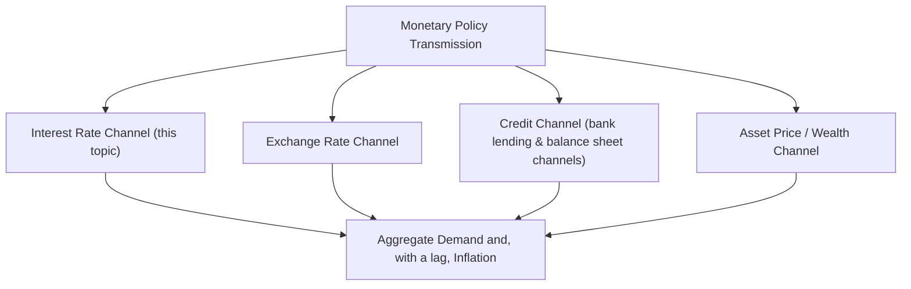

## Interest Rate Channel

### Definition and Role

The interest rate channel is the traditional, most direct transmission mechanism through which a change in a central bank's policy rate affects real economic activity and, ultimately, inflation. It operates through the classical Keynesian IS-curve logic: a change in the short-term nominal policy rate influences longer-term real interest rates relevant to spending decisions, which in turn affects the cost of borrowing and the return to saving, altering aggregate consumption and investment.

### The Core Transmission Sequence

```mermaid
flowchart LR
    A["Central Bank changes Policy Rate"] --> B["Short-term nominal interest rates adjust"]
    B --> C["Expectations of future short rates shift"]
    C --> D["Longer-term nominal interest rates adjust"]
    D --> E["Real interest rates adjust (nominal minus expected inflation)"]
    E --> F["Cost of borrowing / return to saving changes"]
    F --> G["Consumption and Investment decisions change"]
    G --> H["Aggregate Demand changes"]
    H --> I["Output gap and, with a lag, Inflation respond"]
```

### The Real Interest Rate as the Operative Variable

**Key Points**

- Spending decisions — particularly durable goods purchases, housing, and business investment — are theoretically most sensitive to the **real** interest rate (the nominal rate adjusted for expected inflation), not the nominal rate alone, since real interest rates reflect the true cost of borrowing or the true return to saving in terms of purchasing power
- This relationship is captured by the (ex-ante) Fisher equation:

$$r_t = i_t - \pi_t^e$$

where $r_t$ is the ex-ante real interest rate, $i_t$ is the nominal policy or market rate, and $\pi_t^e$ is expected inflation

- A central bank raising the nominal rate by more than any accompanying rise in inflation expectations increases the real rate, discouraging current spending in favor of saving; a central bank cutting the nominal rate lowers the real rate, encouraging current spending over saving

[Inference] The effectiveness of the interest rate channel in any specific episode depends materially on how expected inflation responds alongside the nominal rate change; if a nominal rate cut is accompanied by a proportionate rise in inflation expectations, the real rate — and hence the channel's stimulative effect on spending — may not move as much as the nominal rate change alone would suggest, so analysts typically examine real rather than nominal rate movements when assessing the channel's likely strength.

### The Intertemporal Substitution Mechanism

**Key Points**

- The theoretical microfoundation for the interest rate channel rests on the **intertemporal substitution** of consumption: households and firms compare the utility (or return) of consuming/investing today versus deferring consumption/investment to the future, and the real interest rate is the relevant price governing this trade-off
- A higher real interest rate increases the reward for deferring consumption (saving now, consuming more later), inducing households to substitute away from present consumption
- This microfoundation is formalized in the consumption Euler equation central to New Keynesian models:

$$c_t = E_t[c_{t+1}] - \frac{1}{\sigma}(i_t - E_t[\pi_{t+1}] - \rho)$$

where $c_t$ is (log) consumption, $\sigma$ is the coefficient of relative risk aversion (inverse of the intertemporal elasticity of substitution), and $\rho$ is the household's rate of time preference. A rise in the real rate ($i_t - E_t[\pi_{t+1}]$) relative to $\rho$ reduces current consumption relative to expected future consumption.

### Channels Through Which the Interest Rate Affects Specific Spending Categories

| Spending Category | Interest Rate Sensitivity Mechanism |
| --- | --- |
| **Consumer durables** (autos, appliances) | Often financed via installment credit; higher rates raise the monthly cost of financing, directly discouraging purchase |
| **Housing / residential investment** | Highly sensitive due to mortgage financing; higher mortgage rates raise the cost of homeownership and reduce housing demand, one of the most interest-rate-sensitive components of GDP |
| **Business fixed investment** | Firms compare the expected return on a capital project to the cost of financing it (via the user cost of capital); higher real rates raise the hurdle rate for project approval |
| **Inventory investment** | Higher rates raise the carrying cost of holding inventory, encouraging firms to reduce inventory levels |
| **Consumer saving behavior** | Higher real rates increase the return to saving directly, encouraging deferred consumption (though empirically, income and substitution effects can offset each other for net savers) |

### Long-Term Rates and the Expectations Hypothesis

**Key Points**

- Because most durable spending decisions (mortgages, long-term business investment) are financed at longer maturities than the overnight policy rate, the interest rate channel's strength depends on how effectively changes in the short-term policy rate transmit to longer-term rates
- Under the **expectations hypothesis** of the term structure, long-term rates approximate the average of expected future short-term rates (plus a term premium), so a policy rate change that is expected to persist has a larger effect on long-term rates than a change perceived as temporary or likely to be quickly reversed

$$i_n \approx \frac{1}{n}\sum_{t=1}^{n}E_t[i_{1,t}] + \phi_n$$

- This is why central bank **forward guidance** about the expected future policy path is considered a complement to, and extension of, the conventional interest rate channel: by shaping expectations of the *future* path of short rates, forward guidance can move long-term rates (and hence spending decisions) even without an immediate change in the current policy rate

### Interest Rate Channel Under the Effective Lower Bound

**Key Points**

- When the nominal policy rate approaches zero (or another effective lower bound), the conventional interest rate channel's primary lever — further nominal rate cuts — becomes unavailable, motivating the shift toward unconventional tools (large-scale asset purchases, explicit forward guidance, negative interest rate policy in some jurisdictions) that attempt to continue lowering real rates or shaping expectations of the future rate path through channels other than the current policy rate itself
- Quantitative easing is often understood partly as an attempt to extend the interest rate channel's logic to longer maturities directly — by purchasing longer-dated securities, a central bank can compress long-term yields even when the short-term policy rate is already at its floor, working through the **portfolio balance channel** and **duration extraction** rather than the conventional short-rate mechanism

### Empirical Strength and Lags

**Key Points**

- The interest rate channel is widely regarded as operating with substantial and variable lags — empirical estimates and central bank communications frequently note that the full effect of a policy rate change on output and inflation can take several quarters to over a year to materialize, reflecting the time required for spending decisions to adjust and for those changed spending patterns to feed through to aggregate output and, eventually, price-setting behavior
- Milton Friedman's famous characterization of monetary policy operating with "long and variable lags" is most directly associated with skepticism about the interest rate (and broader monetary) channel's reliability for fine-tuning short-run economic outcomes, and partly motivated his alternative preference for simple, rule-based monetary targeting over discretionary interest rate management

[Inference] The empirical magnitude of the interest rate channel's effect on aggregate demand — sometimes summarized in econometric models as the "interest rate elasticity of investment" or of consumption — varies considerably across studies, time periods, and countries, and should be treated as an estimated, model-dependent parameter rather than a fixed structural constant, given the substantial methodological differences across the empirical macroeconomics literature on this topic.

### The Interest Rate Channel Relative to Other Transmission Channels

**Key Points**

- The interest rate channel is one of several recognized monetary transmission channels, alongside the **exchange rate channel** (policy rate changes affect capital flows and currency values, in turn affecting net exports), the **credit channel** (policy affects the availability, not just the price, of credit, particularly for informationally-opaque borrowers), and the **asset price/wealth channel** (policy rate changes affect equity and housing valuations, in turn affecting household wealth and spending)
- The interest rate channel is generally regarded as the most textbook-canonical and historically emphasized channel, forming the backbone of the IS-curve relationship in standard macroeconomic models, though the relative empirical importance of the interest rate channel versus these other channels is a subject of ongoing research and likely varies by economy, financial structure, and historical period

### Illustrative Numerical Example

**Example**

Suppose a central bank raises its policy rate by 100 basis points, and inflation expectations remain anchored and unchanged at 2%. If this policy rate change transmits fully to a representative long-term borrowing rate (e.g., a mortgage rate that had been closely tracking the policy rate plus a stable spread), the real long-term borrowing rate would also rise by approximately 100 basis points, since expected inflation is unchanged. A household evaluating a new home purchase now faces a higher real financing cost, which — all else equal — is expected to reduce the quantity of housing demanded, illustrating the direct mechanical link between the policy rate action and household spending decisions central to this channel. [Inference] In practice, the degree of pass-through from a policy rate change to any specific long-term borrowing rate is rarely complete or immediate, and depends on factors including term premia, credit risk spreads, and the market's assessment of how persistent the policy change is likely to be — so this example should be understood as an illustration of the channel's basic logic rather than a claim about the precise magnitude of real-world pass-through in any given episode.

### Conclusion

The interest rate channel represents the foundational, most textbook-central mechanism of monetary policy transmission, operating through the effect of real interest rate changes on the intertemporal consumption and investment decisions of households and firms. Its practical strength depends on the degree to which policy rate changes pass through to the longer-term rates relevant for durable spending decisions (governed by the expectations hypothesis of the term structure), the responsiveness of inflation expectations (which determines the real, rather than merely nominal, rate movement), and the substantial lags with which these effects work through to aggregate output and inflation — considerations that motivate central banks' use of forward guidance and, at the effective lower bound, unconventional tools intended to extend the channel's reach.

**Related Topics**

- The Fisher equation and the distinction between nominal and real interest rates
- The consumption Euler equation and intertemporal substitution in New Keynesian models
- The expectations hypothesis of the term structure of interest rates
- Forward guidance as an extension of the conventional interest rate channel
- The credit channel: bank lending channel and balance sheet (financial accelerator) channel
- The exchange rate and asset price/wealth transmission channels
- Quantitative easing and the portfolio balance channel at the effective lower bound
- Monetary policy transmission lags and Friedman's "long and variable lags" critique