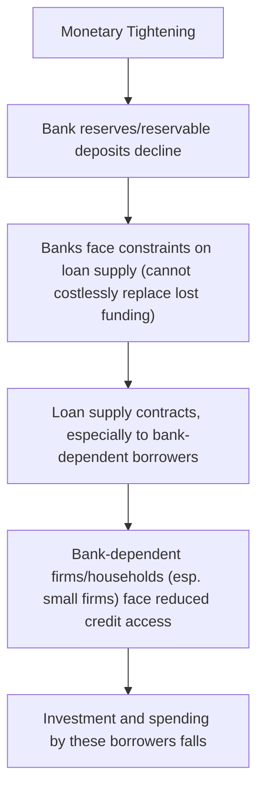
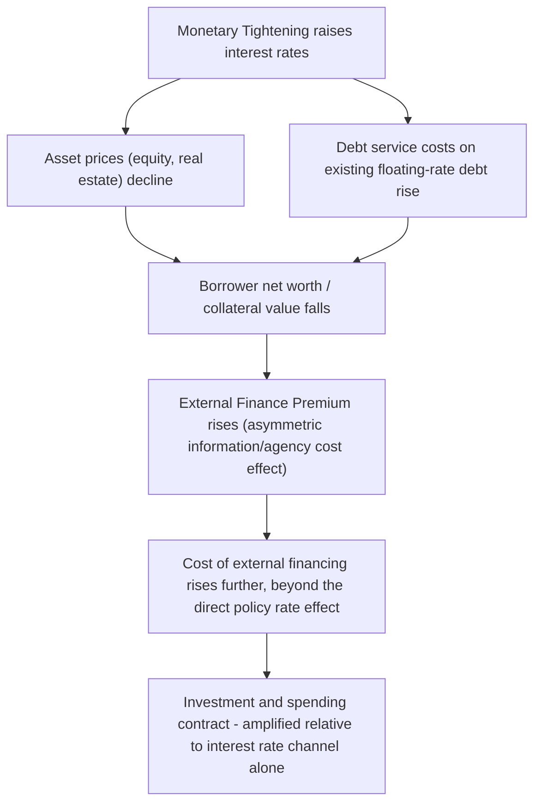

## Bank Lending and Credit Channels

### Definition and Role

The credit channel is a monetary transmission mechanism holding that monetary policy affects the real economy not only through the price of credit (the interest rate channel) but also through its effect on the *availability* of credit, particularly for borrowers who depend on banks or other intermediaries because they cannot easily access public capital markets. The credit channel is typically decomposed into two distinct sub-channels: the **bank lending channel** and the **balance sheet channel** (also called the financial accelerator or broad credit channel).

### Why a Separate Credit Channel Is Needed

**Key Points**

- The conventional interest rate channel assumes that bank loans and market securities (such as corporate bonds) are close substitutes from a borrower's perspective, so a change in the policy rate transmits to borrowing costs uniformly regardless of financing source
- In practice, informational frictions in credit markets — asymmetric information between borrowers and lenders, the inability of many borrowers (especially small firms and households) to issue tradable securities — mean that bank loans are often not a perfect substitute for market financing
- For borrowers dependent on banks specifically, monetary policy's effect on bank behavior (not just on market interest rates generally) becomes a distinct and additional transmission channel

### The Bank Lending Channel

**Key Points**

- The bank lending channel holds that monetary tightening (e.g., reducing bank reserves, historically via reserve requirement changes or reduced reserve supply) constrains banks' ability or willingness to supply loans, independent of any change in the general level of interest rates
- This operates through banks' balance sheet constraints: if a monetary tightening reduces the reservable deposits banks can attract or the reserves available to support lending, and banks cannot perfectly offset this by issuing alternative, uninsured liabilities (such as large certificates of deposit) without cost, banks may respond by reducing loan supply directly, rather than solely by raising loan interest rates
- Borrowers with no ready access to alternative financing sources (small and medium-sized enterprises, in particular) are disproportionately affected by a contraction in bank loan *supply*, even if they would be willing to pay a higher interest rate for financing

### Empirical Identification Challenge: The Bank Lending Channel

[Inference] A long-standing empirical challenge in testing for the bank lending channel is distinguishing a contraction in loan *supply* (banks unwilling or unable to lend) from a contraction in loan *demand* (borrowers wanting less credit because monetary tightening has already reduced their desired spending through the conventional interest rate channel) — since both would produce an observed decline in total lending, requiring researchers to use disaggregated data (e.g., comparing lending behavior across banks with different balance sheet characteristics, such as capitalization or liquidity, that would be expected to respond differently to a given monetary shock if a supply-side lending channel is operative) to identify the channel's distinct contribution.

### The Balance Sheet Channel (Financial Accelerator / Broad Credit Channel)

**Key Points**

- The balance sheet channel focuses on how monetary policy affects the **net worth and creditworthiness of borrowers** themselves, rather than the funding constraints of banks
- Monetary tightening (higher interest rates) reduces asset values (equities, real estate, other collateral) and raises debt service burdens on floating-rate or short-term debt, deteriorating borrowers' balance sheets
- Weaker borrower balance sheets increase the **external finance premium** — the extra cost of external funding (debt or equity) relative to a borrower's internal funds, which arises from asymmetric information and agency costs between borrowers and lenders (lenders demand compensation for the increased risk associated with weaker collateral and creditworthiness)
- This deterioration amplifies the initial monetary policy impulse: the direct interest rate effect is reinforced by the *indirect* effect of a rising external finance premium constraining investment and spending further — the mechanism through which this amplification occurs is termed the **financial accelerator** (associated with the influential work of Ben Bernanke, Mark Gertler, and Simon Gilchrist)

$$\text{External Finance Premium} = f(\text{Borrower Net Worth}, \text{Collateral Value}) \quad \text{with} \quad \frac{\partial \text{Premium}}{\partial \text{Net Worth}} < 0$$

### Distinguishing the Two Sub-Channels

| Feature | Bank Lending Channel | Balance Sheet Channel |
| --- | --- | --- |
| Locus of the friction | Bank funding constraints (the lender's balance sheet) | Borrower net worth and collateral (the borrower's balance sheet) |
| Mechanism | Reduced bank reserves/deposits constrain loan *supply* | Weaker borrower balance sheets raise the external finance premium |
| Most affected borrowers | Firms/households with no alternative to bank financing | Firms/households with high leverage or limited collateral, regardless of financing source |
| Key amplifying variable | Bank capital, liquidity, deposit funding | Asset prices, collateral value, borrower net worth |
| Associated literature | Bernanke and Blinder (1988, 1992) | Bernanke, Gertler, and Gilchrist (1996, 1999) — "financial accelerator" |

### Historical Empirical Evidence: Small Firms and Bank Dependence

**Example**

A substantial body of empirical research from the 1990s and subsequent decades has documented that small and younger firms — which typically lack access to public bond or equity markets and depend heavily on bank relationships for financing — exhibit more pronounced declines in investment and employment following monetary tightening episodes than large firms with access to public capital markets. This differential response across firm size and financing access is widely cited as supporting evidence for the credit channel's operation (in both its bank lending and balance sheet forms), since a pure interest rate channel operating uniformly through the general cost of capital would not, on its own, predict such a systematic difference in sensitivity across firms primarily distinguished by their financing access rather than their fundamental interest rate sensitivity.

### The Credit Channel and the 2008 Financial Crisis

**Key Points**

- The 2007–2008 financial crisis is widely regarded as an especially clear real-world illustration of credit channel dynamics operating with unusual force: severe bank balance sheet impairment (from mortgage-related losses) constrained loan supply broadly (a bank lending channel effect operating at unusually large scale), while a sharp collapse in asset prices (housing, equities) deteriorated household and firm balance sheets simultaneously (a balance sheet/financial accelerator effect)
- This dual impairment — of both lender and borrower balance sheets simultaneously — is often cited as a key reason the 2008 crisis produced an unusually severe and persistent credit contraction and economic downturn relative to a "typical" monetary policy tightening cycle, and partly motivated the extensive use of unconventional policy tools (including targeted credit-market interventions such as the Fed's Term Asset-Backed Securities Loan Facility, TALF) explicitly designed to address credit-channel-specific frictions rather than working solely through the conventional interest rate channel

[Inference] The severity of the 2008 credit contraction relative to prior post-war recessions is frequently attributed in the academic and central banking literature substantially to this simultaneous bank-and-borrower balance sheet impairment, though isolating the precise quantitative contribution of the credit channel relative to other contributing factors (a broader collapse in aggregate demand, elevated uncertainty, and other channels) in any single historical episode remains subject to ongoing empirical research and model-dependent estimation.

### Policy Responses Targeting the Credit Channel Directly

**Key Points**

- Recognizing that conventional interest rate policy may not fully address a credit-channel-driven contraction (since cutting the policy rate does not directly repair impaired bank or borrower balance sheets), central banks have at times deployed tools explicitly targeting credit-channel frictions:
  - **Direct lending facilities against specific asset classes** (e.g., the Fed's TALF, targeting asset-backed securities markets during 2008–2010)
  - **Targeted lending incentive programs** (e.g., the ECB's Targeted Longer-Term Refinancing Operations, TLTROs, which offer favorable funding rates to banks conditional on maintaining or expanding lending to the real economy, directly addressing the bank lending channel's funding-constraint mechanism)
  - **Bank recapitalization and stress testing programs** (a regulatory rather than pure monetary policy tool, but closely complementary to credit channel repair, by directly restoring bank balance sheet health)

### Credit Channel Relevance Across Financial Systems

[Inference] The relative importance of the bank lending channel specifically is generally understood to depend on the structure of a given financial system: economies with **bank-based financial systems** (where firms rely more heavily on bank loans relative to public capital markets — historically including much of continental Europe and Japan, and many emerging markets) are typically considered more susceptible to a strong bank lending channel than **market-based financial systems** (where large firms have greater access to public bond and equity markets, historically more characteristic of the United States and United Kingdom), though firm-size heterogeneity within any given economy means smaller firms in market-based systems can still be significantly exposed to bank lending channel effects even where large firms are not.

### Conclusion

The bank lending and balance sheet channels together constitute the credit channel of monetary transmission, extending the conventional interest rate channel's focus on the price of credit to also incorporate credit *availability* effects arising from informational frictions between borrowers and lenders. The bank lending channel emphasizes constraints on the supply side (bank funding and balance sheet capacity), while the balance sheet channel (financial accelerator) emphasizes deterioration in borrower creditworthiness and the resulting rise in the external finance premium — both mechanisms that amplify the effects of monetary policy beyond what the interest rate channel alone would predict, with particularly strong historical illustration during the 2008 financial crisis and correspondingly influential in shaping the design of subsequent unconventional and credit-targeted policy tools.

**Related Topics**

- Bernanke and Blinder's original formulation of the bank lending channel
- The financial accelerator model (Bernanke, Gertler, and Gilchrist)
- The external finance premium and asymmetric information in credit markets
- Firm-size heterogeneity in monetary policy transmission (bank-dependent vs. market-financed firms)
- The 2008 financial crisis as a credit channel case study
- Targeted credit policy tools: TALF, TLTROs, and bank recapitalization programs
- Bank-based vs. market-based financial system structures and transmission implications
- Macroprudential regulation and its interaction with credit channel dynamics