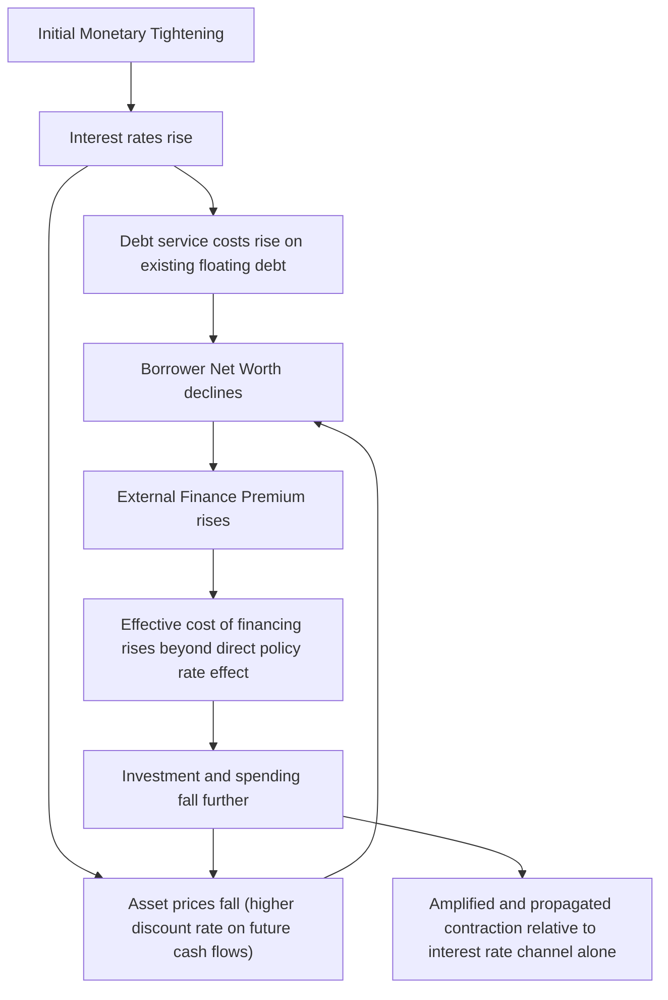

## Balance Sheet and Financial Accelerator Channel

### Definition and Role

The balance sheet channel is a monetary transmission mechanism through which changes in monetary policy affect the real economy by altering the net worth and creditworthiness of borrowers, thereby changing the cost and availability of external financing they face. The **financial accelerator** is the formal theoretical framework — developed principally by Ben Bernanke, Mark Gertler, and Simon Gilchrist — describing how this borrower balance sheet channel amplifies and propagates the initial effects of monetary policy (or other shocks) over time, rather than simply adding a one-time, static effect.

### The Core Friction: The External Finance Premium

**Key Points**

- The financial accelerator framework rests on the existence of an **external finance premium** — the extra cost that a borrower pays for external funds (debt or new equity) relative to the cost of using internal funds (retained earnings)
- This premium arises from **asymmetric information** and **agency costs** between borrowers and lenders: lenders cannot perfectly observe or verify a borrower's true riskiness or the outcome of a financed project, so they demand compensation for the associated monitoring costs and default risk
- The size of the external finance premium depends inversely on the borrower's net worth and collateral: a borrower with substantial collateral or net worth has more "skin in the game," reducing the lender's exposure to loss in the event of default and thus reducing the required premium

$$EFP_t = f(NW_t) \quad \text{with} \quad f'(NW_t) < 0$$

where $EFP_t$ is the external finance premium and $NW_t$ is borrower net worth.

### The Amplification Mechanism

**Key Points**

- Monetary tightening raises interest rates, which has two reinforcing effects on borrower balance sheets: (1) it directly raises debt service costs on existing floating-rate or short-maturity debt, and (2) it typically depresses asset prices (equities, real estate, and other collateral commonly pledged against loans), since higher discount rates reduce the present value of future asset cash flows
- Both effects reduce borrower net worth simultaneously
- Reduced net worth raises the external finance premium (per the relationship above), which raises the effective cost of financing *beyond* the direct effect of the policy rate increase itself
- This higher effective financing cost further depresses investment, spending, and asset prices, which further reduces net worth — creating a **feedback loop** that amplifies and propagates the initial monetary shock over time, rather than the effect being fully realized in a single period

### Why "Accelerator": Dynamic Propagation, Not Just Amplification

**Key Points**

- The term "financial accelerator" specifically emphasizes the **dynamic, self-reinforcing** nature of the mechanism: the feedback loop illustrated above does not resolve in a single period but persists and can even intensify over successive periods, since a period of reduced net worth and investment can further depress asset prices, feeding into the next period's net worth position
- This distinguishes the financial accelerator from a purely static balance sheet effect (a one-time increase in the cost of borrowing that does not compound), and helps explain why financial-accelerator-driven downturns can exhibit unusual persistence and depth relative to what a conventional interest-rate-channel-only model would predict
- The mechanism can operate symmetrically in the expansionary direction: rising asset prices and falling rates raise net worth, lower the external finance premium, and stimulate further investment and asset price gains — a dynamic sometimes implicated in the amplification of credit booms, not only credit contractions

### Formal Modeling: The Bernanke-Gertler-Gilchrist Framework

**Key Points**

- The canonical financial accelerator model (Bernanke, Gertler, and Gilchrist, 1999, building on earlier work by Bernanke and Gertler, 1989) embeds a **costly state verification** problem into an otherwise standard dynamic general equilibrium framework: lenders can only observe a borrower's realized project outcome by paying a monitoring cost, generating an optimal debt contract in which the interest rate charged depends on the borrower's leverage
- A key model output is a countercyclical or leverage-dependent external finance premium: the premium rises when aggregate conditions worsen and borrower net worth (relative to the size of the investment project, i.e., leverage) deteriorates, precisely amplifying the business cycle rather than dampening it
- This framework became one of the standard building blocks incorporated into New Keynesian Dynamic Stochastic General Equilibrium (DSGE) models used at central banks and in academic research, particularly following its prominence in explaining the amplification observed during the 2008 financial crisis

$$\text{Premium}_t = h\left(\frac{K_t}{NW_t}\right), \quad h' > 0$$

where $K_t/NW_t$ represents the borrower's (or the aggregate corporate sector's) leverage ratio — capital financed relative to net worth.

### Balance Sheet Channel: Households vs. Firms

| Sector | Key Collateral/Net Worth Driver | Transmission Effect |
| --- | --- | --- |
| **Households** | Home equity, other asset holdings (equities, savings) | Falling home values reduce collateral available for home equity borrowing; reduced perceived wealth can also depress consumption directly (related to, but distinct from, the pure wealth effect channel) |
| **Non-financial firms** | Collateral value of physical capital, corporate net worth, retained earnings | Deteriorating balance sheets raise the cost of external finance for investment projects, particularly for firms without substantial cash reserves |
| **Financial intermediaries (banks)** | Bank capital and asset quality | A related but distinct "bank capital channel" — deteriorating bank balance sheets can independently constrain lending capacity, interacting with (and sometimes amplifying) the borrower-side balance sheet channel described here |

### Historical Illustration: The 2008 Financial Crisis

**Example**

The 2007–2008 financial crisis is widely regarded as a canonical real-world case of the financial accelerator mechanism operating with unusual severity: a sharp decline in housing prices reduced household net worth and collateral value simultaneously across a very large share of the household sector, while losses on mortgage-related assets simultaneously impaired bank and other financial intermediary balance sheets. Rather than these effects resolving quickly, the interaction between falling asset prices, rising external finance premia, and further asset price declines (as forced deleveraging and asset sales depressed prices further) is frequently cited as a central explanation for both the depth and unusual persistence of the resulting recession, consistent with the accelerator mechanism's emphasis on dynamic propagation rather than a one-time shock. [Inference] While the financial accelerator framework is widely used to explain the severity of the 2008 episode, isolating its precise quantitative contribution relative to other simultaneously operating factors (a broad collapse in aggregate demand, elevated uncertainty, international spillovers) remains a matter of ongoing empirical and model-based research rather than a single settled figure.

### Distinguishing the Financial Accelerator from the Bank Lending Channel

**Key Points**

- The financial accelerator (balance sheet channel) and the bank lending channel are both components of the broader "credit channel" of monetary transmission but operate through different balance sheets: the financial accelerator concerns the *borrower's* balance sheet and net worth, while the bank lending channel concerns the *lender's* (bank's) balance sheet and funding constraints
- In practice, these mechanisms can operate simultaneously and reinforce one another — a monetary tightening that both impairs bank capital (constraining loan supply via the bank lending channel) and depresses borrower net worth (raising the external finance premium via the balance sheet channel) generates a compounded contraction in credit availability greater than either mechanism would produce in isolation

### Policy Implications

**Key Points**

- The financial accelerator's emphasis on the *dynamic, self-reinforcing* nature of balance sheet deterioration provides a theoretical rationale for policy interventions aimed at stabilizing asset prices and borrower net worth directly during severe downturns, rather than relying solely on conventional interest rate cuts, since a sufficiently severe accelerator dynamic can persist and compound even after the policy rate has been reduced substantially
- This rationale is often cited in discussions of unconventional monetary policy tools deployed during and after the 2008 crisis, including large-scale asset purchases (which can support asset prices directly, partially countering the net-worth-depressing effect of a crisis) and targeted credit facilities aimed at specific impaired asset classes
- The financial accelerator framework is also frequently invoked in macroprudential policy discussions, since policies aimed at limiting excessive leverage buildup during expansions (when the accelerator can amplify credit booms) are understood as a means of reducing the severity of the subsequent accelerator-driven contraction when the cycle turns

### Conclusion

The balance sheet and financial accelerator channel describes how monetary policy's effect on borrower net worth and collateral values generates a dynamic, self-reinforcing amplification of the initial policy impulse, operating through a countercyclical external finance premium rooted in asymmetric information between borrowers and lenders. Distinct from, but complementary to, the bank lending channel, the financial accelerator framework — most rigorously formalized by Bernanke, Gertler, and Gilchrist — has become a standard component of modern monetary and macroprudential policy analysis, particularly following its prominent role in explaining the depth and persistence of the 2008 financial crisis.

**Related Topics**

- Bernanke, Gertler, and Gilchrist's financial accelerator model in detail
- The external finance premium and costly state verification frameworks
- Distinguishing the balance sheet channel from the bank lending channel
- Household wealth effects and home equity extraction channels
- The 2008 financial crisis as an empirical case study in accelerator dynamics
- DSGE models incorporating financial frictions (New Keynesian models with financial accelerators)
- Macroprudential policy and leverage cycle management
- Fisher's debt-deflation theory as a historical precursor to the financial accelerator