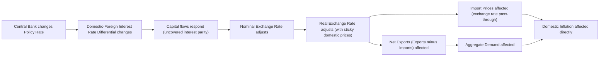
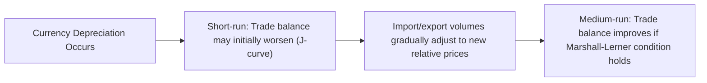

## Exchange Rate Channel

### Definition and Role

The exchange rate channel is a monetary transmission mechanism through which a change in a central bank's policy rate affects the nominal (and real) exchange rate, which in turn influences net exports, import prices, and ultimately aggregate demand and inflation. This channel is particularly significant for small, open economies with a high ratio of trade to GDP, where exchange rate movements have a proportionally larger effect on the domestic economy than in large, relatively closed economies such as the United States.

### The Core Transmission Sequence

### Interest Rate Parity as the Theoretical Foundation

**Key Points**

- The link between the policy rate and the exchange rate rests on **uncovered interest rate parity (UIP)**, which states that the expected return on domestic and foreign assets should be equalized once expected exchange rate changes are accounted for
- All else equal, a rise in the domestic policy rate relative to foreign rates makes domestic-currency assets more attractive to international investors, increasing capital inflows and appreciating the domestic currency
- A fall in the domestic policy rate relative to foreign rates has the opposite effect, depreciating the domestic currency

$$i_t - i_t^* = E_t[\Delta e_{t+1}]$$

where $i_t$ is the domestic interest rate, $i_t^*$ is the foreign interest rate, and $E_t[\Delta e_{t+1}]$ is the expected rate of domestic currency depreciation (an increase in $e$, defined as domestic currency per unit of foreign currency).

[Inference] While uncovered interest parity is the standard theoretical building block for the exchange rate channel in most textbook and policy models, it is well documented in the empirical international finance literature to hold poorly at short horizons in the data (the "forward premium puzzle" or "UIP puzzle"), meaning that the actual empirical relationship between interest rate differentials and exchange rate movements is considerably noisier and less mechanically reliable than the simple theoretical relationship would suggest.

### Nominal vs. Real Exchange Rate Effects

**Key Points**

- Because domestic prices are typically sticky in the short run (adjusting only gradually), a change in the *nominal* exchange rate translates into a corresponding change in the *real* exchange rate over the relevant policy horizon, affecting the relative price of domestic versus foreign goods
- A domestic currency appreciation (real) makes domestic goods relatively more expensive to foreign buyers and foreign goods relatively cheaper to domestic buyers, reducing net exports (the standard expenditure-switching effect)
- A domestic currency depreciation (real) has the opposite effect, making domestic goods relatively cheaper abroad and imports relatively more expensive, stimulating net exports

$$q_t = e_t + p_t^* - p_t$$

where $q_t$ is the (log) real exchange rate, $e_t$ is the nominal exchange rate, and $p_t$, $p_t^*$ are domestic and foreign price levels respectively.

### Exchange Rate Pass-Through to Domestic Inflation

**Key Points**

- Beyond its effect on aggregate demand via net exports, the exchange rate channel also has a **direct** effect on domestic inflation through **import price pass-through**: a currency depreciation raises the domestic-currency price of imported goods (consumer goods, and imported intermediate inputs used in domestic production), directly feeding into the domestic price level
- The degree of pass-through — how much of an exchange rate change translates into domestic price changes — varies substantially across countries and time periods, depending on factors including the share of imports in the consumption basket, the currency of invoicing for traded goods (many commodities and a large share of global trade are invoiced in US dollars regardless of the trading partners involved, a phenomenon termed "dominant currency pricing"), and the credibility of the central bank's inflation target (a highly credible target can dampen pass-through, since firms may be less inclined to fully pass on cost increases if they expect the exchange rate shock to be transitory and inflation to remain anchored)

[Inference] The empirical literature on exchange rate pass-through generally finds that pass-through has declined over recent decades in many advanced economies, a phenomenon often attributed at least partly to improved central bank credibility and better-anchored inflation expectations, though the precise magnitude of pass-through for any specific economy and time period requires empirical estimation rather than assumption of a fixed universal coefficient.

### Small Open Economy Relevance

**Key Points**

- The exchange rate channel is generally considered substantially more important for small, highly open economies (e.g., New Zealand, Sweden, Canada, many emerging markets) than for large, relatively closed economies (e.g., the United States), simply because trade constitutes a much larger share of GDP and a much larger share of the consumption basket in the former
- Small open economy variants of New Keynesian models (following, for example, the work of Lars Svensson and others on inflation targeting in small open economies) formally incorporate the exchange rate as an additional and materially significant channel of transmission and typically feature the exchange rate playing a much larger role in these central banks' policy deliberations and communication than is typical for, say, the Federal Reserve

### Historical Illustration: Emerging Market "Fear of Floating"

**Example**

Several emerging market central banks operating nominally under inflation-targeting or floating exchange rate frameworks have historically exhibited a documented reluctance to allow full exchange rate flexibility, a phenomenon termed **"fear of floating"** (associated with research by Guillermo Calvo and Carmen Reinhart). This reluctance is often attributed to two related exchange-rate-channel-specific concerns particularly acute in emerging markets: (1) higher and less-anchored exchange rate pass-through to domestic inflation than in advanced economies, and (2) balance sheet vulnerabilities from foreign-currency-denominated debt, where a depreciation directly raises the domestic-currency value of foreign-currency liabilities, worsening borrower (and sometimes sovereign) balance sheets — an interaction between the exchange rate channel and the balance sheet/financial accelerator channel discussed elsewhere in this material.

### The J-Curve Effect: Timing Considerations

**Key Points**

- The net export response to an exchange rate depreciation is often theorized (and in some empirical episodes observed) to follow a **J-curve** pattern: in the very short run, a depreciation can initially *worsen* the trade balance, because existing contracts and orders were priced before the depreciation and volumes have not yet adjusted, so the immediate effect is simply a higher domestic-currency cost for a given volume of imports
- Only after a lag — as export and import volumes respond to the new relative prices (a process termed the Marshall-Lerner condition being satisfied over time) — does the trade balance improve as the depreciation's intended effect
- This timing consideration is relevant for understanding why the exchange rate channel's effect on net exports and aggregate demand may not be immediately visible in trade balance data following a policy rate change

### Exchange Rate Channel and the Impossible Trinity

**Key Points**

- The strength and even the existence of an *independent* exchange rate channel depends on the exchange rate regime and degree of capital mobility, per the Mundell-Fleming trilemma: under a fixed exchange rate regime with open capital markets, the exchange rate is not free to respond to domestic policy rate changes at all (it is, by construction, pegged), so the exchange rate channel as described here is specific to economies operating (at least partially) flexible exchange rate regimes
- Economies with managed floats or capital controls (e.g., China) experience a partial or dampened version of this channel, since exchange rate movements in response to policy actions are constrained by active management rather than determined purely by market-driven capital flows

### Conclusion

The exchange rate channel transmits monetary policy to the real economy through two related pathways: an expenditure-switching effect on net exports operating via the real exchange rate, and a direct pass-through effect on domestic inflation via import prices. Its importance varies substantially with an economy's openness to trade and capital flows, making it a comparatively minor channel for large, relatively closed economies like the United States but a central and often dominant consideration for small open economies and many emerging markets, where concerns about pass-through and foreign-currency balance sheet exposure have historically generated documented "fear of floating" behavior even under nominally flexible exchange rate frameworks.

**Related Topics**

- Uncovered interest rate parity and the forward premium puzzle
- Exchange rate pass-through to domestic inflation: determinants and empirical estimates
- Dominant currency pricing and US dollar invoicing in global trade
- "Fear of floating" in emerging market economies (Calvo and Reinhart)
- The J-curve effect and the Marshall-Lerner condition
- Small open economy New Keynesian models (Svensson and related literature)
- The impossible trinity and its constraint on exchange rate channel strength
- Balance sheet effects of foreign-currency-denominated debt following depreciation