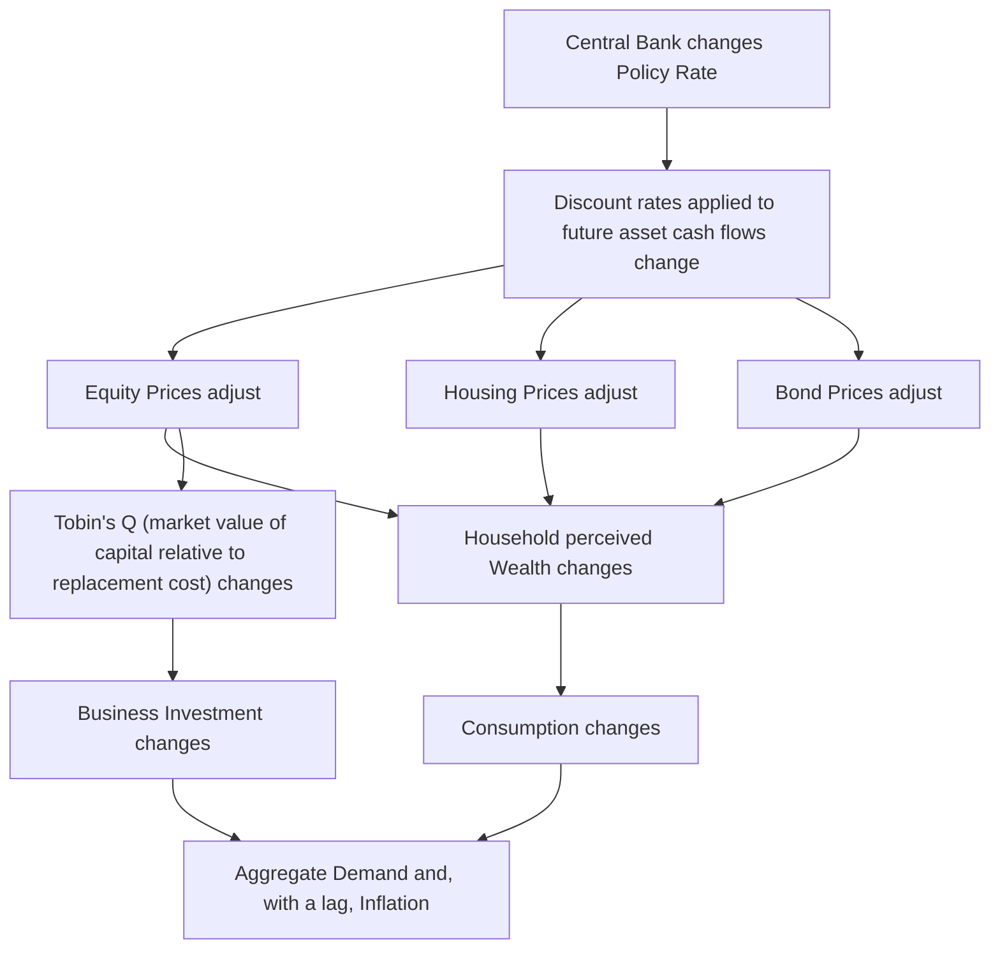
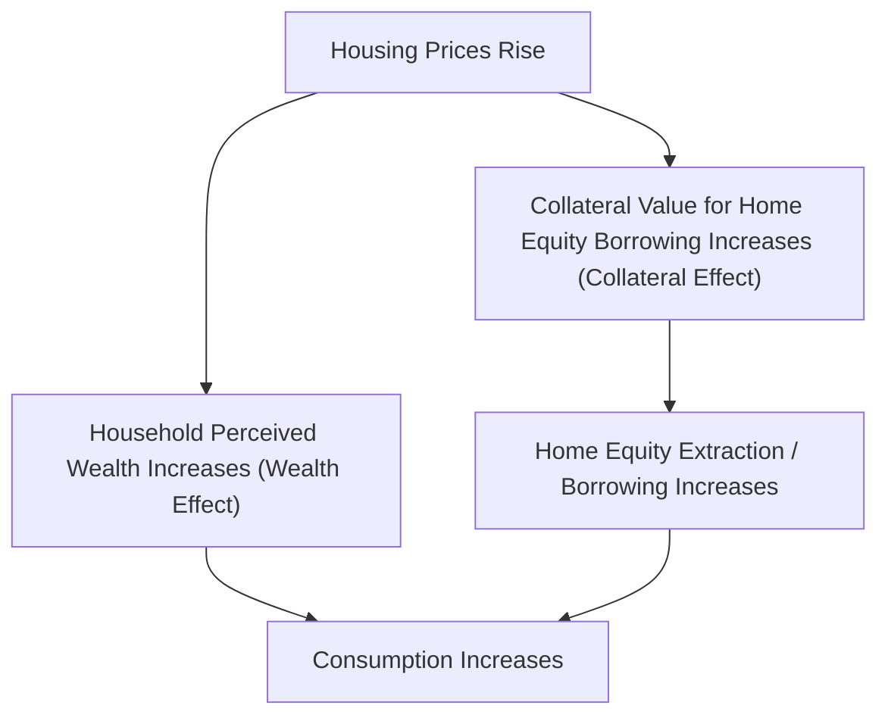

## Asset Price and Wealth Channel

### Definition and Role

The asset price and wealth channel is a monetary transmission mechanism through which changes in a central bank's policy rate affect the prices of financial and real assets — equities, bonds, and housing — which in turn influence household consumption (via perceived wealth) and firm investment (via the market valuation of capital and financing costs). This channel operates in parallel with, but is analytically distinct from, the conventional interest rate channel and the credit/balance-sheet channel, though it interacts with both.

### The Core Transmission Sequence

### Asset Pricing Foundation: Discounted Cash Flow Logic

**Key Points**

- The link between the policy rate and asset prices rests on standard present-value asset pricing: the price of any asset reflects the discounted value of its expected future cash flows (dividends, rents, coupon payments), and the policy rate influences the discount rate applied to those future cash flows both directly (via the risk-free rate component) and indirectly (via its effect on the required risk premium)
- A policy rate cut lowers the discount rate applied to future cash flows, mechanically raising the present value — and hence the current market price — of a given expected cash flow stream, all else equal
- A policy rate increase has the opposite effect, lowering asset prices for a given expected cash flow stream

$$P_t = \sum_{s=1}^{\infty} \frac{E_t[CF_{t+s}]}{(1+r_t+\rho_t)^s}$$

where $P_t$ is the asset price, $E_t[CF_{t+s}]$ is expected future cash flow, $r_t$ is the risk-free discount rate (closely linked to the policy rate), and $\rho_t$ is the risk premium.

### The Wealth Effect on Consumption

**Key Points**

- The **wealth effect** posits that households adjust their consumption not only in response to current income but also in response to changes in the value of their accumulated wealth (financial assets, housing equity), consistent with the permanent income and life-cycle hypotheses of consumption behavior, in which households smooth consumption relative to their perceived lifetime resources rather than solely their current income
- A rise in asset prices (equities, housing) increases perceived household wealth, which — under the life-cycle/permanent income framework — should increase current consumption even without any change in current income, since households perceive themselves as permanently wealthier
- Empirically, the **marginal propensity to consume (MPC) out of wealth** is typically estimated to be considerably smaller than the marginal propensity to consume out of current income, and research has found that the MPC differs by asset type — housing wealth effects are generally found to be larger than equity wealth effects in several empirical studies, plausibly because housing wealth is more evenly distributed across the population and more households treat housing equity as spendable (e.g., via home equity borrowing) than treat equity holdings similarly

$$C_t = f(Y_t^{permanent}, W_t) \quad \text{with} \quad \fracactive{\partial C_t}{\partial W_t} > 0, \text{ typically small in magnitude}$$

[Inference] The specific magnitude of the marginal propensity to consume out of wealth is one of the more actively debated empirical parameters in macroeconomics, with estimates varying meaningfully across countries, time periods, and asset types (housing versus equities in particular); any specific numerical estimate cited in the literature should be understood as period- and methodology-specific rather than a stable universal constant.

### Tobin's Q and Business Investment

**Key Points**

- James Tobin's **Q theory of investment** provides the standard asset-price-based framework linking monetary policy to business investment through the equity market: Tobin's Q is defined as the ratio of the market value of a firm's capital (as reflected in its equity and debt valuation) to the replacement cost of that capital
- A rise in equity prices (driven, for instance, by a policy rate cut lowering the discount rate applied to expected future corporate earnings) raises Q; when $Q > 1$, firms find it profitable to issue new equity and invest in new capital, since the market values a unit of installed capital more highly than the cost of acquiring it
- Conversely, when policy tightening lowers equity prices and Q falls below 1, firms find it unprofitable to raise new capital through equity issuance for investment, discouraging new investment spending

$$Q_t = \frac{\text{Market Value of Capital}}{\text{Replacement Cost of Capital}}, \quad I_t = g(Q_t), \quad g' > 0$$

### Housing Wealth: A Distinct and Historically Significant Sub-Channel

**Key Points**

- The housing wealth channel operates through two related mechanisms: (1) a pure wealth effect on consumption, as described above, and (2) a **collateral effect**, whereby rising home values increase the collateral available for home equity borrowing (home equity lines of credit, cash-out mortgage refinancing), allowing households to convert illiquid housing wealth into spendable funds even without selling the underlying asset
- This collateral-based mechanism connects the housing wealth channel closely to the broader balance sheet/financial accelerator channel, since it depends on the same net-worth-and-collateral logic, applied specifically to household housing equity rather than firm or aggregate borrower net worth
- The pre-2008 US housing boom and subsequent bust is widely cited as a historically significant illustration of this channel's potential magnitude: substantial home equity extraction during the housing price boom (2000s) is estimated in various studies to have supported meaningfully elevated consumption levels, while the subsequent housing price collapse (2007–2009) is understood to have contributed materially to the sharp contraction in consumption during the Great Recession, operating through both the direct wealth effect and the collateral-constraint mechanism simultaneously

### Empirical Comparison: Housing vs. Equity Wealth Effects

| Feature | Housing Wealth Effect | Equity Wealth Effect |
| --- | --- | --- |
| Distribution across households | Broader (homeownership more widespread than direct equity holding in most economies) | Narrower (equity ownership often concentrated among higher-income/wealth households) |
| Collateralizability | High (home equity borrowing is a well-established channel) | Lower (borrowing directly against equity holdings, e.g., margin lending, is less common as a consumption-financing mechanism for most households) |
| Typical estimated MPC | Generally found to be larger in several empirical studies | Generally found to be smaller in several empirical studies |
| Volatility of the underlying asset | Lower short-run volatility, but historically large boom-bust cycles | Higher short-run volatility |

[Unverified] Specific numerical MPC estimates for housing versus equity wealth vary considerably across the empirical literature depending on country, time period, and estimation methodology, so any precise figure should be sourced from a specific study rather than treated as a fixed, universally applicable parameter.

### Asset Prices, Financial Stability, and the "Leaning Against the Wind" Debate

**Key Points**

- Because the asset price channel implies that monetary policy directly influences asset valuations, a long-standing debate in monetary economics concerns whether central banks should adjust policy specifically to address perceived asset price misalignments or bubbles ("leaning against the wind"), beyond what would be warranted by the conventional inflation and output-gap objectives alone
- The pre-2008 consensus among many central banks (sometimes associated with the "Greenspan doctrine" or "mop-up strategy") generally favored *not* targeting asset prices directly, on the grounds that bubbles are difficult to identify reliably in real time and that monetary policy is a blunt tool for addressing asset price misalignments relative to targeted macroprudential regulation, preferring instead to react forcefully ("mop up") after a bubble bursts
- The severity of the 2008 financial crisis prompted substantial re-examination of this consensus, with increased attention to financial stability considerations in monetary policy frameworks and expanded use of macroprudential tools as a complement (and, in the view of many economists, a preferable primary tool relative to interest rate policy) for addressing asset price and credit-driven financial imbalances

[Inference] The "leaning against the wind" debate remains an active and not fully resolved area of monetary policy research and central bank practice; different central banks and academic economists continue to hold differing views on the appropriate weight, if any, that financial stability and asset price considerations should receive within the interest-rate-setting process itself, as distinct from being addressed primarily through separate macroprudential tools.

### Asset Price Channel Interaction with Other Transmission Channels

**Key Points**

- The asset price channel is closely intertwined with, but analytically distinct from, other transmission channels discussed elsewhere: it shares its underlying discount-rate mechanism with the conventional interest rate channel, and its collateral-effect component overlaps substantially with the balance sheet/financial accelerator channel
- Quantitative easing programs are frequently understood as operating substantially through the asset price channel: by purchasing long-term securities, a central bank directly compresses long-term yields and, via portfolio rebalancing effects, can raise the prices of a broader range of financial assets (including equities), aiming to stimulate spending through exactly the wealth and Tobin's Q mechanisms described in this channel, even when the short-term policy rate itself is constrained at the effective lower bound

### Conclusion

The asset price and wealth channel transmits monetary policy to the real economy by altering the valuation of financial and real assets through standard discounted-cash-flow logic, subsequently affecting household consumption via perceived wealth (and, for housing specifically, via collateral-based borrowing capacity) and firm investment via Tobin's Q. Its empirical magnitude — particularly the marginal propensity to consume out of wealth, and the relative strength of housing versus equity effects — remains an actively researched and debated area, and its policy implications extend into the broader, unresolved debate over whether and how monetary policy should respond to asset price developments beyond their direct implications for the conventional inflation and output-gap objectives.

**Related Topics**

- The permanent income and life-cycle hypotheses of consumption
- Tobin's Q theory of investment
- Housing wealth effects and home equity extraction: the pre-2008 US experience
- The "leaning against the wind" debate in monetary policy
- Quantitative easing and the portfolio rebalancing channel
- The balance sheet/financial accelerator channel and its overlap with housing collateral effects
- Macroprudential policy as an alternative tool for addressing asset price imbalances
- Empirical estimation of the marginal propensity to consume out of wealth