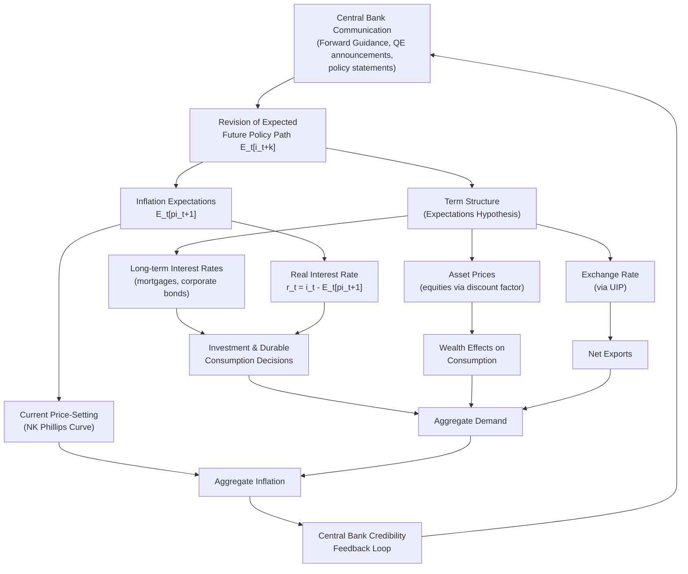

## Expectations and Signaling Channel

### Definition and Conceptual Foundation

The expectations and signaling channel describes how central bank communications, policy actions, and credibility shape private-sector beliefs about future monetary policy, inflation, and economic conditions, thereby influencing current economic decisions. Unlike traditional transmission channels that operate through immediate changes in interest rates or credit availability, this channel operates primarily through the management of expectations about the future path of policy.

The channel rests on a core insight from modern macroeconomics: economic decisions such as consumption, investment, and price-setting are inherently forward-looking. Households and firms do not respond only to the current policy rate but to their expectations of the entire future trajectory of short-term rates, since this trajectory determines long-term interest rates via the expectations hypothesis of the term structure, and determines expected real returns via anticipated inflation.

$$i_{n,t} = \frac{1}{n}\sum_{k=0}^{n-1} E_t[i_{t+k}] + \phi_{n,t}$$

where $i_{n,t}$ is the yield on an $n$-period bond, $E_t[i_{t+k}]$ is the expected future short-term rate, and $\phi_{n,t}$ is a term premium. This equation is the analytical backbone of the channel: a central bank can move $i_{n,t}$ — and hence current economic activity — not only by moving today's $i_t$, but by altering the expected path $E_t[i_{t+k}]$ for all future $k$.

### Theoretical Mechanisms

**Forward Guidance and the Expectations Hypothesis**

Forward guidance is the primary policy tool operating through this channel. By credibly committing to or signaling a future path for the policy rate, the central bank shifts $E_t[i_{t+k}]$ without necessarily changing $i_t$ today. Since long-term rates are averages of expected future short rates, this immediately affects the entire yield curve.

Two forms of forward guidance are typically distinguished:

- **Delphic forward guidance**: The central bank forecasts economic conditions, implicitly revealing what future policy is likely to be given its reaction function. This works by transmitting information about the economy, not by making commitments.
- **Odyssean forward guidance**: The central bank makes an explicit commitment to a future policy path, deliberately deviating from what a discretionary policymaker would do at that future date, in order to affect expectations today. The name refers to Odysseus binding himself to the mast — a genuine commitment device.

Odyssean guidance is theoretically more powerful because it exploits the time-inconsistency of optimal policy: promising to keep rates low even after inflation has stabilized (an action a purely discretionary central bank would not take ex post) generates a larger effect on long-term rates and current activity, as formalized in Eggertsson and Woodford's (2003) analysis of optimal policy at the zero lower bound.

**The Signaling Channel of Quantitative Easing**

In unconventional monetary policy analysis, "signaling" specifically refers to one of two main transmission channels of large-scale asset purchases (the other being portfolio rebalancing). Central bank asset purchases can signal that policy rates will remain low for longer than previously expected, because:

- Committing large balance sheet resources to long-duration assets is costly to reverse and thus serves as a credible signal of future rate intentions
- The scale and composition of purchases reveal the central bank's assessment of the severity and persistence of the shock

[Inference] The relative empirical weight of signaling versus portfolio-rebalancing effects in QE episodes remains contested and appears to vary by episode, asset class, and market conditions.

**Central Bank Credibility and the Anchoring of Expectations**

Credibility determines how quickly and strongly announcements translate into revised expectations. A central bank with high credibility can shift inflation expectations toward its target through communication alone, generating a form of "expectations anchoring" in which long-run inflation expectations become insensitive to transitory shocks.

$$\pi_t^e = \lambda \pi^{target} + (1-\lambda) \pi_{t-1}$$

where $\lambda \in [0,1]$ represents the degree of anchoring to the central bank's target. As $\lambda \to 1$, expectations become fully anchored and largely decoupled from recent inflation realizations — a hallmark of high institutional credibility.

### Transmission Pathways

**1. Real Interest Rate Channel via Inflation Expectations**

Through the Fisher relation, nominal rate signals interact with inflation expectations to determine the real rate relevant for spending decisions:

$$r_t = i_t - E_t[\pi_{t+1}]$$

If the central bank credibly signals higher future inflation tolerance (e.g., during liquidity trap episodes), and nominal rates are constrained at the zero lower bound, raising $E_t[\pi_{t+1}]$ lowers $r_t$ even without a change in $i_t$, stimulating consumption and investment. This is the mechanism underlying Krugman's (1998) argument that central banks must "credibly promise to be irresponsible" to escape a liquidity trap.

**2. Term Structure and Asset Prices**

Signals about the future path of short rates propagate through the term structure (per the expectations hypothesis equation above), affecting mortgage rates, corporate bond yields, and, via discounted cash flow valuation, equity prices:

$$P_t = \sum_{k=1}^{\infty} \frac{E_t[D_{t+k}]}{(1+E_t[i_{t+k}])^k}$$

A downward revision in the expected future rate path raises the discount factor applied to future dividends $D_{t+k}$, increasing asset prices $P_t$ and generating wealth effects that feed into consumption.

**3. Exchange Rate Channel**

By uncovered interest parity, the expected future path of the interest rate differential relative to foreign rates influences the current exchange rate:

$$s_t = E_t[s_{t+1}] - (i_t - i_t^*)$$

Signals about a more dovish future path (lower expected $i_{t+k}$ relative to foreign $i_{t+k}^*$) tend to depreciate the currency today, all else equal, affecting net exports.

**4. Wage- and Price-Setting Behavior**

In New Keynesian models with staggered price adjustment (Calvo pricing), firms that reset prices infrequently must forecast future marginal costs and inflation over the life of the price. The New Keynesian Phillips Curve makes this explicit:

$$\pi_t = \beta E_t[\pi_{t+1}] + \kappa x_t$$

where $x_t$ is the output gap and $\beta$ is the discount factor. Current inflation depends directly on *expected future* inflation, meaning that credible signals about the future inflation path have immediate, mechanical effects on current price-setting — this is a structural reason the channel operates without lag, unlike channels requiring balance-sheet or investment-cycle adjustment.

### Diagram: Transmission Pathway

### Empirical Identification Challenges

Isolating the expectations/signaling channel empirically is difficult because policy announcements are typically bundled with information about the economy (the "Delphic" confound). High-frequency event-study methods around FOMC announcements attempt to separate:

- **Target factor**: surprise changes in the current policy rate
- **Path factor**: surprise changes in the expected future rate path, extracted from movements in short-term futures and longer-dated instruments in a narrow window around the announcement

Nakamura and Steinsson's (2018) work on "Fed information effects" demonstrated that a subset of policy surprises appear to convey information about the Fed's private assessment of economic conditions, causing private forecasters to revise growth expectations in the *same* direction as the policy surprise — a finding that complicates the standard assumption that monetary tightening signals should lower growth expectations.

[Unverified] The precise magnitude of the "information effect" relative to conventional signaling effects remains an active area of methodological dispute, with some subsequent studies (e.g., using alternative identification strategies) finding smaller information effects than the original estimates.

### Practical Example: Federal Reserve Forward Guidance (2020–2021)

During the COVID-19 pandemic response, the Federal Reserve combined:

1. **Rate-based Odyssean guidance**: Commitment to hold the federal funds rate near zero "until labor market conditions have reached levels consistent with the Committee's assessments of maximum employment and inflation has risen to 2 percent and is on track to moderately exceed 2 percent for some time"
2. **Outcome-based (state-contingent) guidance**: Explicit numerical/qualitative thresholds rather than calendar dates, intended to be more credible since the commitment is verifiable against observable data
3. **Flexible Average Inflation Targeting (FAIT)**: An explicit framework shift announced in August 2020, signaling tolerance for inflation moderately above 2% following periods of undershooting — designed to raise $E_t[\pi_{t+k}]$ and lower expected real rates at the effective lower bound

**Key Points:**

- The framework shift itself functioned as a signaling device, independent of any single rate decision
- Market-based inflation breakevens (TIPS spreads) rose following the FAIT announcement, consistent with the intended signaling effect
- [Inference] Disentangling the FAIT announcement's effect from concurrent pandemic-related fiscal and health developments in market data is not fully clean, given the proximity of multiple large shocks

### Comparison with Other Transmission Channels

| Channel | Primary Mechanism | Speed | Dependence on Credibility |
| --- | --- | --- | --- |
| Interest rate channel | Direct change in $i_t$ affects current cost of capital | Immediate to short-run | Low |
| Credit/bank lending channel | Changes in bank reserves/capital affect loan supply | Medium (quarters) | Low-Medium |
| Balance sheet channel | Asset price/collateral value changes affect borrowing capacity | Medium | Low-Medium |
| Exchange rate channel | Interest differential affects currency value | Short-run | Medium |
| **Expectations/signaling channel** | Revision of expected future policy path affects current decisions | **Immediate (forward-looking)** | **High** |

The defining feature distinguishing this channel is that its effectiveness scales directly with central bank credibility: an identical announcement produces a larger effect on expectations (and hence on the term structure and real activity) the more the private sector trusts the central bank to follow through.

### Limitations and Critiques

- **Time-inconsistency problem**: Odyssean commitments to future policy paths that will look suboptimal ex post are subject to the temptation to renege, which rational agents anticipate, potentially undermining the credibility of the signal (the core issue formalized in Kydland and Prescott's 1977 time-inconsistency framework)
- **Forward guidance puzzle**: Standard New Keynesian models predict implausibly large effects of guidance about the distant future on current output and inflation, a result widely viewed in the literature as a modeling shortcoming rather than an empirical regularity, motivating alternative model features (e.g., incomplete information, bounded rationality, or heterogeneous agents)
- **Communication clarity trade-offs**: Overly specific state-contingent guidance can constrain future policy flexibility, while vague guidance may fail to move expectations meaningfully
- **Effective lower bound dependency**: The channel receives outsized attention specifically because conventional rate cuts are unavailable at the ELB; its relative importance in normal times, while still present, is smaller relative to conventional channels

**Related Topics:**

- Forward guidance: Delphic vs. Odyssean distinction (formal modeling)
- The forward guidance puzzle and its proposed resolutions
- Quantitative easing: signaling vs. portfolio rebalancing channels
- Central bank credibility and time-inconsistency (Kydland-Prescott, Barro-Gordon)
- Flexible Average Inflation Targeting and other outcome-based frameworks
- Term structure models and the expectations hypothesis
- New Keynesian Phillips Curve and inflation dynamics
- High-frequency identification of monetary policy shocks (target vs. path factors)
- The Fed information effect literature
- Effective lower bound dynamics and liquidity trap escape strategies