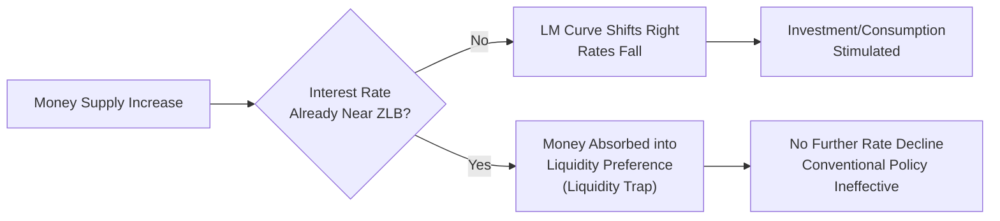
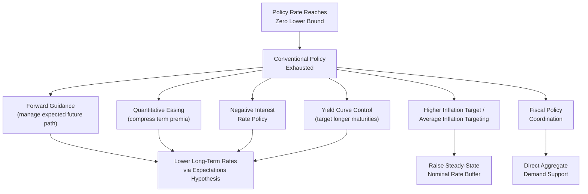

## The Zero Lower Bound Problem

### Definition and Conceptual Foundation

The zero lower bound (ZLB), also referred to as the effective lower bound (ELB) in contemporary literature, describes the constraint that nominal interest rates cannot fall much below zero because economic agents retain the option to hold physical currency, which bears a nominal return of exactly zero. This constraint fundamentally limits the capacity of conventional monetary policy — the setting of a short-term nominal policy rate — to stimulate aggregate demand during severe negative shocks.

Formally, the constraint is expressed as:

$$i_t \geq \underline{i}$$

where $\underline{i}$ is close to but not necessarily exactly zero. The distinction between "zero" and "effective" lower bound matters: negative policy rates have been implemented in several jurisdictions (Denmark, Sweden, Switzerland, the Eurozone, Japan), demonstrating that $\underline{i}$ can be modestly negative. However, storage, insurance, and transaction costs of holding physical cash prevent rates from falling arbitrarily far below zero, so an effective floor still exists, generally estimated to lie somewhere in a narrow band below zero.

### Theoretical Foundation: Why the Bound Exists

**The Cash Arbitrage Argument**

The lower bound arises from a simple arbitrage relationship. Currency is a zero-interest, riskless bearer asset issued by the central bank/government. If a bank or interest-bearing deposit offered a return sufficiently more negative than the (net) cost of storing cash, agents would withdraw funds and hold currency instead:

$$i_t < -c \implies \text{cash preferred to deposits}$$

where $c$ represents the per-period cost of storing, insuring, and transacting in physical cash (vault costs, security, inconvenience for large-scale storage). This is why negative rates observed in practice (e.g., the ECB's deposit facility rate reaching -0.50%, or Swiss National Bank rates reaching -0.75%) remained modest: they were calibrated to stay within the band where cash-holding costs make deposits still preferable for large institutional holders.

**Historical Context: The Liquidity Trap**

The ZLB is closely related to, and often used interchangeably with, Keynes's concept of the liquidity trap: a situation in which conventional monetary policy — expanding the money supply — fails to lower interest rates further or stimulate demand because money and short-term bonds become perfect substitutes at the floor rate. In the IS-LM framework, this corresponds to a horizontal LM curve at low rates, such that shifts in money supply do not move the equilibrium interest rate:

### Why the ZLB Is a Problem: Mechanism of Policy Impairment

**1. Inability to Deliver Negative Real Rates When Needed**

The Fisher equation shows that the real interest rate relevant to spending decisions is:

$$r_t = i_t - E_t[\pi_{t+1}]$$

In a severe demand shortfall, the "natural rate of interest" $r_t^*$ (the real rate consistent with output at potential) can fall sharply negative — as modeled in Wicksellian and New Keynesian frameworks. If $i_t$ is bounded near zero and expected inflation $E_t[\pi_{t+1}]$ is low or falling, the central bank cannot push $r_t$ down to $r_t^*$:

$$r_t = \underline{i} - E_t[\pi_{t+1}] > r_t^*$$

This leaves the real rate too high relative to what is needed to close the output gap, producing a persistent contractionary bias exactly when stimulus is most needed.

**2. Deflationary Spiral Risk**

If a negative demand shock pushes inflation and inflation expectations down while the nominal rate is stuck at $\underline{i}$, the real rate *rises* even as the central bank does nothing to tighten:

$$\downarrow E_t[\pi_{t+1}] \text{ with } i_t = \underline{i} \implies \uparrow r_t$$

This can generate a self-reinforcing deflationary spiral: falling inflation raises real rates, which depresses demand further, which puts additional downward pressure on inflation. This dynamic is central to analyses of Japan's prolonged experience with deflation and near-zero rates from the mid-1990s onward, as well as to the intensity of the 2008–2009 and 2020 policy responses.

**3. Amplification via the New Keynesian Phillips Curve and IS Curve**

In canonical New Keynesian ZLB models (e.g., Eggertsson and Woodford 2003; Werning 2011), the model economy is described by:

$$x_t = E_t[x_{t+1}] - \sigma(i_t - E_t[\pi_{t+1}] - r_t^*)$$

$$\pi_t = \beta E_t[\pi_{t+1}] + \kappa x_t$$

$$i_t = \max(\underline{i}, i_t^{Taylor})$$

where $x_t$ is the output gap. When the Taylor-rule-implied rate $i_t^{Taylor}$ would be negative, the actual rate is constrained at $\underline{i}$, and the resulting positive gap between $i_t$ and $i_t^{Taylor}$ feeds back through both equations, depressing $x_t$ and $\pi_t$ simultaneously, which further depresses $E_t[\pi_{t+1}]$, tightening the constraint in expectation as well — a mechanism sometimes called the "deflationary trap" in these models.

### Historical Episodes

| Episode | Period | Policy Rate at Trough | Key Response |
| --- | --- | --- | --- |
| Japan | 1999–present (intermittent) | ~0% to -0.1% | ZIRP, QE, QQE, Yield Curve Control |
| United States | 2008–2015 | 0–0.25% | QE1–QE3, forward guidance |
| Eurozone | 2014–2022 | -0.50% (deposit rate) | Negative rates, APP, PEPP, TLTROs |
| United Kingdom | 2009–2021 | 0.10–0.50% | QE, forward guidance |
| United States (COVID) | 2020–2022 | 0–0.25% | Unlimited QE, FAIT framework, forward guidance |

[Inference] Japan is generally regarded as the paradigmatic and longest-running ZLB case, and much of the analytical apparatus used to study the ZLB elsewhere (Eggertsson-Woodford, Krugman's 1998 liquidity trap paper) was developed with explicit reference to the Japanese experience of the 1990s.

### Policy Responses to the ZLB

**1. Forward Guidance**

Since the constraint binds on $i_t$ but not directly on expectations of future rates, central banks attempt to lower the *expected future path* of rates and thereby affect long-term rates via the expectations hypothesis, as covered under the expectations/signaling channel. This does not violate the ZLB itself but works around it by manipulating expectations of the post-ZLB rate path.

**2. Quantitative Easing (Large-Scale Asset Purchases)**

Central bank purchases of long-term government bonds, mortgage-backed securities, and (in some jurisdictions) corporate bonds or equities, intended to:

- Compress term premia directly (portfolio rebalancing channel)
- Signal a lower-for-longer rate path (signaling channel)
- Support market functioning during acute stress episodes

**3. Negative Interest Rate Policy (NIRP)**

Setting policy rates modestly below zero, typically on central bank reserves, exploiting the fact that large institutional depositors face higher costs of converting to physical cash than small retail depositors, so the effective floor for policy rates is somewhat below the retail cash-storage floor.

[Unverified] The transmission efficacy and side effects of NIRP (particularly effects on bank profitability and lending incentives) remain subjects of ongoing empirical debate, with some studies suggesting a "reversal rate" below which further cuts become contractionary by impairing bank capital.

**4. Yield Curve Control (YCC)**

Committing to purchase unlimited quantities of a targeted maturity bond to cap its yield at a specified level, as implemented by the Bank of Japan from 2016. This shifts the operational target from the quantity of purchases to the price (yield) of a longer-maturity instrument, directly addressing the ZLB's confinement of the *short* rate by targeting further out the curve instead.

**5. Higher Inflation Targets / Price-Level or Average-Inflation Targeting**

Since the depth of ZLB episodes depends inversely on the "buffer" between the steady-state nominal rate and zero (roughly, steady-state real rate plus inflation target), raising the inflation target or adopting frameworks like Flexible Average Inflation Targeting (adopted by the Fed in 2020) increases the average nominal rate buffer, reducing the frequency and severity with which the ZLB binds.

$$i^{ss} = r^{*} + \pi^{target}$$

A higher $\pi^{target}$ mechanically raises $i^{ss}$, giving more room to cut before hitting $\underline{i}$ in a future downturn — a rationale explicitly cited in academic proposals (e.g., Blanchard, Dell'Ariccia, and Mauro 2010) to raise inflation targets from 2% to a higher figure.

**6. Fiscal Policy Coordination**

Since monetary policy's traditional lever is impaired, many analyses of the ZLB (both New Keynesian and Post-Keynesian) argue for a shifted burden toward fiscal stimulus, since the fiscal multiplier is theoretically larger at the ZLB (because interest-rate crowding-out of government spending is muted when rates cannot rise in response).

### Diagram: Policy Toolkit at the ZLB

### Practical Example: The 2008–2015 U.S. Episode

Following the federal funds rate reaching the 0–0.25% target range in December 2008:

1. The Fed conducted three rounds of large-scale asset purchases (QE1: 2008–2010, focused on agency MBS and Treasuries during acute crisis; QE2: 2010–2011; QE3: 2012–2014, open-ended purchases tied to labor market outcomes)
2. Forward guidance evolved from calendar-based ("exceptionally low levels... at least through mid-2013") to outcome-based (tied to unemployment and inflation thresholds under the Evans Rule, 2012)
3. The federal funds rate remained at the ZLB for seven years, the longest such episode in Fed history to that point

**Key Points:**

- The prolonged duration illustrated the practical difficulty of using unconventional tools to fully substitute for conventional rate cuts
- Estimates of the "shadow rate" (a hypothetical unconstrained policy rate implied by the stance of unconventional policy) suggest unconventional measures achieved substantial but incomplete equivalent stimulus relative to what conventional rate cuts would have provided
- [Inference] The slow pace of the subsequent recovery in the U.S. is sometimes attributed partly to ZLB constraints, though this interpretation competes with explanations centered on deleveraging, fiscal policy stance, and structural factors

### Critiques and Open Debates

- **Effectiveness uncertainty**: The quantitative impact of QE and forward guidance relative to conventional rate cuts is harder to estimate cleanly, given the absence of historical precedent for calibrating the same reduced-form relationships used for conventional policy
- **Forward guidance puzzle**: As with the broader expectations channel, standard models overstate the output/inflation effects of guidance about the distant future, casting some doubt on model-based assessments of ZLB escape strategies
- **Distributional and financial stability concerns**: Extended near-zero rates and QE-driven asset price increases raise concerns about wealth inequality effects and asset price bubbles, which are cited as a cost of extended ZLB policy responses
- **Reversal rate concern**: Excessively negative rates may become contractionary through bank profitability channels, implying $\underline{i}$ is not simply "as low as institutionally feasible" but has an economically optimal floor that may be higher than the technical cash-arbitrage floor

**Related Topics:**

- Liquidity trap theory (Keynes, Krugman 1998, Hicks's IS-LM formalization)
- Forward guidance: Delphic vs. Odyssean distinction
- Quantitative easing transmission channels (signaling vs. portfolio rebalancing)
- Negative interest rate policy and the "reversal rate" literature
- Yield curve control: Bank of Japan's 2016 framework
- Flexible Average Inflation Targeting and optimal inflation target debates
- Shadow rate estimation methodology (Wu-Xia, Krippner models)
- Fiscal-monetary policy coordination at the ZLB
- r-star (natural rate of interest) estimation and secular stagnation