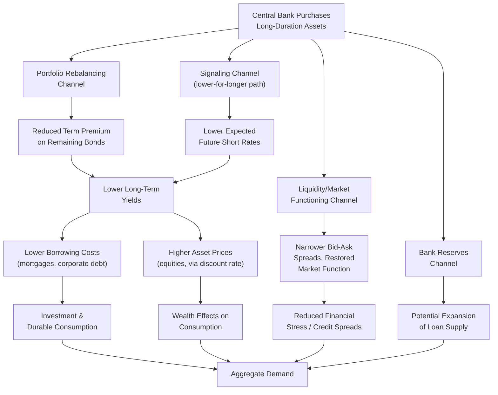

## Quantitative Easing and Large-Scale Asset Purchases

### Definition and Conceptual Foundation

Quantitative easing (QE), also termed large-scale asset purchases (LSAPs), refers to central bank purchases of financial assets — predominantly long-term government bonds, agency mortgage-backed securities, and in some jurisdictions corporate bonds or equities — financed by the creation of central bank reserves, undertaken when the conventional policy rate is at or near the effective lower bound (ELB). The defining feature distinguishing QE from conventional open market operations is its focus on the composition and duration of the central bank's balance sheet rather than the level of the overnight policy rate.

The balance sheet mechanics can be summarized as an asset swap:

$$\Delta \text{Reserves} = \Delta \text{Central Bank Holdings of Long-Term Assets}$$

The central bank credits the reserve accounts of the selling banks in exchange for the long-duration assets, expanding both sides of its balance sheet without altering the overnight policy rate directly.

### Theoretical Transmission Channels

**1. Portfolio Rebalancing Channel**

This channel rests on the premise that assets are imperfect substitutes (violating the pure expectations hypothesis assumption of perfect substitutability across maturities). When the central bank removes a quantity of long-duration, higher-duration-risk assets from the market, private investors holding the residual supply must be compensated with a lower yield (higher price) to be willing to hold the now-scarcer duration risk, or must rebalance into other assets (corporate bonds, equities) bidding up their prices too.

$$i_{n,t} = \frac{1}{n}\sum_{k=0}^{n-1} E_t[i_{t+k}] + \phi_{n,t}(Q_t)$$

where $\phi_{n,t}$, the term premium, is modeled as a decreasing function of $Q_t$, the quantity of long-duration securities held by the private sector (equivalently, an increasing function of the *duration risk removed* by central bank purchases). This is the "preferred habitat" or "local supply" view formalized in models such as Vayanos and Vila's (2009/2021) framework, in which specific investor clienteles have preferences for particular segments of the maturity spectrum, so relative supply shifts at each maturity move that segment's yield.

**2. Signaling Channel**

As covered in the expectations and signaling channel topic, large-scale purchase commitments can function as a credible signal that policy rates will remain low for an extended period, since unwinding a large balance sheet position is costly and would be inconsistent with an imminent rate hike cycle. This operates on $E_t[i_{t+k}]$ in the equation above rather than on $\phi_{n,t}$.

**3. Liquidity/Market Functioning Channel**

During acute financial stress (e.g., March 2020, September 2008), purchases can restore functioning in dislocated markets by acting as a buyer of last resort, compressing liquidity premia embedded in bid-ask spreads and price dislocations that are distinct from the steady-state duration-risk premium targeted by portfolio rebalancing.

**4. Bank Lending / Reserves Channel**

Some models emphasize that the reserves created by QE, held by commercial banks, could relax bank balance sheet or capital constraints, potentially expanding loan supply. [Inference] This channel has received less consistent empirical support than portfolio rebalancing and signaling, particularly during episodes when banks preferred to hold excess reserves rather than expand lending.

### Diagram: QE Transmission

### Balance Sheet Mechanics and Duration Risk

The central bank's purchase program effectively transfers interest rate (duration) risk from the private sector to the central bank's own balance sheet. This can be quantified using the concept of duration-weighted purchases, often expressed as "10-year equivalents":

$$\text{10-yr equivalent} = \sum_i w_i \cdot D_i$$

where $w_i$ is the face value of asset $i$ purchased and $D_i$ is its duration relative to a 10-year benchmark. Central bank communications (e.g., Federal Reserve System Open Market Account operational details) frequently reported purchases in these terms because the stimulative effect of a purchase program depends on the duration risk removed, not merely the nominal dollar amount.

### Comparison of Major QE Programs

| Program | Institution | Period | Asset Focus | Approximate Scale |
| --- | --- | --- | --- | --- |
| QE1 | Federal Reserve | 2008–2010 | Agency MBS, agency debt, Treasuries | ~$1.75 trillion |
| QE2 | Federal Reserve | 2010–2011 | Treasuries | ~$600 billion |
| QE3 | Federal Reserve | 2012–2014 | Agency MBS, Treasuries (open-ended) | ~$1.6 trillion (through taper) |
| APP (Asset Purchase Programme) | ECB | 2014–2018 (with restarts) | Sovereign bonds, covered bonds, corporate bonds, ABS | Over €2.6 trillion |
| PEPP (Pandemic Emergency Purchase Programme) | ECB | 2020–2022 | Sovereign and corporate bonds | €1.85 trillion envelope |
| QQE (Quantitative and Qualitative Monetary Easing) | Bank of Japan | 2013–2016 (evolved into YCC) | JGBs, ETFs, J-REITs | Continuous, large scale |
| Asset Purchase Facility | Bank of England | 2009–ongoing (with restarts) | Gilts, corporate bonds | Over £895 billion (peak) |

[Inference] Direct scale comparisons across programs are complicated by differing base economy sizes, so purchases are often more meaningfully compared as a share of GDP or of the outstanding stock of the targeted asset class.

### Empirical Identification Methods

Because QE announcements are typically embedded in broader policy communications, isolating their causal effect on yields uses several approaches:

**Event-study methodology**: Measuring the change in yields in a narrow window (often intraday) around the announcement, under the assumption that other news is unlikely to arrive in that window, attributing the yield movement to the QE signal.

**Time-series/VAR approaches**: Estimating the dynamic effect of balance sheet expansion shocks on yields, output, and inflation over a longer horizon using structural vector autoregressions, often with sign or zero restrictions to identify a "QE shock" distinct from a conventional rate shock.

**Cross-sectional/local supply approaches**: Comparing the yield response of securities more versus less exposed to central bank purchases (e.g., a security eligible for purchase versus a close substitute that is not), exploiting the preferred-habitat prediction that scarcity effects should be concentrated in the specific purchased securities.

[Unverified] Estimates of the effect of a given quantity of QE purchases on the 10-year yield vary meaningfully across studies and episodes — commonly cited ranges from event studies suggest tens of basis points of yield compression per trillion dollars of announced purchases in the U.S. context, but these estimates are sensitive to methodology, market conditions (crisis versus non-crisis), and the specific program.

### Practical Example: Federal Reserve QE3 (2012–2014) — Open-Ended, State-Contingent Design

QE3 differed structurally from QE1 and QE2 by being announced without a pre-specified total size or end date, instead tied explicitly to labor market outcomes ("if the outlook for the labor market does not improve substantially..."). This design:

1. Combined the portfolio rebalancing channel (ongoing $85 billion/month in purchases at the program's peak) with an implicit signaling channel, since continuation was conditioned on economic conditions rather than a calendar date
2. Was wound down via the 2013–2014 "taper," a gradual reduction in the *pace* of purchases rather than an abrupt stop, reflecting concern about market disruption (the "taper tantrum" of May–June 2013 illustrated the sensitivity of long-term yields to signals about the *future pace* of purchases, effectively demonstrating the signaling channel operating in reverse)

**Key Points:**

- The taper tantrum showed that expectations about the trajectory of QE (a second-derivative effect) could move markets as much as the purchases themselves
- This episode is frequently cited as evidence that the *stock* of purchases (and expectations about future stock) matters more for yields than the *flow* (pace) of ongoing purchases — the "stock view" versus "flow view" debate in the QE literature

### QE Unwind: Quantitative Tightening (QT)

The reverse process — balance sheet reduction — can occur via:

- **Passive runoff**: Allowing maturing securities to roll off without reinvestment, shrinking the balance sheet gradually
- **Active sales**: Directly selling holdings, a more aggressive and rarely used approach due to concerns about amplifying yield increases

$$\Delta \text{Balance Sheet} = -(\text{Maturing Principal} - \text{Reinvestment})$$

[Inference] Passive runoff has been the dominant approach in observed QT episodes (e.g., Federal Reserve balance sheet reduction beginning 2017 and again 2022), likely reflecting a desire to avoid the market disruption risk associated with active sales, though this remains a design choice rather than a technical necessity.

### Side Effects and Critiques

- **Asset price inflation and inequality concerns**: Since QE operates partly by boosting asset prices, and asset ownership is concentrated among wealthier households, critics argue QE may exacerbate wealth inequality — a concern raised in central bank distributional impact studies themselves (e.g., Bank of England analyses of QE distributional effects)
- **Market functioning and price discovery distortion**: Sustained, large-scale central bank presence in sovereign bond markets raises concerns about impaired price discovery and reduced market liquidity in "normal" trading conditions
- **Fiscal-monetary boundary concerns**: Large-scale sovereign bond purchases, particularly during periods of elevated government borrowing, raise concerns about blurring the line between monetary policy and debt monetization, with implications for central bank independence perceptions
- **Exit risk and balance sheet losses**: As policy rates rise from the ELB, central banks holding large quantities of long-duration, lower-yielding assets funded by (variable-rate) reserves can experience negative net interest income or accounting losses — realized prominently by several central banks during the 2022–2023 tightening cycle
- **Effectiveness diminishing returns**: [Speculation] Some commentators argue that repeated or sustained QE episodes may exhibit diminishing marginal effectiveness as the stock of central bank holdings grows and market participants adapt expectations, though rigorous cross-episode evidence on this specific claim is limited

### Distinction from Related Unconventional Tools

| Tool | Distinguishing Feature |
| --- | --- |
| QE / LSAPs | Purchases of a *quantity* of assets, size/pace as the primary lever |
| Yield Curve Control | Targets a *yield level* directly, purchases become residual/unlimited as needed |
| Credit Easing | Purchases targeted at specific, often impaired, credit market segments (e.g., corporate bonds, commercial paper) to restore functioning in that segment specifically, distinguished by Bernanke (2009) from broad-based QE aimed at overall monetary stimulus |
| Negative Interest Rate Policy | Operates on the price of reserves (the rate itself), not the composition/quantity of the balance sheet |

**Related Topics:**

- Portfolio rebalancing theory and the preferred-habitat model (Vayanos-Vila)
- Expectations and signaling channel of monetary policy
- Yield curve control as an alternative/successor framework
- Credit easing versus quantitative easing (Bernanke's distinction)
- Quantitative tightening and balance sheet normalization strategy
- Term premium estimation methodologies (ACM model, Kim-Wright)
- Central bank balance sheet losses and remittance/capital implications
- The "taper tantrum" and market sensitivity to policy trajectory signals
- Distributional effects of unconventional monetary policy