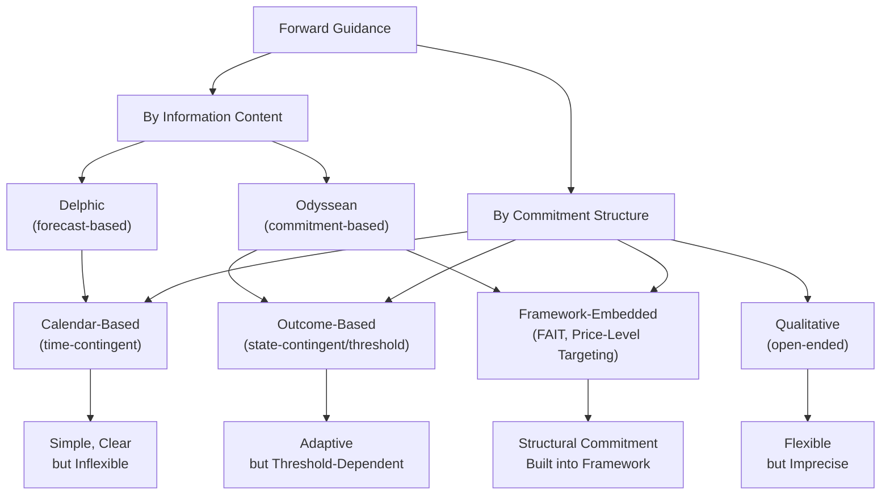

## Forward Guidance Strategies

### Definition and Conceptual Foundation

Forward guidance refers to central bank communication about the likely future path of monetary policy, used as a policy tool in its own right — particularly when the conventional policy rate is constrained at the effective lower bound (ELB). Rather than affecting current economic conditions through the current policy rate $i_t$, forward guidance operates by shaping $E_t[i_{t+k}]$, the expected path of future short-term rates, which feeds into long-term interest rates via the expectations hypothesis of the term structure:

$$i_{n,t} = \frac{1}{n}\sum_{k=0}^{n-1} E_t[i_{t+k}] + \phi_{n,t}$$

Because economic decisions (investment, durable consumption, price-setting) depend on expected future financing conditions rather than solely on today's rate, credible guidance about the future path can stimulate current activity even while $i_t$ itself is unchanged.

### Taxonomy of Forward Guidance Strategies

**1. Delphic vs. Odyssean Guidance**

This is the foundational classification, introduced by Campbell, Evans, Fisher, and Justiniano (2012):

- **Delphic guidance**: The central bank communicates its forecast of future economic conditions and the policy actions consistent with its existing reaction function, without committing to deviate from that function. Named for the Oracle of Delphi, which foretold the future without altering it.
- **Odyssean guidance**: The central bank commits to a future policy action that deviates from what its reaction function would otherwise prescribe at that future date, deliberately binding its own future discretion. Named for Odysseus binding himself to the mast to resist the Sirens.

The distinction matters because only Odyssean guidance exploits the time-inconsistency mechanism central to optimal ELB policy (Eggertsson and Woodford, 2003): promising to hold rates lower for longer than will seem optimal ex post, once conditions improve, is precisely what generates additional stimulus today by lowering expected future real rates and raising expected inflation.

**2. Calendar-Based (Time-Contingent) Guidance**

Communicates an explicit calendar date or period through which a policy stance is expected to be maintained (e.g., "exceptionally low levels of the federal funds rate at least through mid-2013," Federal Reserve, 2011–2012).

*Advantages*: Simplicity, high clarity, easy for markets to price

*Disadvantages*: Inflexible to changing economic conditions; a change in outlook before the stated date forces a communication reversal, potentially damaging credibility; does not adapt automatically to new information

**3. Outcome-Based (State-Contingent / Threshold) Guidance**

Ties the future policy stance to explicit, verifiable economic thresholds rather than calendar dates (e.g., the Federal Reserve's 2012–2014 "Evans Rule," conditioning low rates on unemployment remaining above 6.5% *and* projected inflation remaining below 2.5%).

*Advantages*: Automatically adapts to incoming data, avoiding the credibility cost of arbitrary calendar revisions; makes the reaction function more transparent

*Disadvantages*: Requires selecting specific, measurable, and mutually agreeable thresholds; multiple thresholds can create ambiguous or conflicting signals if indicators diverge (e.g., low unemployment alongside low inflation)

**4. Qualitative (Open-Ended) Guidance**

Uses descriptive rather than numerical language about the future path (e.g., "for some time," "an extended period," "as long as necessary"), without specific dates or thresholds.

*Advantages*: Maximum flexibility; avoids the risk of thresholds becoming outdated or binding awkwardly

*Disadvantages*: Lower precision reduces the guidance's ability to move market expectations by a well-defined amount; more subject to interpretation risk

**5. Odyssean Average-Inflation/Price-Level Targeting Frameworks**

A structural commitment device embedding Odyssean logic directly into the policy framework rather than issuing episodic guidance statements. Under Flexible Average Inflation Targeting (FAIT, adopted by the Federal Reserve in August 2020), the central bank commits to allowing inflation to run moderately above target following periods of below-target inflation, aiming to keep *average* inflation near the target over time:

$$\frac{1}{T}\sum_{t=1}^{T} \pi_t \approx \pi^{target}$$

Under Price-Level Targeting (PLT), the commitment is stronger still: the central bank targets a specific *level* of the price index, so past undershoots must be fully offset by future overshoots, in principle providing more automatic stabilization of expectations than flexible average targeting.

### Diagram: Forward Guidance Taxonomy

### The Time-Inconsistency Foundation

The theoretical power of Odyssean guidance rests on the Kydland-Prescott (1977) time-inconsistency problem applied to the ELB context. A discretionary central bank, once the economy has recovered, would prefer to raise rates promptly to prevent above-target inflation. Rational agents anticipate this discretionary behavior, which limits how much current expectations of future rates can fall in response to a mere announcement of intent. Eggertsson and Woodford's (2003) analysis shows that optimal policy under commitment requires the central bank to *credibly promise* to deviate from what discretion would dictate — keeping rates lower for longer even after the shock has passed — which is precisely what makes the guidance non-time-consistent and therefore requires a credible commitment mechanism (reputation, explicit frameworks, or institutional design) to be effective.

$$\text{Commitment path: } i_t = 0 \text{ for } t < T^*, \quad T^* > T^{discretion}$$

where $T^{discretion}$ is when a purely discretionary central bank would begin raising rates, and $T^*$ is the later liftoff date promised under optimal commitment.

### The Forward Guidance Puzzle

A significant complication in the theoretical literature: standard New Keynesian models predict implausibly large effects on current output and inflation from guidance about interest rates in the distant future — effects that grow, rather than shrink, with the horizon of the promised low-rate period. This is widely regarded in the literature as a modeling deficiency (Del Negro, Giannoni, and Patterson, 2015; McKay, Nakamura, and Steinsson, 2016) rather than a genuine empirical feature of forward guidance. Proposed resolutions include:

- **Incomplete information / rational inattention**: Agents do not fully and immediately incorporate distant forward guidance into current decisions
- **Bounded rationality / level-k thinking**: Agents engage in a finite depth of strategic reasoning about others' responses to guidance, dampening the equilibrium feedback loop that generates the puzzle in the full-information rational expectations model
- **Heterogeneous agent New Keynesian (HANK) models**: Incomplete markets and heterogeneous marginal propensities to consume reduce the aggregate sensitivity to future income/rate changes relative to representative-agent models, since the transmission relies less on strong intertemporal substitution by all agents uniformly

[Unverified] There is no full consensus on which resolution best matches observed empirical responses to forward guidance shocks; this remains an active research area.

### Empirical Identification: The Path Factor

Forward guidance surprises are typically identified using high-frequency event-study methods, decomposing the total policy surprise around an announcement into:

- **Target factor**: The surprise component in the *current* policy rate decision
- **Path factor**: The surprise component in *expected future* rates, extracted from the response of medium-term interest rate futures or swap rates in a narrow window around the announcement, orthogonalized against the target factor

$$\text{Path Factor}_t \perp \text{Target Factor}_t$$

Gürkaynak, Sack, and Swanson's (2005) two-factor decomposition is the standard reference methodology; subsequent work (e.g., Nakamura and Steinsson, 2018) refined this into a single "policy news shock" while also identifying a confounding "Fed information effect," whereby some guidance surprises appear to reveal private information about the economic outlook rather than a pure policy commitment, complicating clean identification of the guidance channel in isolation.

### Practical Example: Comparative Guidance Regimes

| Central Bank | Episode | Guidance Type | Notable Feature |
| --- | --- | --- | --- |
| Federal Reserve | 2011–2012 | Calendar-based | Explicit dates progressively extended |
| Federal Reserve | 2012–2014 | Outcome-based (Evans Rule) | Dual unemployment/inflation thresholds |
| Federal Reserve | 2020–present | Framework-embedded (FAIT) | Structural average-inflation commitment |
| ECB | 2013–present (evolving) | Qualitative, later state-contingent | "Extended period," later tied to inflation projections meeting/exceeding target durably |
| Bank of England | 2013 | Outcome-based (initial), later qualitative | Initial unemployment threshold (7%) abandoned amid rapid labor market improvement |
| Bank of Japan | 2013–present | Framework-embedded (QQE with commitment to 2% target "as long as necessary") | Combined with yield curve control from 2016 |

**Key Points:**

- The Bank of England's 2013 experience illustrates a key risk of outcome-based guidance with a single threshold: unemployment fell toward the 7% threshold faster than anticipated due to factors unrelated to the guidance's intended stimulus (e.g., labor supply and productivity dynamics), forcing an early reassessment and a shift toward more qualitative language, which is often cited as a cautionary case for single-indicator threshold design
- The Fed's transition from calendar-based to outcome-based guidance across 2011–2014 reflects a documented evolution in central bank strategy toward automatic-adjustment mechanisms following recognized weaknesses in the calendar approach

### Guidance Design Trade-offs

| Dimension | Calendar-Based | Outcome-Based | Qualitative | Framework-Embedded |
| --- | --- | --- | --- | --- |
| Clarity/precision | High | Medium-High | Low | Medium |
| Flexibility to new data | Low | Medium-High | High | Medium (bound by framework rules) |
| Credibility risk from reversal | High (visible date change) | Medium (threshold redesign) | Low (inherently vague) | Low (structural, less episode-specific) |
| Susceptibility to the forward guidance puzzle | High (in canonical NK models) | High | Medium (less quantifiable, models it more loosely) | Depends on communicated horizon |

### Critiques and Limitations

- **Time-inconsistency and credibility risk**: The very deviation from discretionary optimum that gives Odyssean guidance its power also makes it vulnerable to being reneged upon once conditions improve, undermining trust in future guidance episodes if a reversal occurs
- **Communication ambiguity**: Multiple simultaneous signals (rate guidance plus balance sheet guidance plus economic projections) can create interpretation difficulties for market participants regarding which signal dominates
- **Overreliance risk at low rates**: Since conventional tools are unavailable at the ELB, guidance can become disproportionately relied upon, raising concerns about diminishing returns if used too frequently or if promises are perceived as non-credible after repeated episodes
- **Threshold design difficulty**: As the Bank of England 2013 episode illustrates, selecting robust single or multiple indicators that behave predictably is empirically difficult, and thresholds calibrated for one cyclical episode may not generalize to different demand/supply shock compositions

**Related Topics:**

- Delphic versus Odyssean guidance: formal welfare analysis
- The zero/effective lower bound problem
- Time-inconsistency and central bank commitment devices (Kydland-Prescott, Barro-Gordon)
- Flexible Average Inflation Targeting and Price-Level Targeting frameworks
- The forward guidance puzzle and HANK model resolutions
- High-frequency identification: target factor, path factor, and the Fed information effect
- Quantitative easing as a complementary/reinforcing signaling tool
- Central bank credibility and reputation-based commitment mechanisms