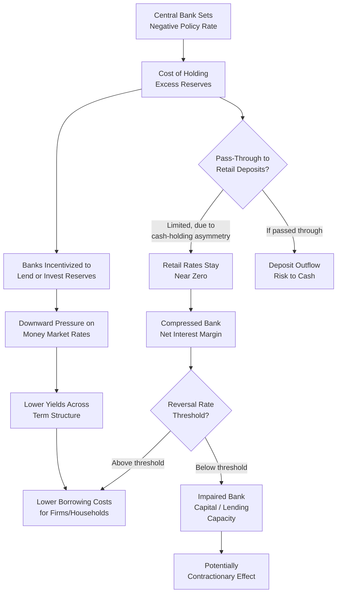

## Negative Interest Rate Policy

### Definition and Conceptual Foundation

Negative interest rate policy (NIRP) refers to a central bank setting its key policy rate — typically the rate paid on commercial bank reserves held at the central bank — below zero, such that banks pay the central bank to hold excess reserves rather than earning interest on them. NIRP represents an extension of conventional interest rate policy past the point long assumed to be a hard floor, exploiting the fact that the true lower bound is not exactly zero but a modestly negative "effective lower bound" (ELB), determined by the cost of holding physical currency as an alternative store of value.

$$\underline{i} = -c$$

where $c > 0$ represents the effective cost (storage, insurance, security, transaction inconvenience) of holding and transacting in physical cash at scale. Since $c$ is generally small but positive, particularly for large institutional holders who cannot practically substitute into cash, $\underline{i}$ can be modestly negative rather than exactly zero.

### Theoretical Rationale

**Extending the Interest Rate Channel Past Zero**

NIRP is motivated by the same interest rate channel logic as conventional policy: lowering the policy rate reduces banks' return on holding reserves, incentivizing them to lend or invest funds elsewhere, while also compressing the entire yield curve and money market rate structure downward, including rates faced by firms and households at the margin.

$$r_t = i_t - E_t[\pi_{t+1}]$$

At the zero lower bound with expected inflation below target, moving $i_t$ modestly negative provides additional (if limited) downward pressure on the real rate $r_t$, an option unavailable under a strict zero floor.

**Asymmetric Cash-Holding Costs Across Agent Types**

The key insight enabling NIRP to function at all is that the cost of holding cash $c$ differs substantially across economic agents:

- **Large institutional depositors** (banks, pension funds, insurance companies) face high costs of converting large balances to physical currency: vault storage, insurance, security transport, and the practical difficulty of conducting large-scale commercial transactions in cash
- **Retail depositors** face much lower relative costs of shifting modest balances to cash, meaning banks are typically reluctant to pass negative rates directly onto retail deposits for fear of triggering deposit outflows into cash

This asymmetry is why observed NIRP implementations applied negative rates primarily to wholesale reserves and interbank rates, while retail deposit rates in most NIRP jurisdictions remained at or near zero rather than turning negative, at least for the bulk of the experience through the mid-2010s to early 2020s.

### Mechanism: Two-Tier and Multi-Tier Reserve Systems

To mitigate the burden on bank profitability while still achieving the intended transmission at the margin, several central banks implemented tiered reserve remuneration systems, in which only reserves held *above* a certain exempt threshold are subject to the negative rate:

$$\text{Interest Paid} = \begin{cases} 0 \text{ or positive rate} & \text{if Reserves} \leq \text{Threshold} \\ i_{negative} \times (\text{Reserves} - \text{Threshold}) & \text{if Reserves} > \text{Threshold} \end{cases}$$

The Bank of Japan's three-tier system (introduced 2016) and the ECB's two-tier system (introduced 2019) exemplify this design, intended to preserve the marginal incentive effect of a negative rate on new lending decisions while limiting the aggregate profitability drag on the banking sector from taxing the entire stock of existing reserves.

### Diagram: NIRP Transmission and Constraints

### The "Reversal Rate" Concept

A central theoretical and empirical concern with NIRP is the possibility that sufficiently negative rates become self-defeating — the "reversal rate," formalized by Brunnermeier and Koby (2018), is the rate below which further cuts *reduce* rather than increase bank lending, because the negative effect on bank net interest margins and capital erosion outweighs the positive effect of lower funding costs on loan demand.

$$i^{reversal}: \frac{\partial \text{Lending}}{\partial i} \bigg|_{i < i^{reversal}} > 0$$

Below $i^{reversal}$, the derivative of lending with respect to the rate flips sign, meaning further rate cuts become contractionary for credit supply. This concept implies that the effective lower bound relevant for policy is not simply the cash-arbitrage floor $-c$, but potentially a higher (less negative) rate determined by bank balance sheet and profitability considerations — meaning $i^{reversal}$ could bind before the technical cash-storage floor does.

[Unverified] Estimates of where the reversal rate lies in practice vary substantially by banking sector structure (dependence on net interest margin income, capital buffers, deposit funding mix) and are not settled empirically; some studies find limited evidence of reversal effects at the rates actually implemented (typically no lower than roughly -0.75% to -1%), while theoretical models suggest the risk grows with the depth and duration of negative rates.

### Historical Implementations

| Jurisdiction | Central Bank | Period | Peak Negative Rate | Notable Design Feature |
| --- | --- | --- | --- | --- |
| Denmark | Danmarks Nationalbank | 2012–2022 (intermittent) | -0.75% | Primarily exchange-rate-peg defense motivation (DKK/EUR peg), not conventional stimulus |
| Eurozone | European Central Bank | 2014–2022 | -0.50% (deposit facility) | Two-tier system introduced 2019 |
| Switzerland | Swiss National Bank | 2015–2022 | -0.75% | Motivated substantially by managing CHF appreciation pressure |
| Sweden | Sveriges Riksbank | 2015–2019 | -0.50% (repo rate) | First major economy to exit NIRP, citing housing market and side-effect concerns |
| Japan | Bank of Japan | 2016–2024 | -0.10% | Three-tier system; combined with Yield Curve Control from 2016 |

[Inference] The Danish and Swiss cases are notable for being motivated substantially by exchange rate management (resisting currency appreciation pressure from safe-haven capital inflows) rather than purely domestic demand stimulus, distinguishing their rationale somewhat from the ECB, Riksbank, and BOJ cases, which were more directly tied to domestic inflation and output objectives.

### Empirical Findings and Debates

**Pass-through to lending rates**: Event-study and panel evidence from the Eurozone and other NIRP episodes generally finds that negative policy rates did pass through to bank lending rates for firms and (to varying degrees) mortgage rates, suggesting the interest rate channel continued to function below zero, at least within the range of rates actually implemented.

**Impact on bank profitability**: Studies of bank equity valuations and net interest margins around NIRP announcements generally find some compression of net interest margins, particularly for banks more reliant on retail deposit funding (since these banks could not easily pass negative rates to retail depositors while facing negative rates on their own reserve holdings), consistent with the theoretical reversal-rate mechanism, though most studies conclude observed rates remained above the point of aggregate contractionary reversal.

**Exchange rate effects**: NIRP episodes in small open economies (Denmark, Switzerland, Sweden) showed clearer and more immediate exchange rate effects than in larger, less trade/capital-flow-sensitive economies (Eurozone, Japan), consistent with uncovered interest parity operating more powerfully where capital flows are highly sensitive to rate differentials.

[Speculation] Some analysts have suggested that NIRP's marginal effectiveness diminishes as the depth and duration increase, due to accumulating balance sheet strain on the financial sector, but this remains difficult to test rigorously given the limited number of distinct historical episodes and the confounding presence of simultaneous QE programs.

### Practical Example: ECB's Two-Tier System (Introduced 2019)

Facing a deposit facility rate of -0.50% and mounting concern about the cumulative burden on Eurozone bank profitability after five years of negative rates, the ECB introduced a two-tier system in October 2019:

1. A portion of each bank's excess reserves, calculated as a multiple of the bank's minimum reserve requirement, was exempted from the negative rate (remunerated at 0%)
2. Reserves held above this exempt threshold continued to be charged at the prevailing negative deposit rate

**Key Points:**

- The design explicitly aimed to preserve the marginal transmission mechanism (new lending decisions still faced the negative rate at the margin) while reducing the average profitability cost across the banking sector
- This exemplifies the broader design principle in advanced NIRP implementations: separating the *marginal* incentive effect (which requires the negative rate to bind at the margin) from the *average* profitability burden (which tiering is designed to mitigate)
- [Inference] The introduction of tiering roughly five years into the ECB's NIRP experience is consistent with growing institutional concern about approaching or observing symptoms associated with the reversal-rate mechanism, though the ECB's own communications framed it primarily as supporting the bank-lending channel's continued functioning

### Distinction from Related Tools

| Tool | Key Difference from NIRP |
| --- | --- |
| Zero Interest Rate Policy (ZIRP) | Rate held at exactly zero (or the ELB floor), not below it |
| Quantitative Easing | Operates on balance sheet quantity/composition, not the price of reserves |
| Yield Curve Control | Targets a longer-maturity yield level, distinct from the overnight reserve rate NIRP targets |
| Forward Guidance | Communication about the future rate path, whereas NIRP is the current rate setting itself |

### Critiques and Limitations

- **Bank profitability erosion**: The core and most widely cited concern, formalized in the reversal-rate literature, with potential second-round effects on financial stability if erosion is severe or prolonged
- **Limited retail pass-through**: The inability (or reluctance) of banks to pass negative rates to retail depositors means the intended stimulus to household behavior operates less directly than in conventional rate cuts, relying instead on bank lending and asset price channels
- **Cash hoarding and implementation limits**: While the effective floor is below the naive zero bound due to institutional cash-storage costs, sufficiently deep or prolonged negative rates could eventually trigger large-scale cash substitution, a risk that grows with the depth of the negative rate and has motivated some discussion of restricting or taxing large cash holdings in extreme scenarios (a policy option raised in academic literature, e.g., Rogoff's proposals, but not implemented at scale)
- **Exchange rate spillovers and "currency war" concerns**: Since NIRP operates partly via exchange rate depreciation (per uncovered interest parity), its use raises concerns about competitive depreciation dynamics among trading partners
- **Exit and reversal considerations**: Several NIRP central banks (Sweden in 2019, Denmark and the Eurozone as global rates rose in 2022) exited into positive territory, and the design of that exit itself required consideration of that same asymmetric pass-through and profitability dynamic in reverse

**Related Topics:**

- The zero/effective lower bound problem and cash-arbitrage constraints
- The reversal rate literature (Brunnermeier-Koby)
- Two-tier and multi-tier reserve remuneration system design
- Bank lending channel of monetary policy transmission
- Uncovered interest parity and exchange rate spillovers from unconventional policy
- Yield curve control as a complementary/alternative tool
- Central bank digital currency and implications for the effective lower bound
- Rogoff's proposals on restricting physical cash to enable deeper negative rates