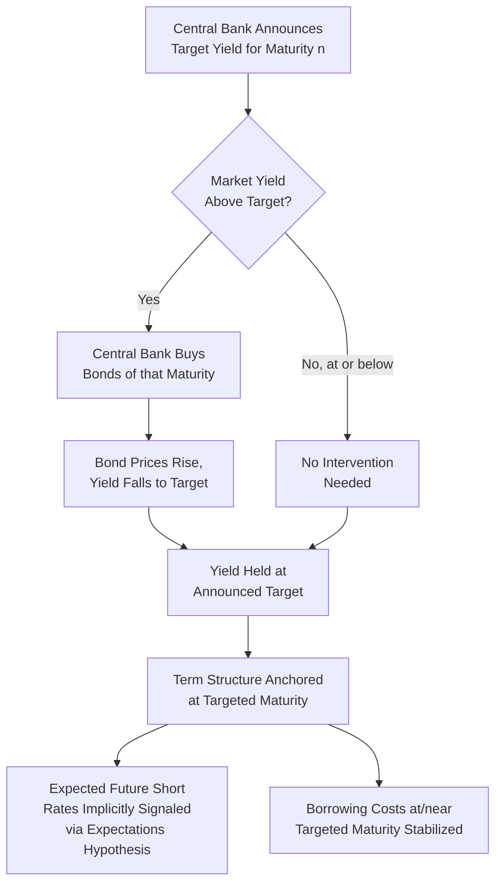

## Yield Curve Control

### Definition and Conceptual Foundation

Yield curve control (YCC) is an unconventional monetary policy tool in which a central bank commits to purchasing unlimited (or effectively unlimited) quantities of a specific government bond maturity in order to cap, or fix, its yield at a pre-announced target level. This represents a fundamental shift in the operational instrument of policy: rather than controlling the *quantity* of assets purchased (as under quantitative easing) and allowing the resulting yield to be determined by market pricing, YCC controls the *price* (yield) directly and treats the quantity of purchases as the residual, demand-elastic variable.

$$i_{n,t} = \bar{i}_n \quad \text{for the targeted maturity } n$$

where $\bar{i}_n$ is the announced target yield. The central bank stands ready to buy (or in principle sell) whatever quantity $Q_t$ is needed to keep the market yield at $\bar{i}_n$:

$$Q_t = f(\bar{i}_n - i_{n,t}^{market})$$

such that any divergence between the market-clearing yield absent intervention and the target triggers purchases sufficient to eliminate the gap.

### Distinction from Quantitative Easing

The conceptual reversal relative to conventional QE is central to understanding YCC's mechanics:

| Dimension | Quantitative Easing | Yield Curve Control |
| --- | --- | --- |
| Controlled variable | Quantity of purchases (announced size/pace) | Yield level (announced target) |
| Residual variable | Resulting yield (market-determined) | Quantity purchased (demand-elastic) |
| Commitment type | Fixed or state-contingent purchase program | Open-ended yield defense |
| Market signal | Purchases signal future rate path indirectly | Target yield is itself the direct signal |
| Balance sheet growth | Predictable from announced pace | Potentially unbounded if market tests the peg |

Because YCC fixes the price and lets quantity adjust, in principle, a fully credible YCC commitment for a maturity for which the central bank's implied future short-rate path is consistent with the peg may require relatively modest actual purchases (since the mere credibility of unlimited intervention deters most market testing of the peg), whereas quantity-based QE requires purchasing the announced amount regardless of the resulting yield.

### Diagram: YCC Mechanism

### Theoretical Foundations

**Relationship to the Expectations Hypothesis**

Since the expectations hypothesis links longer yields to the average expected path of future short rates plus a term premium:

$$i_{n,t} = \frac{1}{n}\sum_{k=0}^{n-1} E_t[i_{t+k}] + \phi_{n,t}$$

targeting $i_{n,t}$ directly at $\bar{i}_n$ implicitly constrains the market's inferred expectation of the future short-rate path, given some assumption about the term premium $\phi_{n,t}$. A credible YCC peg on, for example, a 10-year yield communicates that the central bank expects (and will enforce, if necessary through unlimited purchases) that the average short rate over the following decade will be consistent with that target — a strong form of the signaling channel operating through fixing an entire point on the curve rather than merely guiding beliefs about it.

**Fiscal-Monetary Interaction Channel**

By capping yields on government debt, YCC can also reduce the government's debt-servicing costs, a feature historically significant in wartime financing contexts (the U.S. Federal Reserve's 1942–1951 YCC program capped Treasury yields to support World War II and postwar debt financing) and a recurring point of concern regarding the boundary between monetary policy independence and fiscal financing objectives.

### Historical and Contemporary Implementations

**United States (1942–1951)**

During and after World War II, the Federal Reserve capped short-term Treasury bill rates near 3/8% and long-term bond yields near 2.5%, explicitly to support wartime and postwar government financing at low cost. This program ended with the 1951 Treasury-Federal Reserve Accord, which restored the Fed's independence in setting monetary policy separately from debt-management objectives — an episode frequently cited in discussions of the tension between YCC and central bank independence.

**Bank of Japan (2016–2024)**

The BOJ introduced Yield Curve Control in September 2016 as part of its "QQE with Yield Curve Control" framework, targeting:

- The short-term policy rate (overnight rate) at -0.1%
- The 10-year Japanese Government Bond (JGB) yield at approximately 0%, later adjusted to a tolerance band (initially ±0.1%, subsequently widened to ±0.25%, then ±0.5%, and further adjustments through 2023 before the framework was formally discontinued in March 2024 as the BOJ moved to end its negative rate policy and YCC framework)

**Reserve Bank of Australia (2020–2021)**

Adopted a 3-year government bond yield target of 0.25% (later 0.10%) as part of its COVID-19 pandemic response, aiming to reinforce forward guidance about the expected duration of low policy rates by anchoring the medium-term point on the curve. The RBA abandoned this target in November 2021 after the market decisively tested and broke through the peg amid rapidly rising inflation expectations, an episode widely cited as a cautionary example of YCC credibility failure.

[Inference] The RBA's experience is frequently contrasted with the BOJ's longer-running program specifically because the RBA's peg broke under market pressure while the BOJ's, despite periodic strain and repeated band adjustments, was maintained (with adjustments) for a considerably longer period, illustrating that credibility and market conviction — not just the technical unlimited-purchase commitment — determine a peg's durability.

### Practical Example: Bank of Japan's Band Adjustments

The BOJ's experience illustrates the practical challenge of maintaining a yield target as underlying economic conditions (particularly global inflation dynamics from 2021–2023) shift:

1. **2016–2018**: Target maintained near 0% with minimal market pressure, given persistently low domestic inflation
2. **2018**: Tolerance band widened to approximately ±0.2% to allow modestly more market-driven yield variation and mitigate concerns about impaired bond market functioning from excessive rigidity
3. **2021**: Band formally clarified at ±0.25%
4. **December 2022**: Band widened to ±0.5%, following mounting market pressure and concerns about yield curve distortions as global yields rose sharply
5. **July 2023**: Band effectively treated as a "reference" rather than a rigid cap, with the BOJ signaling greater tolerance for yields modestly above 0.5% before intervening
6. **March 2024**: YCC formally ended alongside the exit from negative interest rate policy

**Key Points:**

- The progressive band widening illustrates a design tension: maintaining a rigid, narrow yield target under strain can require very large-scale purchases (as observed during periods of intense market testing), while a "reference" or flexible-band approach is easier to defend but weakens the intended anchoring signal
- [Inference] The graduated nature of the BOJ's adjustments, rather than an abrupt abandonment (contrasting with the RBA), likely reflects the BOJ's greater balance sheet capacity, distinct market structure (with the BOJ already holding a very large share of outstanding JGBs), and lower simultaneous inflationary pressure relative to Australia's 2021 experience

### Market Functioning and Balance Sheet Implications

Defending a yield target during periods of market pressure can require the central bank to acquire a very large, potentially unbounded, share of the outstanding stock of the targeted security, with several documented consequences:

- **Impaired price discovery**: When the central bank holds a dominant share of a maturity's outstanding stock (as occurred with BOJ JGB holdings), secondary market trading volume and liquidity in that maturity can decline substantially, since fewer bonds remain in private hands to trade
- **Curve distortions at adjacent maturities**: A rigid target at one point on the curve can create pricing anomalies or kinks relative to adjacent maturities not subject to the target, as arbitrage forces attempt to reconcile the fixed point with market-driven pricing nearby
- **Balance sheet growth uncertainty**: Unlike quantity-based QE, where the pace and size are pre-announced, YCC's open-ended purchase commitment means balance sheet growth becomes a function of market pressure against the peg, making the ultimate scale harder to predict ex ante

[Unverified] The precise threshold at which market functioning becomes materially impaired appears to vary by market depth and central bank holdings share, without a broadly agreed quantitative benchmark across episodes.

### Exit Strategy Considerations

Exiting a YCC regime presents distinct risks relative to unwinding conventional QE, because:

- **Signaling risk**: Abandoning or widening a yield target can be interpreted by markets as an admission that the previous target was unsustainable, potentially triggering a larger, more abrupt yield adjustment than a gradual policy normalization would produce
- **Credibility spillover to future commitments**: A disorderly YCC exit (as in the RBA's case) may impair the credibility of future forward guidance or commitment-based tools, since market participants update their beliefs about the central bank's willingness or ability to defend stated commitments
- **Sequencing with other tools**: Central banks with combined YCC and negative rate frameworks (BOJ) faced sequencing decisions about which element to unwind first, given their interconnected effects on the yield curve shape

### Critiques and Limitations

- **Credibility dependence**: As the RBA episode demonstrates, YCC's effectiveness rests heavily on market conviction that the central bank will and can defend the peg; a target perceived as inconsistent with the medium-term inflation outlook invites speculative testing
- **Fiscal dominance concerns**: Because YCC can substantially lower government borrowing costs, particularly for the targeted maturity, its use raises concerns about blurring monetary policy objectives with debt-management/fiscal financing objectives, echoing the concerns that motivated the 1951 Treasury-Federal Reserve Accord
- **Market functioning degradation**: Sustained, large-scale intervention at a single point on the curve can impair liquidity and price discovery in that market segment, a well-documented feature of the BOJ's extended experience
- **Exit difficulty and cliff-edge risk**: The binary nature of a yield cap (versus the more continuous, gradual character of quantity-based QE tapering) can create a more abrupt "cliff-edge" dynamic upon exit, as illustrated by the RBA's rapid, disorderly abandonment

**Related Topics:**

- Quantitative easing and large-scale asset purchases (contrast in operational design)
- The zero/effective lower bound problem
- Expectations and signaling channel of monetary policy
- Fiscal dominance and central bank independence (1951 Treasury-Fed Accord)
- Term premium and preferred-habitat models of the yield curve
- Central bank credibility and speculative attack dynamics (parallels to fixed exchange rate regime literature)
- Bank of Japan's broader unconventional policy framework (QQE, NIRP, YCC integration)
- Market liquidity and price discovery effects of large-scale central bank asset holdings