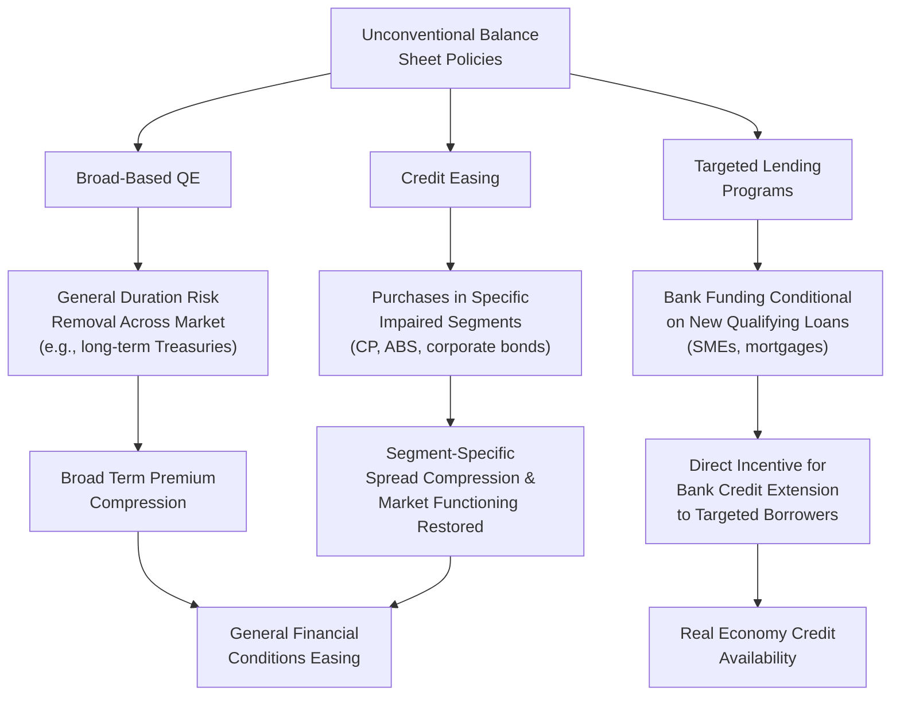

## Credit Easing and Targeted Lending Programs

### Definition and Conceptual Foundation

Credit easing refers to central bank interventions targeted at specific, often impaired, segments of credit markets, with the explicit objective of restoring functioning and reducing spreads in those particular markets — as distinct from quantitative easing, which aims at broad-based monetary stimulus through general duration risk removal and portfolio rebalancing across the market as a whole. The term and the formal distinction were introduced by then-Federal Reserve Chairman Ben Bernanke in a January 2009 speech, differentiating the Fed's crisis-era interventions from Japanese-style QE:

> [Bernanke's distinction, paraphrased]: Credit easing is defined by the *composition* of the central bank's balance sheet — which specific credit market segments and instrument types are targeted — whereas QE (in the sense Bernanke used to describe the earlier Japanese approach) is defined primarily by the *size* of the balance sheet, with the composition being a secondary consideration.

Targeted lending programs extend this logic further by directly lending to, or purchasing assets from, financial institutions conditional on those institutions extending credit to specific end-borrower categories (typically small and medium enterprises, or households), rather than relying purely on general liquidity or asset-price transmission to indirectly encourage such lending.

### Theoretical Rationale

**Addressing Market-Specific Impairment**

Credit easing responds to a diagnosis that in periods of acute financial stress, certain credit market segments experience impaired functioning — elevated risk premia, collapsed liquidity, or outright market freezes — that are not primarily driven by the general level of interest rates but by segment-specific factors: counterparty risk aversion, collateral value uncertainty, or a breakdown in the intermediation chain particular to that market.

$$\text{Spread}_{j,t} = \text{Risk Premium}_{j,t} + \text{Liquidity Premium}_{j,t}$$

for a specific credit market segment $j$ (e.g., commercial paper, asset-backed securities, corporate bonds). Credit easing targets the liquidity premium component directly by having the central bank act as buyer or lender in that specific segment, distinct from broad QE's target of the general term premium across the yield curve.

**Bank Lending Channel Reinforcement**

Targeted lending programs work explicitly through the bank lending channel of monetary transmission: by providing funding to banks *conditional on* new lending to specified borrower categories, the central bank attempts to ensure that the intended stimulus reaches the real economy through credit extension, rather than relying on the more indirect mechanism of general reserve creation potentially being absorbed into bank balance sheets without a corresponding increase in loan supply.

$$\text{Funding Cost to Bank} = f(\text{New Qualifying Lending})$$

where the bank's cost of accessing the facility explicitly decreases with the volume of new lending extended to the targeted category, directly linking the incentive to the desired real-economy outcome.

### Diagram: Credit Easing vs. Broad QE vs. Targeted Lending

### Key Historical Programs

**Commercial Paper Funding Facility (CPFF) — Federal Reserve, 2008–2010**

Established during the 2008 financial crisis when the commercial paper market — a critical short-term funding source for corporations — froze amid counterparty risk concerns following the Lehman Brothers bankruptcy. The Fed created a special purpose vehicle to purchase highly-rated unsecured and asset-backed commercial paper directly from eligible issuers, functioning as a backstop buyer when private money market demand had evaporated.

**Term Asset-Backed Securities Loan Facility (TALF) — Federal Reserve, 2008–2010, reactivated 2020**

Provided non-recourse loans to investors purchasing newly issued asset-backed securities (backed by auto loans, student loans, credit card receivables, and small business loans), aiming to restart securitization markets that had frozen, thereby indirectly supporting the flow of credit to underlying consumer and small business borrowers who depend on securitization-funded lending.

**Targeted Longer-Term Refinancing Operations (TLTROs) — European Central Bank, 2014–present (multiple series)**

A series of programs offering Eurozone banks long-term funding (typically 4-year maturities) at favorable rates, with the rate itself made conditional on the bank's net lending performance to non-financial corporations and households (excluding mortgages in most iterations):

$$i_{TLTRO} = i_{base} - \Delta_{lending} \cdot \mathbb{1}[\text{lending target met}]$$

where banks that exceeded specified lending growth benchmarks received progressively more favorable (in some iterations, negative) funding rates — an explicit example of directly linking central bank funding cost to real-economy credit extension performance, rather than relying purely on general liquidity provision.

**Funding for Lending Scheme (FLS) — Bank of England, 2012–2018**

Provided UK banks and building societies with access to cheaper funding, with the amount they could borrow and the price they paid tied to their net lending to the UK real economy, later refined into variants targeting SME lending specifically (Funding for Lending Scheme Extension) given evidence that overall net lending remained weak despite the initial program's household-lending-driven volume.

**Main Street Lending Program — Federal Reserve, 2020**

Established during the COVID-19 pandemic to support lending to small and medium-sized businesses that were generally too large for the Paycheck Protection Program but faced constrained access to credit markets; the Fed purchased participations in loans originated by banks under specified eligibility criteria, again working through existing bank origination relationships rather than direct central bank lending to end-borrowers.

**Term Funding Scheme (TFS) and successor TFSME — Bank of England, 2016 and 2020**

The 2016 TFS provided funding to banks at rates close to Bank Rate, conditioned on maintaining or expanding lending, introduced following the Brexit referendum to offset anticipated credit tightening; the 2020 Term Funding Scheme with additional incentives for SMEs (TFSME) extended this logic during the pandemic with enhanced incentives specifically for SME lending.

### Comparative Table of Program Design Features

| Program | Institution | Targeted Segment | Conditionality Mechanism |
| --- | --- | --- | --- |
| CPFF | Federal Reserve | Commercial paper market | Direct purchase, no bank-lending conditionality (market backstop) |
| TALF | Federal Reserve | Securitized consumer/SME credit | Loans against ABS collateral, indirect end-borrower support |
| TLTRO (I–III) | ECB | Bank lending to firms/households | Funding rate discount tied to lending growth benchmarks |
| FLS | Bank of England | Bank lending broadly, later SME-focused | Borrowing allowance tied to net lending performance |
| Main Street Lending Program | Federal Reserve | Mid-sized business loans | Loan participation purchases from originating banks |
| TFS / TFSME | Bank of England | Bank lending, SME-enhanced incentives | Funding access/pricing tied to lending volume |

### Empirical Evidence on Effectiveness

**Market functioning restoration**: Programs targeting frozen markets during acute stress (CPFF, TALF) are generally credited in the literature with contributing to observed spread compression and volume recovery in the targeted segments following their announcement and implementation, based on event-study evidence around program announcements.

**Targeted lending pass-through**: Evidence on TLTRO effectiveness suggests the conditional funding rate discounts did influence bank lending behavior at the margin, with studies generally finding a positive association between TLTRO participation/lending benchmarks and subsequent loan growth among participating banks, though isolating the causal contribution from concurrent broader monetary easing (QE, negative rates) implemented simultaneously is empirically challenging.

[Unverified] The precise magnitude of the causal lending effect attributable specifically to the conditionality mechanism (as opposed to the general liquidity/funding cost benefit that would exist even without conditionality) varies across studies and is sensitive to identification strategy, given that these programs were typically introduced alongside multiple other simultaneous easing measures.

### Practical Example: TLTRO III Design (2019 Eurozone)

TLTRO III, launched by the ECB in 2019 and substantially enhanced during the 2020 pandemic response, illustrates a mature targeted lending design:

1. **Base structure**: Banks could borrow at the ECB's main refinancing rate for a set period (originally 3 years, later extended)
2. **Lending-linked incentive**: If a bank's net lending to non-financial corporations and households (excluding mortgages) exceeded a specified benchmark relative to a historical reference period, the applicable rate on the *entire* borrowed amount was reduced, in some periods to as low as the deposit facility rate (which was itself negative), meaning well-performing banks could effectively be paid to borrow from the ECB
3. **Pandemic enhancement (2020)**: The lending benchmark was relaxed and the most favorable rate was extended further, reflecting the urgency of maintaining credit flow during the COVID-19 shock

**Key Points:**

- The "reward" structure (retroactively lowering the rate on the *entire* facility amount based on performance, rather than a modest marginal discount) was designed to maximize the incentive intensity for banks near the lending benchmark threshold
- The scale of TLTRO III participation (over €2 trillion drawn at its peak across the Eurozone banking system) illustrates how attractive the conditional terms became during the pandemic period, though this also generated subsequent central bank profitability/balance-sheet cost debates as policy rates rose in 2022–2023 while banks continued holding TLTRO funds at previously locked-in favorable terms

### Distinctions and Overlaps with Other Unconventional Tools

| Tool | Distinguishing Characteristic Relative to Credit Easing |
| --- | --- |
| Quantitative Easing | Broad-based, not segment- or conditionality-targeted |
| Yield Curve Control | Targets a yield level on standard government securities, not private credit market segments |
| Lender of Last Resort (traditional) | General liquidity backstop to solvent-but-illiquid institutions, not necessarily tied to new lending conditionality or targeted at specific market segments |
| Negative Interest Rate Policy | Operates on the general policy rate rather than segment-specific or conditional facilities |

### Critiques and Limitations

- **Credit allocation and central bank independence concerns**: By directing credit toward specific sectors or borrower categories, targeted lending programs move central banks closer to credit allocation decisions traditionally viewed as fiscal or industrial policy functions, raising concerns about mission creep beyond conventional monetary policy mandates
- **Measurement and gaming risk**: Conditionality based on lending benchmarks creates incentives for banks to structure reported lending to meet thresholds (e.g., through loan reclassification or timing of loan book adjustments) without necessarily reflecting genuine net new credit extension to the real economy, a concern raised regarding FLS and TLTRO design in academic and central bank self-assessments
- **Exit and stock-versus-flow debt overhang**: Long-maturity conditional funding (e.g., TLTRO's multi-year terms) can create a "debt overhang" for the central bank's own balance sheet: as market rates rise, previously locked-in favorable terms extended to banks can generate central bank financial losses or foregone income relative to prevailing market rates, a documented feature of the 2022–2023 tightening cycle following the pandemic-era TLTRO expansion
- **Assessing genuine additionality**: Since these programs are typically implemented alongside broader QE and rate policy, isolating whether observed lending growth reflects the targeted program's conditionality specifically, versus the general easier financial conditions from simultaneous measures, remains a persistent empirical identification challenge

**Related Topics:**

- Quantitative easing and large-scale asset purchases (contrast in targeting breadth)
- Bank lending channel of monetary policy transmission
- Lender of last resort theory and central bank crisis-response mandates
- Central bank balance sheet losses and TLTRO-related profitability effects
- Securitization markets and asset-backed security financing structures
- Small and medium enterprise (SME) credit access and financial frictions literature
- Central bank independence and the credit-allocation mandate boundary
- COVID-19 pandemic monetary policy response comparative analysis