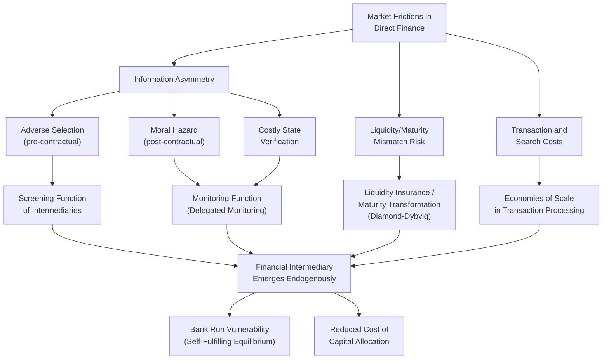

## Theory of Financial Intermediation

### Definition and Conceptual Foundation

The theory of financial intermediation addresses a foundational question in monetary and financial economics: why do financial intermediaries (banks, in particular) exist at all, given that in a frictionless Arrow-Debreu world with complete markets, savers and borrowers could contract directly with one another without any intermediary. The theory's central insight is that intermediaries exist because they solve specific market frictions — information asymmetries, transaction costs, and liquidity/maturity mismatches — that make direct finance costly or infeasible for a large share of economic transactions.

Formally, the puzzle can be stated as the Modigliani-Miller irrelevance benchmark: in perfect markets with no frictions, financial structure (including the presence or absence of intermediaries) does not affect real economic outcomes. Financial intermediation theory is, in large part, the systematic study of which specific frictions violate this benchmark and how intermediary structures emerge endogenously to address them.

### Core Frictions Motivating Intermediation

**1. Information Asymmetry**

The most extensively developed strand of the theory rests on informational frictions between borrowers and lenders, categorized into three canonical types based on the timing of the information problem relative to the transaction:

- **Adverse selection** (pre-contractual): Borrowers possess private information about their own creditworthiness or project quality before a loan is made. Akerlof's (1970) "market for lemons" logic applies directly: if lenders cannot distinguish good from bad borrowers, they price loans based on the average pool quality, which can drive high-quality borrowers out of the market (unraveling), a problem formalized in credit market contexts by Stiglitz and Weiss (1981).
- **Moral hazard** (post-contractual, hidden action): Once financing is provided, borrowers may take actions unobservable to the lender that affect the probability of repayment (e.g., risk-shifting toward higher-variance projects since equity-like payoffs benefit disproportionately from upside risk under limited liability).
- **Costly state verification** (post-outcome): Even after a project's outcome is realized, verifying the true outcome may be costly for the lender, creating an incentive for borrowers to misreport poor outcomes as worse than they are (or to withhold true earnings).

**2. Delegated Monitoring**

Diamond's (1984) delegated monitoring model provides a canonical answer to why intermediaries specifically (rather than direct lender-to-borrower contracts, or diversified direct lending by many small savers) are the efficient response to costly state verification. Direct monitoring of many borrowers by many small savers individually would involve substantial duplication of monitoring costs (each saver would need to verify each borrower). An intermediary that pools funds from many savers and monitors borrowers on their collective behalf achieves economies of scale in monitoring, provided the intermediary itself can be incentivized to monitor diligently and is sufficiently diversified across many independent loans that its own promised repayments to depositors are nearly riskless despite monitoring being unobservable to depositors (the "delegation cost" — verifying the delegate's own honesty — must be lower than the direct monitoring cost duplication it replaces).

$$\text{Delegation Cost} < N \times \text{Direct Monitoring Cost per Loan}$$

where $N$ is the number of savers who would otherwise each need to monitor the borrower(s) directly; diversification across many independent projects held by the intermediary reduces the intermediary's own default probability toward the point where delegation costs (verifying the intermediary's solvency, itself subject to some monitoring) become small relative to the duplicated direct monitoring costs avoided.

**3. Liquidity Insurance and Maturity Transformation**

The Diamond and Dybvig (1983) model provides the canonical framework for understanding banks' liquidity transformation function: banks transform illiquid long-term assets (loans) into liquid short-term liabilities (demand deposits), providing liquidity insurance to depositors who face uncertain, privately known timing of consumption needs.

$$U(c_1, c_2) = \begin{cases} u(c_1) & \text{with probability } t \text{ (impatient type)} \\ u(c_2) & \text{with probability } 1-t \text{ (patient type)} \end{cases}$$

Depositors do not know in advance whether they will need funds early (impatient, type-1) or can wait (patient, type-2). Because this type is private information, individuals cannot contract directly with each other to pool this risk efficiently; a bank offering demand deposits with a fixed early-withdrawal value can achieve superior risk-sharing relative to autarky by pooling depositors and investing in a mix of liquid and illiquid assets, effectively providing insurance against idiosyncratic liquidity needs that individual capital markets cannot replicate as efficiently.

This same model, however, generates the theoretical foundation for bank run vulnerability: because deposit contracts promise a fixed value on a first-come-first-served basis while bank assets are illiquid, a shift in depositor beliefs about others' withdrawal behavior can generate a self-fulfilling run equilibrium, entirely independent of the underlying quality of the bank's assets (a "sunspot" equilibrium in the game-theoretic sense).

### Diagram: Frictions and Intermediary Functions

### Contract Theory Foundations: Optimal Financial Contracts

**The Costly State Verification (CSV) Framework**

Townsend's (1979) costly state verification model, extended by Gale and Hellwig (1985), derives the standard debt contract as the *optimal* financial contract under specific conditions: when the lender can only observe the borrower's realized outcome by paying a verification (auditing) cost, and the contract must specify repayment and a verification rule ex ante, the optimal contract takes the form of standard debt — a fixed repayment obligation in non-default states, with verification (and asset seizure) occurring only in default states where the borrower cannot or claims not to be able to pay.

$$R(y) = \begin{cases} D & \text{if } y \geq D \text{ (no verification)} \\ y - c & \text{if } y < D \text{ (verification occurs, cost } c \text{ incurred)} \end{cases}$$

where $y$ is the realized project outcome, $D$ is the fixed debt repayment, and $c$ is the verification cost. This result — that debt (rather than more complex state-contingent contracts) emerges as optimal — provides a microfounded rationale for the prevalence of standard debt contracts in observed lending relationships, rather than assuming debt's ubiquity as a primitive.

**Collateral and the Screening Function**

Bester (1985) and others demonstrate that collateral requirements can serve as a self-selection (screening) device separating borrower types under adverse selection: offering borrowers a menu of contracts trading off interest rate against collateral requirement, low-risk borrowers (who are relatively more confident of repayment and thus find posting collateral less costly in expectation) self-select into higher-collateral, lower-rate contracts, while higher-risk borrowers self-select into lower-collateral, higher-rate contracts, allowing partial resolution of adverse selection without the lender needing to directly observe borrower type.

### Bank Capital Structure Theory

**Why Banks Are Highly Leveraged**

A distinct strand of the literature addresses why banks, relative to non-financial firms, typically operate with unusually high leverage (low equity-to-assets ratios). Several complementary theoretical explanations exist:

- **Deposits as a disciplining device**: Calomiris and Kahn (1991) argue that demandable debt (deposits) subject to sequential service disciplines bank managers, since depositors' ability to withdraw on demand creates a credible threat mechanism against managerial misbehavior or asset substitution, addressing an agency problem that would otherwise require costlier monitoring
- **Liquidity creation as a valuable service**: The Diamond-Dybvig framework implies that the liquidity insurance function itself requires demandable deposit contracts, and high leverage (a large share of demandable liabilities relative to equity) is a natural byproduct of maximizing the liquidity service provided
- **Deposit insurance and moral hazard interaction**: The introduction of deposit insurance (addressing the run-vulnerability problem identified above) removes depositors' incentive to monitor bank risk-taking, which — absent offsetting regulation — can incentivize banks toward excessive leverage and risk-taking, since equity holders capture upside gains while insured depositors (and ultimately the deposit insurer) bear downside losses

$$\text{Equity Holder Payoff} = \max(0, \text{Assets} - \text{Insured Deposits})$$

This payoff structure is formally equivalent to a call option on bank assets, a framework (following Merton, 1977) widely used to analyze how deposit insurance interacts with capital regulation to shape bank risk-taking incentives.

### Modern Extensions and Critiques

**Shadow Banking and Non-Bank Intermediation**

Contemporary financial intermediation theory has extended beyond the traditional bank-centric model to address "shadow banking" — credit intermediation involving entities and activities outside the traditional regulated banking system (money market funds, repo markets, securitization vehicles) that perform similar liquidity and maturity transformation functions without traditional deposit insurance or the same prudential regulatory perimeter. [Inference] The 2008 financial crisis substantially accelerated academic and regulatory attention to shadow banking specifically because run-like dynamics analogous to the Diamond-Dybvig mechanism were observed in wholesale funding markets (repo, asset-backed commercial paper) that lacked the deposit insurance backstop developed for traditional banks.

**Market-Based versus Bank-Based Financial Systems**

A comparative institutional literature (e.g., Allen and Gale, 2000) examines whether bank-based systems (where intermediaries dominate capital allocation, historically more prevalent in Germany, Japan) or market-based systems (where direct securities markets play a larger role, historically more prevalent in the U.S., U.K.) better address the underlying frictions, with findings generally suggesting each system exhibits comparative advantages under different conditions — bank-based systems potentially superior at cross-time risk-sharing and relationship-based lending to informationally opaque borrowers, market-based systems potentially superior at facilitating diversification and financing for innovative, high-uncertainty projects.

[Unverified] The relative welfare ranking between bank-based and market-based systems remains an unsettled empirical question, with findings sensitive to the specific economic environment, time period, and outcome measures studied.

### Practical Example: Relationship Lending and Small Business Credit

The theory's practical relevance is illustrated by relationship lending — the observation that banks with longer, more informationally intensive relationships with small business borrowers (who are typically the most informationally opaque borrower category, lacking public credit histories or audited financials) are able to extend credit on more favorable terms than would be predicted purely by observable borrower characteristics.

**Key Points:**

- This is consistent with the delegated monitoring and information-production functions of intermediation theory: the bank accumulates private, non-transferable information about the borrower over the relationship's duration, resolving some of the adverse selection and moral hazard frictions that would otherwise constrain lending to this borrower category
- Empirical work (e.g., Petersen and Rajan, 1994) generally finds that relationship duration and scope (e.g., multiple product relationships) are associated with improved credit availability and, to a lesser and more mixed extent, more favorable pricing for small firms
- This microfoundation directly informs why disruptions to bank lending relationships (bank distress, mergers, or branch closures) can have real economic effects on relationship-dependent borrowers distinct from the general availability of credit in the broader market — a mechanism central to the bank lending channel of monetary transmission

### Distinctions Among Related Theoretical Concepts

| Concept | Core Friction Addressed | Key Reference |
| --- | --- | --- |
| Delegated monitoring | Duplication of monitoring costs across many small lenders | Diamond (1984) |
| Liquidity insurance | Idiosyncratic, privately known liquidity/consumption timing needs | Diamond-Dybvig (1983) |
| Costly state verification | Post-outcome verification costs | Townsend (1979), Gale-Hellwig (1985) |
| Adverse selection in credit markets | Pre-contractual private information about borrower quality | Stiglitz-Weiss (1981) |
| Collateral as screening device | Separating borrower types via self-selection | Bester (1985) |
| Deposits as disciplining device | Managerial agency problems within the bank itself | Calomiris-Kahn (1991) |

### Critiques and Open Questions

- **Deposit insurance and moral hazard trade-off**: While deposit insurance resolves the run-equilibrium vulnerability identified by Diamond-Dybvig, it introduces the moral hazard problem discussed above, illustrating that the theory does not offer a costless solution to bank fragility — regulatory capital requirements are, in this framework, best understood as attempting to offset the moral-hazard cost of the run-prevention benefit deposit insurance provides
- **Applicability to modern, complex intermediaries**: Critics note that canonical models (built around simple, single-activity intermediaries) may inadequately capture the complexity of modern universal banks engaged in trading, market-making, and off-balance-sheet activities, motivating extensions incorporating these additional functions and their distinct risk profiles
- **Shadow banking's regulatory perimeter challenge**: Since much shadow banking activity replicates bank-like liquidity transformation without corresponding regulatory backstops or requirements, a persistent policy question is how (or whether) to extend prudential regulation and safety nets to functionally bank-like but institutionally distinct entities
- **Empirical identification of the "value added" of intermediation**: [Inference] Precisely quantifying the welfare gains attributable to intermediation relative to a counterfactual direct-finance world is inherently difficult given the absence of a real-world counterfactual without intermediaries, so much of the empirical literature instead tests specific comparative-static predictions of the theoretical models (e.g., relationship lending effects, run dynamics under specific triggering events) rather than aggregate welfare comparisons directly

**Related Topics:**

- Bank runs and the Diamond-Dybvig model (extensions: global games, sunspot equilibria)
- Deposit insurance design and moral hazard mitigation
- Bank capital regulation (Basel framework) and its microfoundations
- Bank lending channel of monetary policy transmission
- Shadow banking and systemic risk regulation
- Relationship lending and small business credit access
- Costly state verification and optimal debt contract theory
- Market-based versus bank-based financial system comparative analysis