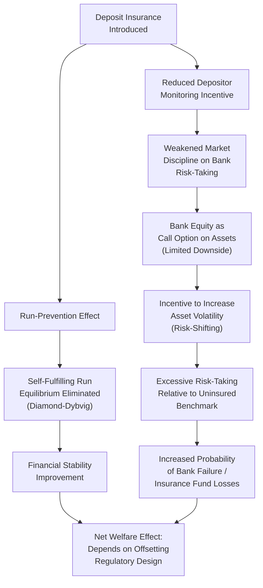

## Deposit Insurance and Moral Hazard

### Definition and Conceptual Foundation

Deposit insurance is a government or government-backed guarantee that depositors will recover some or all of their funds in the event of a bank failure, typically up to a specified coverage limit. Its primary theoretical justification, established formally in the Diamond-Dybvig (1983) framework, is the elimination of the self-fulfilling bank run equilibrium: by guaranteeing depositors' claims regardless of the withdrawal behavior of other depositors, deposit insurance removes the individual incentive to run purely out of fear that others will run, since a depositor's payoff no longer depends on their position in the withdrawal queue.

However, this same guarantee introduces a distinct and well-documented cost: moral hazard, defined as the incentive for an insured party to take on greater risk than they would in the absence of insurance, because the insured party does not bear the full downside consequences of that risk. In the banking context, deposit insurance can incentivize banks (specifically, bank shareholders and managers acting in shareholders' interest) toward excessive risk-taking, since insured depositors have diminished incentive to monitor and discipline bank risk-taking through the threat of withdrawal or demanding higher deposit rates.

### The Central Trade-off

The core analytical tension in the theory of deposit insurance can be stated as a trade-off between two distinct externalities:

$$\text{Total Welfare Effect} = \underbrace{\text{Run-Prevention Benefit}}_{\text{positive}} + \underbrace{\text{Moral Hazard Cost}}_{\text{negative}}$$

Deposit insurance addresses a *coordination failure* externality (the self-fulfilling run) but simultaneously creates an *incentive* externality (excessive risk-taking), because it severs the link between a bank's risk profile and the price/monitoring intensity depositors would otherwise impose on it. The theoretical and policy literature on deposit insurance is largely organized around how to capture the run-prevention benefit while minimizing or offsetting the moral hazard cost.

### The Moral Hazard Mechanism: An Option-Pricing Framework

**Bank Equity as a Call Option on Assets**

The most widely used formal framework for understanding deposit insurance moral hazard, following Merton (1977), models bank equity holders' payoff as structurally equivalent to a call option on the bank's asset value, with the insured deposit liability acting as the option's strike price:

$$\text{Equity Payoff} = \max(0, A_T - D)$$

where $A_T$ is the bank's asset value at the debt's maturity and $D$ is the face value of insured deposits. Because equity holders enjoy the full upside of asset value increases above $D$ (option-like convexity) while their downside is capped at zero (limited liability — losses beyond $D$ are absorbed by the deposit insurer, not equity holders), this payoff structure creates an incentive to increase asset volatility, since the value of a call option is increasing in the underlying asset's volatility, holding its expected value constant:

$$\frac{\partial \text{Value of Equity (as call option)}}{\partial \sigma_A} > 0$$

This is the formal basis for the widely cited proposition that deposit-insured banks have an incentive to pursue higher-risk (higher-variance) strategies than they would absent insurance, since equity holders capture a disproportionate share of the gains from higher volatility while the deposit insurer (ultimately, taxpayers or the insurance fund) bears the corresponding downside.

**Risk-Shifting (Asset Substitution) Behavior**

This mechanism is a specific application of the broader risk-shifting or asset-substitution problem identified by Jensen and Meckling (1976) in general corporate finance contexts: any levered firm's equity holders have some incentive to increase asset risk after debt is issued, since debt holders (or, here, the deposit insurer standing behind depositors) do not share proportionately in the upside. Deposit insurance is distinctive in this literature because it typically removes even the *market discipline* mechanism (higher required deposit rates demanded by informed depositors as compensation for risk) that would otherwise partially offset this incentive in an uninsured lending relationship.

### Diagram: The Deposit Insurance Trade-off

### Regulatory Responses to Offset Moral Hazard

**1. Risk-Based Capital Requirements**

Since the moral hazard mechanism operates through the option-like payoff structure created by limited liability and low equity capitalization, requiring banks to hold more equity capital directly reduces the moral hazard incentive by making equity holders bear a larger share of losses before the deposit insurer's guarantee is triggered:

$$\text{Equity Payoff} = \max(0, A_T - D), \quad \text{where higher required equity} \implies \text{lower } D/A_0 \text{ (leverage)}$$

Higher capital requirements reduce the "moneyness" of the equity call option (the option becomes less in-the-money for a given asset value), reducing the marginal incentive to increase volatility, though [Inference] capital requirements alone do not eliminate the incentive, since equity holders retain some risk-shifting incentive at any leverage ratio below 100% equity financing.

**2. Risk-Based Deposit Insurance Premiums**

Rather than charging all insured institutions a flat premium regardless of risk profile, risk-based premium systems charge higher premiums to banks with riskier balance sheets or business models, intended to internalize the moral hazard externality by pricing the insurance closer to its actuarially fair value for that specific institution:

$$\text{Premium}_i = f(\text{Risk Profile}_i)$$

The Federal Deposit Insurance Corporation Improvement Act (FDICIA) of 1991 introduced risk-based premiums for the FDIC following the savings and loan crisis, motivated explicitly by moral hazard concerns documented during that episode.

**3. Coverage Limits**

Deposit insurance is typically capped at a specified maximum per depositor per institution (e.g., $250,000 in the United States following the 2008 crisis increase from the prior $100,000 limit), rather than providing unlimited coverage. This is intended to preserve some market discipline from large, sophisticated depositors (who exceed the coverage limit and thus retain "skin in the game" incentive to monitor bank risk) while still providing the run-prevention benefit for the retail depositor base whose collective behavior is most central to the Diamond-Dybvig run mechanism.

[Inference] The effectiveness of coverage limits in preserving genuine market discipline from large depositors is limited in practice by the widespread expectation of *de facto* extended protection during systemic crises (e.g., regulators' decisions to protect uninsured depositors in specific failures, discussed below), which can undermine the intended discipline effect even where formal coverage limits remain unchanged.

**4. Prompt Corrective Action and Supervisory Intervention**

Regulatory frameworks (e.g., FDICIA's Prompt Corrective Action provisions) mandate graduated, increasingly severe supervisory interventions as a bank's capital ratio deteriorates, intended to substitute regulatory/supervisory discipline for the market discipline that deposit insurance weakens, closing troubled institutions before losses erode capital to the point where the deposit insurance fund bears substantial losses.

**5. Subordinated Debt Requirements**

Some proposals and, in limited implementations, actual regulatory requirements mandate that banks issue a minimum quantity of uninsured subordinated debt, on the theory that subordinated debt holders (who bear losses before depositors but are not covered by insurance) retain strong incentives to monitor and price bank risk, with the resulting yield spreads serving as an observable market signal of bank risk that supervisors can use to complement their own risk assessment.

### Empirical Evidence

**Cross-country evidence on deposit insurance design and risk-taking**: Demirgüç-Kunt and Detragiache's (2002) influential cross-country study found that the presence of explicit deposit insurance is associated with a *higher* probability of banking crises, particularly where deposit insurance is generous (high coverage limits, funded by the government rather than risk-based industry premiums) and where the broader institutional and regulatory environment is weak — consistent with the moral hazard mechanism dominating the run-prevention benefit in poorly regulated environments, while better-regulated environments show a more favorable trade-off.

**Savings and Loan crisis (United States, 1980s)**: Widely cited as a canonical historical illustration of deposit insurance moral hazard in practice: following deregulation that expanded the permissible asset activities of savings and loan institutions while deposit insurance coverage remained in place (and was in fact increased in 1980), a subset of institutions — particularly those already economically insolvent or near-insolvent (the "zombie thrift" phenomenon, in Kane's 1989 characterization) — pursued high-risk, high-variance strategies (e.g., speculative real estate and junk bond investments) consistent with the risk-shifting incentive predicted by the option-pricing framework, since equity holders in already-impaired institutions had little to lose and substantial option value to gain from volatility.

[Unverified] The precise quantitative contribution of moral hazard, relative to other contributing factors (interest rate risk from the preceding period of high inflation, regulatory forbearance, outright fraud in some cases), to the overall scale of S&L crisis losses remains a subject of some disagreement among economic historians, though moral hazard is broadly agreed to have been a significant contributing mechanism.

**Deposit insurance coverage expansions during crises**: Studies of the 2008 financial crisis period, during which many jurisdictions temporarily raised or eliminated deposit insurance coverage limits (or extended guarantees to previously uninsured wholesale liabilities), generally find these measures were associated with reduced deposit outflows and improved funding stability in the short run, consistent with the intended run-prevention mechanism, though the associated longer-run moral hazard implications of these expanded, and in some cases subsequently only partially reversed, guarantees remain a subject of ongoing analysis.

### Practical Example: Silicon Valley Bank Failure (March 2023) and the Uninsured Depositor Question

The March 2023 failure of Silicon Valley Bank (SVB) illustrates the contemporary policy tension between coverage limits and run-prevention in an environment with a large concentration of uninsured deposits:

1. SVB's depositor base was heavily concentrated among technology startups and venture capital-affiliated clients, with a substantial majority of deposits exceeding the $250,000 FDIC insurance limit and therefore technically uninsured
2. Following public concerns about unrealized losses on SVB's held-to-maturity securities portfolio (driven by rising interest rates), a rapid, large-scale deposit run occurred, disproportionately concentrated among the large uninsured depositor base, consistent with the theoretical prediction that uninsured depositors retain stronger incentives to run at the first sign of trouble relative to fully insured depositors
3. U.S. regulators subsequently invoked a "systemic risk exception" to guarantee all deposits at SVB (and a contemporaneously failing Signature Bank) in full, including amounts exceeding the standard coverage limit, citing financial stability concerns

**Key Points:**

- This episode is frequently cited in subsequent policy discussions as illustrating the practical difficulty of maintaining credible coverage limits during an actual crisis, since the discretionary systemic risk exception effectively extended *de facto* unlimited coverage in this instance, potentially reinforcing market expectations that similar future interventions would occur for other systemically perceived institutions — an outcome consistent with the "too big to fail" moral hazard extension of the basic deposit insurance framework
- [Inference] The episode renewed academic and policy debate about whether formal deposit insurance limits should be raised, made risk-based for large depositors, or supplemented with alternative mechanisms specifically addressing the vulnerability of concentrated, informationally sophisticated but still run-prone uninsured depositor bases

### Distinction: "Too Big to Fail" as an Extension of the Moral Hazard Framework

A related and analytically similar moral hazard mechanism arises from the market's expectation that systemically important financial institutions will receive government support (bailouts) in the event of failure, independent of formal deposit insurance. This "too big to fail" (TBTF) moral hazard operates through the same option-pricing logic — an implicit government guarantee reduces the effective downside borne by large-institution creditors and shareholders in a crisis — but extends beyond insured retail deposits to encompass a systemic institution's broader liability structure, including wholesale funding and, in some interpretations, even equity holders' anticipation of favorable treatment in resolution.

| Feature | Standard Deposit Insurance | Too Big to Fail |
| --- | --- | --- |
| Formal/explicit | Yes, statutory coverage limits | Generally implicit/discretionary |
| Scope of protected liabilities | Insured deposits up to coverage limit | Potentially broader liability structure |
| Pricing mechanism | Risk-based premiums (in modern systems) | Typically unpriced/unfunded ex ante |
| Primary regulatory offset | Capital requirements, PCA, coverage limits | Resolution regimes (e.g., Dodd-Frank Title II), enhanced capital/liquidity requirements for systemic institutions |

### Critiques and Open Debates

- **Optimal coverage level uncertainty**: There is no consensus formal result establishing a single optimal coverage limit balancing run-prevention against moral hazard; optimal levels in theoretical models are sensitive to assumptions about depositor sophistication, monitoring costs, and the broader regulatory environment
- **Risk-based premium implementation difficulty**: Accurately pricing bank-specific risk for premium-setting purposes faces the same information asymmetry problems that motivate financial regulation generally — regulators may lack sufficiently timely or accurate risk information to price premiums correctly, potentially reproducing a version of the adverse selection problem within the insurance-pricing mechanism itself
- **Interaction with capital regulation**: Since capital requirements and deposit insurance premium design both aim at the same underlying moral hazard problem, there is ongoing debate in the literature about the appropriate division of labor and potential redundancy or interaction effects between these two regulatory instruments
- **Dynamic and crisis-time credibility**: As the SVB episode illustrates, formal coverage limits may lack credibility as a genuine ex ante commitment device once a systemic crisis is underway, undermining the theoretical basis for relying on stated coverage limits to preserve market discipline from large depositors in practice

**Related Topics:**

- The Diamond-Dybvig model of bank runs and liquidity insurance
- Bank capital regulation and the Basel framework
- Too big to fail and systemic risk regulation (Dodd-Frank Title II, resolution regimes)
- The Savings and Loan crisis: causes and regulatory lessons
- Risk-shifting and asset substitution in corporate finance (Jensen-Meckling)
- Market discipline and subordinated debt requirements
- Prompt Corrective Action and supervisory intervention frameworks
- The Silicon Valley Bank failure and uninsured deposit run dynamics