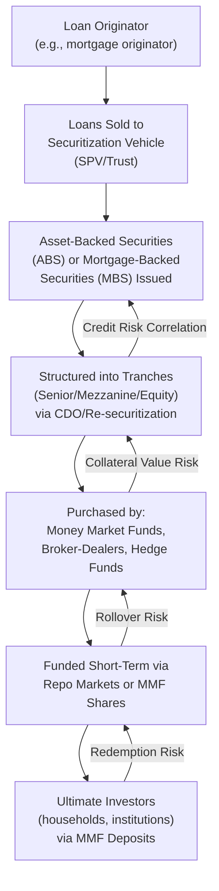

## The Shadow Banking System

### Definition and Conceptual Foundation

The shadow banking system refers to credit intermediation involving entities and activities that perform bank-like functions — principally maturity transformation, liquidity transformation, and credit risk transfer — outside the traditional regulated banking sector, and therefore largely without access to central bank liquidity backstops or explicit deposit insurance. The term was popularized by Paul McCulley (2007) and subsequently formalized in analytical and regulatory work, notably by the Financial Stability Board (FSB), which prefers the more neutral term "non-bank financial intermediation" (NBFI) to describe the same phenomenon without the pejorative connotation "shadow" can carry.

The defining conceptual feature is *functional* rather than *institutional*: shadow banking is identified by what an entity or chain of entities *does* (transforming short-term, liquid, run-prone liabilities into longer-term, illiquid, credit-risky assets) rather than by its legal or regulatory classification. This functional definition is central to why shadow banking poses a distinct regulatory challenge — activities economically equivalent to traditional banking can occur through legal structures that fall outside the traditional bank regulatory perimeter.

$$\text{Shadow Banking Entity} \equiv \{\text{maturity/liquidity transformation} + \text{credit intermediation}\} \setminus \{\text{traditional bank regulatory perimeter}\}$$

### Theoretical Foundation: Why Shadow Banking Emerges

**Regulatory Arbitrage**

A substantial theoretical and empirical literature attributes shadow banking growth partly to regulatory arbitrage: activities that would attract capital requirements, liquidity requirements, or other prudential costs if conducted on a regulated bank's balance sheet can be conducted more cheaply through unregulated or lightly regulated vehicles performing economically similar functions. This is formalized in the observation that as bank capital regulation (e.g., Basel I and II) tightened specific on-balance-sheet activities, credit intermediation migrated toward securitization structures and off-balance-sheet vehicles not subject to the same capital charges.

**Genuine Economic Efficiency Gains**

A complementary, non-arbitrage-based explanation holds that securitization and market-based credit intermediation genuinely improve risk diversification and capital allocation efficiency relative to a purely bank-balance-sheet-based system, by allowing risk to be distributed among investors with heterogeneous risk appetites and by tapping a broader pool of savings (e.g., money market fund investors) than traditional deposit-taking alone would access. [Inference] Most contemporary analyses treat regulatory arbitrage and genuine efficiency gains as complementary rather than mutually exclusive explanations, with their relative importance likely varying across specific shadow banking structures and time periods.

**Extension of the Diamond-Dybvig Liquidity Transformation Framework**

Because shadow banking entities perform the same core liquidity and maturity transformation function analyzed in the Diamond-Dybvig (1983) model of traditional banking, they are subject to the same theoretical run vulnerability: short-term liabilities (e.g., overnight repo, money market fund shares) funding longer-term, illiquid, or credit-risky assets create a structure susceptible to self-fulfilling runs under a sequential-service-like constraint, but without the deposit insurance or central bank backstop that mitigates this vulnerability in the traditional banking system.

### Diagram: The Shadow Banking Credit Intermediation Chain

### Key Institutional Components

**1. Securitization and Structured Finance**

The process of pooling illiquid loans (mortgages, auto loans, credit card receivables, student loans) into a special purpose vehicle (SPV) that issues tradable securities backed by the cash flows from the underlying loan pool. Structured finance further tranches these securities by seniority, so that losses are absorbed first by junior (equity/mezzanine) tranches, insulating senior tranches — a structure intended to create highly-rated securities from pools of lower-rated underlying loans through the diversification and subordination mechanism, though this mechanism's reliability depends critically on the correlation structure of underlying loan defaults, which proved to be badly mis-modeled for certain mortgage-related securities in the lead-up to the 2008 crisis.

**2. Repurchase Agreement (Repo) Markets**

A repo transaction is economically a collateralized short-term loan: one party sells a security with an agreement to repurchase it at a specified (typically higher) price at a future date, with the price difference representing implicit interest. Repo markets are a core funding mechanism for broker-dealers and other shadow banking entities, and because repo agreements are typically very short-term (often overnight) and require daily mark-to-market margining, they are subject to run-like dynamics if counterparties become unwilling to roll over funding or demand higher collateral haircuts (the fraction by which collateral value exceeds the loan amount, providing a margin of safety to the lender):

$$\text{Haircut} = 1 - \frac{\text{Loan Amount}}{\text{Collateral Market Value}}$$

A sudden, system-wide increase in haircuts (as documented extensively during the 2007–2008 period, notably by Gorton and Metrick, 2012) functions analogously to a bank run in the traditional Diamond-Dybvig sense: it forces rapid deleveraging and asset fire-sales as borrowers scramble to meet the higher collateral requirements or find alternative funding.

**3. Money Market Mutual Funds (MMFs)**

Investment vehicles that pool investor funds to purchase short-term, high-quality debt instruments (commercial paper, short-term government securities, repo), traditionally offering a stable net asset value (NAV) of $1.00 per share (for "prime" funds prior to post-2008/post-2016 reforms), functioning economically similarly to bank deposits — a fixed, stable redemption value combined with an underlying illiquid or credit-risky asset pool — but without deposit insurance. The September 2008 "breaking of the buck" by the Reserve Primary Fund (its NAV fell below $1.00 following Lehman Brothers-related commercial paper losses) triggered a broader run on prime MMFs, illustrating the Diamond-Dybvig-type vulnerability directly.

**4. Asset-Backed Commercial Paper (ABCP) Conduits and Structured Investment Vehicles (SIVs)**

Off-balance-sheet vehicles (often sponsored by commercial banks but not consolidated onto the sponsoring bank's regulatory balance sheet prior to post-crisis accounting and regulatory changes) that funded longer-term, less liquid asset holdings (including mortgage-related securities) through the continuous rollover of short-term commercial paper. This structure was a central locus of the 2007 onset of the financial crisis, as ABCP investors became unwilling to roll over funding amid growing uncertainty about the value of underlying mortgage-related collateral, forcing sponsoring banks to draw on contingent liquidity lines they had extended to these vehicles, transmitting stress back onto bank balance sheets despite the vehicles' formal off-balance-sheet status.

### Measurement and Scale

The Financial Stability Board's annual Global Monitoring Report on Non-Bank Financial Intermediation provides the primary internationally standardized measurement framework, distinguishing:

- **The broad measure (MUNFI)**: All non-bank financial intermediation, including entities like insurance companies and pension funds that do not necessarily engage in the specific bank-like activities of concern
- **The narrow measure**: Entities specifically assessed as engaging in shadow-banking-relevant activities (maturity/liquidity transformation, leverage, imperfect credit risk transfer) — money market funds, certain fixed-income funds, finance companies, structured finance vehicles, and broker-dealers engaged in securities financing

[Unverified] Precise global scale estimates vary meaningfully depending on which measure (broad versus narrow) is used and the specific reporting period, with the FSB's narrow measure historically representing a substantial fraction of total global financial system assets (commonly cited as roughly 13-15% in various FSB reports over the 2010s-2020s), though the reader should consult the current FSB Global Monitoring Report directly for the latest reporting-period figures given the annual update cycle and methodology refinements over time.

### Historical Episode: The 2007–2008 Shadow Banking Run

The 2008 financial crisis is widely analyzed as, in substantial part, a run on the shadow banking system rather than (or in addition to) a run on traditional insured deposits, given that traditional retail bank deposits were largely stable (protected by deposit insurance) throughout the episode:

1. **2007**: Rising subprime mortgage delinquencies triggered uncertainty about the value of mortgage-backed securities and related structured products, causing ABCP conduit investors to reduce rollover of commercial paper (the "run" on ABCP)
2. **2008 (pre-Lehman)**: Investment bank Bear Stearns experienced a rapid loss of repo funding as counterparties became unwilling to accept its collateral or demanded sharply higher haircuts, precipitating its emergency sale to JPMorgan Chase (facilitated by Federal Reserve support) in March 2008
3. **September 2008**: The Lehman Brothers bankruptcy triggered the Reserve Primary Fund's "breaking of the buck," causing a broader run on prime money market funds, which in turn caused a sharp contraction in commercial paper market funding for non-financial corporations, transmitting the shadow banking stress into the broader real economy's short-term financing

**Key Points:**

- This episode is frequently cited as the primary catalyst for the analytical and regulatory attention subsequently devoted to shadow banking, since it demonstrated that systemic risk could originate and propagate substantially outside the traditional, directly regulated banking perimeter
- The absence of deposit-insurance-like backstops for MMFs and repo counterparties meant that emergency, ad hoc central bank and Treasury interventions (e.g., the Fed's Commercial Paper Funding Facility, the Treasury's temporary MMF guarantee program) were required to arrest the run, illustrating the policy gap the shadow banking system's growth had created relative to the traditional bank safety net

### Regulatory Responses Since 2008

**1. Money Market Fund Reform**: U.S. SEC reforms (2014, with further reforms proposed/adopted in subsequent years) required institutional prime MMFs to adopt floating NAVs (removing the stable $1.00 per share convention that had made them deposit-like) and, in various iterations, permitted or required redemption gates and liquidity fees during stress periods, intended to reduce the run-like incentive structure.

**2. Securitization Risk Retention Requirements**: Post-crisis regulation (e.g., the "skin in the game" risk retention rules under Dodd-Frank in the U.S.) require securitization sponsors to retain a specified minimum economic interest in securitized exposures, intended to better align originator incentives with the credit quality of underlying loans, addressing an information asymmetry/moral hazard concern specific to the "originate-to-distribute" model that had allowed originators to pass on credit risk without retaining exposure to its consequences.

**3. Enhanced Bank Consolidation of Off-Balance-Sheet Vehicles**: Post-crisis accounting standard changes (e.g., FAS 166/167 in the U.S.) tightened the criteria under which banks could keep securitization vehicles and conduits off their consolidated regulatory balance sheets, directly addressing the regulatory arbitrage mechanism that had allowed banks to sponsor shadow-banking-like activity without corresponding capital charges.

**4. Central Clearing and Margin Requirements for Derivatives and Repo**: Expanded central clearing mandates and standardized minimum margin requirements for securities financing transactions aim to reduce the pro-cyclical, sudden-haircut-increase dynamic documented in the 2008 repo run.

**5. Non-Bank Financial Intermediation Monitoring Framework**: The FSB's ongoing annual global monitoring exercise, alongside enhanced national-level stress testing and monitoring of non-bank financial institutions, represents an attempt to extend systemic risk *surveillance* to the shadow banking sector even where full prudential regulatory authority remains more limited than for traditional banks.

### Comparative Table: Traditional Banking vs. Shadow Banking Safety Net

| Feature | Traditional Banking | Shadow Banking |
| --- | --- | --- |
| Deposit/liability insurance | Explicit (e.g., FDIC) | Generally absent |
| Central bank liquidity access | Direct access to discount window/standing facilities | Limited or absent under normal conditions; extended only via emergency/ad hoc facilities during crises |
| Capital requirements | Extensive (Basel framework) | Varies by entity type; often substantially lighter or entity-specific |
| Prudential supervision | Comprehensive, ongoing | Fragmented across entity types and regulators; historically less comprehensive |
| Run vulnerability | Present in theory (Diamond-Dybvig) but mitigated by insurance/LOLR | Present and historically less mitigated, as illustrated by 2008 |

### Post-2008 Recurrences and Continuing Relevance

**March 2020 (COVID-19 market turmoil)**: Prime money market funds again experienced significant redemption pressure amid acute market stress, prompting the Federal Reserve to establish the Money Market Mutual Fund Liquidity Facility (MMLF), demonstrating that despite post-2008 reforms, MMF run vulnerability had not been fully eliminated. This episode contributed to further SEC MMF reform proposals in subsequent years.

**Open-ended bond fund liquidity mismatch concerns**: Ongoing regulatory and academic attention has focused on open-ended mutual funds offering daily redemption while holding relatively illiquid corporate bond or bank loan assets, a liquidity mismatch structurally analogous to the classic shadow banking concern, and a continuing focus of FSB and national regulator policy work.

[Inference] The recurrence of stress episodes in non-bank financial intermediation in 2020, more than a decade after the initial post-2008 reform wave, suggests that fully closing the shadow banking regulatory gap has proven more difficult than initial reform efforts anticipated, though the scale and systemic consequences of the 2020 episode were substantially mitigated relative to 2008, plausibly reflecting both the reforms that had been implemented and the scale of emergency central bank intervention.

### Critiques and Open Debates

- **Definitional ambiguity and regulatory perimeter challenges**: Because the shadow banking definition is functional rather than institutional, regulators face an ongoing challenge in identifying and monitoring activities that may migrate into new legal structures specifically to remain outside an evolving regulatory perimeter, a documented pattern following each wave of reform
- **Trade-off between financial stability and credit intermediation efficiency**: Excessively restricting shadow banking activity risks reducing genuine diversification and credit-supply efficiency gains, creating persistent debate about the appropriate stringency of regulation applied to non-bank entities relative to traditional banks performing similar functions
- **Cross-border and regulatory arbitrage complications**: Since shadow banking activity can readily relocate across jurisdictions with differing regulatory stringency, effective regulation requires substantial international coordination, which the FSB's monitoring framework partially but not completely achieves given the absence of binding supranational prudential authority
- **Incomplete backstop extension**: The reliance on ad hoc, crisis-time emergency facilities (rather than pre-committed, rules-based backstops analogous to deposit insurance) for shadow banking entities raises questions about the predictability, moral hazard implications, and appropriate scope of future central bank support for non-bank financial intermediation

**Related Topics:**

- The Diamond-Dybvig model of bank runs (theoretical foundation for shadow banking run vulnerability)
- Securitization and structured finance mechanics (tranching, credit enhancement)
- Repo market dynamics and collateral haircuts (Gorton-Metrick analysis)
- Money market fund reform and the "breaking of the buck" episode
- Bank capital regulation and regulatory arbitrage incentives
- Central bank lender-of-last-resort doctrine extended to non-bank entities
- The Financial Stability Board's Global Monitoring Report on Non-Bank Financial Intermediation
- Systemic risk regulation and macroprudential policy design