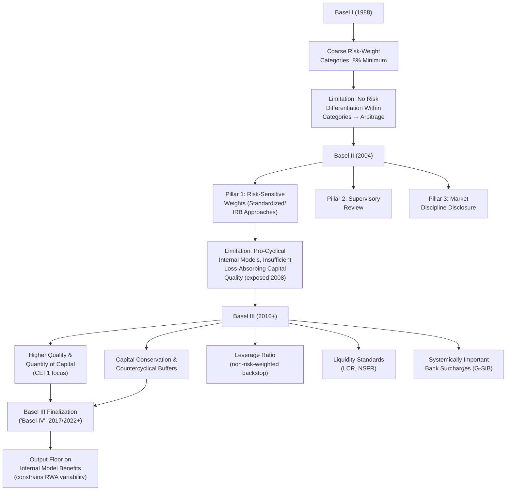

## Bank Capital Regulation and the Basel Frameworks

### Definition and Conceptual Foundation

Bank capital regulation refers to the set of rules requiring banks to fund a minimum proportion of their risk-weighted assets with equity and equity-like instruments (capital) rather than debt, primarily to absorb unexpected losses and thereby reduce the probability of bank failure and the associated externalities (systemic contagion, deposit insurance fund losses, real-economy credit contraction). The Basel frameworks — Basel I, II, III, and the post-crisis Basel III finalization ("Basel IV" in informal industry usage) — refer to the successive internationally coordinated standards developed by the Basel Committee on Banking Supervision (BCBS), housed at the Bank for International Settlements, establishing minimum capital adequacy standards intended for consistent application across major banking jurisdictions.

The theoretical rationale connects directly to the deposit insurance moral hazard framework: because deposit insurance and implicit "too big to fail" guarantees reduce the market discipline that would otherwise price and constrain bank risk-taking, capital requirements function as a regulatory substitute, directly limiting leverage and thereby the moneyness of the equity-holder call option described in the Merton (1977) framework.

$$\text{Capital Ratio} = \frac{\text{Regulatory Capital}}{\text{Risk-Weighted Assets}} \geq \text{Minimum Requirement}$$

### Theoretical Foundations

**Capital as a Loss-Absorption Buffer**

The most direct rationale: capital represents the cushion of resources available to absorb losses before a bank's liabilities (deposits, other debt) are impaired. A bank with capital ratio $k$ can sustain asset losses up to $k \times \text{Assets}$ before becoming insolvent (unable to fully repay depositors and other creditors):

$$\text{Insolvency Threshold: Asset Losses} > k \times A_0$$

Higher capital ratios directly increase the loss-absorption buffer, reducing the probability that a given adverse shock renders the bank insolvent.

**Addressing the Moral Hazard / Risk-Shifting Incentive**

As established in the deposit insurance and moral hazard literature, low-capital (highly levered) banks face an equity-holder incentive to increase asset risk, since equity's option-like payoff structure benefits disproportionately from volatility while losses beyond capital are borne by the deposit insurer or other creditors. Increasing required capital directly reduces this incentive by making equity holders bear a larger share of losses before the insurance/creditor backstop is triggered, reducing the "moneyness" of the implicit put option deposit insurance provides to bank equity holders.

**Addressing Systemic Externalities**

Beyond the risk-shifting incentive at the individual bank level, capital regulation also addresses systemic externalities that an individual bank does not internalize when choosing its own capital structure: a bank's failure can impose costs on the broader financial system (contagion through interbank exposures, fire-sale price effects on other institutions holding similar assets, disruption to credit intermediation for the bank's borrowers) that exceed the private costs borne by the failing bank's own stakeholders. This systemic-externality rationale underlies the more stringent capital requirements applied to systemically important banks under post-crisis frameworks (discussed below).

### Basel I (1988): The Original Framework

The original Basel Accord introduced the first internationally standardized capital adequacy framework, built around simple risk-weighted asset categories:

$$\text{Capital Ratio} = \frac{\text{Tier 1 + Tier 2 Capital}}{\sum_i w_i \cdot \text{Exposure}_i} \geq 8\%$$

where assets were assigned to a small number of risk-weight buckets (e.g., 0% for government bonds of OECD sovereigns, 20% for certain interbank exposures, 50% for residential mortgages, 100% for corporate loans), a relatively coarse categorization that did not differentiate risk *within* categories (e.g., a AAA-rated and a near-default corporate borrower received the identical 100% risk weight).

**Key limitation**: Basel I's coarse risk-weighting created substantial incentive for regulatory arbitrage — banks could hold the riskiest assets within a given risk-weight bucket (maximizing expected return for a given regulatory capital charge) without any capital penalty for the additional risk taken within that bucket, a widely recognized shortcoming that motivated the subsequent Basel II reform.

### Basel II (2004): Risk-Sensitivity and the Three Pillars

Basel II introduced a substantially more risk-sensitive framework, organized around three complementary "pillars":

**Pillar 1 — Minimum Capital Requirements**: Refined risk-weighting methodology, offering banks a choice among:

- **Standardized Approach**: Risk weights based on external credit ratings (e.g., from recognized credit rating agencies)
- **Internal Ratings-Based (IRB) Approach** (Foundation and Advanced variants): Permits banks meeting specified supervisory approval criteria to use their own internal models to estimate key risk parameters — probability of default (PD), loss given default (LGD), and exposure at default (EAD) — feeding into a regulatory risk-weight formula

$$\text{Risk Weight} = f(PD, LGD, EAD, M)$$

where $M$ is effective maturity, and $f(\cdot)$ follows a specified regulatory formula (based on an asymptotic single risk factor credit portfolio model) rather than the bank's own capital calculation being taken directly, preserving a degree of standardization even within the internal-models approach.

**Pillar 2 — Supervisory Review Process**: Requires supervisors to assess whether a bank's internal capital adequacy assessment appropriately captures its full risk profile, including risks not fully captured under Pillar 1 (e.g., concentration risk, interest rate risk in the banking book), with authority to require capital above the Pillar 1 minimum where warranted.

**Pillar 3 — Market Discipline**: Requires enhanced public disclosure of a bank's risk exposures, capital adequacy, and risk management practices, intended to restore some of the market discipline weakened by deposit insurance and other regulatory guarantees, by enabling sophisticated market participants (uninsured creditors, equity analysts, rating agencies) to better assess and price bank risk.

### Diagram: Basel Framework Evolution

### Basel III (2010 onward): Post-Crisis Reforms

The 2008 financial crisis exposed critical weaknesses in Basel II — many institutions that failed or required government support had reported capital ratios that appeared adequate under the pre-crisis framework, revealing that both the *quality* of recognized capital and the *risk-sensitivity calibration* had been insufficient. Basel III introduced substantial reforms across several dimensions:

**1. Higher Quality and Quantity of Capital**

Basel III tightened the definition of capital, placing primary emphasis on Common Equity Tier 1 (CET1) — predominantly common shares and retained earnings, the highest-quality, most loss-absorbing form of capital — while restricting the recognition of hybrid instruments that had proven less effective at absorbing losses during the crisis (some had continued paying coupons or lacked genuine loss-absorbing features when institutions were under severe stress):

$$\text{CET1 Ratio} = \frac{\text{Common Equity Tier 1 Capital}}{\text{Risk-Weighted Assets}} \geq 4.5\%$$

with the total minimum Tier 1 requirement raised to 6% and total capital (Tier 1 + Tier 2) maintained at 8%, but now supplemented by additional buffers described below.

**2. Capital Buffers**

- **Capital Conservation Buffer**: An additional 2.5% of CET1 required above the regulatory minimum, with automatic restrictions on capital distributions (dividends, buybacks, discretionary bonuses) if a bank's capital falls into the buffer range, creating a graduated incentive structure to rebuild capital before a bank breaches the hard minimum
- **Countercyclical Capital Buffer (CCyB)**: A variable buffer (0-2.5% of CET1, at national discretion) that supervisors can activate during periods of excessive credit growth, intended to build additional capital during upswings that can subsequently be released during downturns to support continued lending capacity, directly addressing the pro-cyclicality concern that risk-sensitive internal models can amplify credit cycles (capital requirements falling during booms when measured risk appears low, and rising sharply during downturns exactly when banks are least able to raise new capital)

**3. Leverage Ratio**

A non-risk-weighted backstop measure, introduced specifically because risk-weighted measures proved vulnerable to model risk, gaming, and periods where measured risk understated true risk:

$$\text{Leverage Ratio} = \frac{\text{Tier 1 Capital}}{\text{Total Exposure (largely non-risk-weighted)}} \geq 3\%$$

with additional, higher leverage ratio requirements (a "leverage ratio buffer") subsequently applied to global systemically important banks (G-SIBs).

**4. Liquidity Standards**

Basel III introduced, for the first time at the international standard level, quantitative liquidity requirements complementing capital requirements:

- **Liquidity Coverage Ratio (LCR)**: Requires banks to hold sufficient high-quality liquid assets (HQLA) to cover projected net cash outflows over a 30-day acute stress scenario

$$\text{LCR} = \frac{\text{High-Quality Liquid Assets}}{\text{Net Cash Outflows over 30 Days (Stress Scenario)}} \geq 100\%$$

- **Net Stable Funding Ratio (NSFR)**: Requires a minimum amount of stable funding relative to the liquidity profile of a bank's assets and off-balance-sheet exposures over a one-year horizon, addressing longer-term structural funding mismatches

$$\text{NSFR} = \frac{\text{Available Stable Funding}}{\text{Required Stable Funding}} \geq 100\%$$

Both measures directly address the maturity/liquidity transformation vulnerability central to the Diamond-Dybvig framework, requiring banks to hold buffers or maintain funding structures explicitly calibrated against the run/rollover-risk scenarios that materialized during the 2008 crisis (notably the wholesale funding and repo market stress documented in the shadow banking literature).

**5. Global Systemically Important Bank (G-SIB) Surcharges**

Banks identified as globally systemically important (based on an indicator-based measurement approach considering size, interconnectedness, complexity, cross-jurisdictional activity, and substitutability) face additional capital surcharges (ranging from 1% to 3.5% of CET1 depending on the assessed systemic importance bucket), directly implementing the systemic-externality rationale for capital regulation — internalizing, through higher required capital, the additional social cost that a systemically important institution's failure would impose beyond its own private costs.

### Basel III Finalization ("Basel IV")

A further reform package, finalized by the BCBS in December 2017 (with implementation phased over subsequent years, and further adjustments and delays in various jurisdictions including the U.S. and EU through the early-to-mid 2020s), addressed continuing concerns about excessive variability in risk-weighted asset calculations across banks using internal models for economically similar exposures. The centerpiece reform is the **output floor**:

$$\text{RWA (using internal models)} \geq 72.5\% \times \text{RWA (using standardized approach)}$$

This floor limits the extent to which a bank's internally modeled risk-weighted assets can fall below what the standardized approach would produce for the same exposures, directly constraining the model-risk and potential gaming concern that had been identified as a key weakness of the Basel II IRB framework — where banks using more "optimistic" internal models could report substantially lower risk-weighted assets (and thus lower required capital) than peers holding economically similar exposures under the standardized approach.

[Unverified] The precise implementation timeline and final calibration of Basel III finalization elements have varied and been subject to revision across major jurisdictions (notably differing implementation dates and, in some cases, modified requirements between U.S., EU, and UK regulators), so specific current-period compliance deadlines and final calibrations should be verified against the relevant jurisdiction's current regulatory publications rather than assumed fixed.

### Practical Example: Capital Ratio Calculation Illustration

Consider a simplified illustrative bank with the following risk-weighted asset composition:

| Asset Category | Exposure | Basel Risk Weight | Risk-Weighted Amount |
| --- | --- | --- | --- |
| Sovereign bonds (OECD) | $500 million | 0% | $0 |
| Interbank claims | $200 million | 20% | $40 million |
| Residential mortgages | $800 million | 35-50% (varies by LTV under standardized approach) | ~$320 million (illustrative, at 40% average) |
| Corporate loans | $600 million | 100% | $600 million |
| **Total Risk-Weighted Assets** |  |  | **$960 million** |

If this bank holds $70 million of CET1 capital:

$$\text{CET1 Ratio} = \frac{\$70\text{ million}}{\$960\text{ million}} = 7.29\%$$

This exceeds the 4.5% minimum plus the 2.5% capital conservation buffer (7.0% combined threshold), placing the bank above the point where automatic distribution restrictions would apply, though the specific buffer requirement would be higher still if a countercyclical buffer were activated by the relevant national authority or if the bank were designated systemically important.

**Key Points:**

- This stylized example illustrates why risk-weighting matters distinctly from a simple leverage ratio: the bank's *total* assets ($2.1 billion) substantially exceed its risk-weighted assets ($960 million), since low-risk-weight sovereign and interbank exposures require proportionally less capital backing than higher-risk-weight corporate lending
- The leverage ratio requirement (calculated against largely unweighted total exposure) would produce a materially different, generally lower, ratio for the same capital base, illustrating why Basel III's introduction of the leverage ratio as a *complementary* backstop — rather than a replacement for risk-weighted requirements — addresses a distinct vulnerability (model/gaming risk in risk-weighting) not captured by the risk-weighted measure alone

### Empirical Evidence and Debates

**Effect on lending and economic activity**: A substantial empirical literature examines whether higher capital requirements constrain bank lending and economic activity, given the theoretical possibility that higher required capital raises banks' overall cost of funding (to the extent the Modigliani-Miller capital structure irrelevance proposition does not hold exactly in practice due to tax treatment differences, information asymmetries, or other frictions) and could induce credit contraction, particularly during the transition to higher requirements. Findings across studies are mixed regarding the magnitude of this effect, [Inference] with the balance of evidence generally suggesting a genuine but moderate transition-period effect on credit supply that is smaller than the effect implied by simplistic models assuming capital is a purely costly, non-substitutable input, since better-capitalized banks may also benefit from lower funding costs on the margin (the "Modigliani-Miller offset" partially, though likely not fully, compensating for higher required capital).

**Pro-cyclicality of risk-weighted approaches**: Empirical evidence from the 2008 crisis period broadly supports the concern that internal-model-based risk weights fell during the pre-crisis credit boom (as measured historical default experience appeared favorable) and then rose sharply during the crisis itself, amplifying rather than dampening the credit cycle — a central motivation for the countercyclical buffer and output floor reforms.

### Critiques and Limitations

- **Model risk and gaming persistence**: Despite the output floor reform, critics note that internal-model-based approaches retain some scope for banks to select model assumptions favorably within permitted ranges, an inherent tension in any framework attempting to balance risk-sensitivity against standardization
- **Complexity and compliance burden**: The cumulative complexity of the full Basel III/IV framework (multiple overlapping ratios, buffers, and calculation methodologies) has drawn criticism for imposing substantial compliance costs, particularly for smaller institutions, motivating some jurisdictions to apply simplified frameworks for non-systemically-important banks
- **Cross-jurisdictional implementation divergence**: Despite the Basel framework's international coordination intent, actual implementation has varied across jurisdictions in timing, calibration, and scope, raising ongoing concerns about a genuinely "level playing field" for internationally active banks and about the effectiveness of a voluntary, non-treaty-based international standard-setting process
- **Capital regulation as necessary but insufficient**: Even robust capital regulation does not fully substitute for other elements of the prudential toolkit (deposit insurance design, resolution regimes, liquidity regulation, supervisory intensity), and the 2023 regional banking stress episodes (including Silicon Valley Bank) are frequently cited as illustrating that capital adequacy alone did not prevent the specific interest-rate-risk and uninsured-deposit-run vulnerabilities that materialized, since those risks were not centrally addressed by the risk-weighted capital framework as calibrated at the time

**Related Topics:**

- Deposit insurance and moral hazard (the underlying rationale for capital regulation)
- The Diamond-Dybvig model and liquidity risk regulation (LCR, NSFR)
- Global systemically important banks (G-SIB) and the too-big-to-fail problem
- Macroprudential policy and the countercyclical capital buffer
- Internal ratings-based models and model risk in financial regulation
- Bank resolution regimes and bail-in mechanisms (complementary to capital regulation)
- Shadow banking and the regulatory perimeter (activities migrating outside the Basel framework's scope)
- The 2023 regional banking stress episodes and post-crisis regulatory reassessment