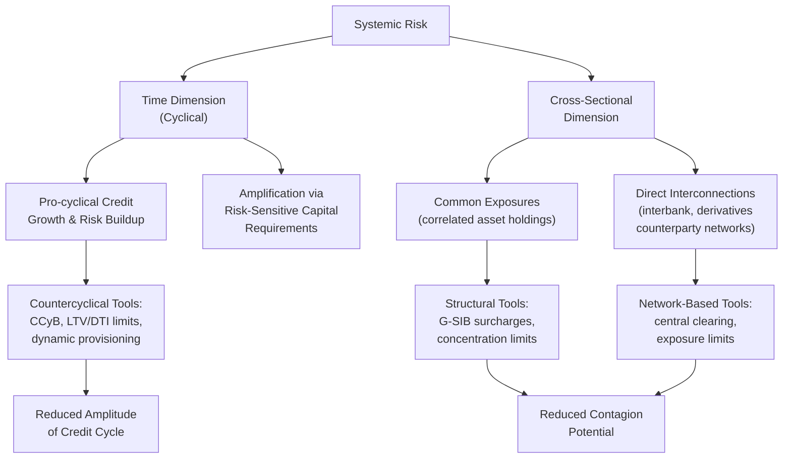

## Macroprudential Regulation and Systemic Risk

### Definition and Conceptual Foundation

Macroprudential regulation refers to the use of prudential tools to address risks to the financial system *as a whole*, distinguishing it from traditional microprudential regulation, which focuses on the safety and soundness of *individual* financial institutions in isolation. The conceptual distinction, most influentially articulated by Borio (2003) at the Bank for International Settlements, rests on the observation that risk to the system is not simply the sum of risks at individual institutions — systemic risk has an inherently collective, endogenous dimension arising from interconnections, common exposures, and the aggregate behavioral responses of institutions to shared conditions, dimensions that microprudential regulation, focused on each institution in isolation, does not fully capture.

$$\text{Systemic Risk} \neq \sum_i \text{Individual Institution Risk}_i$$

This inequality captures the core macroprudential insight: an action that appears prudent for an individual institution (e.g., selling assets to reduce risk during a downturn) can be collectively destabilizing if undertaken simultaneously by many institutions (contributing to fire-sale price dynamics), a phenomenon sometimes termed the "fallacy of composition" applied to financial regulation.

### The Time and Cross-Sectional Dimensions of Systemic Risk

Borio's influential framework decomposes systemic risk into two analytically distinct dimensions, each requiring different policy tools:

**1. The Time (Cyclical) Dimension**

Concerns how aggregate risk in the financial system evolves *over the credit cycle* — specifically, the tendency for risk to build up during economic upswings (when credit growth is rapid, asset prices rising, and measured risk indicators such as default rates appear favorable) and to crystallize during downturns, often after having been systematically underpriced during the boom phase. This pro-cyclicality is amplified by risk-sensitive microprudential tools themselves: if capital requirements fall during booms (as measured risk appears low under internal models) and rise sharply during busts, capital regulation can *amplify* rather than dampen the credit cycle, a concern central to the countercyclical capital buffer's design under Basel III.

**2. The Cross-Sectional Dimension**

Concerns how risk is *distributed across institutions at a given point in time* — specifically, the degree to which the financial system's aggregate exposure to risk is concentrated through common exposures (many institutions holding correlated assets) or through direct interconnections (interbank lending networks, derivatives counterparty exposures) that can propagate an individual institution's distress into broader system-wide contagion.

### Theoretical Mechanisms Generating Systemic Risk

**Fire-Sale Externalities**

When financial institutions face binding leverage or capital constraints and are forced to sell assets to meet those constraints (following a shock), the resulting sales depress asset prices, which in turn worsens the balance sheet position of *other* institutions holding similar assets (marked to the now-lower market price), potentially triggering further forced sales — an amplification mechanism formalized in models such as Shleifer and Vishny's (2011) fire-sale framework and Brunnermeier and Pedersen's (2009) liquidity spiral model:

$$P_t \downarrow \implies \text{Collateral Value} \downarrow \implies \text{Forced Deleveraging} \implies \text{Further Sales} \implies P_{t+1} \downarrow\downarrow$$

This constitutes a pecuniary externality: an individual institution's asset sale decision does not internalize the price-depressing effect on other institutions' balance sheets, since asset prices are a market-clearing outcome that no single institution controls, yet the aggregate effect of many institutions behaving in this individually rational way is collectively destabilizing.

**Network Contagion**

Direct financial interconnections — interbank lending, derivatives counterparty relationships, correlated funding sources — create channels through which one institution's distress or failure can directly transmit losses to counterparties, potentially triggering cascading failures. Network-theoretic models of financial contagion (e.g., Allen and Gale, 2000; Eisenberg and Noe, 2001) formalize how the *topology* of the interbank network (its density, concentration, and the presence of highly connected "hub" institutions) affects the system's vulnerability to contagion following an initial shock to one or a few nodes.

**Procyclicality of Leverage**

Adrian and Shin's (2010) empirical and theoretical work documents that financial intermediaries, particularly investment banks and broker-dealers using mark-to-market accounting, tend to actively manage their balance sheets to *target* a specific leverage ratio, meaning leverage rises during booms (as asset values and net worth increase, institutions actively expand borrowing to increase assets and maintain a targeted leverage ratio, rather than allowing leverage to passively decline) and falls sharply during downturns — a mechanically pro-cyclical leverage management pattern that amplifies both the credit boom and the subsequent bust, distinct from (though related to) the fire-sale mechanism above.

$$\text{Leverage}_t = \frac{\text{Assets}_t}{\text{Equity}_t}, \quad \frac{d\text{Leverage}}{d\text{Net Worth}} > 0 \text{ (actively managed, pro-cyclical)}$$

**Too Big to Fail and Systemic Institution Externalities**

As discussed in the deposit insurance and moral hazard context, institutions perceived as systemically important benefit from implicit government support expectations, which can distort their risk-taking incentives and funding costs relative to smaller institutions, while their failure imposes disproportionate systemic costs not internalized in their individual risk-management decisions — providing the rationale for the cross-sectional macroprudential tools (G-SIB surcharges) discussed below.

### Macroprudential Policy Tools

**1. Countercyclical Capital Buffer (CCyB)**

Discussed under the Basel III framework: a time-varying capital requirement (0-2.5% of CET1 under Basel III, though some jurisdictions have implemented or proposed higher ranges) that national macroprudential authorities can activate during periods of excessive credit growth and release during downturns, directly targeting the time-dimension of systemic risk.

**2. Loan-to-Value (LTV) and Debt-to-Income (DTI) Limits**

Borrower-based macroprudential tools restricting mortgage and other lending based on collateral value ratios or borrower income ratios, aimed directly at limiting excessive household leverage buildup during property price booms — a tool that operates on loan origination standards system-wide, rather than through bank capital requirements, and is used extensively in several jurisdictions (e.g., various implementations across the UK, several Asian economies, and Nordic countries) as a complement to capital-based tools.

**3. Systemically Important Financial Institution (SIFI) Surcharges**

G-SIB and domestic systemically important bank (D-SIB) capital surcharges, discussed under the Basel III framework, directly target the cross-sectional dimension by requiring institutions whose failure would impose disproportionate systemic costs to hold additional capital buffers proportional to their assessed systemic importance.

**4. Central Counterparty (CCP) Clearing Mandates**

Requiring standardized derivatives (and certain other transaction types) to be cleared through central counterparties rather than bilaterally, intended to simplify and make more transparent the network topology of counterparty exposures, replacing a potentially opaque web of bilateral exposures with a hub-and-spoke structure where the CCP's own risk management (margining, default funds) becomes the primary contagion-mitigation mechanism — though this concentrates risk in the CCP itself, creating a new, albeit differently structured and typically more heavily regulated and capitalized, potential point of systemic vulnerability.

**5. Stress Testing**

Regular, standardized stress tests (e.g., the U.S. Federal Reserve's Comprehensive Capital Analysis and Review (CCAR) / Dodd-Frank Act Stress Testing (DFAST), the European Banking Authority's EU-wide stress tests) assess whether individual institutions — and, in system-wide aggregation exercises, the banking system collectively — could withstand severe but plausible adverse economic scenarios, serving both a supervisory function (informing capital planning requirements) and an information/transparency function (publicly disclosed results intended to reduce uncertainty-driven contagion risk during actual stress periods).

**6. Liquidity Regulation (System-Wide Dimension)**

While the Liquidity Coverage Ratio and Net Stable Funding Ratio (introduced under Basel III) are formally microprudential requirements applied to individual institutions, they carry an important macroprudential rationale: because a fire-sale or contagion dynamic requires *multiple* institutions to face simultaneous liquidity stress for system-wide effects to emerge, ensuring that individual institutions hold adequate liquidity buffers reduces the probability that a shock to one institution propagates into a system-wide liquidity crisis.

### Institutional Architecture for Macroprudential Policy

Following the 2008 crisis, most major jurisdictions established or formalized dedicated macroprudential policy authorities or committees, reflecting the recognition that pre-crisis regulatory architecture (often organized around individual-institution supervision, split across multiple functional regulators) lacked a clear institutional mandate or authority for system-wide risk monitoring and intervention:

| Jurisdiction | Macroprudential Authority | Established |
| --- | --- | --- |
| United States | Financial Stability Oversight Council (FSOC) | 2010 (Dodd-Frank Act) |
| United Kingdom | Financial Policy Committee (FPC), Bank of England | 2013 |
| European Union | European Systemic Risk Board (ESRB) | 2010 |
| Global coordination | Financial Stability Board (FSB) | 2009 (successor to Financial Stability Forum) |

[Inference] The common timing of these institutional developments (clustered around 2009–2013) directly reflects the 2008 crisis's role as the primary catalyst for recognizing the pre-existing institutional gap in system-wide risk monitoring and macroprudential authority.

### Practical Example: Use of LTV/DTI Limits During a Property Boom

Consider a stylized macroprudential intervention scenario: a national authority observes rapid house price appreciation accompanied by rising average mortgage LTV ratios and growing household debt-to-income ratios, judged to represent building systemic risk in the time dimension (a classic credit-boom pattern preceding historical property-related financial crises).

**Key Points:**

- A macroprudential response might combine: (1) tightening maximum permissible LTV ratios for new mortgage originations (directly constraining the leverage embedded in new lending), (2) activating or raising the countercyclical capital buffer (requiring banks to hold additional capital against the growing stock of mortgage exposures), and (3) enhanced supervisory stress testing incorporating a more severe property price decline scenario
- This combination illustrates the complementary use of borrower-based tools (directly constraining loan terms) alongside capital-based tools (requiring banks to internalize more of the risk through higher capital charges) — a design pattern reflecting the recognition that different tools address different transmission channels of the same underlying cyclical risk-buildup concern
- [Inference] The relative effectiveness of borrower-based versus capital-based tools in specific historical episodes appears to depend on factors including the depth of domestic mortgage securitization (which can allow risk to migrate outside the directly regulated banking sector if only bank-facing tools are used) and cross-border capital flow dynamics, though a comprehensive, generally agreed cross-country ranking of tool effectiveness has not been firmly established in the empirical literature

### Empirical Evidence on Macroprudential Tool Effectiveness

A growing empirical literature, including cross-country panel studies (e.g., work associated with the International Monetary Fund's macroprudential policy database) generally finds that macroprudential tools, particularly borrower-based measures like LTV and DTI limits, are associated with reduced credit growth and house price appreciation during boom periods. However, [Unverified] the literature is less conclusive regarding these tools' effectiveness at reducing the *severity* of subsequent downturns or crises once they occur, as opposed to their more consistently documented effect on moderating the pace of credit growth during upswings — a distinction between preventing/moderating boom conditions versus mitigating bust-phase severity that remains an active area of ongoing research.

**Cross-border leakage**: A well-documented empirical finding is that macroprudential tightening in one jurisdiction can be partially offset by increased cross-border lending from foreign branches or subsidiaries not subject to the same domestic macroprudential requirements, a "leakage" phenomenon that has motivated increased attention to reciprocity arrangements (where foreign regulators agree to apply equivalent requirements to their own institutions' exposures in the tightening jurisdiction) among internationally coordinated macroprudential frameworks.

### Relationship to Monetary Policy

A significant and ongoing area of debate concerns the relationship and potential interaction between macroprudential policy and conventional monetary policy, given that both affect credit conditions and can be used, in principle, to address financial stability concerns:

- **"Leaning against the wind" debate**: Whether monetary policy itself should respond to financial stability/credit-boom concerns (raising rates beyond what a pure inflation/output mandate would suggest, to restrain asset price or credit booms) or whether this task should be left entirely to dedicated macroprudential tools, preserving monetary policy's focus on its conventional inflation/output stabilization mandate — a debate without full consensus resolution, with central banks' stated frameworks and practice varying across jurisdictions and time periods
- **Complementarity versus substitutability**: Some analyses suggest macroprudential and monetary tools can be used as complements (macroprudential tools addressing sector-specific or time-dimension risks that monetary policy's broad, economy-wide instrument is poorly suited to target precisely, given monetary policy's simultaneous effects on the entire economy rather than specific credit market segments)

[Inference] The general trend in institutional practice since 2008 has been toward treating macroprudential policy as the primary, targeted tool for addressing financial stability risks specifically, while monetary policy retains its primary focus on price stability and output objectives, though this division of labor remains subject to ongoing academic and policy debate rather than representing a fully settled consensus.

### Critiques and Limitations

- **Measurement and early-warning challenges**: Systemic risk, particularly in its time dimension, is difficult to measure in real time — a central macroprudential policy challenge is that credit booms are easier to identify with confidence in retrospect than in real time, creating risk of both false positives (unnecessarily restrictive intervention during benign credit growth) and false negatives (failing to intervene during a genuine, but not yet clearly identifiable, buildup of systemic risk)
- **Political economy and authority calibration challenges**: Macroprudential tools, particularly borrower-based measures directly affecting household credit access (e.g., LTV limits restricting mortgage borrowing), can face political resistance, especially during politically popular property price booms, raising questions about whether macroprudential authorities possess sufficient independence and credible mandate to act pre-emptively against politically popular credit expansion
- **Cross-border leakage and coordination challenges**: As noted above, the effectiveness of purely domestic macroprudential tools can be undermined by cross-border regulatory arbitrage absent effective international reciprocity arrangements, a persistent challenge given the voluntary, non-treaty-based nature of most international macroprudential coordination mechanisms
- **Incomplete toolkit for addressing shadow banking**: Since many macroprudential tools (particularly bank capital-based measures) are most directly applicable to traditional regulated banks, risk may migrate toward less-regulated shadow banking entities in response to macroprudential tightening, echoing the regulatory arbitrage dynamic documented in the shadow banking literature and suggesting the macroprudential toolkit's effectiveness depends partly on the breadth of its application across the full range of credit-intermediating entities, not banks alone

**Related Topics:**

- Bank capital regulation and the Basel frameworks (countercyclical buffer, G-SIB surcharges)
- The shadow banking system and regulatory arbitrage/leakage concerns
- The Diamond-Dybvig model and fire-sale/contagion externalities
- Network models of financial contagion (Allen-Gale, Eisenberg-Noe)
- The "leaning against the wind" monetary-macroprudential policy debate
- Deposit insurance, moral hazard, and too-big-to-fail externalities
- Stress testing methodology (CCAR/DFAST, EU-wide stress tests)
- Central counterparty clearing and derivatives market structure reform