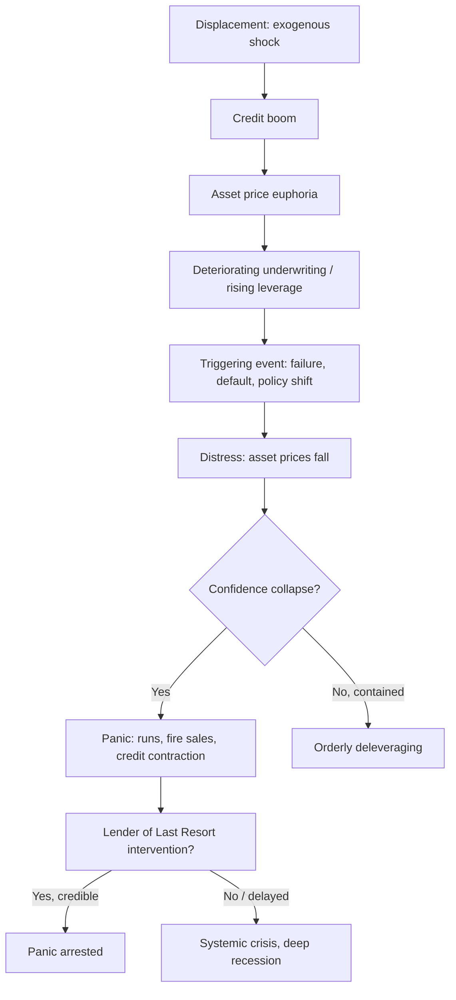

## Historical Patterns of Financial Crises and Panics

### Overview

Financial crises are recurring disruptions in the functioning of credit and payment systems, typically characterized by sharp asset-price declines, credit contraction, bank runs or their modern equivalents, and a scramble for liquidity. Despite differences in institutional detail across eras, historical crises share a recognizable morphology that economists have documented across centuries and continents.

### The Canonical Crisis Sequence (Kindleberger–Minsky Framework)

Charles Kindleberger, building on Hyman Minsky's financial instability hypothesis, described a stylized anatomy of crises with five phases:

1. **Displacement** — An exogenous shock changes profit opportunities in some sector (a new technology, financial deregulation, a peace treaty opening trade, a commodity discovery).
2. **Boom** — Credit expands to finance investment in the newly profitable sector; asset prices rise, reinforcing optimism (a positive feedback loop).
3. **Euphoria** — Speculation becomes increasingly detached from fundamentals; "new era" thinking emerges; leverage rises; underwriting standards deteriorate.
4. **Distress / Financial Crisis** — Insiders begin taking profits; some triggering event (a failure, a fraud revelation, a policy tightening) causes a reversal; asset prices fall.
5. **Revulsion / Panic** — A rush for liquidity ("flight to quality") produces fire sales, bank runs, and a general contraction of credit, often halted only by a lender of last resort or comprehensive policy intervention.

This is sometimes summarized as **displacement → boom → euphoria → distress → panic → revulsion**, with the [Inference] caveat that not every historical episode passes through all stages cleanly — some crises (e.g., pure sovereign debt crises) truncate or skip stages.

**Key Points**

- Minsky's underlying taxonomy of borrower types — hedge, speculative, and Ponzi finance — describes the microfoundation of the boom-to-distress transition: as euphoria progresses, more borrowers rely on rising asset prices (rather than income) to service debt.
- The "this time is different" syndrome (Reinhart and Rogoff's phrase) refers to the recurring belief during booms that historical crisis patterns no longer apply due to some structural change.

### Bank Runs and Panics: The Classical Mechanism

A **bank run** occurs when depositors, fearing a bank cannot honor withdrawals, simultaneously attempt to withdraw funds, which can render even a solvent bank illiquid due to fractional reserve banking and maturity transformation (banks fund long-term illiquid loans with short-term liquid deposits).

The **Diamond–Dybvig model** (1983) formalizes this as a coordination problem with multiple equilibria: if all depositors believe others will run, running is individually rational even for a fundamentally solvent bank, producing a self-fulfilling panic. This distinguishes:

- **Fundamental-based panics**: triggered by genuine insolvency concerns (bad loans, asset losses)
- **Pure panics / self-fulfilling runs**: triggered by shifts in expectations alone, absent changes in fundamentals

[Inference] In practice, historical panics typically combine both elements — genuine deterioration in some institutions triggers indiscriminate runs on others perceived as similar ("contagion" or "information contagion").

### Major Historical Episodes

**Pre-central-banking era**

- **Dutch Tulip Mania (1636–37)** — Often cited as the earliest well-documented speculative bubble; [Unverified/Speculation] some economic historians (notably Peter Garber) have argued its severity was exaggerated in popular retelling relative to contemporary evidence.
- **South Sea Bubble (1720, Britain)** and **Mississippi Bubble (1720, France)** — Both involved government-chartered companies, monetized public debt, and speculative equity issuance; both collapsed within the same year, illustrating early cross-border correlation of speculative episodes.

**19th century: recurring banking panics (pre-Fed United States)**

The U.S. lacked a central bank from 1837–1913 (excepting the First and Second Banks of the United States earlier), producing a pattern of periodic panics:

| Panic | Key Trigger | Notable Feature |
| --- | --- | --- |
| 1837 | Land speculation, specie circular, cotton price collapse | Multi-year depression |
| 1857 | Railroad overexpansion, gold ship loss (SS Central America) | First "modern" global panic (telegraph-linked markets) |
| 1873 | Railroad bond overinvestment, Jay Cooke & Co. failure | Long depression, international scope (Vienna crash) |
| 1893 | Silver policy uncertainty, railroad failures | Severe unemployment, gold reserve run |
| 1907 | Failed corner of United Copper Co., trust company runs | Resolved by J.P. Morgan's private coordination; catalyzed creation of the Federal Reserve (1913) |

**Key Points**

- The Panic of 1907 is historically pivotal: the absence of an official lender of last resort forced private coordination (Morgan organizing bank consortiums), directly motivating the National Monetary Commission and the Federal Reserve Act of 1913.
- Recurring panics in this era commonly clustered around **autumn months**, tied to the seasonal demand for currency in agricultural economies (the "inelastic currency" problem) — a structural driver distinct from speculative excess.

**The Great Depression (1929–1939)**

- Triggered by the 1929 stock market crash, but the defining feature (per Friedman and Schwartz, *A Monetary History of the United States*) was a sequence of **banking panics (1930–1933)** that the Federal Reserve failed to counteract, causing the money supply to contract by roughly a third.
- [Inference/contested] Friedman and Schwartz's "monetarist" interpretation (Fed policy failure, insufficient liquidity provision) contrasts with Ben Bernanke's "credit channel" emphasis (bank failures destroyed information capital needed for credit intermediation) and with Minsky/Keynesian debt-deflation narratives (Irving Fisher, 1933) — these are complementary rather than mutually exclusive in most modern treatments.
- Resulted in comprehensive institutional reform: the Glass–Steagall Act (1933), FDIC deposit insurance, and the Securities Exchange Act (1934) — arguably a durable structural fix that helps explain the relative absence of systemic U.S. banking panics between 1934 and 2007.

**Post-WWII episodes**

- **Latin American Debt Crisis (1982)** — Sovereign lending crisis; commercial banks had recycled OPEC "petrodollars" into sovereign loans to developing economies; a Volcker-era interest rate shock made floating-rate debt service unsustainable, triggering Mexico's 1982 default declaration.
- **Savings and Loan Crisis (US, 1980s–early 1990s)** — Combination of interest rate risk mismatch (long fixed-rate mortgages funded by short deposits) following 1970s deregulation and moral hazard from deposit insurance; over 1,000 thrifts failed.
- **Japanese Asset Price Bubble (1986–1991) and its aftermath** — Real estate and equity bubble fueled by loose monetary policy and financial liberalization; collapse ushered in Japan's "Lost Decade(s)," a frequently cited case study in balance-sheet recession dynamics (Richard Koo's framework) and the limits of conventional monetary policy near the zero lower bound.
- **European Exchange Rate Mechanism Crisis (1992)** — "Black Wednesday": speculative attacks (notably by George Soros's fund) forced the British pound out of the ERM, illustrating a currency-crisis pattern distinct from banking panics.
- **Mexican Peso Crisis / "Tequila Crisis" (1994–95)** and **Asian Financial Crisis (1997–98)** — Currency crises with capital-flight dynamics; the Asian crisis (Thailand, Indonesia, South Korea) highlighted the danger of short-term dollar-denominated liabilities funding domestic-currency assets ("original sin" and currency/maturity mismatch).
- **Russian Financial Crisis (1998)** and collapse of **Long-Term Capital Management (LTCM)** — Demonstrated how a sovereign default could transmit through highly leveraged relative-value hedge fund strategies to threaten systemic stability, prompting a Fed-organized (not Fed-funded) private recapitalization of LTCM.
- **Global Financial Crisis (2007–2009)** — Originated in U.S. subprime mortgage securitization; propagated through opaque structured products (CDOs, MBS) and short-term wholesale funding markets (repo, asset-backed commercial paper), producing a "shadow banking" run distinct in mechanics from classical retail deposit runs but structurally analogous (a maturity-mismatched intermediary facing a collective loss of confidence). Lehman Brothers' failure (September 2008) is the canonical case study in the costs of allowing a large, interconnected institution to fail without resolution mechanisms.
- **European Sovereign Debt Crisis (2010–2012)** — Combined sovereign and banking distress ("doom loop") in Greece, Ireland, Portugal, Spain, and Italy; highlighted the fragility of a currency union without integrated fiscal backstops or a unified lender of last resort with clear sovereign-support authority.

### Recurring Structural Patterns

Reinhart and Rogoff's *This Time Is Different* (2009), using an eight-century dataset, identify several cross-episode regularities:

- **Debt buildups precede crises**: private credit-to-GDP ratios typically rise sharply in the years before a crisis, then contract sharply afterward.
- **Capital flow bonanzas** often precede sovereign defaults and banking crises in emerging markets — surges of foreign capital inflow followed by sudden stops.
- **Post-crisis recessions associated with financial crises are deeper and more prolonged** than ordinary business-cycle recessions, particularly when the crisis is a banking crisis rather than a purely equity-market correction. [Inference] The magnitude of this "financial crisis penalty" is debated in later research (e.g., Bordo and Haubrich find more heterogeneity than Reinhart-Rogoff's aggregate averages suggest).
- **Serial default** is common: many sovereigns (e.g., Spain, Argentina, Greece) default repeatedly across centuries, suggesting weak institutional commitment technology rather than one-off bad luck.

### Common Triggers Across Eras

| Category | Examples |
| --- | --- |
| Asset price bubbles bursting | Tulip mania, 1929, dot-com (2000), U.S. housing (2007) |
| Bank/institution failures triggering contagion | Jay Cooke (1873), Lehman (2008) |
| Sovereign default or fiscal shock | Latin America (1982), Russia (1998), Greece (2010) |
| Currency/exchange rate attacks | ERM (1992), Asian crisis (1997) |
| Monetary policy tightening exposing fragility | Volcker shock (1980–82), various 19th-century panics |
| Fraud or information revelation | South Sea Bubble, Madoff-adjacent 2008 disclosures |

### Diagram: Generalized Crisis Propagation

### Illustration: Credit–Asset Price Feedback Loop (svg_diagram)

<svg xmlns="http://www.w3.org/2000/svg" viewBox="0 0 640 340" font-family="sans-serif">
<text x="320" y="24" font-size="16" font-weight="bold" text-anchor="middle">Credit–Asset Price Feedback Loop (svg_diagram)</text>
<circle cx="320" cy="180" r="140" fill="none" stroke="#888" stroke-dasharray="4,3" />
<rect x="240" y="40" width="160" height="50" rx="8" fill="#dceeff" stroke="#3366aa" />
<text x="320" y="70" font-size="13" text-anchor="middle">Credit Expansion</text>
<rect x="440" y="150" width="160" height="50" rx="8" fill="#dceeff" stroke="#3366aa" />
<text x="520" y="180" font-size="13" text-anchor="middle">Rising Asset Prices</text>
<rect x="240" y="260" width="160" height="50" rx="8" fill="#dceeff" stroke="#3366aa" />
<text x="320" y="290" font-size="13" text-anchor="middle">Higher Collateral Value</text>
<rect x="40" y="150" width="160" height="50" rx="8" fill="#dceeff" stroke="#3366aa" />
<text x="120" y="180" font-size="13" text-anchor="middle">Increased Borrowing Capacity</text>
<path d="M400,65 L440,155" stroke="#333" marker-end="url(#arrow)" fill="none" />
<path d="M520,200 L400,275" stroke="#333" marker-end="url(#arrow)" fill="none" />
<path d="M240,285 L200,190" stroke="#333" marker-end="url(#arrow)" fill="none" />
<path d="M120,150 L240,70" stroke="#333" marker-end="url(#arrow)" fill="none" />
<text x="320" y="330" font-size="11" text-anchor="middle" fill="#555">Reversal of any link (e.g., a collateral price shock) can flip the loop into a deleveraging spiral</text>
</svg>

### Mathematical Formalization: Diamond–Dybvig Intuition

In a simplified two-period Diamond–Dybvig setting, depositors are either **patient** (consume at $t=2$) or **impatient** (consume at $t=1$), and this type is private information. A bank offers a demand-deposit contract promising $r_1$ per unit deposited if withdrawn at $t=1$ and $r_2$ at $t=2$, where:

$$r_1 < 1 < r_2$$

reflecting the return on the illiquid long-term investment. The "good" equilibrium has only impatient depositors withdrawing early; the "bad" equilibrium (panic) has all depositors withdrawing at $t=1$, which is self-fulfilling because the bank must liquidate long-term assets at a loss to meet withdrawals, potentially exhausting funds before all depositors are served. Deposit insurance or a credible lender of last resort eliminates the panic equilibrium by guaranteeing $r_2$ regardless of the run, without requiring costly early liquidation.

### Practical Example: Reading a Historical Crisis Through the Framework

Applying the Kindleberger stages to the 2007–2008 crisis:

- **Displacement**: financial innovation in mortgage securitization plus sustained low interest rates (early-to-mid 2000s)
- **Boom**: rapid growth of subprime and Alt-A mortgage originations; house prices rising nationally
- **Euphoria**: "house prices never fall nationally" narrative; AAA ratings on structured products despite underlying collateral deterioration
- **Distress**: 2006–2007 uptick in subprime delinquencies; Bear Stearns hedge fund collapses (June 2007)
- **Panic/Revulsion**: interbank lending freezes (August 2007 onward), Lehman Brothers bankruptcy (September 15, 2008), money market fund "breaking the buck," commercial paper market seizure

**Conclusion**

Across nearly four centuries of documented episodes, financial crises exhibit a recognizable structural rhythm — credit-fueled asset booms, a triggering reversal, and a self-reinforcing scramble for liquidity — even as the specific institutional form (bank deposits, sovereign bonds, repo markets, structured credit) evolves. This regularity is the empirical and theoretical foundation for the case, developed further in this chapter, for a credible lender-of-last-resort function: an institution able to interrupt the panic phase before it produces the deep, protracted output losses that historically accompany banking-sector crises specifically.

**Related Topics**

- Bagehot's Dictrine and the classical rules for lender-of-last-resort lending
- Deposit insurance design and moral hazard trade-offs
- Shadow banking and non-bank runs (repo, money market funds, asset-backed commercial paper)
- Sovereign debt crises and the Reinhart–Rogoff dataset methodology
- Systemic risk measurement (CoVaR, SRISK, interconnectedness metrics)
- Macroprudential policy as a crisis-prevention complement to lender-of-last-resort intervention
- The debate over Fed policy failure during the Great Depression (Friedman–Schwartz vs. Bernanke credit-channel views)
- Currency crisis models (first-generation Krugman, second-generation self-fulfilling models)