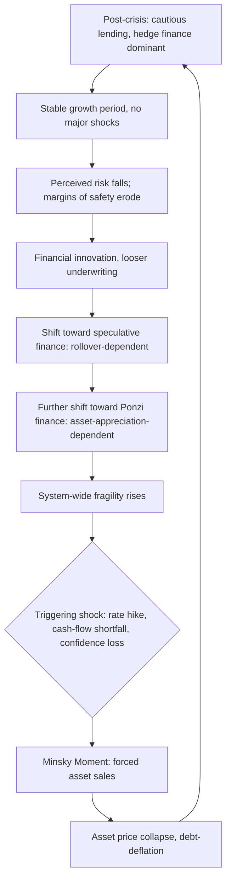

## Minsky's Financial Instability Hypothesis

### Overview

The financial instability hypothesis (FIH), developed by Hyman Minsky primarily across his 1975 book *John Maynard Keynes* and 1986 book *Stabilizing an Unstable Economy*, argues that capitalist economies with sophisticated financial systems are **inherently prone to cycles of instability** — not because of external shocks alone, but because prolonged periods of economic stability systematically encourage financial arrangements that make the system increasingly fragile. This is often summarized as the **"stability is destabilizing"** paradox.

### Core Thesis

Minsky's central claim departs from equilibrium-based macroeconomics: financial fragility is an **endogenous** product of normal economic functioning during good times, not an exogenous disturbance. As an economy experiences a period of stable growth, both borrowers and lenders progressively revise their views of acceptable risk upward, financing structures shift toward more leverage, and the system moves from a robust configuration to a fragile one — even absent any change in underlying fundamentals.

**Key Points**

- The hypothesis is explicitly a theory of the **business cycle's financial dimension**, intended to explain why capitalist economies periodically experience debt-deflation crises (drawing on Irving Fisher's 1933 debt-deflation theory).
- It is grounded in a **Keynesian** view of investment decisions under fundamental uncertainty, contra the rational-expectations/efficient-markets tradition — Minsky considered himself extending Keynes's *General Theory*, particularly its treatment of investment and finance in Chapter 12 and Chapter 17.

### The Three Financing Postures

Minsky classifies economic units (households, firms, financial institutions) by the relationship between their cash flow commitments and their cash flow receipts:

**Hedge Finance**

- Expected income cash flows are sufficient to cover both principal and interest payments on outstanding debt in every period.
- The unit does not need to refinance (roll over) debt or sell assets to meet obligations.
- Lowest risk profile; the balance sheet can withstand adverse shocks.

**Speculative Finance**

- Expected income covers interest payments but **not** principal repayment in near-term periods.
- The unit must **roll over (refinance)** maturing debt to remain solvent — it is exposed to **rollover risk**: if credit conditions tighten or lenders lose confidence, the unit cannot refinance and faces distress even without any change to the earning power of its underlying assets.
- Classic example: a bank engaged in maturity transformation, or a firm issuing short-term commercial paper to fund longer-term capital projects.

**Ponzi Finance**

- Expected income covers **neither** principal nor full interest payments.
- The unit must borrow additional funds or sell assets merely to meet current interest obligations, causing outstanding debt (or the debt-to-asset ratio) to grow over time.
- Solvency depends entirely on continued appreciation of the underlying asset's value or continued access to fresh credit — the arrangement is unsustainable once asset price growth stalls or credit access tightens.
- [Inference] Minsky's use of "Ponzi" describes a financing *structure* with these cash-flow characteristics; it does not necessarily imply fraud, in contrast to a Ponzi scheme in the criminal-law sense, though the mathematics of unsustainability are analogous.

$$\text{Hedge: } CF_t \geq I_t + P_t \quad\quad \text{Speculative: } I_t \leq CF_t < I_t + P_t \quad\quad \text{Ponzi: } CF_t < I_t$$

where $CF_t$ is expected cash flow in period $t$, $I_t$ is interest due, and $P_t$ is principal due.

### The Dynamic Mechanism: How Stability Breeds Fragility

Minsky's core dynamic proceeds through the following logic:

1. Following a crisis or recession, surviving borrowers and lenders are risk-averse; the economy is dominated by hedge finance; balance sheets are conservative (Minsky calls this a state where the financial system is "robust").
2. As the economy grows without a major disruption, realized outcomes consistently meet or beat expectations, and perceived risk falls — both borrowers' and lenders' "margins of safety" narrow.
3. Profit-seeking financial institutions, competing for market share, innovate new instruments and loosen underwriting standards to accommodate rising demand for credit (endogenous financial innovation).
4. The economy's financing structure gradually shifts: hedge units convert to speculative postures, and speculative units convert to Ponzi postures, as everyone bets on continued favorable conditions (e.g., continued asset price appreciation, continued availability of refinancing).
5. Aggregate demand and investment become increasingly dependent on ever-expanding credit; the system becomes "fragile" — a change in interest rates, cash flows, or credit availability that would have been easily absorbed at stage 1 can now trigger a chain of forced asset sales, refinancing failures, and defaults.
6. A triggering event (often a monetary policy tightening intended to curb speculation or inflation) exposes the fragility, causing a **"Minsky moment"** — a sudden collapse in asset prices as speculative and Ponzi units are forced to sell assets simultaneously, which itself depresses the very prices they need to remain solvent.

**Key Points**

- The term "Minsky moment" was coined by economist Paul McCulley (PIMCO) in 1998, referencing the Russian debt crisis; it entered mainstream use extensively during the 2007–2008 financial crisis to describe the sudden reversal in credit market sentiment.
- This progression from hedge → speculative → Ponzi finance at the *aggregate* (system-wide) level, not merely at the level of individual units, is what Minsky terms the movement from a **robust** to a **fragile** financial structure.

### Diagram: The Minsky Cycle

### Relationship to Debt-Deflation Theory

Minsky's framework explicitly builds on **Irving Fisher's debt-deflation theory (1933)**, which described how, once a debt-financed boom reverses, distressed selling to meet obligations depresses asset prices, which raises the *real* burden of remaining nominal debt, prompting further distress selling — a self-reinforcing deflationary spiral. Minsky's contribution is to explain **why** an economy arrives at the debt levels and financing fragility that make such a spiral possible in the first place, whereas Fisher largely took the pre-existing debt overhang as given.

### Policy Implications

Minsky drew several policy conclusions from the FIH, which bear directly on the case for a lender of last resort:

- **"Big Government" and "Big Bank" as stabilizers**: Minsky argued that a sufficiently large government sector (countercyclical fiscal deficits that sustain profits and cash flows during downturns) and a central bank willing to act as lender of last resort are structural necessities for containing the endogenous instability of capitalist finance — not merely optional interventions.
- **Financial regulation should be dynamic, not static**: because financial innovation continuously erodes the effectiveness of existing regulatory constraints (a process Minsky links to the "usual" evolution from robust to fragile structures), regulators must continually adapt oversight rather than assume a fixed regulatory regime remains adequate.
- **Lender-of-last-resort intervention validates existing debt structures**: by preventing a collapse in asset prices, LOLR action prevents speculative and Ponzi units from becoming insolvent purely due to a liquidity-driven price collapse — but Minsky noted this also creates a **moral hazard problem**, as successful bailouts can reinforce risk-taking in the subsequent cycle, a dynamic sometimes labeled the "Minsky paradox of intervention."

**Example**

Applying the three-tier taxonomy to the U.S. housing sector in the mid-2000s:

- A homeowner with a traditional fixed-rate, fully amortizing mortgage and stable income represents **hedge finance**.
- A homeowner with an interest-only adjustable-rate mortgage, planning to refinance before the rate reset, represents **speculative finance** — solvency depends on continued credit availability.
- A homeowner with a negative-amortization loan (where the balance grows over time) who is relying entirely on continued home price appreciation to eventually refinance or sell profitably represents **Ponzi finance** — a stall or reversal in house price appreciation makes default effectively unavoidable.

### Empirical and Theoretical Reception

[Inference/contested] The FIH was largely outside the mainstream of academic macroeconomics for decades, given its rejection of rational expectations and equilibrium methodology, but gained substantial renewed attention after 2007–2008, when its qualitative narrative (credit-fueled boom, deteriorating underwriting standards, sudden reversal) closely matched observed events. Economists such as Paul Krugman, and institutions including the Federal Reserve Bank of New York (whose senior economists have written formal papers modeling Minsky-style dynamics, e.g., work by Adrian and Shin on financial intermediary leverage cycles), have engaged with and partially formalized elements of the hypothesis. [Unverified] The degree to which formal DSGE-style models fully capture the *endogenous* nature of Minsky's fragility-building process (as opposed to treating leverage cycles as exogenously parameterized) remains a live methodological debate among macroeconomists.

**Conclusion**

Minsky's financial instability hypothesis reframes financial crises as an endogenous outcome of normal capitalist dynamics rather than the product of external shocks or irrational behavior alone: extended stability incentivizes a system-wide drift from hedge to speculative to Ponzi financing structures, ultimately producing the very fragility that a subsequent shock exposes. This provides the direct theoretical justification, taken up elsewhere in this chapter, for why a credible lender of last resort — and dynamic financial regulation more broadly — is treated as a structural necessity rather than a discretionary policy option in economies with developed credit markets.

**Related Topics**

- Fisher's debt-deflation theory and its formal relationship to the FIH
- The "Minsky moment" concept and its use in describing 2007–2008
- Endogenous money and credit creation in post-Keynesian economics
- Leverage cycles and financial intermediary balance-sheet models (Adrian–Shin, Geanakoplos)
- Moral hazard and the "too big to fail" problem in lender-of-last-resort policy
- Macroprudential regulation as a response to system-wide (rather than institution-specific) fragility
- Historical patterns of financial crises and panics (preceding topic in this chapter)
- Bagehot's Doctrine and classical rules for LOLR lending