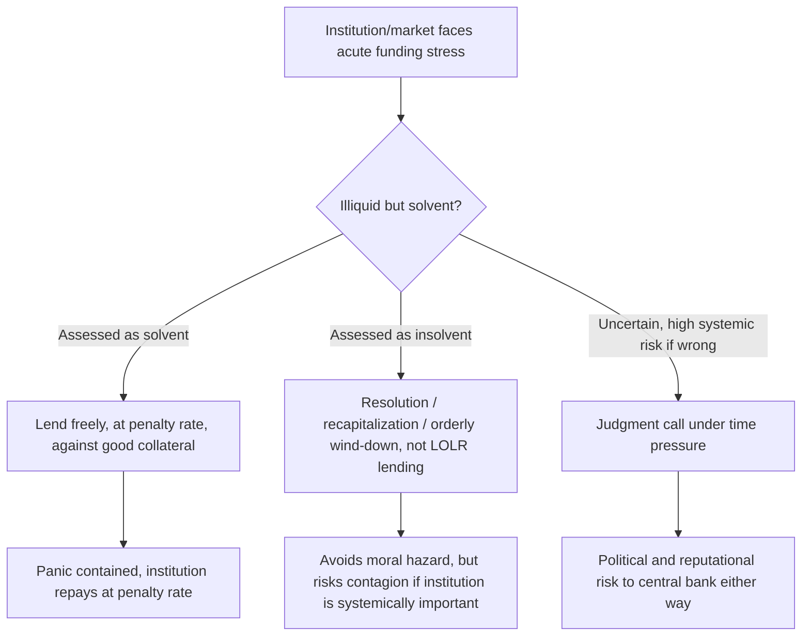

## Lender of Last Resort Doctrine

### Overview

The lender of last resort (LOLR) doctrine describes the principles governing when and how a central bank (or, historically, other institutions) should provide emergency liquidity to the financial system during a panic, in order to prevent an illiquidity problem among solvent institutions from becoming a systemic solvency crisis. The doctrine's classical formulation originates with **Walter Bagehot**, and its core function is to interrupt the panic phase of the crisis dynamics described elsewhere in this chapter (the Kindleberger-Minsky sequence) before contagion and forced fire sales turn a liquidity shortage into widespread insolvency.

### Historical Origins

The theoretical foundations predate Bagehot: **Henry Thornton**, in *An Enquiry into the Nature and Effects of the Paper Credit of Great Britain* (1802), was the first to systematically argue that a central bank should supply liquidity to the market during a crisis rather than protect its own reserves, distinguishing the central bank's public responsibility from an ordinary commercial bank's private interest.

**Walter Bagehot**, in *Lombard Street: A Description of the Money Market* (1873), building on Thornton and on the Bank of England's practical experience (including its failure to act adequately during the Overend Gurney crisis of 1866), articulated the doctrine in its most cited form, sometimes called **Bagehot's Dictum** or **Bagehot's Rule**.

### Bagehot's Rule: The Classical Formulation

Bagehot's prescription is conventionally distilled into several interlocking principles:

1. **Lend freely** — In a panic, the central bank should not ration credit; it should supply as much liquidity as the market demands to calm the panic, since underreacting risks allowing the panic to spread.
2. **At a high (penalty) rate** — Lending should occur at an interest rate above the pre-crisis market rate. This serves two purposes: it discourages institutions that do not genuinely need emergency liquidity from borrowing opportunistically, and it encourages prompt repayment once normal market conditions return.
3. **Against good collateral, valued at pre-crisis ("normal") prices** — The central bank should lend only against collateral that would have been considered sound under normal market conditions, valued as it would have been before the panic depressed prices (not at fire-sale/distressed market prices). This is intended to ensure the central bank is lending to solvent but illiquid institutions, rather than propping up fundamentally insolvent ones.
4. **Announced in advance** — Bagehot argued the central bank should make clear, ex ante, that it will act as lender of last resort under these terms, so that the mere expectation of support can itself dampen panic (an early articulation of what modern economists would call a **credible commitment** or **constructive ambiguity** trade-off, discussed below).

$$\text{Bagehot's Rule: Lend freely} + \text{penalty rate } r_{\text{penalty}} > r_{\text{market}} + \text{good collateral at pre-crisis valuation}$$

**Key Points**

- The purpose of the penalty rate is explicitly **not** revenue generation for the central bank; it is a screening mechanism to limit lending to genuine liquidity needs and preserve incentives for private-market lending to resume once conditions normalize.
- Bagehot's framework presumes a clear conceptual distinction between **illiquidity** (a fundamentally sound institution unable to meet short-term obligations due to a temporary funding disruption) and **insolvency** (a institution whose liabilities exceed the true value of its assets) — a distinction that is analytically clean but, [Inference] as discussed below, often extremely difficult to apply in real time during an actual crisis.

### The Illiquidity–Insolvency Distinction and Its Practical Difficulty

The theoretical justification for LOLR lending rests on the idea that panics can render **solvent** institutions **illiquid** through the Diamond–Dybvig-style coordination failure (self-fulfilling withdrawal demand exceeding what can be met from readily available assets, even though the institution's assets exceed its liabilities in present-value terms). LOLR lending is meant to bridge this liquidity gap, not to rescue insolvent institutions.

In practice, however:

- **Asset values are themselves endogenous to the panic**: during a systemic crisis, the "pre-crisis price" of collateral may be unobservable or contested, since the panic itself may reflect a genuine (if partial) repricing of previously mispriced risk, not merely an irrational liquidity event.
- **Speed of decision-making**: central banks must often decide whether to lend within hours or days, without full information about an institution's true balance-sheet health — leading to real-world reliance on rapid, imperfect solvency assessments.
- [Inference] This ambiguity is central to why LOLR decisions in actual crises (e.g., the differential treatment of Bear Stearns versus Lehman Brothers in 2008) generate significant ex post debate about whether the correct institutions were assisted or allowed to fail.

### The Moral Hazard Problem

A standing tension within the LOLR doctrine concerns **moral hazard**: if financial institutions anticipate that a central bank will rescue them (or the system) during a crisis, this expectation can encourage more risk-taking during the boom phase, since some downside risk is effectively socialized. This links directly to the Minsky "paradox of intervention" discussed in the FIH topic — successful crisis intervention can seed the excess of the next credit cycle.

Proposed mitigations debated in the literature include:

- **Penalty rates** (Bagehot's own solution) to limit moral hazard by making LOLR borrowing costly relative to normal funding.
- **Constructive ambiguity**: deliberately refraining from fully specifying in advance which institutions will be rescued and on what terms, to preserve some market discipline — this stands in tension with Bagehot's "announce in advance" principle, and is a genuinely contested point among LOLR theorists. [Inference] Critics of constructive ambiguity argue that in practice it fails to prevent moral hazard (since large institutions still anticipate rescue) while adding unnecessary uncertainty that can worsen panics; proponents argue full pre-commitment removes market discipline entirely.
- **Ex post cost recovery** mechanisms (special levies on the financial industry, as used partially in the U.S. TARP program) to offset the perception that rescues are costless to the industry.

### Evolution Beyond Bagehot: 20th and 21st Century Extensions

Modern practice has extended the classical doctrine in several ways that go beyond Bagehot's original 19th-century context:

- **Lending to non-bank institutions**: Bagehot's framework was designed around commercial banks. The 2007–2008 crisis prompted central banks (notably the Federal Reserve, under emergency authority such as Section 13(3) of the Federal Reserve Act) to extend liquidity facilities to investment banks, money market funds, and other non-bank intermediaries — reflecting the "shadow banking" run dynamics distinct from classical deposit-taking institutions.
- **Systemic (market-wide) versus institution-specific LOLR action**: Some modern theorists (e.g., work associated with the Bank of England and academic economists like Charles Goodhart) distinguish between LOLR support to an individual troubled institution and **market-wide liquidity operations** designed to support functioning of an entire market segment (e.g., the commercial paper market or repo market) without targeting any single firm — the latter arguably sits closer to ordinary open-market operations than to classical LOLR lending.
- **Collateral flexibility during crises**: In practice, central banks (again notably the Fed in 2008–2009, through facilities such as the Term Asset-Backed Securities Loan Facility, TALF, and the Primary Dealer Credit Facility, PDCF) have accepted a much broader range of collateral, and at valuations reflecting significant crisis-era stress, than Bagehot's "good collateral at pre-crisis prices" formulation would strictly imply — a pragmatic departure justified on the grounds that in a sufficiently severe and broad crisis, insisting on narrowly "good" collateral could itself fail to arrest the panic.
- **International Lender of Last Resort**: In economies without their own reserve currency, or facing an external liquidity crisis, the domestic central bank cannot act as an unconstrained LOLR (since it cannot costlessly create foreign currency). This gap motivates the role of the **IMF** and central bank **swap lines** (e.g., the Fed's dollar swap lines with other major central banks, expanded significantly in 2008 and again during the COVID-19 shock in 2020) as forms of international LOLR provision.

### Diagram: LOLR Decision Logic

### Practical Example: 2007–2008 Applications and Departures from Bagehot

- The Federal Reserve's **discount window** expansion and creation of the **Term Auction Facility (TAF)** in December 2007 broadly followed the "lend freely" principle, while attempting to reduce the stigma historically associated with discount window borrowing (a practical problem Bagehot did not need to address, since discount window stigma is a modern institutional artifact).
- The **Bear Stearns** rescue (March 2008), structured via JPMorgan Chase with Fed backing of certain assets, is frequently analyzed as a departure from strict Bagehot principles — the Fed effectively took on credit risk on specific (non-"good," distressed-priced) assets rather than lending purely against high-quality collateral at a penalty rate.
- The decision **not** to rescue **Lehman Brothers** (September 2008) is widely, though not universally, treated as a case where the illiquidity/insolvency distinction was judged (rightly or wrongly, and this remains debated) to fall on the insolvency side, or where legal/collateral constraints under the Federal Reserve Act were held to preclude adequate collateralized lending. [Unverified/contested] The relative roles of legal constraint versus policy judgment in the Lehman decision remain disputed among the participants themselves (e.g., differing subsequent accounts from Bernanke, Geithner, and Paulson).

**Conclusion**

The lender of last resort doctrine, from Thornton and Bagehot's 19th-century formulation through its 21st-century extensions to non-bank institutions and international liquidity provision, represents the primary institutional response to the panic-and-contagion dynamics documented across historical crises and theorized in Minsky's financial instability hypothesis. Its central and unresolved tension — between decisively arresting a panic and limiting the moral hazard that crisis intervention itself creates — remains a live design question in central banking practice rather than a solved problem, and shapes ongoing debates over financial regulation, resolution regimes, and the appropriate scope of emergency central bank authority.

**Related Topics**

- Bagehot's Dictum in modern central bank operating frameworks (comparison across the Fed, ECB, Bank of England)
- Constructive ambiguity versus pre-committed LOLR rules — theoretical and empirical debates
- Deposit insurance as a complement to (or substitute for) LOLR lending
- Resolution regimes and "living wills" for systemically important financial institutions (post-Dodd-Frank)
- Central bank swap lines and international lender of last resort functions
- The Bear Stearns, Lehman Brothers, and AIG decisions of 2008 as comparative case studies
- Section 13(3) of the Federal Reserve Act and its post-2008 legal reforms
- Shadow banking runs and their distinct LOLR challenges relative to classical deposit-based banking