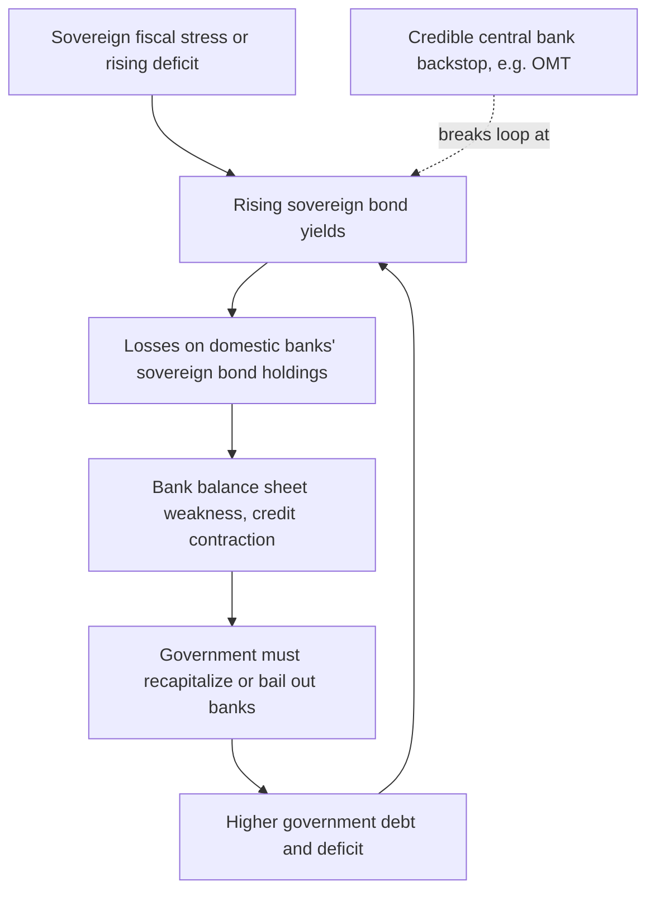

## Sovereign Debt Crises and Monetary Policy

### Overview

Sovereign debt crises arise when a government's ability to service its outstanding debt obligations comes into serious question — whether due to unsustainable debt dynamics, a loss of market access, or a self-fulfilling confidence collapse. Monetary policy interacts with sovereign debt crises through multiple, often conflicting, channels: a central bank's actions (or constraints) can either enable a crisis, ameliorate one, or in extreme cases become the *source* of the crisis itself, particularly in currency unions or economies with foreign-currency-denominated debt. This topic connects the LOLR doctrine to the specific and more contested question of central bank support for a sovereign, rather than for banks.

### Anatomy of Sovereign Debt Sustainability

The standard debt sustainability framework expresses the change in the debt-to-GDP ratio as:

$$\Delta b_t = (r - g) b_{t-1} - pb_t$$

where $b_t$ is the debt-to-GDP ratio, $r$ is the effective real interest rate on government debt, $g$ is the real GDP growth rate, and $pb_t$ is the primary balance (surplus positive) as a share of GDP. This identity yields the central insight of sovereign debt sustainability analysis:

- If $r > g$ ("unfavorable interest-growth differential"), the debt ratio tends to rise automatically unless offset by sufficiently large primary surpluses.
- If $r < g$, existing debt tends to shrink as a share of GDP even without primary surpluses — a condition many advanced economies benefited from during much of the low-rate 2010s.

**Key Points**

- Monetary policy directly affects $r$ (through its influence on the general level of interest rates and, for a country borrowing in its own currency, through the risk-free component of sovereign yields).
- A sustained rise in $r - g$, whether from monetary tightening, a growth slowdown, or a rising sovereign risk premium, mechanically worsens debt dynamics even absent any fiscal policy change — a channel of particular relevance when central banks raise rates to combat inflation while heavily indebted governments are simultaneously present.

### Self-Fulfilling Debt Crises and Multiple Equilibria

A key theoretical contribution (formalized notably by Cole and Kehoe, 2000, and applied to the Eurozone context by Paul De Grauwe) is that sovereign debt crises, like bank runs, can exhibit **multiple equilibria**:

- **"Good" equilibrium**: Investors believe the sovereign will repay; they demand a low risk premium; low borrowing costs keep $r$ low, which helps ensure debt actually remains sustainable — a self-confirming, low-yield outcome.
- **"Bad" equilibrium**: Investors fear default; they demand a high risk premium; the resulting high $r$ pushes $r - g$ up, worsening actual debt sustainability and validating the initial fear — a self-fulfilling, high-yield "doom loop."

This is structurally analogous to the Diamond–Dybvig bank-run logic discussed under LOLR doctrine: a sufficiently large shift in market expectations can push a fundamentally solvent sovereign borrower into a crisis purely through the endogenous effect of the crisis itself on borrowing costs.

**Key Points**

- De Grauwe's influential argument regarding the Eurozone crisis was that member states borrowing in euros (a currency they do not control) are structurally similar to emerging markets borrowing in foreign currency — they cannot unilaterally guarantee that a central bank will backstop their debt, making them uniquely vulnerable to this self-fulfilling dynamic relative to countries that borrow in a currency they issue.
- [Inference] This framework is influential but not without critics; some economists emphasize that "bad equilibria" in practice tend to be triggered or amplified by genuine fiscal or structural fundamentals (e.g., Greece's actual fiscal deficit revisions in 2009) rather than being purely self-fulfilling, making the pure multiple-equilibria story an idealization rather than a complete empirical account.

### Why a Central Bank Backstop Matters: The "Own-Currency" Distinction

A sovereign that borrows in a currency **it can itself create** (e.g., the U.S. federal government issuing dollar-denominated Treasury securities, with the Federal Reserve able to act as a backstop purchaser) faces a fundamentally different risk profile than one that does not:

- **Own-currency sovereign**: The central bank can, in principle, always purchase government debt to prevent a self-fulfilling liquidity crisis (an implicit or explicit LOLR function extended to the sovereign itself), eliminating the "bad equilibrium" described above — though this capacity does not eliminate the risk of high **inflation** if used to excess, which is a distinct (and in some framings, the *only*真) genuine constraint on such a government.
- **Foreign-currency or currency-union sovereign**: A government issuing debt in a currency it cannot create (a Eurozone member issuing euro debt with no unilateral claim on ECB support; an emerging market issuing dollar-denominated debt) cannot rely on its own central bank as an unconditional backstop, leaving it exposed to the self-fulfilling liquidity-crisis dynamic in a way an own-currency issuer, in principle, is not.

[Inference] This is sometimes summarized in Modern Monetary Theory-adjacent and some mainstream New Keynesian analyses alike (though the two traditions draw different normative conclusions from it) as the distinction between genuine **solvency risk** and pure **liquidity/rollover risk** — the latter being largely a currency-arrangement-dependent phenomenon rather than an unavoidable feature of sovereign borrowing per se. This remains a genuinely debated proposition regarding its policy implications, even where the underlying institutional facts are not in dispute.

### Case Study: The European Sovereign Debt Crisis (2010–2012) and OMT

The Eurozone crisis illustrates the currency-union vulnerability directly:

1. **2009–2010**: Greece's fiscal deficit was revised sharply upward; sovereign spreads across peripheral Eurozone economies (Greece, Ireland, Portugal, and later Spain and Italy) began rising sharply.
2. **The "doom loop"**: Rising sovereign yields damaged the balance sheets of domestic banks holding large quantities of their own government's debt, threatening bank solvency; anticipated or actual bank bailouts in turn worsened the sovereign's own fiscal position — a mutually reinforcing bank-sovereign feedback loop distinct from, but related to, the pure sovereign self-fulfilling dynamic above.
3. **ECB's "Outright Monetary Transactions" (OMT), announced September 2012**: Following ECB President Mario Draghi's July 2012 statement that the ECB would do "whatever it takes" to preserve the euro, the OMT program committed the ECB to potentially unlimited purchases of a distressed member state's sovereign bonds in secondary markets, conditional on the country accepting an associated fiscal/reform program under the European Stability Mechanism.
4. **Effect**: Sovereign spreads for peripheral Eurozone economies fell sharply following the OMT announcement, [Inference] widely interpreted in the subsequent academic and policy literature as strong evidence for the self-fulfilling, multiple-equilibria view — the announcement of a credible backstop resolved the crisis with minimal actual bond purchases under the program, consistent with a shift from the "bad" to the "good" equilibrium rather than fundamentals alone having changed.

**Key Points**

- OMT functioned, in effect, as an LOLR facility extended to sovereigns rather than banks — directly paralleling Bagehot's "lend freely" principle, but applied in a context (sovereign debt, currency union) far removed from Bagehot's original 19th-century banking context.
- The conditionality attached to OMT (requiring an ESM program) reflects the moral hazard concern familiar from bank LOLR lending: unconditional sovereign backstops risk removing fiscal discipline incentives, analogous to how unconditional bank bailouts risk encouraging future excessive risk-taking.

### Diagram: The Bank-Sovereign Doom Loop

### Monetary Policy Trade-offs During Sovereign Stress

Central banks facing a sovereign debt crisis confront a genuine trade-off:

- **Supporting sovereign debt markets** (via purchases or backstop commitments) can prevent a self-fulfilling crisis and preserve financial stability, but risks blurring the line between monetary policy and fiscal financing (**"fiscal dominance"** concerns) and can weaken incentives for fiscal discipline.
- **Withholding support** preserves central bank independence and market discipline on fiscal policy, but risks allowing a liquidity crisis to become a genuine, unnecessary default with large real economic costs (bank failures, credit contraction, potential exit from a currency union).
- [Inference] Where exactly a central bank should draw this line — and whether purchases under a program like OMT constitute "monetary policy" (managing financial stability/monetary transmission) versus impermissible "monetary financing" of government deficits (prohibited under, e.g., Article 123 of the EU Treaty) — was itself litigated, including before the European Court of Justice and Germany's Federal Constitutional Court, indicating this is a genuinely contested legal and economic boundary rather than a settled technical matter.

### Sovereign Debt Crises Outside Currency Unions: Emerging Market Foreign-Currency Debt

A related but distinct pattern affects emerging markets that borrow in foreign currency (commonly U.S. dollars) — the "**original sin**" problem (Eichengreen and Hausmann):

- Domestic monetary policy cannot directly backstop foreign-currency debt, since the domestic central bank cannot create dollars.
- A domestic currency depreciation (which might otherwise help an economy adjust to an external shock) instead *raises* the domestic-currency value of foreign-currency debt service, potentially triggering exactly the kind of debt-servicing crisis monetary easing would normally be expected to help avoid — a perverse channel absent for own-currency borrowers.
- This dynamic was central to the 1994 Mexican peso crisis, the 1997–98 Asian financial crisis, and recurring Latin American sovereign crises (e.g., Argentina 2001, 2018–2020).

**Example**

Comparing three stylized sovereigns facing a market confidence shock:

- **United States** (own-currency issuer, deep and liquid Treasury market, Fed able to act as backstop purchaser): a confidence shock is more likely to manifest as a modest yield increase than a self-fulfilling liquidity crisis, [Inference] though this does not eliminate longer-run inflation or fiscal sustainability concerns tied to persistent large deficits.
- **Italy (Eurozone member)**: cannot unilaterally direct the ECB to backstop its debt; the OMT framework provides a conditional backstop, but Italy's position remains structurally more exposed than a national currency issuer, as the 2011–2012 spread widening illustrated.
- **Argentina (foreign-currency, i.e., dollar-denominated, debt)**: monetary policy has essentially no direct tool to backstop dollar debt service; recurring default and restructuring episodes (most recently 2020) reflect this structural constraint combined with domestic macroeconomic imbalances.

**Conclusion**

Sovereign debt crises sit at the intersection of fiscal sustainability arithmetic and the same self-fulfilling confidence dynamics that animate classical bank panics, with the central bank's *capacity and willingness* to act as an LOLR for the sovereign itself — rather than merely for banks — determining whether a liquidity scare can spiral into an unnecessary default. The Eurozone crisis and its resolution via OMT stand as the clearest modern illustration that this backstop function, while contested on fiscal-discipline and legal grounds, can be decisive in practice, while the emerging-market "original sin" problem illustrates the sharply different and more constrained position of sovereigns unable to borrow in their own currency.

**Related Topics**

- Debt sustainability analysis: formal derivation and IMF/World Bank frameworks
- The Eurozone banking union and its relationship to breaking the bank-sovereign doom loop
- Modern Monetary Theory's perspective on own-currency sovereign constraints (contrasted with mainstream views)
- "Original sin" and currency mismatch in emerging market sovereign debt
- Sovereign debt restructuring mechanisms: Collective Action Clauses, Paris Club, and holdout litigation (e.g., Argentina vs. NML Capital)
- Fiscal dominance and central bank independence under sovereign stress
- Draghi's "whatever it takes" speech and its role as a case study in central bank communication and credibility
- Comparative analysis of Fed QE (own-currency) versus ECB OMT (currency-union conditional backstop)