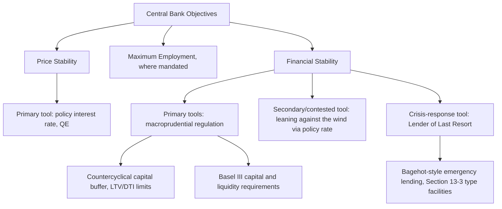

## Financial Stability as a Central Bank Objective

### Overview

Financial stability has increasingly been recognized as a distinct central bank objective, standing alongside — and at times in tension with — the traditional mandates of price stability (low, stable inflation) and, for some central banks, maximum employment. Unlike price stability, financial stability lacks a single, universally agreed quantitative target (there is no direct analogue to a 2% inflation target), which has made its institutionalization within central bank mandates, toolkits, and governance structures considerably more contested and still-evolving.

### Defining Financial Stability

There is no single canonical definition, but most formulations converge on describing financial stability as a condition in which the financial system — institutions, markets, and infrastructure — is capable of:

- Efficiently allocating resources and absorbing shocks, rather than amplifying them
- Facilitating the smooth functioning of payment and settlement systems
- Continuing to perform core intermediation functions (channeling savings to productive investment) even under stress

Conversely, **financial instability** is generally characterized negatively — by the presence of the panic and contagion dynamics discussed elsewhere in this chapter, excessive credit growth and leverage (as in Minsky's framework), asset price misalignments relative to fundamentals, or impaired functioning of critical financial infrastructure.

**Key Points**

- [Inference] The absence of an agreed single metric (unlike inflation, which has a widely accepted measurement convention via CPI or similar indices) is frequently cited in the central banking literature as a core reason financial stability has been harder to operationalize as a formal mandate compared to price stability.
- Financial stability is often framed as concerned with **systemic risk** specifically — risk to the financial system as a whole — rather than the failure of any single institution per se, though the two are obviously related (a sufficiently large or interconnected institutional failure can itself constitute a systemic event).

### Historical Evolution: From Implicit to Explicit Mandate

**Pre-crisis consensus (roughly 1990s–2007)**: Many central banks, particularly under the influence of the "Jackson Hole consensus" associated with figures like Alan Greenspan, operated under a view sometimes summarized as: monetary policy should focus primarily on price stability, and asset price bubbles should generally not be preemptively targeted by raising interest rates — rather, the central bank should focus on **"cleaning up after"** a bubble bursts (via aggressive rate cuts and liquidity provision) rather than **"leaning against"** it in advance. This is often called the **"mop up after, don't lean against"** doctrine.

**Post-2008 reassessment**: The global financial crisis significantly discredited the pure "mop up" approach among many policymakers and academics, on the grounds that:

- The costs of the 2008 crisis (in lost output, employment, and fiscal resources) proved to be extremely large — larger than many pre-crisis models had assumed possible for a financial-sector-originated shock.
- Ultra-low interest rates in the mid-2000s were, by some accounts (though this remains debated), a contributing factor to the credit and housing boom that preceded the crisis, suggesting monetary policy itself is not necessarily neutral with respect to financial stability risk-taking (the **"risk-taking channel"** of monetary policy, associated with research by Borio and Zhu, among others).

This reassessment produced two broad, non-mutually-exclusive policy responses:

1. **"Lean against the wind" monetary policy**: Some economists and policymakers argued central banks should be willing to raise interest rates somewhat above what a pure inflation/output-gap-focused (e.g., Taylor rule) framework would suggest, specifically to restrain excessive credit growth or asset price appreciation, even at some near-term cost to the inflation/output objectives.
2. **Macroprudential policy as the primary tool**: A competing (and, [Inference] on the whole, more widely adopted) view holds that financial stability risks are better addressed through **targeted regulatory tools** aimed directly at the sources of systemic risk (bank capital and liquidity requirements, loan-to-value limits, countercyclical capital buffers) rather than through the blunt instrument of the economy-wide policy interest rate, preserving monetary policy's focus on price and output stability.

**Key Points**

- The "lean versus clean" debate remains genuinely unresolved in the academic and policy literature; [Inference] the post-2008 institutional trend has more heavily favored building out dedicated macroprudential frameworks (see below) rather than routinely using the policy rate for financial stability purposes, though some central banks (e.g., Sweden's Riksbank in the early 2010s) did explicitly cite financial stability concerns, including household debt levels, in policy rate decisions during this period.

### Institutional Responses: New Frameworks and Bodies

Following the crisis, several jurisdictions created new institutional structures explicitly tasked with financial stability oversight, reflecting the judgment that this objective required distinct governance and tools rather than being folded entirely into existing monetary policy committees:

- **United States**: The **Financial Stability Oversight Council (FSOC)**, created under the Dodd-Frank Act (2010), bringing together multiple regulatory agencies to monitor systemic risk and designate **Systemically Important Financial Institutions (SIFIs)** for enhanced supervision.
- **United Kingdom**: The **Financial Policy Committee (FPC)**, established within the Bank of England (operational from 2013), given a statutory objective for macroprudential oversight distinct from the Monetary Policy Committee's inflation-targeting mandate — an explicit institutional separation of the two objectives within the same central bank.
- **European Union**: The **European Systemic Risk Board (ESRB)**, established in 2010, tasked with macroprudential oversight of the EU financial system, working alongside the ECB and national authorities.
- **International coordination**: The **Financial Stability Board (FSB)**, established in 2009 (successor to the earlier Financial Stability Forum), coordinates international regulatory standard-setting (working with the Basel Committee on Banking Supervision) to address cross-border systemic risk.

### The Macroprudential Toolkit

Macroprudential policy tools are generally categorized by their target:

**Time-varying (countercyclical) tools** — aimed at leaning against the credit cycle itself:

- **Countercyclical Capital Buffer (CCyB)**: An additional bank capital requirement that regulators can raise during periods of excessive credit growth and release during downturns, intended to build resilience during booms and support lending capacity during busts.
- **Loan-to-value (LTV) and debt-to-income (DTI) limits**: Restrictions on mortgage or other lending relative to collateral value or borrower income, aimed directly at limiting household leverage buildup.

**Structural tools** — aimed at the permanent resilience of the system regardless of the cycle's stage:

- **Capital and liquidity requirements** under the **Basel III** framework (minimum capital ratios, the Liquidity Coverage Ratio, the Net Stable Funding Ratio), developed substantially in direct response to the 2008 crisis's revelation of insufficient bank capital and liquidity buffers.
- **Systemically important institution surcharges**: Additional capital requirements imposed on the largest, most interconnected institutions ("G-SIBs" under the Basel framework), reflecting the greater systemic externality their failure would impose.
- **Resolution regimes and "living wills"**: Requirements that large institutions maintain credible plans for orderly wind-down without requiring taxpayer bailout, directly addressing the "too big to fail" moral hazard problem connected to LOLR doctrine.

**Key Points**

- Macroprudential tools are explicitly designed to complement, rather than replace, the classical LOLR function: they aim to *reduce the frequency and severity* of crises requiring LOLR intervention in the first place, rather than substituting for emergency liquidity provision once a crisis occurs.

### Diagram: The Modern Central Bank Objective Set

### Tensions and Open Questions

- **Potential conflict with price stability**: A scenario in which financial stability concerns call for higher rates (to restrain credit growth) while inflation is below target (calling for lower rates) illustrates a genuine potential conflict between objectives, which the macroprudential-primary-tool approach is partly designed to avoid by keeping the two policy instruments separate.
- **Central bank independence and scope**: Assigning financial stability responsibilities to the central bank (as opposed to a separate regulator) raises governance questions — macroprudential tools often have direct, visible distributional effects (e.g., LTV limits affecting who can obtain a mortgage), which some observers argue sits uneasily with the technocratic independence traditionally justified primarily with reference to monetary policy's more diffuse effects.
- **Measurement and early-warning challenges**: Unlike inflation, systemic risk is not directly observable in real time; central banks rely on a range of imperfect indicators (credit-to-GDP gaps, asset price deviations from trend, interconnectedness measures such as **CoVaR** or **SRISK**), and [Inference] the track record of these indicators in reliably predicting crises out-of-sample, as opposed to fitting past crises in-sample, remains an active area of research rather than a settled, well-validated forecasting technology.
- **International/cross-border coordination**: Systemic risk can build up through cross-border channels (as the Eurozone crisis and the global reach of the 2008 U.S.-originated crisis both illustrated), creating coordination challenges given that most macroprudential authority remains nationally (or, in the Eurozone case, only partially supranationally) organized.

### Practical Example: The Countercyclical Capital Buffer in Action

Several jurisdictions (UK, Sweden, Hong Kong, among others) have activated the CCyB during periods of perceived excessive credit growth, then released it during subsequent downturns — most notably, several regulators (including the UK's FPC) cut the CCyB to 0% in March 2020 in response to the COVID-19 shock, explicitly to free up bank capital for continued lending during the downturn — illustrating the intended countercyclical mechanism operating in the direction opposite to its earlier activation.

**Conclusion**

Financial stability has moved from a largely implicit, crisis-response-only central bank concern (embodied historically in the LOLR function alone) to an explicit, institutionally distinct objective supported by a dedicated macroprudential toolkit developed substantially in response to the 2008 crisis. Its integration alongside price stability and (where applicable) employment mandates remains institutionally and analytically less settled than those older objectives, reflecting genuine open questions about measurement, appropriate tools, and the potential for conflict with conventional monetary policy — questions this chapter's treatment of the LOLR doctrine and historical crisis patterns is intended to help contextualize.

**Related Topics**

- Macroprudential policy design: rules-based versus discretionary approaches
- The "lean versus clean" debate in monetary policy and financial stability
- Basel III capital and liquidity requirements in detail
- Systemic risk measurement: CoVaR, SRISK, and network/interconnectedness models
- Central bank independence and mandate design in a multi-objective framework
- Comparative institutional design: FSOC (US) versus FPC (UK) versus ESRB (EU)
- The risk-taking channel of monetary policy (Borio–Zhu framework)
- Resolution regimes and the "too big to fail" problem post-Dodd-Frank