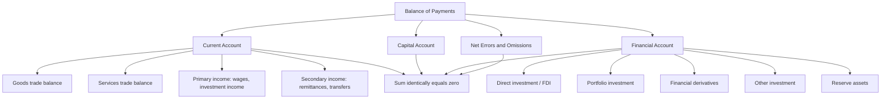

## Balance of Payments Accounting

### Overview

The balance of payments (BOP) is a systematic double-entry accounting record of all economic transactions between residents of a country and the rest of the world over a given period. As a double-entry system, the BOP always balances by construction (total credits equal total debits), which is an accounting identity rather than an economic equilibrium condition — a point that is frequently a source of confusion and worth establishing clearly at the outset.

### The Double-Entry Principle

Every international transaction generates **two offsetting entries** in the BOP, following standard double-entry bookkeeping logic:

- A **credit (+)** entry records transactions that bring value into the country or represent a reduction in the country's foreign assets / increase in its foreign liabilities (e.g., exports, incoming investment).
- A **debit (−)** entry records transactions that send value out of the country or represent an increase in foreign assets / decrease in foreign liabilities (e.g., imports, outgoing investment).

**Example**: A U.S. firm exports $1 million of goods to Germany, paid via a wire transfer into the exporter's U.S. bank account from a German bank.

- Credit: +$1 million (goods export, recorded in the current account)
- Debit: −$1 million (increase in U.S. banking sector's liabilities to German residents, i.e., an inflow of foreign-owned deposits, recorded in the financial account)

Because every transaction is recorded twice with offsetting signs, the BOP **must sum to zero** in principle:

$$\text{Current Account} + \text{Capital Account} + \text{Financial Account} + \text{Net Errors and Omissions} = 0$$

**Key Points**

- The identity holding "by construction" means observing, for instance, "the current account is in deficit" is not itself evidence of instability or disequilibrium in the way a household running a persistent budget shortfall might be — it necessarily corresponds to an equal and offsetting financial account surplus (net capital inflow), and interpreting the economic significance of that pattern requires additional analysis beyond the accounting identity itself.

### The Three Main Accounts

**1. Current Account**

Records trade in goods and services, primary income, and secondary income (transfers):

- **Goods**: Merchandise exports and imports (the traditional "trade balance").
- **Services**: Trade in services — tourism, transportation, financial services, intellectual property licensing, and similar.
- **Primary income**: Cross-border income from factors of production — wages paid to foreign workers, and critically, **investment income** (dividends, interest, reinvested earnings) earned on cross-border ownership of financial assets. This is distinct from the flow of the investment itself (which appears in the financial account).
- **Secondary income**: Current transfers with no corresponding economic value received in return — workers' remittances, foreign aid grants, pension payments to residents abroad.

$$\text{Current Account} = (X - M) + \text{Net Primary Income} + \text{Net Secondary Income}$$

where $X$ is exports and $M$ is imports of goods and services (together forming the trade balance).

**2. Capital Account**

A generally much smaller account recording:

- Capital transfers (e.g., debt forgiveness, migrants' transfers of assets when changing residence)
- Acquisition/disposal of non-produced, non-financial assets (e.g., rights to natural resources, patents, in specific cross-border transfer circumstances)

**Key Points**

- The capital account, in the technical BOP sense used here (following IMF Balance of Payments Manual conventions), is **not** the same thing as what is colloquially or loosely sometimes called the "capital account" in popular discussion of capital flows — that broader concept of cross-border investment flows corresponds to the **financial account** below. [Inference] This terminological overlap is a common source of confusion for students moving between IMF/technical usage and looser journalistic usage.

**3. Financial Account**

Records net changes in ownership of financial assets and liabilities between residents and non-residents, categorized by the type of investment:

- **Direct investment**: Cross-border investment intended to establish a lasting interest and significant influence in an enterprise (conventionally, ownership of 10% or more of voting equity) — Foreign Direct Investment (FDI).
- **Portfolio investment**: Cross-border purchases of equity and debt securities not meeting the direct investment threshold — bonds, equities held for financial return without controlling influence.
- **Financial derivatives**: Net flows related to derivative contracts (options, swaps, futures) with cross-border counterparties.
- **Other investment**: A residual category including trade credit, loans, currency and deposits, and other transactions not captured above — this is where the bulk of ordinary cross-border bank deposit flows (as in the export example above) typically appear.
- **Reserve assets**: Changes in a country's official foreign exchange reserves held by the monetary authority — a distinct sub-category with particular significance for exchange rate policy (see below).

**Sign convention note**: Under the BOP Manual 6 (BPM6) convention used by the IMF since 2009, financial account transactions are recorded such that a net *acquisition* of foreign assets by residents (capital outflow) is a positive entry in the financial account, and a net *increase in liabilities to* foreigners (capital inflow) is also recorded with a sign convention designed so that, together with the current and capital accounts, the total nets to zero. [Inference] Because sign conventions for the financial account specifically changed with the BPM6 revision (differing from the earlier BPM5 standard), students consulting older textbooks or historical data series should verify which convention a given source uses before interpreting the sign of financial account balances.

### The Net Errors and Omissions Term

Because current, capital, and financial account data are compiled from different, imperfect source datasets (customs records, survey data, banking system reports) rather than literally observing both sides of every transaction simultaneously, in practice the reported components rarely sum to exactly zero. The **net errors and omissions** line is a plug figure inserted to enforce the accounting identity, and its magnitude serves as a rough (though imperfect) indicator of underlying data quality issues, including, in some country contexts, unrecorded capital flight or informal cross-border transactions.

### Key Identity: Current Account and Net Foreign Asset Position

The current account balance corresponds to the change in a country's **net international investment position (NIIP)** — its net stock of foreign assets minus foreign liabilities — before valuation effects:

$$\Delta \text{NIIP}_t \approx \text{Current Account}_t + \text{Valuation Changes}_t$$

A sustained current account deficit implies the country is, on net, accumulating foreign liabilities (or running down foreign assets) — financing current consumption or investment in excess of domestic saving through foreign borrowing or asset sales, which is the financial-account counterpart of the current account deficit.

**Key Points**

- This links directly to the national accounting identity $CA = S - I$ (current account equals national saving minus domestic investment), a standard building block for open-economy macroeconomic analysis covered further in subsequent international monetary economics topics (e.g., the intertemporal approach to the current account).

### Diagram: Structure of the Balance of Payments

### Reserve Assets and Exchange Rate Regimes

The **reserve assets** sub-component of the financial account carries special significance depending on a country's exchange rate regime:

- Under a **fixed or managed exchange rate**, the central bank actively buys or sells foreign reserves to maintain the target exchange rate; the resulting change in reserve assets is a residual, policy-driven financial account item that offsets private-sector current and financial account flows to keep the overall BOP balanced at the target rate.
- Under a **freely floating exchange rate**, in principle the central bank does not intervene, so reserve asset changes should be minimal or zero, with the exchange rate itself adjusting to clear the BOP (i.e., private financial account flows adjust to match the current account balance without official intervention).
- The **"balance of payments"** in a narrower, policy-relevant sense sometimes refers specifically to the sum of the current and (non-reserve) financial account — i.e., the overall flow that reserve changes must offset under a fixed or managed regime — distinct from the "everything sums to zero" identity sense used above.

### Practical Example: Interpreting a Country's BOP Data

Consider a stylized emerging market reporting:

- Current account: −$20 billion (deficit — importing more goods/services and/or paying more investment income abroad than it receives)
- Capital account: +$1 billion
- Financial account: −$18 billion (using BPM6 convention, indicating net capital inflows — foreigners increasing their net claims on the country, i.e., the country is a net foreign-liability-accumulator to fund the current account gap)
- Net errors and omissions: +$1 billion

$$(-20) + (1) + (-18) + (1) = -36 \neq 0 \text{ [illustrative sign-convention-dependent example; verify against source convention]}$$

[Inference] Note that the precise arithmetic sign relationships depend sensitively on which BOP convention (BPM5 vs. BPM6) and which specific presentation (e.g., IMF Balance of Payments Statistics vs. a national central bank's own presentation) is being used; students should always check the specific sign convention of any dataset before performing this kind of identity check, rather than assuming a universal convention.

**Conclusion**

Balance of payments accounting provides the systematic double-entry framework recording all cross-border economic transactions, structured into current, capital, and financial accounts that sum identically to zero by construction. Understanding this framework — particularly the distinction between the accounting identity (which always holds) and the economic interpretation of imbalances within it (current account deficits/surpluses, reserve accumulation, net foreign asset positions) — is foundational for the subsequent analysis of exchange rate determination, external adjustment, and international monetary policy transmission covered elsewhere in this chapter.

**Related Topics**

- The intertemporal approach to the current account ($CA = S - I$ identity and its implications)
- Net international investment position (NIIP) and valuation effects
- Exchange rate regimes and the role of reserve accumulation
- The "impossible trinity" (trilemma) of open-economy monetary policy
- Twin deficits hypothesis: fiscal and current account balance linkages
- Sudden stops and capital flow reversals in emerging markets
- IMF Balance of Payments Manual (BPM6) methodology in detail
- Global imbalances and the "Bretton Woods II" debate