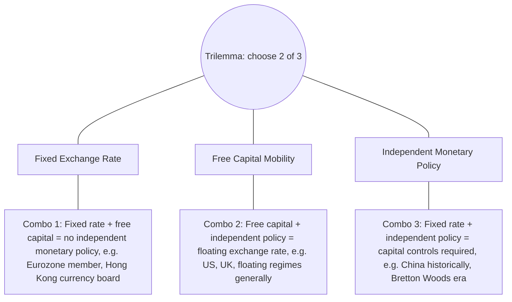

## The Mundell-Fleming Model

### Overview

The Mundell-Fleming model, developed independently by Robert Mundell and Marcus Fleming in the early 1960s, extends the closed-economy IS-LM framework to an open economy, incorporating international capital flows and exchange rate determination. Its central contribution is demonstrating that the effectiveness of monetary and fiscal policy depends critically on the exchange rate regime (fixed versus floating) and the degree of capital mobility — a result formalized as the **"impossible trinity"** or **"trilemma."**

### Core Assumptions

The standard (Mundell-Fleming, "MF") model assumes:

- A **small open economy**: the country takes the world interest rate $i^*$ as given, unable to influence it through its own policy.
- **Perfect capital mobility**: capital flows instantaneously and without limit to equalize domestic and foreign interest rates (in the simplest version, before extensions incorporating risk premia or imperfect capital mobility).
- **Fixed price level in the short run** (a Keynesian assumption, consistent with the closed-economy IS-LM framework it extends), so nominal and real variables move together in this short-run analysis.
- Uncovered Interest Parity (UIP) as the mechanism linking domestic and foreign interest rates via expected exchange rate changes (in the simplest static version, with no expected depreciation, this collapses to $i = i^*$).

### The Three Building Blocks

**IS curve (goods market equilibrium)**, extended to an open economy:

$$Y = C(Y-T) + I(i) + G + NX(e, Y, Y^*)$$

where $NX$ (net exports) depends negatively on the real exchange rate $e$ (a rise in $e$, representing real appreciation, worsens the trade balance) and positively on foreign income $Y^*$, negatively on domestic income $Y$ (through import demand).

**LM curve (money market equilibrium)**, unchanged in form from the closed-economy model:

$$\frac{M}{P} = L(i, Y)$$

**Interest parity condition (perfect capital mobility)**:

$$i = i^*$$

This third equation is the model's distinctive open-economy addition: with perfect capital mobility, the domestic interest rate is pinned to the world rate, since any deviation would trigger instantaneous, unlimited capital flows that eliminate the differential.

**Key Points**

- The interest parity condition effectively removes one degree of freedom relative to the closed economy: the domestic interest rate can no longer be independently determined by domestic monetary policy under fixed exchange rates and perfect capital mobility — a result central to the model's main policy conclusions below.

### The Impossible Trinity (Trilemma)

A country cannot simultaneously maintain all three of:

1. A **fixed exchange rate**
2. **Free capital mobility**
3. **Independent monetary policy**

It can achieve at most **two of the three**. This follows directly from the model's structure: if capital is perfectly mobile and the exchange rate is fixed, the interest parity condition $i = i^*$ must hold, leaving no room for the central bank to set $i$ independently to pursue domestic objectives.

**Diagram: The Trilemma**

### Policy Effectiveness Under Floating Exchange Rates (Perfect Capital Mobility)

**Monetary policy is highly effective; fiscal policy is ineffective (crowded out entirely).**

- **Expansionary monetary policy**: An increase in the money supply shifts LM rightward, initially lowering the domestic interest rate below $i^*$. This triggers capital outflow (investors seek the higher foreign return), causing the domestic currency to depreciate. Depreciation raises net exports (improves competitiveness), shifting the IS curve rightward until the interest rate returns to $i^*$ — meaning the *entire* expansionary effect operates through the exchange-rate/net-export channel, with the interest rate ultimately unchanged and output rising.
- **Expansionary fiscal policy**: An increase in government spending shifts IS rightward, initially raising the domestic interest rate above $i^*$. This triggers capital inflow, causing the domestic currency to *appreciate*, which reduces net exports, shifting IS back to the left until the interest rate returns to $i^*$. In the limiting case of perfect capital mobility, this exchange-rate-driven crowding-out is **complete**: output returns to its original level, with only the exchange rate having appreciated and the composition of output shifted from net exports toward government spending.

$$\text{Floating + perfect capital mobility: } \Delta Y_{\text{monetary}} > 0, \quad \Delta Y_{\text{fiscal}} \approx 0$$

### Policy Effectiveness Under Fixed Exchange Rates (Perfect Capital Mobility)

**Fiscal policy is highly effective; monetary policy is ineffective (powerless).**

- **Expansionary fiscal policy**: IS shifts rightward, initially raising $i$ above $i^*$, triggering capital inflow and upward pressure on the currency. To maintain the fixed rate, the central bank must **sell domestic currency / buy foreign reserves**, which expands the money supply (an automatic, policy-required response under a fixed regime), shifting LM rightward as well. This process continues until $i$ returns to $i^*$, with output rising by the full extent implied by the (now accommodated) money supply expansion — a strong, unambiguous positive output effect.
- **Expansionary monetary policy**: An attempt to increase the money supply shifts LM rightward, initially lowering $i$ below $i^*$, triggering capital outflow and downward pressure on the currency. To defend the fixed rate, the central bank **must buy domestic currency / sell foreign reserves**, which *contracts* the money supply, shifting LM back to its original position. The net effect is that the initial monetary expansion is entirely and automatically reversed by the reserve operations required to defend the peg — monetary policy is rendered powerless as an independent tool.

$$\text{Fixed + perfect capital mobility: } \Delta Y_{\text{fiscal}} > 0 \text{ (large)}, \quad \Delta Y_{\text{monetary}} \approx 0$$

**Key Points**

- This pair of results is the direct mechanism underlying the trilemma: under a fixed exchange rate with free capital mobility, monetary policy is endogenously determined by the requirement to defend the peg, leaving fiscal policy as the available independent demand-management tool — precisely reversing the floating-rate case.

### Diagram: IS-LM-BP Under Floating vs. Fixed Rates

```mermaid
flowchart TD
    subgraph Floating Rate
    A1[Monetary expansion] --> A2[i falls below i-star]
    A2 --> A3[Capital outflow, currency depreciates]
    A3 --> A4[Net exports rise, IS shifts right]
    A4 --> A5[Output rises, i returns to i-star]
    end
    subgraph Fixed Rate
    B1[Monetary expansion attempt] --> B2[i falls below i-star]
    B2 --> B3[Capital outflow, downward pressure on currency]
    B3 --> B4[Central bank sells reserves to defend peg]
    B4 --> B5[Money supply contracts back, no lasting effect]
    end
```

### Extensions and Refinements

- **Imperfect capital mobility**: Relaxing the perfect capital mobility assumption (allowing some, but not infinite, capital flow responsiveness to interest differentials) produces intermediate results, with the classic "BP curve" (balance of payments equilibrium locus) having a finite slope between the horizontal (perfect mobility) and vertical (zero capital mobility, autarky) extremes.
- **Dornbusch overshooting model (1976)**: Rudiger Dornbusch's extension incorporates sticky prices with rational expectations in the exchange rate market, showing that following a monetary expansion, the nominal exchange rate can **overshoot** its new long-run equilibrium value in the short run, before gradually appreciating back toward the (still-depreciated relative to before) long-run level as prices adjust — reconciling short-run exchange rate volatility with long-run purchasing power parity-consistent outcomes.
- **Mundell-Fleming-Dornbusch (as a combined framework)** remains a standard starting point in graduate open-economy macroeconomics, though it has been substantially extended and, in some respects, superseded by more fully microfounded **New Open Economy Macroeconomics (NOEM)** models (e.g., Obstfeld-Rogoff, 1995) that derive similar qualitative conclusions from explicit intertemporal optimization rather than the largely static, ad hoc behavioral equations of the original IS-LM-based approach.

**Key Points**

- [Inference] The original Mundell-Fleming model's assumption of a fixed price level and largely static, non-forward-looking behavioral relationships is a significant simplification relative to modern DSGE-based open-economy models; it remains pedagogically central because its qualitative policy conclusions (the trilemma, the floating/fixed asymmetry in policy effectiveness) have proven robust and intuitive, even though the underlying modeling technology has been substantially superseded in frontier research.

### Practical Example: China's Managed Exchange Rate and Capital Controls

China's historical exchange rate management (particularly the RMB's peg-like management against the dollar through the 2000s) illustrates the trilemma's third combination: by maintaining substantial **capital controls** (limiting free capital mobility), China has historically been able to simultaneously manage its exchange rate and retain a degree of independent monetary policy — a combination unavailable to an economy with free capital mobility, consistent with the trilemma's logic. [Inference] The precise degree of capital account openness and its evolution over time in China's case is a matter of ongoing empirical assessment rather than a fixed, binary condition, since capital controls can be partial and their effectiveness varies by channel.

**Conclusion**

The Mundell-Fleming model's central insight — that fiscal and monetary policy effectiveness depend sharply on the exchange rate regime under conditions of capital mobility, formalized in the impossible trinity — remains one of the most durable and widely taught results in open-economy macroeconomics. It directly frames the currency-union vulnerability discussed in the sovereign debt crises topic (a Eurozone member has effectively chosen "fixed rate + free capital mobility," sacrificing independent monetary policy) and provides the analytical foundation for evaluating exchange rate regime choice more generally, addressed further in subsequent topics in this chapter.

**Related Topics**

- The impossible trinity in practice: historical regime choices across countries and eras
- Dornbusch overshooting model: full derivation and empirical evidence
- New Open Economy Macroeconomics (Obstfeld-Rogoff) as a microfounded successor framework
- Fixed versus floating exchange rate regimes: costs and benefits
- Capital controls: theory, effectiveness, and IMF institutional view evolution
- Uncovered interest parity: theory versus the empirical "forward premium puzzle"
- The Eurozone as an application of the trilemma (fixed rate + free capital, no independent monetary policy)
- Optimum currency area theory and its relationship to trilemma trade-offs