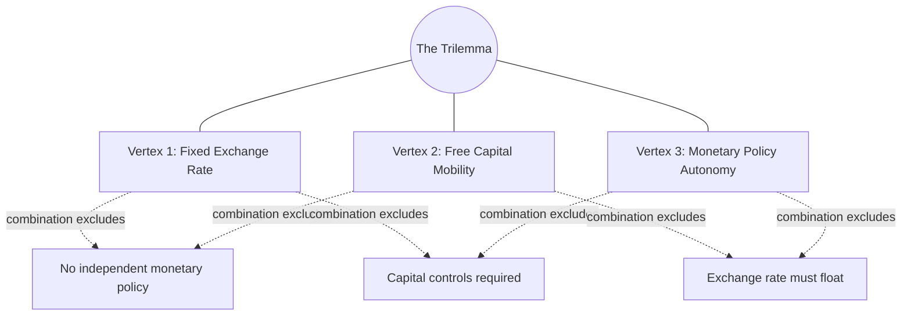
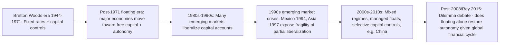

## The Policy Trilemma and the Impossible Trinity

### Overview

The policy trilemma — also called the **impossible trinity** or **Mundell-Fleming trilemma** — is one of the most influential organizing principles in international monetary economics. It states that a country cannot simultaneously achieve all three of: a fixed exchange rate, free international capital mobility, and an independent monetary policy. At most two of the three are jointly achievable; pursuing the third requires sacrificing one of the other two. While the previous topic derived this result formally within the Mundell-Fleming IS-LM-BP framework, this topic treats the trilemma as a standalone organizing concept, its historical applications, and its extensions and critiques in the subsequent literature.

### Statement of the Trilemma

The three mutually incompatible policy goals are:

1. **Exchange rate stability** — maintaining a fixed or tightly managed exchange rate against another currency or basket.
2. **Capital account openness** — allowing free (unrestricted) cross-border flows of financial capital.
3. **Monetary policy autonomy** — the ability to set domestic interest rates or the money supply according to domestic objectives (inflation control, output stabilization), independent of what is required to defend the exchange rate.

The underlying logic: if capital moves freely and the exchange rate is fixed, arbitrage forces the domestic interest rate to track the foreign (or anchor-currency) interest rate via interest parity, since any independent domestic policy action would trigger capital flows large enough to threaten the peg. To retain independent monetary policy under a fixed rate, a country must restrict capital mobility (via capital controls) to prevent this arbitrage from occurring.

**Key Points**

- The trilemma is a **logical/accounting-style constraint** derived from the interest parity condition and the definition of a fixed exchange rate, not merely an empirical regularity — [Inference] though the *degree* to which it binds in practice (as opposed to in the idealized, perfect-capital-mobility case) is an empirical question addressed by extensions discussed below.

### Diagram: The Trilemma Triangle

### The Three Corner Solutions

**Corner 1: Fixed exchange rate + free capital mobility (sacrifice monetary autonomy)**

Examples: Eurozone member states (which have additionally sacrificed the exchange rate/monetary policy tools entirely by adopting a shared currency); Hong Kong's currency board arrangement pegging the HKD to the USD since 1983; Denmark's peg to the euro under the ERM II mechanism.

- Under this regime, domestic interest rates must track the anchor currency's rates (subject to any residual risk premium); domestic monetary policy cannot be used to address purely domestic economic conditions that diverge from the anchor country's conditions.
- [Inference] This is precisely the vulnerability structure discussed in the sovereign debt crises topic: a country in this corner cannot use its own central bank to backstop domestic financial stress in the way an independent-currency, floating-rate country can.

**Corner 2: Free capital mobility + monetary policy autonomy (sacrifice exchange rate stability)**

Examples: The United States, United Kingdom, Japan, and most advanced economies under the post-Bretton Woods floating rate system (since the early 1970s); many, though not all, larger emerging markets have moved toward this corner over recent decades.

- The exchange rate is left to float, absorbing the adjustment that would otherwise require either capital controls or the sacrifice of monetary independence.
- This is the corner solution implicitly assumed in most standard open-economy macroeconomic policy analysis for major floating-rate economies.

**Corner 3: Fixed exchange rate + monetary policy autonomy (sacrifice free capital mobility)**

Examples: China for much of the 2000s and into the 2010s (a managed exchange rate alongside substantial capital controls); most Bretton Woods system members (1944–1971), which combined pegged exchange rates with capital controls explicitly sanctioned under the original IMF Articles of Agreement; India and various other emerging markets have historically used this combination to varying degrees.

- Capital controls (limits on cross-border financial flows — via taxation, quantitative restrictions, or administrative approval requirements) break the arbitrage link between domestic and foreign interest rates, permitting the exchange rate to be pegged while retaining some latitude for independent monetary policy.
- [Inference] The *effectiveness* of capital controls in fully insulating monetary policy is a matter of degree and empirical dispute — controls are rarely perfectly binding in practice (evasion, mislabeled trade invoicing, and other channels create leakage), so this corner is generally understood as providing partial rather than complete monetary autonomy.

### Historical Application: Bretton Woods as Corner 3

The Bretton Woods system (1944–1971) is a canonical historical illustration of Corner 3: member countries maintained fixed (adjustable peg) exchange rates against the U.S. dollar (itself convertible to gold), while widespread capital controls — explicitly permitted and in some respects encouraged under the original IMF Articles — allowed individual countries some scope for independent monetary policy suited to domestic post-war reconstruction and full-employment objectives. The system's eventual breakdown (culminating in the 1971 "Nixon Shock" suspending dollar-gold convertibility) is frequently analyzed, in part, through a trilemma lens: growing capital mobility over the 1960s (partly reflecting the growth of the Euromarkets circumventing formal capital controls) increasingly strained the system's ability to maintain both fixed rates and independent monetary policy simultaneously.

### Extensions and Refinements to the Basic Trilemma

**The "Dilemma" (Rey, 2015)**: Hélène Rey's influential Jackson Hole paper argued that even the "free capital mobility + monetary autonomy" corner (floating exchange rates) may not fully deliver independent monetary policy in a world with a **global financial cycle** driven substantially by U.S. monetary policy and global risk appetite — capital flows, credit growth, and asset prices in many countries move together with this global cycle regardless of the exchange rate regime, suggesting the trilemma may in practice function more like a **"dilemma"**: independent monetary policy is constrained by global financial conditions even under floating rates, unless capital account openness itself is also restricted. [Inference] This remains a genuinely contested reframing rather than a settled replacement for the classical trilemma — subsequent empirical work has produced mixed evidence on the extent to which exchange rate flexibility still provides meaningful monetary autonomy, with some studies supporting Rey's dilemma framing more strongly than others.

**Quadrilemma / financial stability as a fourth dimension**: Some more recent treatments (partly reflecting the post-2008 elevation of financial stability as a distinct policy objective, discussed elsewhere in this chapter) propose adding **financial stability** as an additional, partially separable dimension — arguing that macroprudential policy can, to some extent, provide a degree of insulation from global financial cycle spillovers even without fully sacrificing capital account openness or exchange rate flexibility, complicating the clean three-way trade-off of the classical formulation.

**Partial and intermediate regimes**: In practice, few countries sit at a pure corner; most occupy intermediate positions — managed floats with occasional intervention, partial capital account liberalization, and correspondingly partial (rather than zero or full) monetary autonomy. The trilemma is best understood as describing the **trade-off frontier** along which countries must choose, rather than a strict binary choice among three discrete corner solutions.

### Diagram: Evolution of Trilemma Positioning Over Time (Stylized)

### Practical Example: Comparing Three Economies

| Economy | Exchange Rate | Capital Mobility | Monetary Autonomy | Trilemma Corner |
| --- | --- | --- | --- | --- |
| Hong Kong | Fixed (currency board vs. USD) | Free | None (tracks Fed policy) | Corner 1 |
| United States | Floating | Free | Full | Corner 2 |
| China (2000s) | Managed/pegged | Restricted | Partial | Corner 3 |

[Inference] China's position has evolved over time toward somewhat greater exchange rate flexibility and gradual (though incomplete) capital account liberalization since the mid-2000s; its precise current positioning along the trilemma frontier is a matter for up-to-date empirical assessment rather than a fixed historical fact, since capital account and exchange rate policy in China continue to evolve.

**Conclusion**

The policy trilemma provides a parsimonious and durable framework for understanding the fundamental trade-offs facing any country's international monetary policy architecture: exchange rate stability, capital account openness, and monetary policy autonomy cannot all be fully achieved simultaneously. While the basic three-corner logic remains foundational, subsequent scholarship — particularly Rey's "dilemma" reframing emphasizing the global financial cycle — has raised genuine and unresolved questions about whether exchange rate flexibility alone is sufficient to deliver full monetary autonomy in a world of highly integrated global capital markets, an active area of ongoing research and policy debate.

**Related Topics**

- The Mundell-Fleming model: formal derivation of the trilemma result
- Rey's "dilemma" and the global financial cycle literature
- Bretton Woods system: rise, operation, and collapse
- Capital controls: design, effectiveness, and the IMF's evolving institutional view
- Currency boards and dollarization as extreme Corner 1 solutions
- Optimum currency area theory and the Eurozone's trilemma position
- Emerging market "fear of floating" and intermediate exchange rate regimes
- Macroprudential policy as a potential complement to trilemma-constrained monetary policy