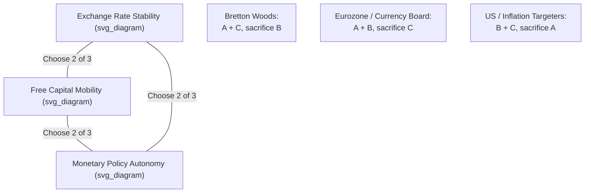

## Capital Mobility and Monetary Policy Autonomy

### Overview

Capital mobility and monetary policy autonomy addresses the constraints that international capital flows impose on a central bank's ability to independently set domestic interest rates and pursue domestic macroeconomic objectives. The subject is anchored by the **Mundell-Fleming trilemma** (also called the impossible trinity), which states that a country cannot simultaneously maintain a fixed exchange rate, free capital movement, and independent monetary policy—only two of the three are jointly achievable.

### The Trilemma: Formal Statement

The trilemma asserts that policymakers must choose two of the following three goals, sacrificing the third:

1. **Exchange rate stability** (fixed or pegged exchange rate)
2. **Free capital mobility** (open capital account)
3. **Monetary policy autonomy** (independent control over domestic interest rates)

This gives rise to three feasible policy regimes:

| Regime | Exchange Rate | Capital Mobility | Monetary Autonomy | Example |
| --- | --- | --- | --- | --- |
| Fixed peg + open capital account | Fixed | Free | Sacrificed | Hong Kong (currency board), Eurozone members |
| Floating exchange rate + open capital account | Flexible | Free | Retained | United States, Japan, UK |
| Fixed peg + capital controls | Fixed | Restricted | Retained | China (managed), Bretton Woods era |

### Theoretical Foundation: Uncovered Interest Parity

The trilemma's binding mechanism runs through **uncovered interest rate parity (UIP)**:

$$i_d = i_f + \frac{E[S_{t+1}] - S_t}{S_t}$$

Where $i_d$ is the domestic interest rate, $i_f$ is the foreign interest rate, $S_t$ is the current spot exchange rate, and $E[S_{t+1}]$ is the expected future spot rate.

**Key Points**

- Under perfect capital mobility, arbitrageurs exploit any interest rate differential not offset by expected currency depreciation/appreciation, forcing $i_d$ toward $i_f$ adjusted for expected exchange rate movements.
- If the exchange rate is fixed (so $E[S_{t+1}] = S_t$), UIP collapses to $i_d = i_f$: the domestic interest rate is pinned to the foreign rate, eliminating monetary autonomy.
- If capital is immobile (capital controls prevent arbitrage), the domestic rate can diverge from $i_f$ indefinitely regardless of the exchange rate regime.
- If the exchange rate floats, expected depreciation/appreciation can absorb the interest differential, allowing $i_d$ to diverge from $i_f$ even with open capital markets.

### Mundell-Fleming Model Mechanics

The Mundell-Fleming (IS-LM-BP) framework formalizes the trilemma in a small open economy.

**IS curve** (goods market equilibrium):

$$Y = C(Y-T) + I(i) + G + NX(Y, Y^*, S)$$

**LM curve** (money market equilibrium):

$$\frac{M}{P} = L(i, Y)$$

**BP curve** (balance of payments equilibrium, perfect capital mobility):

$$i = i^*$$

Under perfect capital mobility, the BP curve is horizontal at $i = i^*$. Any attempt by the central bank to shift the LM curve (via money supply changes) to move $i$ away from $i^*$ triggers capital flows that force the exchange rate (fixed regime) or interest rate (float regime) back into alignment.

**Fixed exchange rate + perfect capital mobility:**

- Monetary expansion lowers $i$ below $i^*$ → capital outflow → downward pressure on currency → central bank must sell foreign reserves to defend the peg → money supply contracts back to original level.
- **Conclusion**: Monetary policy is fully ineffective for demand management; it is endogenously determined by the peg defense.
- Fiscal policy becomes highly effective, since it does not require monetary accommodation to work through the interest rate channel.

**Floating exchange rate + perfect capital mobility:**

- Monetary expansion lowers $i$ below $i^*$ → capital outflow → currency depreciates → depreciation boosts net exports ($NX$) → IS curve shifts right → output rises without reserve intervention.
- **Conclusion**: Monetary policy is highly effective; fiscal policy is comparatively weakened because fiscal expansion raises $i$, causing appreciation that crowds out net exports.

### Diagram: Trilemma Triangle

### Degrees of Capital Mobility

Perfect capital mobility is a polar case. In practice, mobility exists on a spectrum, and empirical work (notably the **Chinn-Ito index** and the **IMF's AREAER-based capital control indices**) measures de jure and de facto openness separately.

**Key Points**

- **De jure openness**: legal restrictions on cross-border capital transactions (as codified in the IMF's Annual Report on Exchange Arrangements and Exchange Restrictions).
- **De facto openness**: actual observed magnitude of gross or net capital flows/stocks relative to GDP, which can diverge substantially from de jure rules due to circumvention, informal channels, or non-enforcement.
- Partial capital mobility permits **partial** monetary autonomy: the interest differential $i_d - i_f$ need not be zero, but its persistence and magnitude are bounded by the cost and risk of circumventing capital controls.
- Empirical UIP tests using regression $\Delta s_{t+1} = \alpha + \beta(i_d - i_f) + \epsilon_t$ typically find $\beta$ significantly less than the UIP-predicted value of 1, and often negative — the so-called **forward premium puzzle** — reflecting risk premia, imperfect capital mobility, and expectation formation frictions rather than a clean UIP benchmark.

### Extensions Beyond the Strict Trilemma

**1. The "Dilemma" Hypothesis (Rey, 2013)**

Hélène Rey's influential reformulation argues that the trilemma effectively collapses into a **dilemma**: independent monetary policy is feasible only if the capital account is managed, regardless of the exchange rate regime. This is because a **Global Financial Cycle**—driven substantially by US monetary policy and global risk appetite (proxied by measures like the VIX)—transmits financial conditions (credit growth, leverage, asset prices) across borders through gross capital flows even under floating exchange rates.

[Inference] This literature remains actively contested; subsequent work (e.g., Obstfeld and others) has offered partial rebuttals showing that exchange rate flexibility still provides meaningful, if incomplete, insulation, particularly for large, financially developed economies with deep local-currency bond markets.

**2. Financial Stability and Macroprudential Policy**

Even under a floating exchange rate with formal monetary autonomy, large gross capital inflows can generate financial stability risks (credit booms, currency mismatches, asset bubbles) that constrain the central bank's *effective* freedom to set rates purely on domestic output/inflation objectives. This has motivated the rise of macroprudential tools (loan-to-value caps, countercyclical capital buffers, reserve requirements on foreign liabilities) as a "fourth instrument" to manage capital-flow-driven risks separately from the interest rate.

**3. Fear of Floating**

Calvo and Reinhart (2002) documented that many emerging markets classified as "floating" in official IMF regime classifications exhibit low exchange rate volatility relative to reserves and interest rate volatility—suggesting de facto pegging behavior ("fear of floating") driven by:

- High foreign-currency-denominated debt (balance sheet effects of depreciation)
- Exchange-rate pass-through to domestic inflation
- Underdeveloped hedging markets

This implies actual monetary autonomy for many EMs is lower than their de jure floating regime would suggest.

### Worked Example: Peg Defense Under Capital Mobility

**Example**

Consider a small open economy with a currency pegged to the US dollar at $S = 10$ (domestic currency per USD), with full capital account openness. The Federal Reserve raises $i^*$ from 2% to 5%.

1. Absent central bank action, UIP implies the domestic rate must also rise to 5% to prevent capital outflow and depreciation pressure.
2. If the domestic central bank instead wants to keep $i_d = 2\%$ to support a weak domestic economy, capital flows out seeking the higher USD return.
3. Outflow creates excess demand for USD in the FX market, pushing the domestic currency toward depreciation.
4. To defend the peg at $S = 10$, the central bank must sell USD reserves and buy domestic currency, contracting the domestic money supply.
5. Contracting money supply mechanically raises $i_d$ back toward $i^*$ (via the LM curve), until $i_d \approx i^* = 5\%$.
6. **Outcome**: the attempt to maintain low domestic rates is undone by reserve outflows; the peg forces convergence to the foreign rate, confirming zero monetary autonomy under this regime combination.

**Limiting factor**: this process is bounded by the stock of foreign exchange reserves. Reserve depletion below a critical threshold (often assessed via the **Greenspan-Guidotti rule**, reserves ≥ short-term external debt) can trigger a speculative attack and forced devaluation, as in the classic **first-generation currency crisis models** (Krugman, 1979).

### Policy Responses to Manage the Trade-off

**Key Points**

- **Capital controls**: Taxes (e.g., Chile's *encaje* unremunerated reserve requirement, 1991–1998), quantity restrictions, or administrative approval requirements on inflows/outflows, used to preserve monetary autonomy without fully floating.
- **Sterilized intervention**: Central bank buys/sells FX reserves while offsetting the domestic money supply effect via open market operations (e.g., issuing sterilization bonds). [Inference] Effectiveness is generally considered limited in economies with highly integrated capital markets, since sterilization bonds themselves may attract offsetting capital flows, though its efficacy is debated and varies by country and instrument.
- **Managed float / crawling peg**: Intermediate regimes retaining partial autonomy while limiting exchange rate volatility, at the cost of periodic credibility and speculative-attack vulnerability.
- **Inflation targeting with a float**: The dominant modern regime for economies prioritizing autonomy (majority of the OECD, many large EMs post-1990s crises), explicitly sacrificing exchange rate stability.
- **Currency unions/boards**: Complete sacrifice of autonomy in exchange for full credibility and eliminated exchange rate risk within the union/peg (Eurozone, Hong Kong, Bulgaria's currency board).

### Empirical Evidence

- Obstfeld, Shambaugh, and Taylor (2005) provide cross-country empirical confirmation of the trilemma using historical data spanning the classical gold standard, interwar period, Bretton Woods, and modern float era, showing interest rate co-movement with the base country is strongly conditioned by both exchange rate regime and capital account openness.
- Aizenman, Chinn, and Ito's "trilemma indexes" construct continuous measures of the three trilemma dimensions and show most countries pursue a **"trilemma configuration"**—a weighted middle ground—rather than pure corner solutions, consistent with the widespread use of managed floats and partial capital controls.

### Related Topics

- Mundell-Fleming (IS-LM-BP) model in depth
- Global Financial Cycle and Hélène Rey's dilemma hypothesis
- Currency crisis models (first-, second-, and third-generation)
- Sterilized vs. unsterilized foreign exchange intervention
- Macroprudential policy and capital flow management measures (CFMs)
- Uncovered interest parity and the forward premium puzzle
- Optimum currency area theory
- Fear of floating (Calvo-Reinhart)
- Chinn-Ito capital account openness index