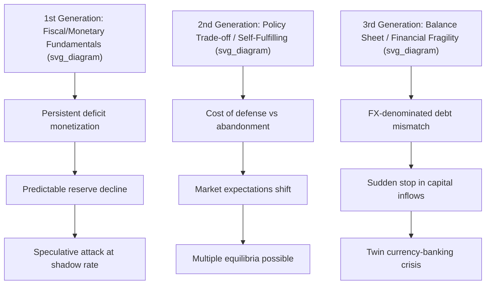

## Currency Crises and Speculative Attacks

### Overview

Currency crises occur when a pegged or managed exchange rate regime collapses under speculative pressure, forcing an abrupt devaluation, float, or abandonment of the peg. The theoretical literature is organized into three "generations" of models, each capturing a distinct mechanism by which fixed exchange rate regimes become untenable, plus a fourth strand addressing balance-sheet and banking-sector channels.

### First-Generation Models (Krugman, 1979)

**Core mechanism**: Currency crises result from a fundamental inconsistency between domestic macroeconomic policy (persistent fiscal deficits monetized by the central bank) and the commitment to a fixed exchange rate.

**Model structure**:

1. Government runs a persistent fiscal deficit financed by domestic credit creation (money printing).
2. This generates ongoing excess domestic money supply growth relative to money demand.
3. Under a fixed exchange rate, excess money supply would normally cause inflation, but the peg requires the central bank to sell foreign reserves to absorb this excess liquidity and defend parity.
4. Reserves decline **steadily and predictably** as domestic credit expands.
5. Rational speculators, anticipating that reserves will eventually be exhausted and the peg abandoned, attack the currency *before* reserves hit zero, since holding the currency through a discrete devaluation is costly.

**Formal reserve dynamics**: Domestic credit $D_t$ grows at rate $\mu$:

$$D_t = D_0 + \mu t$$

Reserves $R_t$ decline correspondingly to hold the money supply $M = D + R$ consistent with the fixed exchange rate:

$$R_t = R_0 - \mu t$$

**Key Points**

- The speculative attack is a discrete, self-interested action that occurs at a **shadow exchange rate** crossing point — the moment the post-float exchange rate implied by fundamentals equals the current pegged rate.
- The attack causes reserves to fall to the critical threshold **instantaneously** (a sudden reserve drop) rather than gradually, because speculators convert domestic currency to foreign currency in a lump-sum move to avoid capital losses.
- **Conclusion**: the crisis timing is *fully determined by fundamentals* (the pace of domestic credit expansion); there is no self-fulfilling element. The government's own inconsistent policies make the collapse inevitable and simply advance its timing relative to naive reserve exhaustion.
- Application: Latin American crises of the 1960s–80s, and elements of the 1994 Mexican peso crisis (Tequila Crisis), where excessive domestic credit growth and fiscal financing needs eroded reserves.

### Second-Generation Models (Obstfeld, 1994, 1996)

**Core mechanism**: Crises arise from a government's *cost-benefit trade-off* between defending the peg and pursuing other domestic objectives (output, employment, debt service), creating the possibility of **multiple equilibria** and **self-fulfilling** speculative attacks — even when fundamentals are not obviously unsustainable.

**Model structure**:

- The government weighs the costs of maintaining the peg (e.g., high interest rates needed to defend it, which depress output and raise debt-service costs) against the costs of abandoning it (loss of credibility, imported-inflation risk, contractual disruption).
- If enough market participants *believe* a devaluation is coming, they may attack the currency (sell it, demand higher yields on peg-linked debt), which itself raises the government's defense costs (e.g., forcing higher domestic interest rates), making devaluation the government's rational choice — a **self-fulfilling prophecy**.
- If instead market participants believe the peg will hold, defense costs remain low, and the government indeed maintains it.

**Formal representation** (escape clause framework): government minimizes a loss function

$$L = a(y - y^*)^2 + b \cdot \mathbb{1}[\text{devalue}]$$

Where a devaluation reduces output-gap losses (via a competitiveness boost) at a fixed political/credibility cost $b$. The devaluation threshold depends on expected future policy, which itself depends on current market beliefs — generating circularity and multiplicity of equilibria.

**Key Points**

- Multiple equilibria imply the **same set of fundamentals** can be consistent with either a "peg survives" or "peg collapses" outcome, depending purely on coordinated market expectations.
- These models motivate the study of "sunspot" equilibria — a crisis triggered by extrinsic, payoff-irrelevant signals that coordinate speculator behavior.
- Application: the **1992 European Exchange Rate Mechanism (ERM) crisis**, particularly the UK's "Black Wednesday" exit from the ERM. UK fundamentals (reserves, fiscal position) were not catastrophically unsustainable, but high unemployment made defending the peg (via high interest rates) politically costly, and speculative attacks (notably associated with George Soros's fund) forced sterling's exit.
- [Inference] The degree to which self-fulfilling multiplicity versus weak fundamentals explains any specific historical crisis remains an empirically contested attribution exercise, since ex post it is difficult to cleanly distinguish "weak fundamentals that justified the attack" from "an attack that became self-fulfilling."

### Third-Generation Models (Krugman, 1999; Chang and Velasco, 2001)

**Core mechanism**: Crises originate in the **financial and corporate sector** rather than pure fiscal/monetary fundamentals, driven by balance-sheet mismatches, moral hazard, and banking fragility, with the currency crisis and a banking/financial crisis reinforcing each other ("twin crises").

**Key transmission channels**:

1. **Currency mismatch / balance-sheet effects**: Firms and banks borrow in foreign currency (USD) but earn revenue in domestic currency. A depreciation sharply raises the domestic-currency value of foreign debt, causing widespread insolvency, which in turn deepens the crisis and depreciation pressure (a feedback loop).
2. **Moral hazard and financial fragility**: Implicit government guarantees (explicit or perceived bailout commitments) encourage banks to fund long-term, risky domestic投資 via short-term foreign-currency borrowing, creating maturity and currency mismatches vulnerable to sudden stops.
3. **Sudden stops**: A sharp, discrete reversal in capital inflows (Calvo, 1998) driven by shifts in foreign investor sentiment, contagion from other countries, or a reassessment of country risk, which can be self-fulfilling: anticipation of a sudden stop triggers a run on reserves/bank liabilities, which itself validates the stop.
4. **Twin crises**: Currency crisis and banking crisis reinforce one another — depreciation weakens bank balance sheets (via FX-denominated liabilities or maturity mismatches), triggering deposit runs and credit contraction, which further weakens the currency via capital flight and reduced confidence.

**Application**: The **1997–98 Asian Financial Crisis** (Thailand, Indonesia, South Korea, Malaysia) is the canonical case — short-term USD-denominated corporate/bank debt, weak financial regulation, and pegged exchange rates combined such that a loss of confidence triggered simultaneous currency collapse and banking-sector failure across the region.

### Diagram: Crisis Generation Comparison

### Speculative Attack Mechanics: A Worked Numerical Example

**Example**

A country pegs its currency at $S = 25$ per USD, holds reserves $R_0 = \$10$ billion, and domestic credit grows at $\mu = \$500$ million/month due to fiscal deficit monetization. Domestic money demand is stable.

1. Absent an attack, reserves would decline linearly, reaching zero in $10{,}000/500 = 20$ months.
2. The **shadow exchange rate** $\tilde{S}_t$ — the rate that would prevail if the peg were abandoned today and money supply consisted only of domestic credit — rises over time as $D_t$ grows.
3. Speculators calculate the exact month $T^*$ at which $\tilde{S}_{T^*} = S = 25$ (the pegged rate). Before this point, holding foreign currency is more costly than domestic currency (given the peg holds and offers a stable rate); at $T^*$, the two are equalized.
4. At $T^*$, rational speculators launch a **coordinated attack**: they sell domestic currency for foreign currency, causing an instantaneous, discrete drop in reserves — not one that trickles out slowly — because waiting past $T^*$ would mean incurring a capital loss when the inevitable float occurs.
5. This attack exhausts remaining reserves in a single episode, forcing an immediate float, well before the naive 20-month "no attack" exhaustion date.

**Conclusion**: the *actual* collapse date is always earlier than a naive reserves/burn-rate calculation would suggest, because forward-looking speculators do not wait for a zero-reserve boundary condition.

### Indicators and Early Warning Systems

**Key Points**

- **Reserve adequacy metrics**: Reserves-to-short-term-external-debt ratio (**Greenspan-Guidotti rule**, ideally ≥ 1), reserves-to-imports (months of import cover), reserves-to-M2 (captures potential for domestic capital flight into foreign currency).
- **Real exchange rate misalignment**: Persistent real appreciation relative to trading partners signals eroding competitiveness and rising devaluation pressure.
- **Current account deficits**: Large, persistently financed by short-term or portfolio (rather than FDI) capital inflows are considered more crisis-prone due to reversal risk.
- **Credit growth**: Rapid domestic credit/GDP growth is a robust leading indicator of both banking and currency crises in the empirical early-warning-systems (EWS) literature (e.g., Kaminsky and Reinhart's "signals approach," 1999).
- **Maturity and currency mismatch indicators**: Short-term external debt to reserves; foreign-currency-denominated liabilities relative to foreign-currency revenue in the banking/corporate sector.
- [Inference] EWS models generally exhibit meaningful out-of-sample predictive noise; they identify elevated vulnerability rather than precise crisis timing, and false-positive/false-negative rates remain non-trivial across studies.

### Policy Responses During and After a Crisis

- **Interest rate defense**: Sharp rate hikes to make holding domestic currency assets attractive enough to offset devaluation expectations — costly for growth and can worsen fiscal/banking positions (the core 2nd-generation trade-off).
- **Reserve intervention**: Direct FX market sales to support the currency; limited by stock of reserves and can be self-defeating if it signals desperation.
- **Capital controls**: Temporary restrictions on outflows to stem attack momentum (e.g., Malaysia's 1998 capital controls, considered by some analyses to have provided breathing room, though [Inference] the counterfactual and welfare effects remain debated in the literature).
- **IMF-supported programs**: Emergency financing paired with conditionality (fiscal consolidation, structural reform, sometimes bank restructuring), as seen in Mexico (1994), Thailand/Indonesia/Korea (1997–98), and Argentina (2001).
- **Orderly devaluation/float**: Pre-emptive, managed exit from an unsustainable peg to avoid a disorderly collapse — difficult to execute credibly without triggering the very attack it seeks to avoid.
- **Post-crisis debt restructuring**: Sovereign or corporate debt renegotiation where balance-sheet damage (third-generation channel) is severe, as in Argentina's 2001–02 default.

### Case Study Summary Table

| Crisis | Year(s) | Dominant Generation | Key Mechanism |
| --- | --- | --- | --- |
| Latin American debt crises | 1970s–80s | 1st | Fiscal deficits monetized, reserve exhaustion |
| ERM crisis (UK, Italy) | 1992 | 2nd | Self-fulfilling attack, defense-cost trade-off |
| Mexican Peso (Tequila) | 1994 | 1st/2nd hybrid | Credit expansion + political/reserve pressures |
| Asian Financial Crisis | 1997–98 | 3rd | FX debt mismatch, sudden stop, twin banking crisis |
| Russian crisis | 1998 | 1st/3rd hybrid | Fiscal unsustainability + financial contagion |
| Argentine crisis | 2001–02 | 1st/3rd hybrid | Currency board rigidity, fiscal and debt unsustainability |

### Related Topics

- Trilemma and capital mobility (foundational context for peg sustainability)
- Sudden stops and capital flow reversals (Calvo, 1998)
- Twin crises: banking and currency crisis interaction
- IMF conditionality and program design
- Optimal reserve accumulation and self-insurance
- Contagion channels in international finance
- Sovereign debt restructuring mechanisms
- Capital controls: design and effectiveness evidence