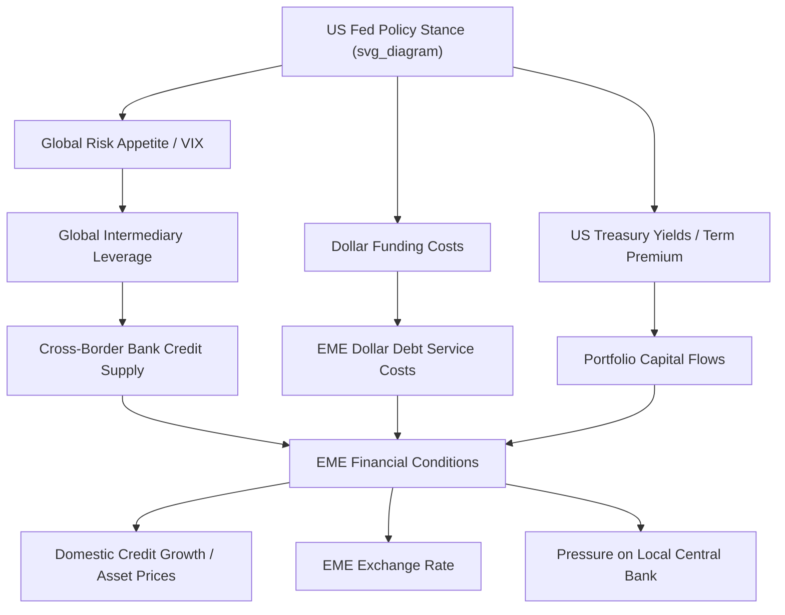

## Global Liquidity and International Policy Spillovers

### Overview

Global liquidity and international policy spillovers examine how monetary and financial conditions generated in major economies—principally the United States, given the dollar's role as the dominant international currency—transmit across borders to affect financial conditions, credit growth, capital flows, and macroeconomic outcomes in other countries, often independent of, or in tension with, those countries' own domestic monetary policy stance.

### Defining Global Liquidity

**Key Points**

- **Official liquidity**: central bank reserves, swap lines, and IMF resources available to meet balance-of-payments financing needs.
- **Private (market) liquidity**: cross-border bank lending, portfolio capital flows, and international debt issuance that determine the ease of obtaining external financing in private markets.
- The **Bank for International Settlements (BIS)** tracks global liquidity primarily through cross-border bank credit aggregates and international debt securities issuance, distinguishing between liquidity conditions in advanced economies and in emerging market economies (EMEs).
- Global liquidity is inherently **procyclical**: it expands in periods of low global risk aversion and easy funding conditions, and contracts sharply during risk-off episodes—amplifying rather than dampening the global financial cycle.

### The Global Financial Cycle (Rey, 2013)

**Core thesis**: Hélène Rey's influential work argues for the existence of a single, dominant **Global Financial Cycle (GFC)** in asset prices, gross capital flows, and credit growth, co-moving across countries largely regardless of exchange rate regime, and driven substantially by:

1. **US monetary policy**: changes in the Federal Reserve's policy stance directly affect global risk appetite and funding costs, given the dollar's role as the primary international funding and invoicing currency.
2. **Global risk aversion**, commonly proxied empirically by the **VIX** (CBOE Volatility Index) or similar measures of implied equity volatility.
3. **Leverage and risk-taking by global financial intermediaries** (international banks, asset managers), whose balance-sheet capacity expands and contracts with funding conditions, transmitting shocks through cross-border lending and portfolio allocation.

**Formal transmission channel — the "risk-taking channel"**:

$$\text{Global risk appetite} \downarrow \Rightarrow \text{Intermediary leverage} \downarrow \Rightarrow \text{Cross-border credit supply} \downarrow \Rightarrow \text{EME financial conditions tighten}$$

**Key implication for the trilemma**: Rey's central claim is that this cycle operates through the **gross capital flow and credit channel**, which is not fully insulated by a floating exchange rate. This motivates the **"dilemma"** reformulation: independent monetary policy may require *managing the capital account* (via capital flow management measures or macroprudential tools), not merely floating the currency, effectively reducing the trilemma to a binary choice between capital account openness and monetary autonomy.

[Inference] The strength and universality of the GFC finding is actively debated; subsequent research (including work associated with Maurice Obstfeld) argues exchange rate flexibility still provides meaningful, if partial, insulation—particularly for economies with deep local-currency financial markets, credible inflation-targeting frameworks, and lower foreign-currency debt exposure—so the dilemma versus trilemma question remains an open empirical matter rather than a settled one.

### Transmission Channels of Monetary Policy Spillovers

**1. Interest Rate / Portfolio Rebalancing Channel**

Changes in advanced-economy policy rates alter relative returns, driving portfolio capital flows toward or away from other economies as investors rebalance across the global asset universe in search of yield or safety.

**2. Exchange Rate Channel**

Advanced-economy monetary easing typically depreciates that economy's currency, which can appreciate partner-country currencies, affecting their competitiveness and, where import-price pass-through is significant, their domestic inflation dynamics.

**3. Bank Lending / Credit Supply Channel**

Global banks headquartered in advanced economies adjust cross-border lending in response to their home funding conditions and leverage constraints, transmitting monetary tightening or easing directly into the credit availability of borrowers in other jurisdictions, including where those borrowers' fundamentals are unchanged.

**4. Term Premium / Bond Market Channel**

Quantitative easing (QE) and quantitative tightening (QT) by major central banks affect global term premia (the compensation investors demand for holding longer-duration bonds), influencing long-term yields worldwide through portfolio-balance effects, independent of any single country's own policy rate.

**5. Dollar Funding Channel**

Because a large share of international trade invoicing, cross-border bank liabilities, and non-bank corporate debt is dollar-denominated, US monetary tightening raises the cost of servicing and rolling over dollar liabilities globally—a mechanism sometimes termed the **dollar's "exorbitant" transmission role**—operating independently of the borrowing country's own currency or monetary stance.

### Diagram: Spillover Transmission Map

### Empirical Manifestations

**1. The "Taper Tantrum" (2013)**

When the Federal Reserve signaled a potential reduction in the pace of QE asset purchases, EME bond yields, currencies, and equity markets sold off sharply—despite no change in the Fed's actual policy rate at that time—illustrating that *forward guidance and balance-sheet policy signals*, not just realized rate changes, generate substantial spillovers. Countries with larger current account deficits and higher inflation ("Fragile Five": Brazil, India, Indonesia, South Africa, Turkey) experienced disproportionately severe pressure, highlighting how domestic vulnerability indicators condition spillover intensity.

**2. Post-2008 Unconventional Monetary Policy Spillovers**

Quantitative easing by the Fed, ECB, Bank of Japan, and Bank of England after the Global Financial Crisis is widely documented in the empirical literature to have contributed to capital inflow surges into EMEs, compressing EME sovereign spreads and inflating asset prices, as investors searched for yield unavailable in near-zero-rate advanced economies.

**3. 2022–2023 Global Tightening Cycle**

Synchronized rate hikes across advanced economies to combat post-pandemic inflation generated broad-based dollar appreciation and tightening financial conditions across EMEs, with heterogeneous effects depending on each country's foreign-currency debt exposure, reserve buffers, and domestic inflation dynamics.

### Policy Responses to Manage Spillovers

**Key Points**

- **Foreign exchange intervention**: direct FX market operations to smooth excessive currency volatility arising from spillover-driven capital flow swings, without necessarily abandoning the underlying monetary policy stance.
- **Macroprudential policy**: countercyclical capital buffers, loan-to-value and debt-to-income limits, and levies on non-core (wholesale/foreign-currency) bank liabilities to dampen the credit-growth channel of spillover transmission.
- **Capital flow management measures (CFMs)**: the **IMF's Institutional View (2012, updated since)** provides a framework endorsing targeted, temporary CFMs as legitimate tools under certain circumstances (e.g., surges that threaten financial stability), representing a shift from the Fund's historically more capital-account-liberalization-oriented stance.
- **Reserve accumulation**: self-insurance against sudden stops and spillover-driven capital flight, though [Inference] this is a costly strategy given the negative carry typically involved in holding low-yielding reserve assets while facing higher domestic borrowing costs.
- **Central bank swap lines**: bilateral or multilateral currency swap arrangements (most prominently the Federal Reserve's dollar swap lines with major central banks, expanded during the 2008 and 2020 crises) that provide emergency dollar liquidity, mitigating acute dollar funding stress without requiring reserve drawdown.
- **Regional financial arrangements**: pooled reserve/swap mechanisms such as the **Chiang Mai Initiative Multilateralization (CMIM)** in ASEAN+3, intended to provide a regional backstop reducing reliance on either self-insurance or IMF programs alone.

### International Coordination Debates

**Key Points**

- The core policy debate concerns whether advanced-economy central banks should internalize spillover effects on other countries ("systemic" or "cooperative" approach) versus focusing exclusively on domestic mandates (the conventional, largely prevailing view among most major central banks, including the Fed, which generally sets policy based on domestic objectives).
- **Spillback effects**: a countervailing consideration is that severe spillover-driven distress in EMEs can itself feed back into advanced-economy financial stability and growth (via trade, financial exposure, and confidence channels)—a "spillback" that provides a self-interested rationale for coordination even absent altruistic motives.
- The **G20** and **IMF multilateral surveillance** function as the primary (though non-binding) international forums for spillover discussion, without formal enforcement mechanisms compelling coordinated policy action among sovereign central banks.
- [Speculation] Given that no binding international monetary policy coordination framework currently exists, unilateral national policy responses (macroprudential tools, reserve buffers, targeted CFMs) are likely to remain the primary practical mechanism for managing spillover exposure for the foreseeable future, rather than a shift toward formal multilateral rate coordination.

### Related Topics

- Capital mobility and the trilemma (dilemma reformulation)
- Currency crises and speculative attacks (spillover-triggered sudden stops)
- Dollar dominance and international currency status
- Central bank swap line architecture and crisis liquidity provision
- Macroprudential policy design and capital flow management measures
- Quantitative easing and cross-border portfolio-balance effects
- Sovereign reserve adequacy and self-insurance frameworks
- Taper tantrum episode analysis and the "Fragile Five"