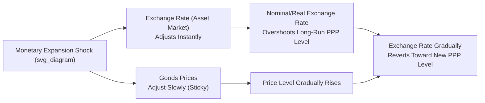

## Purchasing Power Parity

### Overview

Purchasing power parity (PPP) is a theory of exchange rate determination positing that, in the absence of transaction costs and trade barriers, exchange rates adjust so that an identical basket of goods costs the same when expressed in a common currency across countries. It provides both a long-run equilibrium benchmark for exchange rates and a widely used cross-country comparison methodology for real income and output.

### Absolute Purchasing Power Parity

**Formal statement**: The exchange rate equals the ratio of price levels between two countries.

$$S = \frac{P}{P^*}$$

Where $S$ is the nominal exchange rate (domestic currency per unit of foreign currency), $P$ is the domestic price level, and $P^*$ is the foreign price level.

**Underlying mechanism — the Law of One Price (LOOP)**: For any individual tradable good $i$:

$$P_i = S \cdot P_i^*$$

If this did not hold, arbitrageurs could buy the good where cheap and sell where expensive, earning riskless profit until prices converge (adjusted for the exchange rate). Absolute PPP is essentially the Law of One Price aggregated across an entire basket of goods comprising the price index.

**Key Points**

- Absolute PPP requires that the *same basket* with *identical weights* is priced in both countries — a condition rarely satisfied in practice, since consumption baskets used to construct CPI or other price indices differ substantially by country (reflecting different consumption patterns, non-traded services, and quality differences).
- Even if the Law of One Price holds for every individual traded good, absolute PPP can fail at the aggregate price-index level if basket composition or weights differ across countries.
- Non-traded goods and services (housing, haircuts, local labor-intensive services) are not subject to the arbitrage mechanism underlying LOOP, since they cannot be shipped across borders, which systematically breaks absolute PPP — this is central to the Balassa-Samuelson effect (below).

### Relative Purchasing Power Parity

**Formal statement**: The *percentage change* in the exchange rate over time equals the inflation differential between the two countries, rather than requiring price *levels* to be equal.

$$\frac{S_t - S_{t-1}}{S_{t-1}} \approx \pi - \pi^*$$

Or in a commonly used approximate log-differenced form:

$$\Delta s_t = \pi_t - \pi_t^*$$

Where $\Delta s_t$ is the percentage change in the exchange rate, and $\pi_t, \pi_t^*$ are domestic and foreign inflation rates.

**Key Points**

- Relative PPP is a weaker condition than absolute PPP: it does not require price levels to be equalized, only that *changes* in the exchange rate offset *inflation differentials*, preserving relative competitiveness over time.
- Relative PPP can hold even when absolute PPP fails persistently (e.g., due to a constant wedge from non-traded goods), as long as that wedge remains stable over time.
- This relationship underlies the intuition that a country with persistently higher inflation than its trading partners should see its currency depreciate proportionally to maintain constant relative purchasing power / competitiveness.

### The Real Exchange Rate

PPP is most directly assessed through the **real exchange rate**, defined as:

$$Q = \frac{S \cdot P^*}{P}$$

Where $Q$ is the real exchange rate (a measure of relative purchasing power / competitiveness).

**Key Points**

- If absolute PPP holds continuously, $Q = 1$ at all times (or is stationary around a constant if using an index form).
- Deviations of $Q$ from its PPP-implied level represent real exchange rate misalignment — the currency is "overvalued" (foreign goods cheap in domestic-currency terms, $Q < $ PPP benchmark) or "undervalued" ($Q > $ PPP benchmark).
- The real exchange rate is a key input to open-economy macro models (Mundell-Fleming, New Keynesian open-economy models) as the variable governing the competitiveness channel of net exports.
- Empirically, real exchange rates exhibit large and persistent swings around their PPP-implied levels, contradicting the strict continuous-parity version of the theory.

### Empirical Evidence and PPP Puzzles

**1. Short-Run PPP Failure**

Nominal and real exchange rates are far more volatile in the short run than relative price levels, and this volatility is poorly explained by inflation differentials alone. This decoupling is attributed to:

- Sticky nominal goods prices combined with flexible asset (exchange rate) markets — consistent with the **Dornbusch overshooting model**, where exchange rates react instantly to monetary shocks while goods prices adjust slowly, causing the exchange rate to temporarily overshoot its long-run PPP-consistent level.
- Capital account/financial market shocks (portfolio flows, interest rate differentials, risk sentiment) that dominate short-run exchange rate movements, independent of goods-market price dynamics.

**2. The PPP Puzzle (Rogoff, 1996)**

Kenneth Rogoff's influential survey identified a puzzle: real exchange rate deviations from PPP show extremely **long half-lives**, typically estimated in the range of three to five years, even though the sources of these deviations (nominal price/wage stickiness) should, in standard sticky-price models, dissipate over a much shorter horizon (a year or two).

[Inference] Reconciling the persistence of PPP deviations (implying near-random-walk exchange rate behavior in the short-to-medium run) with the slow adjustment implied by conventional sticky-price models remains only partially resolved in the literature, despite substantial subsequent research (e.g., nonlinear adjustment models, aggregation bias explanations, and heterogeneous-goods models).

**3. Unit Root Tests and Long-Run Mean Reversion**

Standard time-series unit root tests (e.g., Augmented Dickey-Fuller) frequently **fail to reject** the hypothesis that real exchange rates follow a random walk (no mean reversion to a PPP level) over typical post-Bretton-Woods floating-era sample lengths, due to low statistical power given persistent, slow-moving series. However, studies using very long historical time spans (a century or more) or panel data methods (pooling many country pairs to increase statistical power) more often find evidence of mean reversion consistent with long-run PPP holding, albeit with the long half-lives described above.

### The Balassa-Samuelson Effect

**Core mechanism**: A systematic explanation for why absolute PPP fails persistently, particularly between rich and poor countries — specifically, why price levels in higher-income countries tend to be systematically higher than PPP-implied parity would predict.

**Model logic**:

1. Productivity growth is typically faster in the **traded goods sector** (manufacturing) than the **non-traded goods sector** (services) in fast-growing/developing economies.
2. In the traded sector, the Law of One Price holds approximately, so traded-goods prices are pinned to world prices.
3. Faster productivity growth in tradables allows wages in that sector to rise without pushing up traded-goods prices (higher output per worker absorbs the wage increase).
4. Labor mobility between sectors pulls non-traded-sector wages up to match, but since non-traded-sector productivity has not risen commensurately, this wage increase is passed through into **higher non-traded goods prices**.
5. The overall domestic price level (traded + non-traded basket) therefore rises relative to the trading partner, even though the traded-goods component alone still satisfies the Law of One Price.

**Key implication**: This explains the empirical regularity that price levels (and real exchange rates measured against a common currency) are systematically higher in richer, faster-growing economies — a central reason why per-capita income comparisons using market exchange rates diverge substantially from those using PPP-adjusted exchange rates.

### PPP as a Measurement Tool: The Penn World Table / ICP

Beyond its role as an exchange rate theory, PPP exchange rates are constructed and used extensively for cross-country real income and output comparisons, most notably via the **International Comparison Program (ICP)**, coordinated by the World Bank, which underlies datasets such as the **Penn World Table**.

**Key Points**

- PPP-adjusted GDP figures correct for the fact that market exchange rates do not reflect relative domestic purchasing power (per the Balassa-Samuelson effect and other distortions), producing more meaningful comparisons of living standards and real output across countries with very different price levels.
- The **Big Mac Index**, published by *The Economist*, is a well-known informal illustration of PPP using a single standardized good (a McDonald's Big Mac) as a simplified basket, illustrating both the intuition of PPP and its practical limitations (the Big Mac itself has a substantial non-traded-input/labor cost component, subject to Balassa-Samuelson-type distortion).
- [Unverified] The precision of PPP conversion factors from ICP rounds is subject to ongoing methodological debate regarding basket comparability, particularly for services and non-market government output across very different economies; users of PPP-GDP figures should treat cross-round comparisons with some caution.

### Diagram: PPP Deviation Dynamics (Dornbusch Overshooting Context)

### Worked Example: Relative PPP Application

**Example**

Suppose the domestic country has annual inflation of 6%, while the foreign country (US) has annual inflation of 2%. The current spot exchange rate is $S_0 = 50$ (domestic currency per USD).

Relative PPP predicts the exchange rate change:

$$\Delta s \approx \pi - \pi^* = 6\% - 2\% = 4\%$$

The domestic currency should depreciate by approximately 4% over the year to preserve relative purchasing power:

$$S_1 \approx S_0 \times (1 + 0.04) = 50 \times 1.04 = 52$$

**Conclusion**: if actual depreciation over the period differs substantially from this 4% benchmark (which empirically it very often does, especially over short horizons), this represents a real exchange rate deviation from relative PPP, consistent with the well-documented short-run PPP failure discussed above; over sufficiently long horizons, empirical studies find such deviations tend to narrow, though with the multi-year half-lives noted in the PPP puzzle literature.

### Related Topics

- Dornbusch exchange rate overshooting model
- Balassa-Samuelson effect and cross-country price level divergence
- Real exchange rate determinants beyond PPP (terms of trade, net foreign assets)
- Uncovered and covered interest rate parity
- Big Mac Index and informal PPP benchmarks
- Penn World Table / International Comparison Program methodology
- PPP puzzle and half-life estimation techniques
- Nominal versus real exchange rate volatility in floating regimes