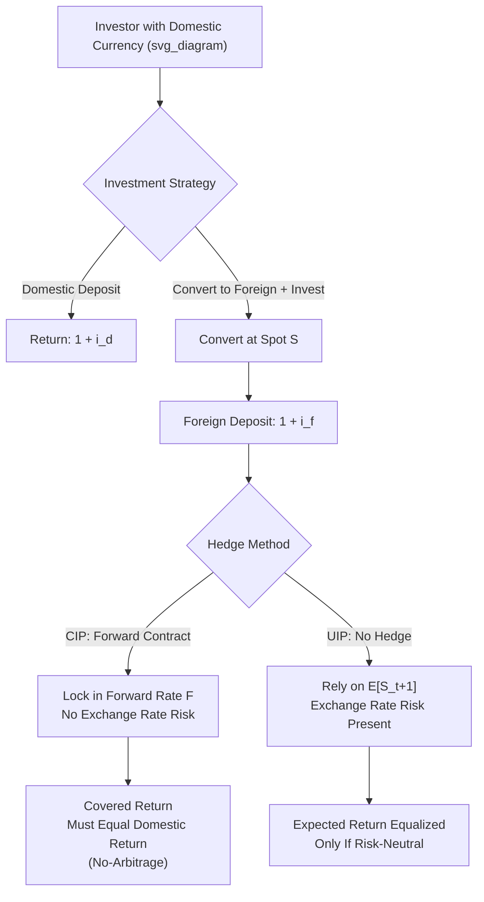

## Covered and Uncovered Interest Rate Parity

### Overview

Interest rate parity conditions link spot and forward exchange rates to interest rate differentials between two currencies, forming the core no-arbitrage relationships in international finance. **Covered interest parity (CIP)** is a near-arbitrage condition holding under free capital mobility, using forward contracts to eliminate exchange rate risk. **Uncovered interest parity (UIP)** replaces the forward rate with the *expected future spot rate*, introducing exchange rate risk and expectations, and is central to open-economy monetary models including the Mundell-Fleming framework and the exchange rate trilemma.

### Covered Interest Rate Parity (CIP)

**Formal statement**: The forward exchange rate premium/discount exactly offsets the interest rate differential between two currencies, such that hedged (covered) returns on equivalent assets in either currency are equalized.

$$1 + i_d = \frac{F}{S}(1 + i_f)$$

Rearranged into the commonly used approximate form:

$$\frac{F - S}{S} \approx i_d - i_f$$

Where $S$ is the spot exchange rate, $F$ is the forward exchange rate (both quoted as domestic currency per unit of foreign currency), $i_d$ is the domestic interest rate, and $i_f$ is the foreign interest rate, both over the matching maturity as the forward contract.

**Arbitrage mechanism**:

1. An investor with domestic currency can either (a) invest domestically at $i_d$, or (b) convert to foreign currency at spot $S$, invest at $i_f$, and simultaneously sell the foreign-currency proceeds forward at $F$ to lock in the domestic-currency return with no exchange rate risk.
2. If the two strategies yield different domestic-currency returns, a riskless arbitrage opportunity exists: borrow in the low-return currency, invest in the high-return currency, and use the forward contract to hedge the conversion back.
3. Such arbitrage (called **covered interest arbitrage**) should be exploited until the interest differential and the forward premium/discount converge — this is CIP.

**Key Points**

- CIP is a **pure no-arbitrage condition** involving *no exchange rate risk* (the forward locks in the future conversion rate) and, in principle, no expectations component — the two investment strategies produce known, comparable outcomes as of today.
- CIP historically held extremely tightly (to within transaction-cost bounds) among major currencies prior to the 2008 Global Financial Crisis, and was treated as close to a hard arbitrage identity in textbook treatments.
- Since 2008, persistent and economically significant **CIP deviations** have been widely documented in the empirical literature (Du, Tepper, and Verdelhan, 2018, among others), particularly in USD cross-currency bases, attributed to post-crisis regulatory constraints (balance-sheet costs, leverage ratio requirements under Basel III) limiting banks' capacity to conduct pure arbitrage even when profitable opportunities appear to exist, plus differential demand for dollar funding across counterparties.
- [Inference] The persistence of CIP deviations is generally interpreted in the literature as reflecting genuine limits to arbitrage from regulatory and balance-sheet constraints on dealer banks, rather than measurement error, though the precise decomposition of contributing factors remains an active area of research.

### Uncovered Interest Rate Parity (UIP)

**Formal statement**: The expected change in the exchange rate equals the interest rate differential — the forward/hedging mechanism is replaced by the *expected* future spot rate, introducing exchange rate risk.

$$1 + i_d = \frac{E[S_{t+1}]}{S_t}(1 + i_f)$$

Approximate form:

$$E[\Delta s_{t+1}] \approx i_d - i_f$$

**Key Points**

- UIP requires investors to be **risk-neutral** (or that any risk premium is zero/constant) and to have **rational expectations** about future exchange rates for the condition to hold as a pure equality.
- Under UIP, a currency with a higher interest rate is expected to *depreciate* by an amount equal to the interest differential — the higher yield is exactly offset by expected currency losses, so expected returns are equalized across currencies without needing a forward hedge.
- UIP is the interest parity condition embedded in most standard open-economy macro models (Mundell-Fleming, Dornbusch overshooting, New Keynesian open-economy models) as the mechanism linking domestic and foreign interest rates under free capital mobility.

### The Relationship Between CIP, UIP, and the Forward Rate

If CIP holds (an empirical near-certainty pre-2008, and approximately still relevant for many currency pairs) and UIP also holds, then the forward rate must equal the *expected* future spot rate:

$$F_t = E[S_{t+1}]$$

This is the **unbiasedness hypothesis**: the forward rate is an unbiased predictor of the future spot rate. Testing this joint hypothesis (CIP + UIP) is the basis for most empirical UIP tests, since expected future spot rates are not directly observable but forward rates are.

### The Forward Premium Puzzle (Fama, 1984)

**Empirical test regression**:

$$\Delta s_{t+1} = \alpha + \beta \left(\frac{F_t - S_t}{S_t}\right) + \epsilon_{t+1}$$

Under UIP (and rational expectations), theory predicts $\alpha = 0$ and $\beta = 1$ — the forward premium should be an unbiased predictor of the subsequent exchange rate change, one-for-one.

**Key Points**

- The overwhelming majority of empirical studies find $\beta$ estimates that are **significantly less than 1**, and very frequently **negative** — implying that currencies with higher interest rates (a forward premium) tend to *appreciate* further, on average, rather than depreciate as UIP predicts. This is the celebrated **forward premium puzzle** or "Fama puzzle."
- This finding directly underlies the empirical profitability (historically) of the **carry trade** — borrowing in low-interest-rate currencies and investing in high-interest-rate currencies — which would have zero expected profit under UIP but has historically generated positive average (though negatively skewed, crash-risk-prone) returns.
- Leading explanations in the literature include:
  - **Time-varying risk premia**: UIP fails because a risk premium (compensating for exchange rate risk, which may be correlated with bad states of the world) drives a wedge between expected returns, and this premium varies over time in ways correlated with the interest differential itself.
  - **Peso problems**: small-sample bias where a low-probability, large depreciation/devaluation event has not yet occurred within the sample period, biasing regression estimates even if the true underlying UIP-consistent expectation is correct.
  - **Departures from rational expectations**: survey-based measures of exchange rate expectations often show systematic, predictable forecast errors inconsistent with full rational expectations, suggesting behavioral or learning-based explanations contribute to the puzzle.
  - **Limits to speculative capital / slow-moving capital**: constraints on the capital available to exploit the carry trade prevent full arbitrage of the interest differential, allowing the wedge to persist.
- [Inference] No single explanation is considered fully satisfactory in the literature; most current treatments regard the forward premium puzzle as reflecting a *combination* of time-varying risk premia and market frictions rather than a single dominant mechanism.

### Diagram: CIP vs UIP Structural Comparison

### Worked Example: CIP Arbitrage Check

**Example**

Given: $S = 1.10$ USD/EUR, one-year forward $F = 1.12$ USD/EUR, $i_{USD} = 5\%$, $i_{EUR} = 2\%$.

**CIP-implied forward rate**:

$$F_{CIP} = S \times \frac{1 + i_{USD}}{1 + i_{EUR}} = 1.10 \times \frac{1.05}{1.02} = 1.10 \times 1.0294 = 1.1324$$

The quoted forward ($F = 1.12$) is below the CIP-implied forward ($1.1324$), indicating a potential arbitrage opportunity (ignoring transaction costs and balance-sheet constraints):

1. Borrow EUR at 2%.
2. Convert EUR to USD at spot $S = 1.10$.
3. Invest USD at 5%.
4. Simultaneously sell USD forward for EUR at the actual quoted rate $F = 1.12$ to lock in the conversion back to EUR in one year.
5. Compare the guaranteed EUR return from this strategy against simply holding EUR at 2% — the arbitrage exploits the gap between quoted $F$ and CIP-implied $F_{CIP}$.

**Conclusion**: in efficient, frictionless markets this gap would be arbitraged away instantly; the persistence of such gaps in the post-2008 era (the CIP basis) is attributed to balance-sheet costs and regulatory constraints that impose an effective cost on conducting the arbitrage, rather than the complete absence of an arbitrage opportunity.

### Empirical and Policy Relevance

**Key Points**

- **Cross-currency basis swaps** provide a direct, continuously traded market measure of CIP deviations, widely monitored by central banks and dealers as an indicator of dollar funding stress, particularly during periods of financial market turmoil (2008 GFC, March 2020 COVID shock).
- Central bank **swap lines** (notably the Federal Reserve's dollar swap lines with major central banks) are explicitly designed to relieve dollar funding pressures that manifest as widened CIP deviations during crises.
- UIP's empirical failure has significant implications for open-economy monetary model calibration: many modern models incorporate an explicit, often time-varying, risk premium term to reconcile theory with the forward premium puzzle rather than assuming pure UIP holds.
- For exchange rate forecasting, the empirical failure of UIP means that simple interest-differential-based forecasts do not outperform a random walk in most out-of-sample tests — a finding closely related to the broader **Meese-Rogoff (1983) puzzle** regarding the general difficulty of beating a random walk in short-to-medium-horizon exchange rate forecasting.

### Related Topics

- Forward premium puzzle and carry trade strategies
- Meese-Rogoff exchange rate forecasting puzzle
- Cross-currency basis swaps and dollar funding stress indicators
- Central bank swap lines and crisis liquidity provision
- Capital mobility and the monetary policy trilemma
- Dornbusch overshooting model
- Time-varying risk premia in international asset pricing
- Purchasing power parity and long-run exchange rate determination