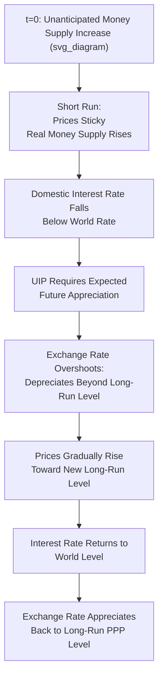

## Monetary Approach to Exchange Rate Determination

### Overview

The monetary approach to exchange rate determination treats the nominal exchange rate as the relative price of two national monies, determined by the relative supply and demand for those monies. It represents an asset-market view of exchange rate determination, in contrast to the flow-based, trade-balance-driven models of earlier traditions. The approach has two principal variants: the **flexible-price monetary model** (assuming continuous PPP) and the **sticky-price (Dornbusch) monetary model** (allowing short-run overshooting).

### Foundational Framework

The monetary approach builds on three core building blocks:

1. **Money market equilibrium** (domestic and foreign), based on standard money demand functions.
2. **Purchasing power parity**, linking price levels to the exchange rate (continuously in the flexible-price version, only in the long run in the sticky-price version).
3. **Uncovered interest rate parity**, linking domestic and foreign interest rates to expected exchange rate changes.

**Standard money demand specification**:

$$M = P \cdot L(Y, i)$$

Or in log-linear form:

$$m = p + \phi y - \lambda i$$

Where $m$, $p$, $y$ are logs of money supply, price level, and real income, $i$ is the nominal interest rate, and $\phi, \lambda$ are the income elasticity and interest semi-elasticity of money demand, respectively.

### The Flexible-Price Monetary Model (Frenkel-Bilson)

**Core assumption**: Goods prices are fully flexible, so PPP holds continuously — $S = P/P^*$ at every point in time.

**Derivation**: Combining money market equilibrium in both countries with continuous PPP:

$$m - m^* = (p - p^*) + \phi(y - y^*) - \lambda(i - i^*)$$

Since $s = p - p^*$ under continuous PPP:

$$s = (m - m^*) - \phi(y - y^*) + \lambda(i - i^*)$$

**Key Points**

- **Relative money supply**: a relative increase in domestic money supply ($m - m^*$) causes a **proportional depreciation** of the domestic currency ($s$ rises, meaning more domestic currency per unit of foreign currency) — this follows directly from PPP linking money supply growth to domestic inflation, which then depreciates the currency.
- **Relative income**: a relative increase in domestic real income ($y - y^*$) causes **appreciation** (lower $s$), because higher income raises domestic money *demand*, which — for a given money supply — requires a higher domestic price level's inverse (i.e., lower prices) to clear the money market, appreciating the currency via PPP. [Note: some textbook treatments frame this via the transactions-demand channel with the sign as presented.]
- **Relative interest rates**: a relative increase in the domestic interest rate ($i - i^*$) causes **depreciation** (higher $s$) in the flexible-price model. This works through reduced domestic money demand (higher opportunity cost of holding money) at a given money supply, which raises the price level via the quantity-theory-like money market clearing condition, and PPP then transmits this into currency depreciation.
- This last result is often considered counterintuitive relative to simple partial-equilibrium interest-parity reasoning (which would suggest higher $i$ attracts capital and appreciates the currency); the flexible-price monetary model's prediction depends on the interest rate rise reflecting **higher expected inflation** (via the Fisher relation) rather than a real interest rate shock, since it operates through the money-demand channel under full price flexibility.

### The Fisher Effect and Its Role

The counterintuitive interest rate result above hinges on the **Fisher equation**:

$$i = r + \pi^e$$

Under the flexible-price model, a nominal interest rate increase is typically interpreted as reflecting higher expected inflation ($\pi^e$) rather than a change in the real interest rate ($r$), since prices are assumed fully flexible and monetary neutrality holds. Higher expected inflation directly implies expected currency depreciation (via UIP/PPP consistency), which is the mechanism generating the model's counterintuitive interest-rate-depreciation link.

[Inference] This channel is best understood as applying to interest rate differentials driven by *inflation expectations differentials* rather than *real* monetary policy tightening; the model's prediction can appear paradoxical if the underlying source of the interest rate change is not made explicit, a point frequently emphasized in graduate-level treatments to avoid misapplication.

### The Sticky-Price Monetary Model (Dornbusch, 1976)

**Core departure**: Goods prices are **sticky in the short run** (do not adjust instantaneously), while the exchange rate and interest rate are determined in efficient asset markets and adjust instantly to new information. PPP holds only as a **long-run** condition, not continuously.

**Model mechanics — sequence following a monetary expansion**:

1. **Long-run (PPP) equilibrium level**: an unanticipated, permanent increase in the money supply implies a proportional long-run depreciation of the currency (per the flexible-price logic, since prices eventually adjust fully).
2. **Short-run asset market response**: because goods prices are sticky, the *real* money supply ($M/P$) rises in the short run (nominal $M$ increases, $P$ unchanged initially), lowering the domestic interest rate below the world rate via LM-curve-type money market clearing.
3. **UIP requires exchange rate expectations to reconcile the lower domestic rate**: with $i_d < i_f$, UIP requires the domestic currency to be *expected to appreciate* going forward to compensate international investors for accepting the lower interest rate. This can only be consistent with rational expectations if the exchange rate **depreciates immediately by more than its long-run equilibrium level** — "overshooting" — so that the subsequent expected appreciation back toward the long-run level offsets the interest differential.
4. **Gradual adjustment**: over time, sticky prices gradually rise toward their new long-run level, the real money supply gradually returns to normal, the domestic interest rate rises back to $i_f$, and the exchange rate appreciates back from its overshot level to the new long-run PPP-consistent level.

**Key implication — exchange rate overshooting**: The nominal (and real) exchange rate's *immediate* response to a monetary shock exceeds its *long-run* equilibrium response, then partially reverses over time — providing a rationalization for the empirically observed excess volatility of exchange rates relative to fundamentals (an issue the pure flexible-price model cannot explain, since it implies exchange rates should move roughly in proportion to relative money supplies at all times).

### Diagram: Dornbusch Overshooting Time Path

### Comparing the Two Model Variants

| Feature | Flexible-Price Model (Frenkel-Bilson) | Sticky-Price Model (Dornbusch) |
| --- | --- | --- |
| Price adjustment | Instantaneous | Gradual/sticky |
| PPP | Holds continuously | Holds only in the long run |
| Interest rate ↑ effect on $S$ | Depreciation (via inflation expectations) | Appreciation in the short run (via UIP and sticky prices), consistent with conventional intuition |
| Exchange rate volatility | Proportional to money supply/fundamentals | Can overshoot fundamentals, generating excess short-run volatility |
| Best empirical fit | Weak — doesn't explain short-run exchange rate volatility | Better rationalizes observed short-run volatility, though [Inference] still faces substantial empirical challenges (e.g., Meese-Rogoff) in out-of-sample forecasting performance |

### Empirical Assessment: The Meese-Rogoff Puzzle

Meese and Rogoff (1983) tested structural exchange rate models, including monetary-approach models, against a naive random-walk forecast and found that **none of the structural models — including the monetary approach — could consistently outperform a simple random walk** in out-of-sample exchange rate forecasting, even when the models were given the benefit of actual (rather than forecasted) realized values of their own right-hand-side fundamentals.

**Key Points**

- This result has proven remarkably robust across subsequent decades of research and remains one of the most cited puzzles in international finance.
- [Inference] Interpretations vary: some attribute the puzzle to fundamental model misspecification (omitted variables, wrong functional form), others to the difficulty of accurately measuring/forecasting the underlying fundamentals (money supply, income, interest rates) themselves even if the model were structurally correct, and others to time-varying risk premia and expectational factors not well captured by simple monetary fundamentals.
- Later research (e.g., using panel methods, long horizons, or specific subsamples) has found some evidence of monetary-model forecasting power under certain conditions, but a robust, generally accepted resolution of the puzzle across all specifications and periods has not been established.

### Extensions and Related Frameworks

**Key Points**

- **Portfolio-balance models** extend the monetary approach by relaxing the assumption of perfect asset substitutability, allowing domestic and foreign bonds to be imperfect substitutes, which introduces a role for relative bond *stocks* (not just money) and current account financing flows in exchange rate determination.
- **New Open Economy Macroeconomics (NOEM)** models (e.g., Obstfeld and Rogoff's Redux model, 1995) provide fully micro-founded, utility-maximizing general equilibrium versions incorporating sticky prices, monopolistic competition, and welfare analysis, superseding the more ad hoc money-demand specification of the classic monetary approach while preserving its core mechanisms.
- The monetary approach's emphasis on relative money supply growth as a long-run exchange rate driver remains consistent with, and is often taught alongside, relative PPP as a long-run anchor, even though the specific short-run dynamics differ substantially between the flexible- and sticky-price variants.

### Worked Example: Flexible-Price Model Application

**Example**

Suppose domestic money supply grows 8% while foreign money supply grows 3% ($m - m^* = 5\%$); domestic real income grows 2% faster than foreign ($y - y^* = 2\%$, with $\phi = 1$); interest differential is negligible ($i - i^* \approx 0$).

Using the flexible-price monetary model:

$$s \approx (m - m^*) - \phi(y - y^*) = 5\% - (1)(2\%) = 3\%$$

**Conclusion**: the model predicts approximately 3% depreciation of the domestic currency — the excess money growth effect (5%) is partially offset by the higher relative income growth effect (2%), since stronger income growth raises money demand and provides some support for the currency, consistent with the model's structural predictions.

### Related Topics

- Dornbusch overshooting model (detailed derivation and diagrammatic analysis)
- Purchasing power parity: absolute and relative forms
- Uncovered interest rate parity and the forward premium puzzle
- Meese-Rogoff puzzle and exchange rate forecasting
- Portfolio-balance models of exchange rate determination
- New Open Economy Macroeconomics (Redux model)
- Fisher effect and inflation expectations
- Money demand function specification and estimation