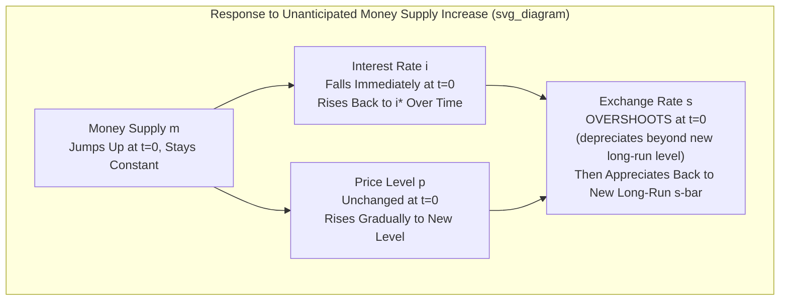

## The Dornbusch Overshooting Model

### Overview

The Dornbusch overshooting model (Dornbusch, 1976) is a foundational sticky-price monetary model of exchange rate determination that reconciles the empirical observation of excess exchange rate volatility with an underlying rational, no-arbitrage asset market. Its central result is that nominal and real exchange rates can **overshoot** their long-run equilibrium level in response to a monetary shock, subsequently reverting gradually as goods prices adjust — providing the first rigorous theoretical explanation for why exchange rates are so much more volatile than the macroeconomic fundamentals that are supposed to drive them.

### Core Assumptions

**Key Points**

- **Sticky goods prices in the short run**: domestic price level $P$ is predetermined at any point in time and adjusts only gradually, reflecting nominal rigidities (menu costs, contracts, slow information diffusion).
- **Perfectly flexible asset prices**: the exchange rate and interest rate are determined in efficient, forward-looking asset markets and can jump instantaneously in response to news.
- **Perfect capital mobility** with **uncovered interest rate parity (UIP)** holding continuously.
- **Rational expectations**: agents correctly anticipate the future path of the economy, including the eventual full adjustment of prices.
- **Long-run purchasing power parity (PPP)** holds once prices have fully adjusted, anchoring the model's long-run equilibrium exchange rate.
- **Small open economy**: domestic policy actions do not affect the foreign interest rate $i^*$, which is treated as exogenous.

### Model Structure

**1. Money Market Equilibrium (short run)**

$$m - p = \phi y - \lambda i$$

With $y$ typically held fixed at its natural/full-employment level in the simplest version, so short-run money market adjustments operate primarily through $i$ given sticky $p$.

**2. Uncovered Interest Parity**

$$i = i^* + \dot{s}^e$$

Where $\dot{s}^e$ is the expected rate of change (continuous-time) of the exchange rate. A domestic interest rate below the foreign rate requires the domestic currency to be *expected to appreciate* to equalize expected returns.

**3. Long-Run Price Adjustment (expectations-augmented Phillips-curve-type dynamics)**

$$\dot{p} = \theta(\bar{s} + p^* - p) \quad \text{or equivalently modeled via excess demand}$$

Prices adjust gradually toward their long-run equilibrium level, with the adjustment speed governed by $\theta$; excess demand for domestic goods (partly driven by real exchange rate misalignment) drives inflationary or disinflationary pressure.

**4. Long-Run PPP Anchor**

$$\bar{s} = \bar{p} - p^*$$

The long-run (bar-denoted) equilibrium exchange rate satisfies PPP once prices have fully adjusted to their new steady-state level, consistent with the new, permanently higher money supply.

### The Overshooting Mechanism, Step by Step

Consider an **unanticipated, permanent increase** in the domestic money supply $m$ at time $t=0$.

**Step 1 — Long-run equilibrium shifts**: Since money is neutral in the long run and PPP holds once prices fully adjust, the long-run price level rises proportionally with $m$, and the long-run exchange rate $\bar{s}$ depreciates proportionally: $\Delta \bar{s} = \Delta m$.

**Step 2 — Short-run price stickiness**: At $t=0^+$, $p$ has not yet moved (it is predetermined/sticky). The **real** money supply $m - p$ therefore rises immediately and by the full amount of the nominal increase.

**Step 3 — Domestic interest rate falls**: To clear the money market with a higher real money supply and unchanged $y$, the domestic interest rate $i$ must fall below $i^*$ (movement along the money demand curve, per the LM-type relationship).

**Step 4 — UIP requires expected appreciation**: With $i < i^*$, UIP requires $\dot{s}^e < 0$ — the currency must be *expected to appreciate* going forward, to compensate investors for accepting the lower domestic interest rate relative to the (unchanged) foreign rate.

**Step 5 — Rational expectations pin down the overshoot**: The only way the exchange rate can be expected to appreciate from time $0^+$ onward, while consistently converging to the *new, more depreciated* long-run level $\bar{s}$, is if the exchange rate **jumps immediately past** $\bar{s}$ at $t=0$ — i.e., **overshoots** — and then appreciates gradually back toward $\bar{s}$ as prices adjust and the interest differential closes.

**Step 6 — Gradual convergence**: As time passes, sticky prices $p$ gradually rise toward their new long-run level $\bar{p}$, the real money supply gradually falls back toward its original level, the domestic interest rate rises back toward $i^*$, and correspondingly the exchange rate appreciates from its overshot peak back down to $\bar{s}$, arriving there exactly as $p$ reaches $\bar{p}$.

### Diagram: Overshooting Time Paths

### The Overshooting Result in Phase-Diagram Form

The standard Dornbusch model is typically presented using a phase diagram in $(p, s)$ space with two key loci:

- **Goods market equilibrium (Δp = 0 locus)**: downward-sloping, representing combinations of price level and exchange rate consistent with zero price change (goods market equilibrium given the real exchange rate's effect on aggregate demand).
- **Money market equilibrium / UIP locus (Δs = 0 locus)**: vertical line at $p = m - \phi y + \lambda i^*$ (approximately), representing the price level consistent with money market equilibrium at the foreign interest rate — since in steady state $i = i^*$ (no expected exchange rate change).

**Key Points**

- The system exhibits a **unique saddle-path** converging to the new steady state following the money supply shock; rational expectations require the exchange rate to jump immediately onto this saddle path at $t=0$, which is precisely the overshooting jump.
- Any other immediate jump size would place the economy on a trajectory that either diverges from equilibrium (violating a transversality/no-bubble condition) or fails to satisfy the required consistency between asset-market equilibrium and the exogenously given (sticky) initial price level.
- The magnitude of overshooting is governed by the interest semi-elasticity of money demand $\lambda$ and the speed of price adjustment $\theta$: overshooting is **larger** when money demand is less interest-elastic (small $\lambda$, since a given real money supply change requires a larger interest rate swing to clear the market) and when prices adjust **more slowly** (small $\theta$, since a longer adjustment period requires a correspondingly extreme initial jump to satisfy UIP over that longer horizon).

### Formal Overshooting Magnitude

A commonly cited closed-form result (under specific functional-form assumptions) for the degree of overshooting is:

$$s(0) - \bar{s} = \frac{1}{\lambda\theta}(m - \bar{p}_{old})$$

Where the overshoot magnitude is inversely related to both $\lambda$ (interest semi-elasticity of money demand) and $\theta$ (speed of price adjustment) — confirming that stickier prices and less interest-elastic money demand both generate larger overshooting.

[Inference] The exact closed-form expression varies somewhat by textbook depending on specific functional form and linearization assumptions; the qualitative comparative-statics results (overshooting magnitude decreasing in $\lambda$ and $\theta$) are the more robust and commonly examined takeaway.

### Worked Example: Overshooting Illustration

**Example**

Suppose the money supply increases by 10% (permanent, unanticipated), the long-run exchange rate depreciation is therefore also 10% (from PPP-consistency), but empirical/calibrated estimates of $\lambda$ and $\theta$ imply an overshooting multiplier such that the *initial* jump is 15% depreciation.

1. At $t = 0^+$: exchange rate depreciates immediately by 15% (from, say, $S=100$ to $S=115$) — this is the overshoot, exceeding the 10% long-run depreciation.
2. Domestic interest rate falls below $i^*$ due to the temporarily expanded real money supply.
3. Over subsequent months/years, as $p$ gradually rises toward its new long-run level, the real money supply normalizes, $i$ rises back toward $i^*$, and the exchange rate **appreciates** from $S=115$ back down to the long-run level $S=110$ (the 10% depreciation consistent with PPP).
4. **Conclusion**: an observer examining only the exchange rate's path between $t=0$ and the new long-run equilibrium would see the currency depreciate sharply and then partially reverse — a pattern fully consistent with rational, efficient asset markets under sticky goods prices, not evidence of irrationality or bubbles.

### Empirical Relevance and Assessment

**Key Points**

- The model's central achievement is providing a **rational-expectations-consistent explanation for excess exchange rate volatility**, addressing a major shortcoming of the flexible-price monetary model (which implies exchange rates move roughly proportionally with relative fundamentals at all times).
- Direct empirical tests of overshooting are complicated by the difficulty of cleanly identifying unanticipated, permanent monetary shocks in real-world data (most monetary policy changes are at least partially anticipated or are responses to other economic conditions, confounding clean identification).
- [Inference] While the specific structural mechanism (sticky prices generating asset-market overshooting) is not universally taken as a literal, precise description of real-world exchange rate dynamics, the model's qualitative insight — that flexible asset prices can overshoot long-run equilibrium levels when other prices are sticky — remains a foundational concept in open-economy macroeconomics and is widely taught as the canonical explanation for exchange rate volatility.
- The model contributed to the broader **Meese-Rogoff** empirical research agenda, since Dornbusch-style overshooting dynamics were among the structural models tested against (and generally not found to outperform) the random-walk benchmark in the original and subsequent studies.
- The overshooting logic has been extended and incorporated into modern **New Open Economy Macroeconomics (NOEM)** models with fully micro-founded sticky-price general equilibrium structures (e.g., Obstfeld-Rogoff Redux model), which preserve the core overshooting intuition while adding welfare analysis and richer general-equilibrium feedback.

### Limitations and Critiques

**Key Points**

- The model assumes output $y$ is fixed, abstracting from any demand-driven output effects of the exchange rate/monetary shock — later extensions relax this to allow output to respond, which can modify (typically dampen) the overshooting result.
- The specific price-adjustment equation is somewhat ad hoc (not derived from optimizing agent behavior) compared to later fully micro-founded New Keynesian open-economy models.
- The model assumes a single unanticipated shock in isolation; real-world exchange rate dynamics reflect continuous streams of news and shocks, making the clean overshoot-then-converge pattern difficult to isolate empirically even if the underlying mechanism is operative.
- The model does not incorporate risk premia, so it cannot address the forward premium puzzle's empirical failure of UIP — the model *assumes* UIP holds continuously, which is itself an empirically contested assumption per the associated interest-parity literature.

### Related Topics

- Monetary approach to exchange rate determination (flexible-price variant)
- Uncovered interest rate parity and the forward premium puzzle
- Purchasing power parity: long-run anchor role
- Meese-Rogoff exchange rate forecasting puzzle
- New Open Economy Macroeconomics (Obstfeld-Rogoff Redux model)
- Phase diagram / saddle-path analysis in continuous-time macro models
- Exchange rate volatility and asset-market approaches
- Central bank credibility and anticipated versus unanticipated policy shocks