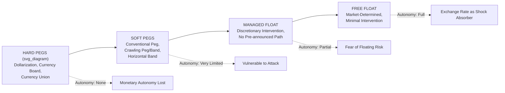

## Fixed, Floating, and Managed Exchange Rate Regimes

### Overview

Exchange rate regimes describe the institutional framework governing how a country's currency value is determined relative to other currencies, ranging from rigidly fixed arrangements to freely floating markets, with a broad spectrum of intermediate "managed" regimes in between. Regime choice is a central policy decision shaping monetary autonomy, external adjustment mechanisms, credibility, and vulnerability to speculative attack, and is directly governed by the trade-offs formalized in the monetary policy trilemma.

### Classification Spectrum

**Key Points**

- Exchange rate regimes are conventionally arrayed along a spectrum from "hardest" fixed arrangements to purest floats; the **IMF's *de facto* classification system** (distinct from countries' own *de jure* announced regimes) is the standard reference taxonomy used in empirical and policy work, given that many countries' actual currency behavior diverges from their official stated regime.
- The classification matters because de jure and de facto behavior frequently diverge — the **"fear of floating"** phenomenon (Calvo and Reinhart, 2002) documents that many officially "floating" emerging markets in practice exhibit exchange rate volatility far below what a genuine float would produce, alongside heavy reserve and interest rate volatility indicating substantial covert intervention.

### Hard Pegs

**1. Dollarization / Currency Substitution**

A country abandons its own currency entirely and adopts another country's currency (typically the US dollar) as legal tender.

**Key Points**

- Complete elimination of independent monetary policy and of any exchange rate risk vis-à-vis the anchor currency; no seigniorage revenue retained domestically (or only partial, via de facto arrangements).
- Examples: Ecuador (2000, post-crisis), El Salvador (2001), Panama (long-standing dollarization).
- Provides maximum credibility against currency crises of the classic first- and second-generation type (no domestic currency exists to attack), but eliminates the exchange rate as a shock absorber and eliminates the central bank's lender-of-last-resort capacity in domestic currency.

**2. Currency Board**

A strict institutional arrangement where the monetary authority issues domestic currency **fully backed** by foreign reserves at a fixed, legally mandated conversion rate, with the money supply mechanically determined by reserve flows.

**Key Points**

- Domestic currency issuance is constrained to be at least 100% backed by foreign reserves (often the anchor currency), eliminating discretionary domestic credit creation by the central bank.
- Provides very high credibility (the mechanical backing rule is difficult to reverse without an explicit legislative/institutional change) but **removes the lender-of-last-resort function**, creating vulnerability during banking crises since the central bank cannot freely create domestic liquidity to support banks.
- Examples: Hong Kong Monetary Authority (HKD pegged to USD since 1983, ongoing), Bulgaria (lev pegged to euro), Estonia and Lithuania (pre-euro adoption), and historically Argentina's convertibility system (1991–2002), whose collapse illustrated the fragility of currency boards when fiscal and banking-sector pressures overwhelm the mechanical rule.

**3. Currency Union**

Multiple sovereign countries adopt a single common currency, ceding monetary policy entirely to a shared, supranational central bank.

**Key Points**

- The **Eurozone** (European Central Bank, 20 member states as of the mid-2020s) is the preeminent modern example, alongside smaller currency unions such as the **CFA franc zone** (West African and Central African Economic and Monetary Communities, pegged to the euro).
- Member states sacrifice fully independent monetary policy in exchange for eliminated intra-union exchange rate risk, potentially greater trade integration, and shared credibility — but lose the exchange rate as an adjustment tool for asymmetric ("idiosyncratic") shocks affecting individual members differently, a central concern of **optimum currency area (OCA) theory**.
- The Eurozone sovereign debt crisis (2010–2012, particularly Greece, Ireland, Portugal, Spain) is frequently analyzed as illustrating the costs of forgoing independent monetary policy and nominal exchange rate adjustment when facing asymmetric shocks within a currency union lacking full fiscal integration or labor mobility.

### Soft Pegs and Intermediate Regimes

**1. Conventional Fixed Peg**

The currency is pegged to a single foreign currency or basket at a fixed (though not institutionally hard-wired) rate, with the central bank retaining discretion and capacity to adjust the peg if needed.

**Key Points**

- Retains some monetary policy discretion relative to hard pegs, but is generally vulnerable to the same speculative-attack dynamics described in first- and second-generation currency crisis models if fundamentals or credibility deteriorate.
- Examples: Saudi Arabia (riyal pegged to USD), most Gulf Cooperation Council states.

**2. Crawling Peg / Crawling Band**

The peg is adjusted according to a pre-announced or de facto formula (often tracking inflation differentials), rather than being held perfectly fixed, to accommodate ongoing but predictable adjustment needs.

**Key Points**

- Designed to maintain external competitiveness (real exchange rate stability) in the presence of persistent inflation differentials with the anchor country, consistent with relative PPP logic.
- A **crawling band** adds a permitted fluctuation range around the crawling central rate, providing additional flexibility while retaining a managed trajectory.
- Historical examples include Chile and Israel's use of crawling bands during disinflation processes in the 1980s–90s.

**3. Pegged within Horizontal Bands**

The exchange rate is permitted to fluctuate within an announced band around a central parity, wider than a conventional narrow peg but still constrained.

**Key Points**

- The pre-1992 **European Exchange Rate Mechanism (ERM)** is the canonical historical example, with bands typically at ±2.25% (narrow band) or ±6% (wide band, used by some members) around bilateral central parities.
- Wider bands provide somewhat greater monetary policy discretion and reduce (but do not eliminate) vulnerability to one-way speculative bets, since the band itself absorbs some pressure before intervention or realignment is required.

### Managed Floating Regimes

**Managed float (dirty float)**: The exchange rate is market-determined but subject to **discretionary central bank intervention** to influence its level or smooth volatility, without a pre-announced path or explicit target.

**Key Points**

- No formal commitment to a specific rate or band, distinguishing it from crawling pegs/bands, but intervention is active and can be substantial and unpredictable to outside observers.
- Common among many large emerging markets (India, China's post-2005 managed regime, and numerous others) seeking to retain some exchange rate stability benefits without the rigid commitment (and crisis vulnerability) of a formal peg.
- China's regime has evolved considerably: from a hard USD peg pre-2005, to a managed float referencing a currency basket with a daily trading band around a central parity (the "central parity rate" mechanism) from 2005 onward, with periodic adjustments to the band width and reference basket composition.

### Free Floating Regimes

**Key Points**

- The exchange rate is determined entirely by market forces, with the central bank not intervening to influence its level (though it may still conduct standard monetary policy operations affecting interest rates for domestic objectives).
- Provides maximum monetary policy autonomy (per the trilemma) and acts as an automatic shock absorber for external disturbances (terms-of-trade shocks, capital flow reversals) via nominal exchange rate adjustment rather than requiring costly internal price/wage adjustment.
- Examples: United States, United Kingdom, Japan, Eurozone (as a bloc vis-à-vis external currencies), Australia, Canada, and most other advanced, financially developed economies with credible independent central banks.
- The IMF's stricter de facto classification distinguishes **"free floating"** (minimal intervention, limited to exceptional circumstances) from simply **"floating"** (more frequent, though still not systematic, intervention) — few currencies fully qualify for the strictest "free floating" category in practice.

### Diagram: Regime Spectrum and Trilemma Trade-offs

### Regime Choice Trade-offs Summary

| Dimension | Fixed/Hard Peg | Intermediate/Managed | Free Float |
| --- | --- | --- | --- |
| Monetary autonomy | None to minimal | Partial | Full |
| Exchange rate risk (trade/investment) | Eliminated (hard peg) or low | Reduced but present | Full market risk |
| Nominal anchor for inflation | Strong (imported credibility) | Moderate | Depends on independent framework (e.g., inflation targeting) |
| Vulnerability to speculative attack | High (soft pegs); none (hard pegs, absent institutional collapse) | Moderate | Minimal (no fixed rate to defend) |
| Shock absorption capacity | Low (requires internal adjustment) | Partial | High (nominal exchange rate adjusts) |
| Credibility requirement | Very high institutional commitment needed | Moderate | Depends on alternative anchor (e.g., central bank credibility, inflation target) |

### The "Bipolar View" and Its Critique

**Key Points**

- Following the wave of emerging-market currency crises in the 1990s (Mexico 1994, Asia 1997–98, Russia 1998, Brazil 1999), a influential "**bipolar view**" (associated with economists including Stanley Fischer) argued that **intermediate regimes were inherently crisis-prone** and that countries with open capital accounts should migrate toward the two "corner solutions" — either a hard peg/currency union or a free float — avoiding the soft-peg middle ground vulnerable to speculative attack.
- This view gained substantial policy influence in the early 2000s but has since been qualified: many countries (particularly large emerging markets such as India, Brazil, and others) have continued to operate stable, apparently viable managed or intermediate regimes for extended periods, and the global proliferation of macroprudential tools and capital flow management measures has provided additional instruments to manage intermediate-regime vulnerabilities that were less available or less accepted at the time of the original bipolar thesis.
- [Inference] Current mainstream policy and academic opinion is generally regarded as more pluralistic than the strict bipolar view, treating regime choice as context-dependent on a country's financial development, trade structure, capital account openness, and institutional capacity, rather than mandating migration to corner solutions as a universal prescription.

### Optimum Currency Area (OCA) Considerations

**Key Points**

- OCA theory (Mundell, 1961; McKinnon, 1963; Kenen, 1969) identifies criteria under which fixing exchange rates (or forming a currency union) among a group of economies is likely to be beneficial: high labor mobility between members, high trade integration, similar business cycle synchronization, and fiscal transfer mechanisms to absorb asymmetric shocks.
- Regions/country groups satisfying OCA criteria well are better positioned to sustain fixed regimes or currency unions without excessive costs from forgone independent monetary policy, since alternative adjustment mechanisms (labor migration, fiscal transfers) can substitute for the lost exchange rate tool.
- The Eurozone's OCA credentials have been extensively debated in the literature, particularly regarding limited labor mobility (linguistic/cultural barriers) and the absence of a centralized fiscal transfer mechanism comparable to those within individual nation-states, cited as contributing factors in the severity of the 2010–2012 sovereign debt crisis's asymmetric impact across member states.

### Related Topics

- Capital mobility and the monetary policy trilemma
- Currency crises and speculative attacks (first-, second-, third-generation models)
- Optimum currency area theory in depth
- Fear of floating (Calvo-Reinhart) and de facto versus de jure regime classification
- China's managed exchange rate regime evolution
- Eurozone sovereign debt crisis and currency union costs
- Capital flow management measures and macroprudential policy
- IMF exchange rate regime classification methodology