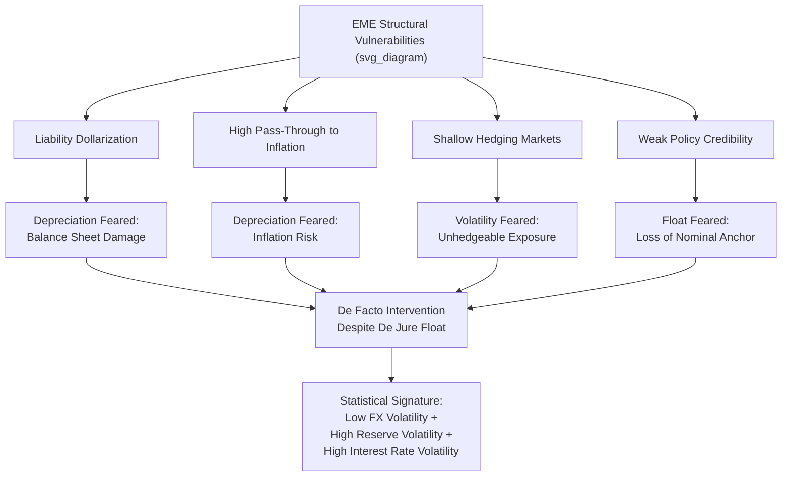

## Fear of Floating and Exchange Rate Management

### Overview

"Fear of floating" (Calvo and Reinhart, 2002) describes the empirical phenomenon in which countries officially classified as operating floating exchange rate regimes exhibit exchange rate behavior — low currency volatility combined with high reserve and interest rate volatility — that is inconsistent with genuine free floating, indicating substantial covert or informal intervention to limit currency movement. The concept is central to understanding why many emerging and developing economies' de facto monetary policy autonomy and exchange rate flexibility diverge sharply from their de jure announced regime.

### The Calvo-Reinhart Empirical Methodology

**Core approach**: Rather than relying on countries' self-reported regime classifications, Calvo and Reinhart examined the **actual statistical behavior** of three variables to infer true exchange rate policy:

1. **Exchange rate volatility**: the variance/standard deviation of monthly (or higher-frequency) percentage changes in the nominal exchange rate.
2. **Foreign exchange reserve volatility**: the variance of reserve changes, used as a proxy for the intensity of direct FX market intervention.
3. **Interest rate volatility**: the variance of short-term domestic interest rates, used as a proxy for indirect intervention via monetary policy tightening/easing to defend the currency.

**Key finding**: Countries self-classified (or IMF-classified de jure) as "floating" very frequently exhibited: (a) low exchange rate volatility comparable to that of countries with explicit pegs, alongside (b) high reserve volatility and (c) high interest rate volatility — the statistical signature of a country actively resisting currency movements despite nominally floating.

**Key Points**

- This methodology directly motivated the development of the now-standard **de facto exchange rate regime classification systems** (used by the IMF and in academic research, notably Reinhart and Rogoff's later refined classification), which classify regimes based on observed behavior rather than official policy announcements.
- The gap between de jure and de facto classification is itself informative: a wide gap signals either an aspiration toward greater flexibility not yet achieved, or a policy of deliberate ambiguity (retaining stated flexibility for credibility/negotiating purposes while managing the rate closely in practice).

### Why Emerging Markets Fear Floating

**1. High Liability Dollarization / Currency Mismatch**

**Key Points**

- Extensive foreign-currency-denominated debt among domestic firms, banks, and sometimes the sovereign itself means that currency depreciation directly raises the domestic-currency value of debt service obligations, potentially triggering widespread balance-sheet distress or insolvency — this is the core **third-generation currency crisis channel** (Krugman, 1999; Chang and Velasco, 2001).
- Because depreciation is contractionary through this balance-sheet channel (rather than expansionary via the conventional competitiveness channel emphasized in standard open-economy models), authorities have strong incentives to resist depreciation even under a nominally floating regime.

**2. High Exchange Rate Pass-Through to Inflation**

**Key Points**

- In many emerging markets, depreciation passes through to domestic inflation more quickly and more completely than in advanced economies, reflecting less-anchored inflation expectations, greater import dependence, and sometimes formal or informal price indexation practices.
- High pass-through means currency depreciation directly threatens price stability objectives (particularly under inflation-targeting frameworks), creating a policy incentive to limit exchange rate movements even absent a formal peg commitment.

**3. Underdeveloped Hedging Markets**

**Key Points**

- Shallow or illiquid domestic forward and derivatives markets limit firms' and banks' ability to hedge foreign-currency exposures, meaning that unhedged balance-sheet mismatches (see above) cannot be easily mitigated through private financial market instruments, raising the real economic cost of currency volatility relative to economies with deep hedging markets.

**4. Loss of Credibility / Nominal Anchor Concerns**

**Key Points**

- In economies with historically weak monetary policy credibility (a history of high inflation, fiscal dominance, or previous currency crises), allowing the exchange rate to float freely may be perceived as removing a valuable disciplining nominal anchor, even where an alternative anchor (e.g., inflation targeting) has been formally adopted but not yet fully credible with the public and markets.

**5. Export Competitiveness and Terms-of-Trade Concerns**

**Key Points**

- Some fear-of-floating behavior reflects a desire to prevent excessive **appreciation** (not just depreciation) that would erode export competitiveness, particularly in economies reliant on manufactured or commodity exports where currency strength directly affects trade performance — this motivates "one-way" interventions during capital inflow surges as well as outflow episodes.

### Diagram: Fear of Floating Transmission Logic

### Instruments of De Facto Exchange Rate Management

**Key Points**

- **Direct FX intervention**: spot market purchases/sales of foreign currency by the central bank to influence the exchange rate level, the most straightforward and widely used instrument, constrained by available reserve stocks (on the sale side) and sterilization costs (on the purchase side).
- **Sterilized intervention**: FX operations combined with offsetting domestic open market operations to neutralize the effect on the domestic money supply, allowing exchange rate management without abandoning a separate domestic interest rate target — though [Inference] the effectiveness of sterilized intervention in highly capital-mobile economies is considered limited in much of the empirical literature, since sterilization instruments may themselves attract offsetting capital flows.
- **Interest rate policy used for exchange rate objectives**: raising rates specifically to defend the currency (attracting capital, per UIP logic) rather than purely for domestic output/inflation objectives — the interest rate volatility signature identified by Calvo and Reinhart.
- **Moral suasion / administrative guidance**: informal pressure on domestic banks or state-linked entities to adjust their FX market behavior, common in economies with significant state presence in the financial sector.
- **Capital flow management measures (CFMs)**: taxes, reserve requirements, or quantity restrictions on inflows/outflows used to reduce the underlying pressure requiring FX intervention in the first place.
- **FX derivatives market intervention**: central bank operations in non-deliverable forwards (NDFs) or onshore forward markets to influence expectations and pricing without directly transacting in the spot market (used notably by Brazil and other EMs).

### Policy Frameworks Reconciling Floating with Management

**1. Inflation Targeting with Managed Flexibility**

Many EMEs have adopted formal inflation-targeting frameworks while retaining discretionary FX intervention capacity, explicitly departing from "pure" inflation targeting to incorporate financial stability and exchange rate volatility concerns — sometimes termed **"inflation targeting lite"** or characterized within the broader **integrated policy framework** approach.

**2. The IMF's Integrated Policy Framework (IPF)**

**Key Points**

- A more recent IMF analytical framework (developed roughly since the late 2010s) explicitly models the joint, coordinated use of **four policy instruments** — the interest rate, FX intervention, capital flow management measures, and macroprudential policy — rather than treating monetary policy and exchange rate management as separable or in strict conflict.
- This represents a substantial evolution from earlier IMF orthodoxy (which historically emphasized capital account liberalization and pure floating as generally preferable), reflecting accumulated empirical evidence on the costs of unmanaged volatility for economies with the structural vulnerabilities described above.
- [Inference] The IPF remains a relatively recent and evolving framework; its precise quantitative prescriptions for instrument combinations continue to be refined through ongoing IMF research and country-specific application, rather than constituting a single settled formula.

### Empirical and Historical Illustrations

**Key Points**

- **Latin America (various, 1990s–2000s)**: Brazil, Mexico, and other economies exhibited classic fear-of-floating behavior following their respective crisis episodes, with de jure floats accompanied by substantial de facto intervention, particularly via interest rate policy and periodic direct FX operations.
- **China's managed regime**: while not a "float" in the Calvo-Reinhart sense at all (China is more accurately classified as an explicitly managed regime rather than a nominal float exhibiting fear-of-floating behavior), it illustrates the broader spectrum of active management motivated by similar underlying concerns (export competitiveness, financial stability).
- **India's managed float**: the Reserve Bank of India has historically engaged in substantial FX intervention to smooth rupee volatility despite an officially flexible exchange rate framework, consistent with fear-of-floating characteristics, particularly regarding pass-through to domestic inflation.
- **Post-2013 Taper Tantrum adjustments**: several EMEs (India, Indonesia, Brazil, South Africa, Turkey — the "Fragile Five") responded to the 2013 spillover episode with a combination of direct intervention, rate hikes, and in some cases new CFMs, illustrating the multi-instrument response pattern characteristic of fear-of-floating behavior under acute external pressure.

### Costs and Trade-offs of Fear of Floating

**Key Points**

- **Reduced effective monetary autonomy**: to the extent that interest rate policy is used for exchange rate defense rather than purely domestic objectives, the country sacrifices some of the monetary autonomy that a genuine float would theoretically provide — pushing the country's actual position on the trilemma spectrum closer to the fixed/peg end despite its de jure floating classification.
- **Reserve accumulation costs**: sustained one-way intervention (particularly resisting appreciation during inflow surges) can lead to large reserve accumulation, which carries a quasi-fiscal cost (negative carry, since reserves are typically invested in low-yielding safe assets while domestic borrowing costs are often higher) and can itself generate domestic liquidity management challenges requiring sterilization.
- **Delayed adjustment / moral hazard**: persistent resistance to depreciation may delay necessary external adjustment (e.g., following a terms-of-trade shock), potentially building up larger eventual adjustment needs or vulnerabilities compared to earlier, smaller, market-driven adjustments.
- **Reduced transparency**: heavy but undisclosed intervention can reduce market participants' ability to accurately price currency risk, potentially increasing volatility during episodes when intervention capacity or willingness is perceived to be reaching its limits.

### Related Topics

- Currency crises and speculative attacks (third-generation balance-sheet channel)
- Capital mobility and the monetary policy trilemma
- Fixed, floating, and managed exchange rate regimes
- Global liquidity and international policy spillovers
- IMF Integrated Policy Framework and multi-instrument policy design
- Capital flow management measures: design and effectiveness
- Inflation targeting frameworks in emerging markets
- Reserve adequacy metrics and the Greenspan-Guidotti rule