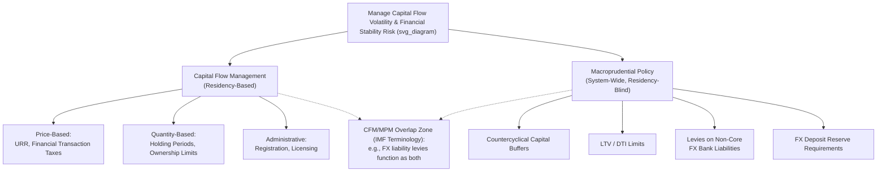

## Capital Flow Management and Macroprudential Tools

### Overview

Capital flow management (CFM) measures and macroprudential policy tools represent the primary instruments emerging and developing economies use to manage the risks associated with volatile cross-border capital flows, complementing conventional monetary policy in a context where the exchange rate trilemma, global liquidity spillovers, and fear-of-floating dynamics all constrain the effectiveness of interest rate policy alone. The two toolsets are conceptually distinct — CFMs target the capital account directly, while macroprudential tools target the domestic financial system's resilience — but overlap substantially in practice and are frequently discussed as a joint policy framework.

### Defining the Two Toolsets

**Capital Flow Management (CFM) Measures**

Measures that discriminate based on the residency of the transacting party or the cross-border nature of the transaction, directly affecting the volume, composition, or timing of capital flows into or out of a country.

**Macroprudential Policy (MPP) Measures**

Measures targeting the resilience of the domestic financial system as a whole (systemic risk), applied without regard to the residency of the counterparty, though many macroprudential tools have particularly strong effects on foreign-currency-related risks.

**Key Points**

- The IMF's **Institutional View on the Liberalization and Management of Capital Flows** (2012, subsequently updated) introduced the term "CFM/MPM" for measures that function simultaneously as both a capital flow management tool and a macroprudential tool (e.g., limits on banks' foreign-currency-denominated liabilities), acknowledging that many real-world policy instruments do not fit cleanly into a single category.
- This dual classification matters for IMF surveillance and program conditionality purposes, since CFMs and macroprudential measures have historically been subject to different degrees of institutional endorsement within the Fund's policy advice.

### Taxonomy of Capital Flow Management Instruments

**1. Price-Based Measures (Taxes)**

**Key Points**

- **Unremunerated reserve requirements (URR)**: a classic instrument requiring a fraction of capital inflows to be deposited, interest-free, at the central bank for a specified period — effectively a tax on inflows that rises as the holding period shortens, discouraging short-term "hot money" while imposing a smaller burden on longer-term investment.
- **Chile's *encaje*** (1991–1998) is the most frequently studied historical example: a URR applied to portfolio and certain other capital inflows, widely credited in the literature with altering the *composition* of inflows toward longer maturities, though its effect on the *total volume* of inflows is more contested empirically.
- **Financial transaction taxes**: Brazil's *Imposto sobre Operações Financeiras* (IOF), applied at varying rates to different categories of capital inflows (fixed income, equity) during the 2009–2013 period of heavy inflow pressure, adjusted repeatedly in response to changing flow conditions.

**2. Quantity-Based Measures (Restrictions)**

**Key Points**

- Outright limits or prohibitions on specific categories of cross-border transactions (e.g., limits on foreign ownership of domestic bonds, restrictions on resident foreign-currency borrowing, licensing requirements for capital account transactions).
- **Malaysia's 1998 capital controls**: following the Asian Financial Crisis, Malaysia imposed comprehensive controls including a one-year holding period on repatriation of portfolio capital and fixed the ringgit exchange rate, a notable case where controls were used as a explicit alternative to an IMF-supported adjustment program; [Inference] the episode remains debated regarding the counterfactual costs and benefits relative to the IMF-program path taken by neighboring crisis countries.
- **China's extensive administrative capital account restrictions**, maintained in modified form across its gradual liberalization process, illustrate sustained, large-scale quantity-based management rather than temporary crisis-response measures.

**3. Administrative and Reporting Requirements**

**Key Points**

- Registration, licensing, or approval requirements for specific transaction types that do not outright prohibit flows but raise transaction costs and provide authorities with monitoring capacity and discretionary control points.

### Taxonomy of Macroprudential Instruments

**1. Countercyclical Capital Buffers (CCyB)**

Requirements for banks to hold additional capital during periods of excessive credit growth, released during downturns to support continued lending — part of the Basel III regulatory framework, adopted with country-specific calibration by national authorities.

**2. Loan-to-Value (LTV) and Debt-to-Income (DTI) Limits**

Caps on mortgage or other lending relative to collateral value or borrower income, used extensively across both advanced and emerging economies to dampen credit-driven asset price booms, particularly in housing markets.

**3. Levies on Non-Core / Foreign-Currency Bank Liabilities**

**Key Points**

- Taxes or reserve requirements specifically targeting banks' wholesale, foreign-currency-denominated funding (as opposed to stable domestic retail deposits, termed "core" liabilities), directly addressing the currency and maturity mismatch channel central to third-generation currency crisis models.
- **South Korea's macroprudential levy on non-core FX bank liabilities** (introduced 2011) is a frequently cited example, alongside broader reforms including limits on FX forward positions and FX loan-to-deposit ratio requirements, implemented following the 2008 crisis experience.

**4. Reserve Requirements on Foreign-Currency Deposits**

Higher reserve requirements applied specifically to foreign-currency-denominated bank deposits or liabilities, raising the effective cost of foreign-currency intermediation and reducing currency mismatch incentives within the banking system.

**5. Sectoral and Systemic Risk Buffers**

Additional capital requirements targeted at specific sectors identified as posing elevated systemic risk (e.g., real estate exposure concentration limits).

### Diagram: CFM and Macroprudential Instrument Map

### The IMF Institutional View and Its Evolution

**Key Points**

- The 2012 **Institutional View** marked a significant shift from the IMF's historically more capital-account-liberalization-oriented stance (particularly relative to the pre-Asian-Financial-Crisis era), formally endorsing CFMs as legitimate policy tools under specified circumstances rather than treating them purely as second-best distortions to be phased out.
- The framework distinguishes **inflow CFMs** (appropriate when inflow surges threaten macroeconomic overheating or financial stability, and when monetary/fiscal/exchange-rate tools have been reasonably exhausted or are insufficient) from **outflow CFMs** (generally viewed with more caution, appropriate mainly in crisis or near-crisis circumstances given greater risk of signaling distress and provoking further capital flight).
- The subsequent **Integrated Policy Framework (IPF)**, developed roughly since the late 2010s, extends this further by explicitly modeling the *joint, simultaneous* optimal use of four instruments — interest rate policy, FX intervention, CFMs, and macroprudential policy — rather than treating CFMs as a residual tool used only after conventional policy is exhausted.
- [Inference] The IPF continues to be refined through ongoing IMF research; its country-specific quantitative guidance is still evolving rather than representing a single finalized doctrine, and its practical application varies considerably by country context and vulnerability profile.

### Empirical Evidence on Effectiveness

**Key Points**

- **Composition effects**: A substantial body of empirical work (particularly on Chile's *encaje*) finds relatively consistent evidence that price-based CFMs can shift the *maturity composition* of capital inflows toward longer-term flows, reducing short-term "hot money" vulnerability.
- **Volume effects**: Evidence on whether CFMs meaningfully reduce the *total volume* of capital inflows is considerably more mixed; [Inference] many studies find effects that are statistically significant but economically modest, and effectiveness appears to depend heavily on the comprehensiveness of the measure and the ease of circumvention through unregulated channels.
- **Circumvention and leakage**: A persistent finding across country studies is that capital controls are subject to erosion over time as market participants develop workarounds (e.g., reclassifying flows, using offshore structures, or shifting to less-regulated instruments), suggesting CFMs are generally more effective as a *temporary* or *crisis-response* tool than as a permanent, static barrier.
- **Macroprudential effectiveness**: Cross-country studies (including extensive BIS and IMF research) generally find stronger and more robust evidence that macroprudential tools (particularly LTV/DTI limits and FX-liability-targeted measures) reduce credit growth and financial-system vulnerability indicators, compared to the more mixed evidence on CFM volume effects.

### Interaction with Monetary Policy and the Trilemma

**Key Points**

- CFMs and macroprudential tools are frequently framed as providing a partial resolution to Rey's "dilemma" reformulation of the trilemma (see Global Liquidity and International Policy Spillovers): by managing the *gross capital flow and credit channel* directly, they can help restore a degree of effective monetary policy autonomy that a floating exchange rate alone does not fully provide, given global financial cycle transmission.
- This positions CFMs/macroprudential policy as complements to, rather than substitutes for, conventional interest-rate-based monetary policy — allowing the interest rate to remain focused primarily on domestic inflation/output objectives while capital-flow and financial-stability risks are managed through the additional instruments.
- [Inference] The precise optimal division of labor across instruments remains an active research and policy question; the IPF framework represents the leading current attempt at formalizing this joint instrument-assignment problem, but consensus on quantitative calibration across diverse country contexts has not been fully established.

### Case Studies Summary

| Country/Episode | Period | Instrument Type | Notable Feature |
| --- | --- | --- | --- |
| Chile *encaje* | 1991–1998 | Price-based CFM (URR) | Shifted inflow composition toward longer maturities |
| Malaysia capital controls | 1998–1999 | Quantity-based CFM | Alternative to IMF program; fixed exchange rate paired with controls |
| Brazil IOF tax | 2009–2013 | Price-based CFM | Repeatedly adjusted rates in response to inflow pressure |
| South Korea FX liability levy | 2011– | Macroprudential (CFM/MPM overlap) | Targeted non-core FX bank funding directly |
| China administrative controls | Ongoing (gradual liberalization) | Quantity-based CFM | Large-scale, sustained rather than temporary |

### Related Topics

- Global liquidity and international policy spillovers
- Fear of floating and exchange rate management
- Currency crises and speculative attacks (third-generation balance-sheet channel)
- IMF Integrated Policy Framework
- Capital mobility and the monetary policy trilemma
- Basel III regulatory framework and countercyclical capital buffers
- Sudden stops and capital flow reversals
- Reserve adequacy and self-insurance strategies