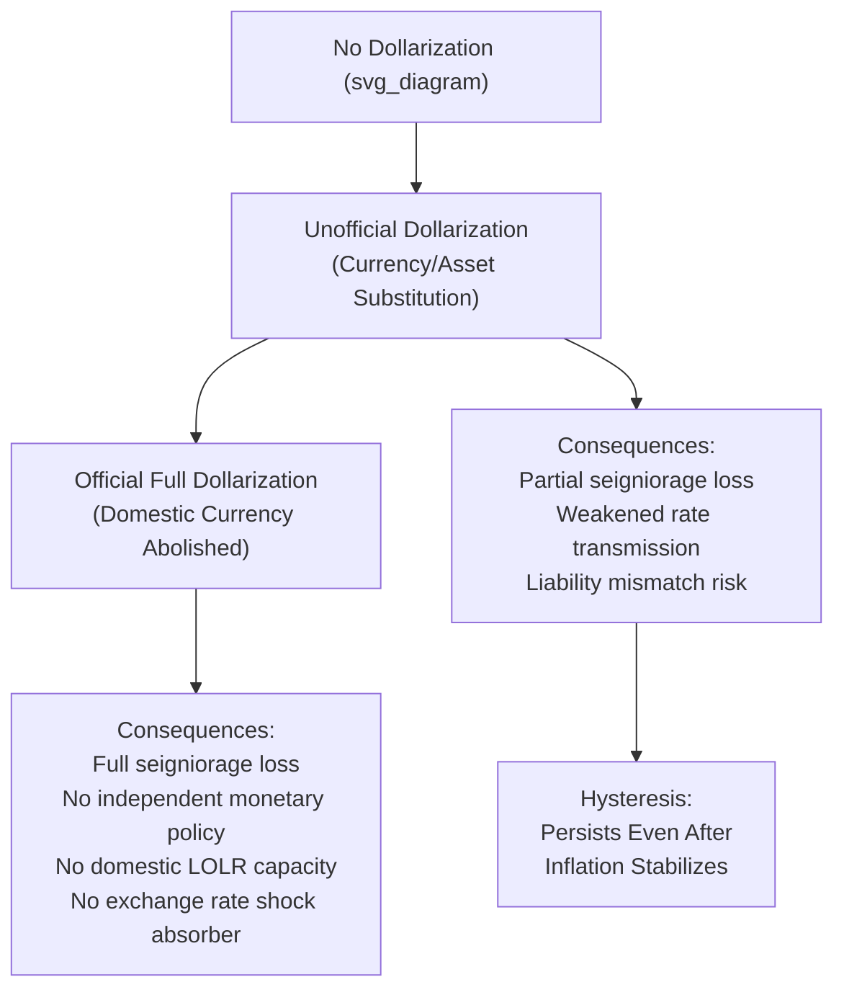

## Dollarization and Currency Substitution

### Overview

Dollarization and currency substitution refer to the use of a foreign currency (predominantly, though not exclusively, the US dollar) alongside or in place of a country's domestic currency for some or all of the standard functions of money. The phenomenon ranges from informal, market-driven partial substitution to formal, government-sanctioned full dollarization, and carries distinct implications for monetary policy autonomy, financial stability, and macroeconomic adjustment relative to the exchange rate regimes discussed elsewhere in this framework.

### Conceptual Distinctions

**Currency Substitution vs. Asset Substitution**

**Key Points**

- **Currency substitution** refers specifically to foreign currency replacing domestic currency in its **transactions/medium-of-exchange role** — foreign banknotes or foreign-currency-denominated payment instruments used for everyday purchases.
- **Asset substitution** (sometimes distinguished as "financial dollarization") refers to foreign currency being used as a **store of value** — domestic residents holding savings, bank deposits, or other financial assets denominated in foreign currency, without necessarily using foreign currency for day-to-day transactions.
- In practice, the two frequently co-occur and are not always cleanly separable empirically, but the distinction matters for policy: asset substitution primarily affects financial stability and balance-sheet risk, while currency substitution more directly affects the domestic central bank's seigniorage revenue and monetary transmission mechanism.

**Unofficial (De Facto) vs. Official (De Jure) Dollarization**

**Key Points**

- **Unofficial dollarization**: foreign currency use emerges organically through private agents' decisions, typically in response to high domestic inflation, currency instability, or weak confidence in the domestic currency, without formal government sanction — the domestic currency remains legal tender.
- **Official (full) dollarization**: the government formally adopts a foreign currency as legal tender, either entirely replacing the domestic currency (as in Ecuador, El Salvador, Panama) or in some cases retaining a symbolic domestic currency for small-denomination transactions while the foreign currency dominates.

### Drivers of Dollarization

**1. High and Volatile Inflation (Currency Substitution Motive)**

**Key Points**

- Persistent high domestic inflation erodes the domestic currency's function as a reliable store of value and unit of account, driving residents toward a more stable foreign currency for savings and, eventually, larger transactions — historically prominent in Latin American economies during periods of high inflation (Bolivia, Peru, Argentina in various episodes).
- Once established, currency substitution tends to exhibit **hysteresis** (a "ratchet effect"): dollarization that emerges during a high-inflation episode frequently persists even after domestic inflation is subsequently brought under control, since network effects, habit formation, and the sunk costs of re-establishing confidence in the domestic currency create switching frictions in the reverse direction.

**2. Portfolio Diversification and Risk Management (Asset Substitution Motive)**

**Key Points**

- Even absent extreme inflation, households and firms may hold foreign-currency assets as a hedge against domestic currency depreciation risk or as part of standard portfolio diversification, particularly where domestic financial markets offer limited instruments for hedging currency risk otherwise.

**3. Financial Sector Incentives**

**Key Points**

- Domestic banks may actively offer foreign-currency-denominated deposit and loan products, sometimes because they themselves face foreign-currency funding needs (e.g., correspondent banking relationships, foreign-currency-denominated wholesale funding) and seek to match assets and liabilities in the same currency, propagating dollarization through the banking system's own balance-sheet management.

**4. Trade and Remittance Linkages**

**Key Points**

- Economies with large remittance inflows (frequently dollar-denominated, given migration patterns to the US) or extensive dollar-invoiced trade may see organic dollar accumulation and usage independent of domestic monetary instability per se.

### Consequences for Monetary Policy

**1. Loss of Seigniorage Revenue**

**Key Points**

- As foreign currency displaces domestic currency in circulation, the domestic central bank loses the revenue (seigniorage) it would otherwise earn from issuing domestic currency — the difference between the face value of currency issued and its cost of production, effectively an interest-free loan to the government under normal circumstances.
- Under **full official dollarization**, seigniorage loss is typically substantial and permanent, though some arrangements include partial seigniorage-sharing agreements with the anchor-currency issuing country (rare in practice; the US has not historically provided formal seigniorage compensation to dollarized economies).

**2. Weakened Monetary Policy Transmission**

**Key Points**

- Under substantial unofficial dollarization, the domestic central bank's control over the effective money supply and interest rates relevant to the economy is diluted, since a meaningful share of transactions and savings occur in a currency the central bank does not issue and cannot directly control.
- This particularly undermines the **interest rate channel** of monetary transmission: domestic policy rate changes have muted effects on aggregate demand if a large share of loans and deposits are dollar-denominated and priced off foreign (not domestic) interest rate benchmarks.

**3. Elimination of Lender-of-Last-Resort Capacity (in Domestic Currency)**

**Key Points**

- Under high asset/liability dollarization in the banking system, the central bank's capacity to act as lender of last resort is constrained, since it can create unlimited domestic currency but not unlimited foreign currency — during a banking crisis involving dollar-denominated deposit runs, the central bank cannot simply print dollars to backstop the banking system, a vulnerability starkly illustrated in Argentina's 2001–2002 crisis.
- This is the same fundamental constraint that applies to currency boards (see Fixed, Floating, and Managed Exchange Rate Regimes) and is magnified under full official dollarization, where the constraint is absolute rather than partial.

**4. Elimination of the Exchange Rate as Shock Absorber**

**Key Points**

- Full official dollarization entirely removes the nominal exchange rate as an adjustment mechanism for external shocks (terms-of-trade shocks, competitiveness pressures), forcing adjustment to occur through internal prices and wages instead — a much slower and often more costly (in terms of output and employment) adjustment channel, per standard optimum currency area (OCA) theory logic.

### Financial Stability Risks: Liability Dollarization

**Key Points**

- **Liability dollarization** — the accumulation of foreign-currency-denominated debt by firms, banks, or households whose income/revenue is predominantly in domestic currency — creates a **currency mismatch** that becomes the central transmission mechanism in third-generation currency crisis models (Krugman, 1999; Chang and Velasco, 2001).
- This mismatch means that currency depreciation, rather than being the standard expansionary competitiveness boost assumed in traditional open-economy models, becomes **contractionary**: it raises the domestic-currency value of debt service obligations, potentially triggering widespread balance-sheet distress, credit contraction, and recession — a dynamic extensively documented in the 1997–98 Asian Financial Crisis and numerous Latin American episodes.
- This mismatch is also a central driver of **fear of floating** behavior: authorities in economies with substantial liability dollarization have strong incentives to resist currency depreciation even under a nominally floating regime, precisely to avoid triggering this balance-sheet channel.

### Diagram: Dollarization Spectrum and Consequences

### Official Dollarization: Case Studies

**1. Ecuador (2000)**

**Key Points**

- Adopted full dollarization in January 2000 amid a severe banking and currency crisis (the sucre had lost approximately two-thirds of its value against the dollar in the preceding year), as an emergency credibility-restoration measure.
- Widely credited with rapidly restoring price stability and ending hyperinflationary pressures, though [Inference] the loss of independent monetary and exchange rate policy has been cited in subsequent analyses as constraining Ecuador's capacity to respond countercyclically to external shocks (e.g., oil price declines, given Ecuador's oil-dependent economy), a recurring theme in assessments of the arrangement's longer-run costs.

**2. El Salvador (2001)**

**Key Points**

- Adopted the US dollar as legal tender in 2001 in a more gradual, less crisis-driven context than Ecuador, motivated substantially by a desire to reduce transaction costs given extensive dollar-denominated remittance flows from the large Salvadoran diaspora in the United States and to attract foreign investment via reduced currency risk.

**3. Panama (Long-Standing)**

**Key Points**

- Panama has used the US dollar as its primary circulating currency since the early 20th century (with the balboa existing only as coinage, pegged 1:1), representing the longest-standing and most institutionally embedded case of full dollarization in Latin America, frequently cited as a relatively successful example given Panama's sustained macroeconomic stability, though [Inference] Panama's specific role as a regional financial and trade hub (including the Panama Canal) makes direct generalization of its experience to other potential dollarizing economies difficult.

### Policy Responses to Manage Unofficial Dollarization (De-Dollarization Strategies)

**Key Points**

- **Macroprudential measures targeting FX liabilities**: differential reserve requirements or capital charges on foreign-currency-denominated deposits and loans, raising the relative cost of dollar intermediation relative to domestic-currency intermediation (see Capital Flow Management and Macroprudential Tools).
- **Indexation alternatives**: development of domestic-currency-denominated, inflation-indexed financial instruments (e.g., Chile's *Unidad de Fomento*, a widely used inflation-indexed unit of account) to provide a domestic-currency store-of-value alternative that does not require foreign-currency substitution to protect against inflation risk.
- **Sustained macroeconomic stability**: the most fundamental, though slowest-acting, de-dollarization strategy — sustained low and stable inflation and credible monetary policy institutions gradually rebuild confidence in the domestic currency, though the hysteresis effect noted above means this process is typically slow and incomplete even after fundamentals improve substantially.
- **Prudential limits on FX lending to unhedged borrowers**: regulatory requirements restricting foreign-currency lending to borrowers without matching foreign-currency revenue, directly targeting the liability-dollarization/currency-mismatch financial stability channel.
- [Inference] Cross-country evidence on de-dollarization strategies generally finds that success is gradual and highly dependent on sustained credibility over many years; there is no single instrument identified in the literature as reliably producing rapid de-dollarization absent an extended track record of macroeconomic stability.

### Related Topics

- Fixed, floating, and managed exchange rate regimes (currency boards and dollarization as hard pegs)
- Currency crises and speculative attacks (third-generation liability dollarization channel)
- Fear of floating and exchange rate management
- Capital flow management and macroprudential tools
- Optimum currency area theory
- Seigniorage and inflation tax
- Lender of last resort function and banking crisis management
- Ecuador and Argentina crisis case studies