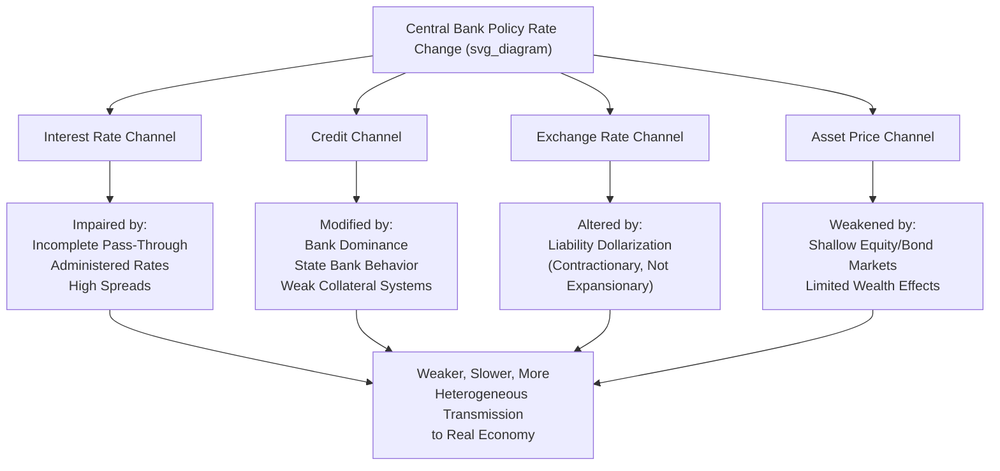

## Monetary Transmission in Shallow Financial Markets

### Overview

Monetary transmission in shallow financial markets examines how the standard channels through which central bank policy actions affect the real economy — interest rate, credit, exchange rate, and asset price channels — operate differently, and often much less effectively, in developing and emerging economies characterized by underdeveloped, illiquid, or incomplete financial markets, compared to the deep, liquid financial systems assumed in most textbook monetary transmission models originally developed for advanced economies.

### Standard Transmission Channels: Baseline Framework

**Key Points**

- **Interest rate channel**: policy rate changes affect market interest rates, which affect the cost of borrowing/saving and hence consumption and investment decisions.
- **Credit channel** (bank lending and balance sheet sub-channels): policy changes affect banks' capacity and willingness to lend, and affect borrowers' net worth and collateral values, amplifying or dampening the direct interest rate effect.
- **Exchange rate channel**: policy rate changes affect capital flows and the exchange rate, which affects net exports and imported inflation.
- **Asset price channel**: policy changes affect equity, bond, and property prices, influencing wealth effects on consumption and Tobin's-Q effects on investment.
- **Expectations channel**: forward guidance and central bank communication shape expectations of future policy and inflation, influencing current economic decisions.

In shallow financial markets, each of these channels is structurally impaired relative to this baseline, requiring substantial modification of standard monetary policy analysis and implementation.

### Structural Features of Shallow Financial Markets

**Key Points**

- **Underdeveloped government and corporate bond markets**: limited or absent secondary market trading, few benchmark maturities, and low overall market depth mean there is often no reliable yield curve to serve as a transmission benchmark or to signal policy stance beyond the shortest maturities.
- **Bank-dominated financial systems**: in the absence of deep securities markets, banks are frequently the primary (sometimes near-exclusive) channel for external finance, concentrating transmission almost entirely in the bank lending channel and making its functioning disproportionately important relative to advanced economies with diversified market-based and bank-based finance.
- **High market concentration / limited competition**: banking sectors in many developing economies are dominated by a small number of large banks (sometimes state-owned or foreign-owned), which can weaken the pass-through of policy rate changes to lending rates if these banks possess significant market power and do not compete away margins.
- **Large informal and unbanked sectors**: a substantial share of economic activity may occur entirely outside the formal banking system, in cash-based or informal-credit arrangements (family/community lending, informal moneylenders) that are entirely insulated from formal monetary policy transmission.
- **Limited interbank market depth**: shallow or illiquid interbank markets can impede the initial step of transmission — from the central bank's policy rate to short-term money market rates — particularly where the central bank's own liquidity management operations are infrequent or poorly calibrated to system liquidity conditions.
- **Underdeveloped hedging and derivatives markets**: absence of deep forward, futures, or interest rate swap markets limits firms' and banks' ability to manage interest rate and currency risk, which can both blunt certain transmission channels and amplify others (e.g., unhedged FX exposure amplifying the exchange rate/balance-sheet channel).

### Impairment of the Interest Rate Channel

**Key Points**

- **Incomplete pass-through**: empirical studies across many developing economies find that changes in the central bank policy rate pass through to retail lending and deposit rates only partially and with substantial lags, compared to the more complete and rapid pass-through typically observed in advanced economies.
- **Administered and regulated rates**: in some economies, a meaningful share of credit is extended at administered rates (state development bank lending, directed credit programs, government-mandated priority-sector lending rates) that do not respond to policy rate changes at all, mechanically reducing the aggregate interest-sensitivity of the economy.
- **High and volatile lending spreads**: elevated and unstable spreads between the policy rate and actual lending rates — reflecting credit risk premia, limited competition, and operational cost structures — mean that even where pass-through occurs, the *level* of rates facing borrowers may be dominated by these spread factors rather than by policy rate movements themselves.
- **Limited role of long-term rates**: because deep government bond markets that would normally provide a market-based long-term risk-free benchmark are often absent, borrowing costs for longer-term investment may be determined more by bank-specific balance-sheet considerations and idiosyncratic risk assessment than by a coherent, policy-linked yield curve.

### Impairment and Modification of the Credit Channel

**Key Points**

- **Bank lending channel amplified, but constrained by capital and liquidity buffers**: given the bank-dominated structure, the bank lending channel (policy tightening reducing banks' loanable funds and hence credit supply) can be a particularly powerful transmission mechanism — but its strength depends heavily on individual banks' capital adequacy and liquidity positions, which vary substantially and can create highly heterogeneous transmission across the banking sector.
- **Balance sheet channel complicated by informal collateral practices**: the standard balance-sheet channel (asset price changes affecting collateral values and hence credit access) operates differently where formal collateral registries, land titling systems, or standardized valuation practices are underdeveloped, potentially weakening or distorting this channel's normal functioning.
- **State-owned bank behavior**: where state-owned banks constitute a large share of the banking system, their lending decisions may be influenced by policy directives, political considerations, or implicit government guarantees rather than purely commercial responses to monetary policy signals, introducing an additional source of transmission heterogeneity not present in fully privatized, market-driven banking systems.
- **Microfinance and non-bank financial institutions**: in economies with significant microfinance sector activity, transmission to this segment (frequently serving borrowers otherwise excluded from formal banking) may follow distinct dynamics, often less directly linked to the central bank's policy rate and more dependent on donor funding, specialized refinancing facilities, or dedicated regulatory treatment.

### The Exchange Rate Channel in Shallow-Market Contexts

**Key Points**

- As discussed extensively under Fear of Floating and Dollarization, the exchange rate channel in many developing economies operates partly or substantially through a **contractionary balance-sheet effect** (given liability dollarization) rather than the standard expansionary competitiveness effect assumed in textbook open-economy models, fundamentally altering the sign and magnitude of this channel's contribution to overall transmission.
- Limited or absent deliverable forward and hedging markets mean that exchange rate volatility translates more directly into unhedged balance-sheet risk for firms and banks, rather than being absorbed through financial market risk-transfer mechanisms available in deeper markets.
- Central banks in shallow-market economies frequently engage in direct or indirect exchange rate management (per fear-of-floating dynamics) partly *because* the underdeveloped state of domestic hedging markets amplifies the real economic costs of exchange rate volatility relative to what would be observed in a deeper financial system.

### Diagram: Transmission Channel Impairment Map

### Implications for Monetary Policy Design and Implementation

**1. Operational Framework Adaptations**

**Key Points**

- Central banks in shallow-market economies frequently rely more heavily on **direct instruments** (reserve requirements, direct credit ceilings or floors, administered rate-setting for certain credit categories) alongside or instead of purely indirect, market-based instruments (open market operations calibrated to a market-determined short-term rate), given the limited depth of the money and interbank markets needed for indirect instruments to transmit reliably.
- **Financial market development initiatives** (developing government bond markets, improving interbank market infrastructure, strengthening payment systems) are frequently pursued as complementary, longer-run policy objectives explicitly aimed at strengthening the effectiveness of conventional monetary transmission channels over time.

**2. Communication and Credibility Considerations**

**Key Points**

- The expectations channel of transmission is particularly dependent on central bank credibility, which can be harder to establish in economies with histories of high inflation, fiscal dominance, or previous currency crises — meaning the *effectiveness* of forward guidance and inflation-targeting frameworks may itself be constrained by the same institutional and credibility factors that produce shallow financial markets in the first place, creating a degree of mutual reinforcement between weak market depth and weak transmission.

**3. Complementary Role of Fiscal and Structural Policy**

**Key Points**

- Given the structural impairments described above, monetary policy alone is frequently regarded in the literature as insufficient for full macroeconomic stabilization in shallow-market economies, motivating greater reliance on complementary fiscal policy, macroprudential tools (see Capital Flow Management and Macroprudential Tools), and financial sector development reforms as part of an integrated stabilization strategy rather than treating interest rate policy as the primary, self-sufficient stabilization instrument.

### Empirical Evidence on Transmission Strength

**Key Points**

- Cross-country empirical studies (frequently using panel VAR or similar methodologies comparing advanced and developing economies) generally find that the **magnitude and speed of monetary policy transmission to output and inflation is weaker and slower** in developing economies with shallower financial markets, consistent with the structural mechanisms described above.
- **Financial development indices** (measuring private credit-to-GDP, stock market capitalization, bond market depth, and related metrics) are commonly used in this literature as explanatory variables, with higher financial development generally associated empirically with stronger and faster monetary policy pass-through and transmission to real economic outcomes.
- [Inference] While this general pattern (weaker transmission in shallower markets) is a relatively robust cross-country empirical finding, the precise quantitative magnitude of transmission impairment varies considerably across studies depending on methodology, sample period, and the specific set of countries examined, and should not be treated as a single precisely estimated universal parameter.

### Related Topics

- Fear of floating and exchange rate management
- Dollarization and currency substitution
- Capital flow management and macroprudential tools
- Bank lending channel and balance sheet channel theory
- Financial repression and directed credit policy
- Inflation targeting frameworks in emerging markets
- Interbank market design and liquidity management operations
- Financial sector development and central bank institution-building