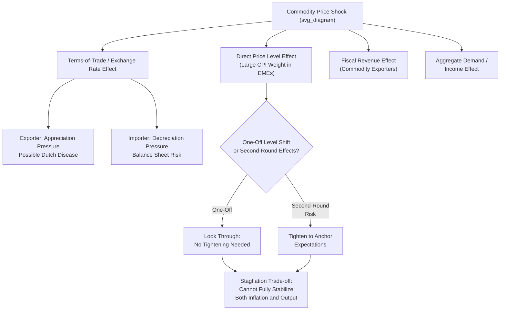

## Commodity Price Shocks and Monetary Policy

### Overview

Commodity price shocks and monetary policy examines the distinct challenges facing central banks — particularly in commodity-exporting and commodity-importing developing economies — when large, often volatile swings in commodity prices generate simultaneous and potentially conflicting pressures on inflation, output, the exchange rate, and fiscal accounts, requiring monetary policy frameworks to navigate trade-offs not present in the standard closed-economy or diversified-economy models.

### Transmission Channels of Commodity Shocks

**1. Direct Price Level / Headline Inflation Channel**

**Key Points**

- Food and energy commodities typically constitute a substantially larger share of the consumption basket (and hence CPI weighting) in developing economies relative to advanced economies, meaning commodity price shocks translate into **larger headline inflation swings** for a given percentage commodity price change.
- This creates an acute policy dilemma for inflation-targeting central banks: headline inflation may breach target ranges due to a supply-side shock that monetary policy cannot directly reverse (interest rates cannot lower international oil prices), raising the classic **core versus headline inflation targeting** debate.

**2. Terms-of-Trade and Exchange Rate Channel**

**Key Points**

- For commodity-exporting economies, a rise in export commodity prices improves the terms of trade, typically appreciating the real (and often nominal) exchange rate through increased export revenue and associated capital inflows — sometimes generating **Dutch disease** dynamics where the appreciation undermines competitiveness in other tradable sectors.
- For commodity-importing economies, a rise in import commodity prices (notably oil) worsens the terms of trade, creating depreciation pressure and, combined with fear-of-floating dynamics and liability dollarization (see related topics), potentially triggering the same contractionary balance-sheet channel documented in currency crisis models.
- The direction of the exchange rate response is therefore **asymmetric depending on a country's net commodity trade position**, requiring monetary policy frameworks to be calibrated to the specific commodity exposure profile of the economy in question rather than applying a uniform response template.

**3. Fiscal Channel (for Commodity-Exporting Economies)**

**Key Points**

- In many commodity-exporting developing economies, government revenue is heavily dependent on commodity-related taxation or state ownership of commodity production (e.g., national oil companies), meaning commodity price swings translate directly into large fiscal revenue swings.
- This creates a **fiscal-monetary interaction channel**: commodity price declines that strain government finances may generate pressure for fiscal deficit monetization or debt issuance that itself has monetary and exchange rate implications, complicating the central bank's ability to treat fiscal and monetary policy as fully independent, particularly in economies with weaker fiscal institutions or central bank independence.

**4. Aggregate Demand Channel**

**Key Points**

- Commodity export windfalls (or income losses) generate direct wealth and income effects on aggregate demand through household and corporate income channels, operating somewhat independently of the price-level and exchange rate channels described above, and requiring separate consideration in the overall monetary policy response calibration.

### The Core Policy Dilemma: Supply Shocks and the Inflation-Output Trade-off

Commodity price shocks are canonically modeled as **supply shocks** (cost-push shocks) rather than demand shocks, creating a fundamentally different policy trade-off than demand-driven inflation.

**Key Points**

- A negative supply shock (e.g., an oil price spike for an importing economy) simultaneously raises inflation **and** reduces output/growth — the classic **stagflationary** combination — meaning a central bank cannot simultaneously stabilize both inflation and output using a single interest rate instrument in response to a pure supply shock, unlike the more straightforward trade-off implied by demand shocks (where tightening or easing moves both inflation and output in the same, more clearly defined direction).
- This is formally captured in New Keynesian models via the **Phillips curve with a cost-push (supply shock) term**:

  $$\pi_t = \beta E_t[\pi_{t+1}] + \kappa y_t + u_t$$

Where $u_t$ represents the exogenous cost-push shock (e.g., a commodity price shock), and the central bank's optimal response under a standard quadratic loss function requires accepting **some** combination of above-target inflation and below-potential output rather than being able to fully offset both simultaneously — the so-called **"divine coincidence"** (where stabilizing inflation and output gap coincide) breaks down in the presence of cost-push shocks.

### Core vs. Headline Inflation Targeting

**Key Points**

- **Headline inflation targeting**: the central bank targets the full CPI, including volatile food and energy components — provides maximum transparency and avoids perceptions of the central bank "excluding" items that matter most to household welfare, but risks generating unnecessary output volatility if the bank tightens aggressively in response to a transient supply shock that will reverse on its own.
- **Core inflation targeting** (excluding food and energy, or using other measures designed to strip out volatile components): allows the central bank to "look through" transient commodity-driven price swings and focus policy on the more persistent, demand-driven inflation component, but can create **communication and credibility challenges** in economies where food and energy constitute a large share of the consumption basket and of the public's lived inflation experience, since a central bank appearing to "ignore" the prices that matter most to households can undermine public trust and anchored inflation expectations.
- **Second-round effects assessment**: a central, practically crucial judgment for any inflation-targeting central bank facing a commodity shock is distinguishing a **one-off, level-shift price adjustment** (which need not trigger tightening, since it will mechanically drop out of year-on-year inflation calculations after twelve months) from a shock that generates **persistent second-round effects** through wage-price spirals or de-anchored inflation expectations (which does warrant a policy response) — this judgment is central to practical commodity-shock policy communication and is often the single most consequential analytical call a central bank makes during such episodes.

### Diagram: Commodity Shock Transmission and Policy Response

### Fiscal-Monetary Interactions: The Case of Commodity-Exporting Economies

**Key Points**

- **Sovereign wealth funds / stabilization funds**: many commodity-exporting economies (Chile's copper-related structural fiscal rule, Norway's Government Pension Fund Global, various Gulf sovereign wealth funds) have established mechanisms to save commodity windfall revenue during high-price periods and draw it down during low-price periods, explicitly designed to smooth the fiscal (and indirectly, monetary policy) impact of commodity price volatility.
- **Fiscal rules linked to commodity price benchmarks**: structural or cyclically-adjusted fiscal balance rules that calculate an estimated "reference" commodity price (e.g., a long-run average copper price for Chile) to determine sustainable spending levels independent of the current spot price, reducing the fiscal procyclicality that would otherwise amplify commodity-driven macroeconomic volatility and complicate monetary policy's stabilization task.
- Where such fiscal smoothing mechanisms are weak or absent, monetary policy in commodity-exporting economies may face a substantially more difficult task, since it must contend with both the direct commodity price transmission channels described above **and** a potentially procyclical fiscal stance amplifying rather than dampening the underlying commodity cycle.

### Exchange Rate Regime Interactions

**Key Points**

- Commodity-exporting economies operating **fixed or heavily managed exchange rate regimes** face particularly acute versions of the terms-of-trade transmission challenge, since the exchange rate cannot adjust to absorb commodity-driven external shocks, forcing the entire adjustment burden onto domestic prices, wages, and output — a standard argument (per optimum currency area and trilemma logic) favoring greater exchange rate flexibility for economies with significant, volatile commodity exposure.
- Conversely, **floating exchange rate regimes** allow the nominal exchange rate to act as a shock absorber for commodity terms-of-trade shocks, appreciating during export-commodity booms and depreciating during busts, which — absent severe liability dollarization — can help stabilize the domestic-currency value of both export revenue and the broader economy relative to a fixed regime.
- [Inference] This shock-absorption benefit of floating regimes for commodity-exporting economies is a relatively well-established result in the open-economy macro literature, though its practical realization depends significantly on the same structural factors (liability dollarization, pass-through, hedging market depth) discussed under Fear of Floating that can complicate the exchange rate channel's functioning more broadly in developing economies.

### Empirical Illustrations

**Key Points**

- **Oil price shocks and net oil importers** (e.g., many South and Southeast Asian and African economies): historical oil price spikes (1970s, 2007–08, 2022 post-invasion-of-Ukraine period) have repeatedly generated acute stagflationary pressure and balance-of-payments strain in oil-importing developing economies, often accompanied by currency depreciation pressure and associated fear-of-floating policy responses.
- **Commodity exporters and the 2014–2016 commodity price decline**: the sharp decline in oil and broader commodity prices over this period generated substantial fiscal and currency pressure across commodity-exporting economies (Russia, Nigeria, various Gulf states, Latin American commodity exporters), with heterogeneous policy responses ranging from exchange rate flexibility (Russia's ruble float, adopted in late 2014 partly in response to this pressure) to sustained reserve drawdown to defend pegs (several Gulf states, supported by substantial accumulated reserve buffers).
- **Chile's structural fiscal rule**: frequently cited as a relatively successful example of using fiscal policy design specifically to reduce the monetary policy burden of managing copper price volatility, allowing Chile's central bank greater capacity to focus on its core inflation-targeting mandate rather than continuously offsetting fiscally-driven procyclicality.

### Related Topics

- Fear of floating and exchange rate management
- Dollarization and currency substitution
- Monetary transmission in shallow financial markets
- Fixed, floating, and managed exchange rate regimes
- New Keynesian Phillips curve and cost-push shocks
- Dutch disease and resource curse literature
- Sovereign wealth funds and fiscal stabilization rules
- Inflation targeting frameworks in emerging markets