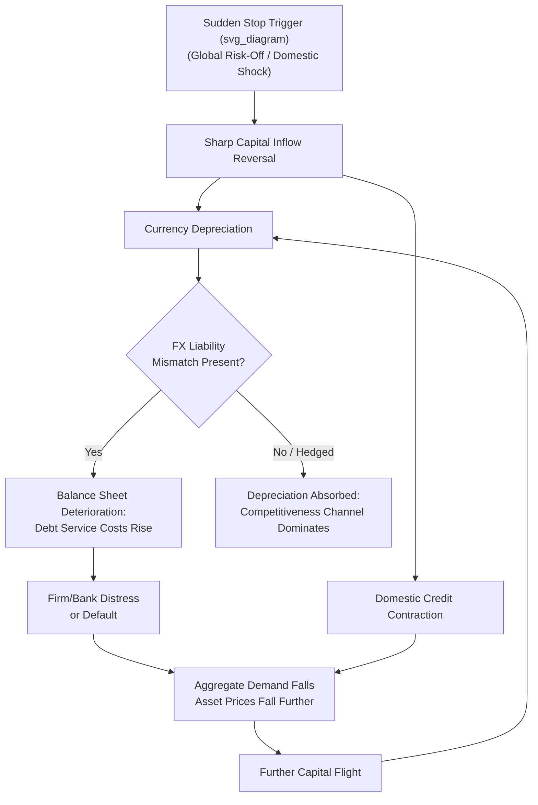

## Sudden Stops and Balance Sheet Effects

### Overview

Sudden stops refer to abrupt, large-scale reversals in capital inflows to an economy, typically triggered by a sharp shift in foreign investor sentiment, contagion from other countries, or a reassessment of country risk. When combined with balance sheet effects — the amplification mechanism arising from currency and maturity mismatches in the private and public sector — sudden stops become a central transmission channel in third-generation currency and financial crisis models, generating severe, self-reinforcing macroeconomic contractions that differ fundamentally from the gradual adjustment processes assumed in standard open-economy models.

### Defining and Measuring Sudden Stops

**Formal Definition (Calvo, 1998; Calvo, Izquierdo, and Mejía, 2004)**

**Key Points**

- A sudden stop is conventionally identified empirically as a **large, discrete decline in net capital inflows** (or a sharp reversal from inflow to outflow) relative to a country's historical or regional norm, typically defined using a threshold based on standard deviations below the trend or historical average of capital flows.
- Common operational criteria in the empirical literature include: a year-on-year decline in capital inflows exceeding roughly two standard deviations from the country's historical mean, occurring alongside a preceding period of above-average inflows (distinguishing a genuine "stop" from a country that simply never received substantial inflows to begin with).
- Sudden stops are frequently, though not universally, accompanied by a **simultaneous "sudden stop" in domestic credit growth** and a sharp exchange rate depreciation or reserve loss, reflecting the tight interlinkage between the external capital account shock and domestic financial conditions.

### Mechanics of a Sudden Stop Episode

**1. Triggering Factors**

**Key Points**

- **Global/external triggers**: shifts in global risk aversion (proxied empirically by measures like the VIX), monetary tightening in major advanced economies (raising the relative attractiveness of advanced-economy assets and the cost of servicing foreign-currency debt), or contagion from crises in other countries perceived as having similar vulnerabilities.
- **Domestic/idiosyncratic triggers**: a country-specific shock to fundamentals (fiscal deterioration, political instability, a domestic banking sector problem) that prompts a reassessment of country risk by foreign investors.
- **Self-fulfilling elements**: consistent with second-generation crisis model logic, the *anticipation* of a sudden stop by some investors can itself trigger a rush for the exit by others, generating a self-fulfilling dynamic where the stop occurs partly because market participants believe it will occur, independent of any single "fundamental" trigger being unambiguously decisive.

**2. Immediate Transmission Effects**

**Key Points**

- **Currency depreciation**: reduced capital inflows (or active outflows) create excess supply of domestic currency in the FX market, generating sharp depreciation pressure, particularly acute under a pegged or managed regime attempting to resist the movement (see Fear of Floating).
- **Domestic credit contraction**: since foreign capital inflows frequently fund a portion of domestic bank lending (directly via foreign-currency wholesale borrowing, or indirectly by supporting overall banking system liquidity), a sudden stop mechanically tightens domestic credit conditions, independent of any explicit monetary policy tightening.
- **Asset price declines**: equity and property markets, which frequently benefited from the preceding capital inflow surge, experience sharp corrections as foreign portfolio investors withdraw.
- **Interest rate spikes**: domestic interest rates frequently rise sharply, both from the central bank's defensive response (raising rates to stem outflows and defend the currency) and from a general repricing of domestic credit risk by remaining lenders.

### The Balance Sheet Amplification Mechanism

**Core Logic**

**Key Points**

- The severity of a sudden stop's real economic impact depends critically on the **currency composition and maturity structure** of the economy's external and domestic liabilities — this is the "balance sheet effects" component that distinguishes third-generation crisis dynamics from simpler capital-flow-reversal analysis.
- **Currency mismatch amplification**: where firms, banks, or the sovereign hold substantial foreign-currency-denominated debt while earning revenue predominantly in domestic currency, the sudden-stop-triggered depreciation **directly increases the domestic-currency value of debt service obligations**, potentially pushing otherwise-solvent borrowers into distress or default — this is precisely the mechanism that makes depreciation *contractionary* rather than the standard expansionary competitiveness-boosting effect assumed in traditional models.
- **Maturity mismatch amplification**: where short-term foreign liabilities substantially exceed readily available liquid assets (foreign reserves, liquid foreign-currency holdings), a sudden stop in *rollover* capacity — lenders refusing to refinance maturing short-term debt — can force distressed asset sales or default even where the borrower's underlying solvency (long-run asset value versus total liabilities) is not fundamentally impaired, a classic **liquidity crisis amplifying into (or masquerading as) a solvency crisis**.

**The Fisherian Debt-Deflation Feedback Loop**

**Key Points**

- Depreciation-driven balance sheet deterioration triggers a self-reinforcing feedback loop closely analogous to Irving Fisher's classic debt-deflation mechanism: distressed borrowers cut back investment and consumption (or default outright) → this reduces aggregate demand and asset prices further → further asset price declines worsen collateral values and balance sheets economy-wide → this can trigger further capital flight and depreciation → which further worsens the original currency mismatch, closing the loop.
- This feedback loop is a central reason why sudden-stop-triggered crises frequently produce output contractions substantially larger and more persistent than would be predicted by the capital flow reversal alone, absent the balance-sheet amplification channel.

### Diagram: Sudden Stop Amplification Loop

### Empirical and Historical Illustrations

**Key Points**

- **Mexican Peso Crisis (1994–95)**: characterized by a sharp reversal of the substantial portfolio capital inflows that had financed Mexico's current account deficit in the preceding years, compounded by short-term, partly dollar-linked government debt (*tesobonos*) that amplified rollover risk when investor confidence deteriorated.
- **Asian Financial Crisis (1997–98)**: the canonical sudden-stop-with-balance-sheet-amplification episode — substantial short-term, unhedged foreign-currency corporate and bank borrowing across Thailand, Indonesia, and South Korea meant that the capital flow reversal and associated depreciation triggered widespread corporate and banking-sector distress, transforming a capital account shock into a deep, prolonged real economic crisis (the "twin crisis" dynamic).
- **Argentine Crisis (2001–02)**: sudden stop dynamics interacted with the rigidity of Argentina's currency board arrangement (see Fixed, Floating, and Managed Exchange Rate Regimes), where the inability to devalue under the board meant the adjustment burden fell initially on domestic activity and fiscal sustainability before the eventual, highly disruptive abandonment of the peg and associated sovereign default.
- **COVID-19 Shock (March 2020)**: generated one of the most rapid and broad-based portfolio capital outflow episodes from emerging markets on record, illustrating that sudden stops can be triggered by genuinely global, non-country-specific shocks (a global risk-off/liquidity event) rather than requiring idiosyncratic domestic vulnerabilities as the proximate trigger, though countries with weaker pre-existing external and fiscal buffers generally experienced more severe and persistent effects.

### Policy Responses and Mitigation Strategies

**Key Points**

- **Reserve buffers**: self-insurance via accumulated foreign exchange reserves, assessed against metrics such as the Greenspan-Guidotti rule (reserves relative to short-term external debt), provides a direct buffer against rollover risk during a sudden stop, though at the quasi-fiscal cost of holding low-yielding reserve assets during normal times.
- **Central bank swap lines**: emergency bilateral currency swap arrangements (notably the Federal Reserve's dollar swap lines, substantially expanded during the 2008 and 2020 episodes) provide crisis liquidity that can blunt the acute dollar funding stress component of a sudden stop without requiring outright reserve drawdown.
- **Macroprudential limits on currency and maturity mismatch**: ex ante regulatory measures (limits on banks' net open FX positions, levies on non-core foreign-currency liabilities, FX loan-to-deposit ratio requirements — see Capital Flow Management and Macroprudential Tools) directly target the balance-sheet amplification mechanism by reducing the underlying mismatches before a sudden stop occurs.
- **Exchange rate flexibility**: allowing gradual, market-driven currency adjustment during "normal" capital flow fluctuations (rather than defending a rigid peg until reserves are exhausted) can reduce the eventual severity of a discrete, crisis-triggering adjustment, consistent with the broader bipolar-view and OCA-theory arguments favoring flexibility for economies exposed to volatile capital flows.
- **IMF and multilateral emergency financing**: rapid-disbursing facilities (e.g., the IMF's Rapid Financing Instrument, Flexible Credit Line for pre-qualified strong-fundamentals countries) designed specifically to provide liquidity support during sudden-stop episodes without the extended negotiation timelines of traditional IMF programs.
- [Inference] The relative effectiveness of these mitigation strategies is generally found in the literature to depend heavily on whether they are implemented preemptively (building buffers and reducing mismatches during calm periods) versus reactively during an unfolding crisis, with preemptive measures generally regarded as substantially more effective at limiting the ultimate severity of balance-sheet amplification once a sudden stop is underway.

### Related Topics

- Currency crises and speculative attacks (third-generation models)
- Capital mobility and the monetary policy trilemma
- Global liquidity and international policy spillovers
- Dollarization and currency substitution
- Capital flow management and macroprudential tools
- Fear of floating and exchange rate management
- Reserve adequacy and the Greenspan-Guidotti rule
- Fisherian debt-deflation and financial accelerator models