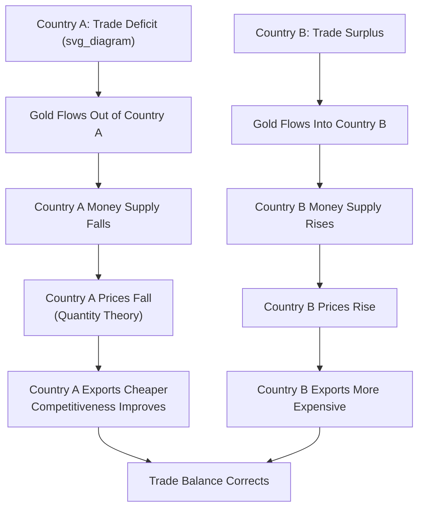

## The Classical Gold Standard

### Overview

The classical gold standard (approximately 1870–1914) was an international monetary system under which participating countries fixed the value of their domestic currency to a specified weight of gold, maintained free convertibility between currency and gold, and permitted free international movement of gold and capital. It represents the historical archetype of a fixed exchange rate regime with full capital mobility, and its operation, achievements, and eventual collapse provide the empirical foundation for much subsequent international monetary theory, including early tests of the trilemma and PPP.

### Institutional Structure

**Key Points**

- **Gold convertibility**: each participating country's central bank or treasury committed to freely convert domestic currency into gold (and vice versa) at a fixed, legally defined rate — this fixed gold content of each currency mechanically determined fixed bilateral exchange rates between all gold-standard countries (via their respective gold parities), a system sometimes termed "fixed but adjustable in extremis."
- **Free gold movement**: gold could be freely exported and imported across borders without restriction, providing the physical arbitrage mechanism that kept exchange rates within narrow bands (the "gold points") around their official parities.
- **Free capital mobility**: capital flows were generally unrestricted among the core gold-standard countries (principally the United Kingdom, and to varying degrees France, Germany, and the United States), representing a historically exceptional degree of financial globalization not matched again until the late 20th century.
- **Gold points and arbitrage**: the cost of physically shipping and insuring gold created a narrow band (the "gold points") around the official parity within which the exchange rate could fluctuate without triggering gold arbitrage; once the exchange rate moved beyond a gold point, it became profitable to ship gold directly rather than transact in the foreign exchange market, which mechanically bounded exchange rate volatility.

### The Price-Specie-Flow Mechanism (Hume)

**Core adjustment mechanism**, originally articulated by David Hume, describing how the gold standard was theorized to automatically correct balance-of-payments imbalances:

1. A country running a trade/current account deficit experiences a net outflow of gold to settle the imbalance (gold physically leaves the country to pay for the excess of imports over exports).
2. Under the classical **quantity theory of money**, a reduction in the domestic gold stock (which backed the money supply) mechanically reduces the domestic money supply.
3. A contracting money supply causes domestic prices to fall (deflation), per the quantity theory relationship $MV = PY$.
4. Lower domestic prices make the deficit country's goods relatively cheaper on world markets, boosting exports and reducing imports, correcting the original trade imbalance.
5. The mirror-image process occurs in the surplus country: gold inflows expand the money supply, raise domestic prices, and reduce that country's competitiveness, further contributing to the symmetric correction of the imbalance.

**Key Points**

- This mechanism represents an early, historically foundational articulation of automatic balance-of-payments adjustment under a fixed exchange rate regime, and is frequently taught as a precursor to the monetary approach to the balance of payments (a related strand to the monetary approach to exchange rate determination).
- [Inference] Extensive economic historical research has found that the price-specie-flow mechanism, as a *literal* description of historical gold standard adjustment dynamics, is not strongly supported empirically — actual gold flows and relative price movements during the classical era were considerably smaller and less closely linked than the mechanism's clean theoretical prediction would imply, suggesting other adjustment channels (described below) were empirically more important in practice.

### Alternative and Complementary Adjustment Channels

**1. Capital Flow Stabilization ("Rules of the Game")**

**Key Points**

- Central banks, particularly the Bank of England, are understood in the historical literature to have played an active stabilizing role through discretionary discount rate (Bank Rate) adjustments — raising the discount rate to attract short-term capital inflows and defend gold reserves during periods of pressure, rather than relying solely on the passive, automatic price-specie-flow mechanism.
- This discretionary central bank behavior is sometimes described as following the (informally understood) **"rules of the game"** of the gold standard, though historical research (notably by Arthur Bloomfield) has found that actual central bank behavior frequently **violated** the strict "rules" (which would have required amplifying, not offsetting, gold-flow-driven money supply changes) — central banks often **sterilized** gold flows to moderate their domestic monetary impact, contrary to the pure textbook mechanism.

**2. The Role of London as the Center of the System**

**Key Points**

- The United Kingdom, and specifically the Bank of England, occupied an unusually central role in the classical gold standard given London's position as the world's dominant financial and commercial center, sterling's extensive use as an international reserve and trade-settlement currency, and the depth of London's capital markets.
- This centrality meant Bank of England discount rate policy had outsized influence on global gold and capital flows, giving the classical gold standard some characteristics of a **de facto sterling-centered system** rather than a fully symmetric multilateral gold-based arrangement, foreshadowing themes later revisited in discussions of dollar dominance in the Bretton Woods and post-Bretton-Woods eras.

### Credibility and the "Gold Standard Mentality"

**Key Points**

- The classical gold standard's relative stability (particularly the general absence of the severe, frequent speculative-attack-driven crises that characterize later fixed exchange rate episodes) is frequently attributed in the literature substantially to the **strength and credibility of the commitment** to gold convertibility — a "gold standard mentality" in which maintaining convertibility was treated as an overriding, near-inviolable policy priority by the core participating countries, subordinating domestic considerations (including, notably, domestic employment and output stabilization) to external balance.
- This high credibility is thought to have reduced the scope for the kind of self-fulfilling speculative attacks central to second-generation currency crisis models, since market participants had limited reason to doubt the authorities' willingness to defend the parity even at meaningful domestic cost.
- [Inference] This credibility-centered explanation for the classical gold standard's relative stability, while influential, is not the sole explanatory factor offered in the economic history literature; the system's stability during this specific era is also linked to the historically unusual absence of major, prolonged inter-great-power wars during most of the 1870–1914 period and the relatively limited role of mass-franchise democratic politics in constraining central bank/treasury policy choices at the time, both factors that changed dramatically after 1914.

### The Trilemma Applied to the Classical Gold Standard

**Key Points**

- In trilemma terms, the classical gold standard represents a clear historical instance of the **"fixed exchange rate + free capital mobility, sacrifice monetary autonomy"** corner solution: participating countries' domestic money supplies and interest rates were substantially determined by gold flows and the need to maintain convertibility, rather than by independent domestic stabilization objectives.
- Obstfeld, Shambaugh, and Taylor's (2005) empirical trilemma research (referenced under Capital Mobility and Monetary Policy Autonomy) explicitly uses the classical gold standard era as one of several historical regimes tested, generally finding results consistent with reduced monetary autonomy (strong domestic-foreign interest rate co-movement) during this period relative to the post-Bretton-Woods floating era, supporting the trilemma's cross-era validity.

### Collapse: World War I and Aftermath

**Key Points**

- The classical gold standard effectively ended with the outbreak of World War I in 1914, as belligerent countries suspended gold convertibility to finance wartime expenditure through unconstrained money creation, a policy incompatible with maintaining the fixed gold-backed parity.
- The subsequent, largely unsuccessful attempt to **restore** the gold standard in the interwar period (various countries rejoining at, in several notable cases including the UK's 1925 return, an overvalued pre-war parity) is generally regarded in the historical literature as having contributed significantly to the severity of the Great Depression, given the deflationary pressure required to defend overvalued gold parities during a period lacking the classical era's relatively favorable credibility and political-economy conditions.
- [Inference] The interwar gold standard's failure and its role in the Great Depression's severity is a well-established theme in economic history (associated closely with research by Barry Eichengreen, among others), though the precise weighting of gold-standard-related versus other contributing factors to the Depression's severity remains a subject of ongoing historical-economic research and debate.

### Diagram: Price-Specie-Flow Mechanism

### Legacy and Relevance to Modern International Monetary Theory

**Key Points**

- The classical gold standard era serves as a key historical data point in empirical trilemma research and in broader debates about the trade-offs between fixed and flexible exchange rate regimes, providing a long-run historical counterpart to the shorter post-WWII float-era evidence more commonly emphasized in contemporary discussions.
- The system's automatic-adjustment aspirations (however imperfectly realized in practice) and its eventual collapse under the strain of a major global shock (WWI) and subsequent flawed restoration attempts inform later international monetary system design, including the explicit move away from pure automaticity toward the managed, institutionally governed adjustable-peg system of Bretton Woods.
- [Inference] Contemporary references to a "return to the gold standard" as a policy proposal are generally regarded within mainstream international monetary economics as impractical and likely undesirable given the classical system's reliance on domestic macroeconomic subordination to external balance, a trade-off broadly considered incompatible with modern expectations regarding central bank responsiveness to domestic employment and output objectives — though this remains a normative and periodically revisited policy debate rather than a settled empirical matter.

### Related Topics

- Bretton Woods system and its collapse
- Capital mobility and the monetary policy trilemma
- Interwar gold standard restoration and the Great Depression
- Purchasing power parity and long-run price level adjustment
- Central bank credibility and commitment mechanisms
- Fixed, floating, and managed exchange rate regimes
- Dollar dominance and international currency status (successor to sterling's role)
- Obstfeld-Shambaugh-Taylor empirical trilemma research