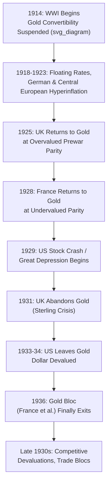

## The Interwar Monetary Experience

### Overview

The interwar monetary experience (1914–1939) encompasses the collapse of the classical gold standard at the outbreak of World War I, the turbulent floating and hyperinflationary episodes of the early 1920s, the flawed attempt to restore a gold-based international system in the mid-to-late 1920s, and the system's final disintegration amid the Great Depression and competitive devaluations of the 1930s. The period serves as a critical historical case study in exchange rate regime fragility, the costs of misaligned fixed parities, and the political-economy constraints on international monetary cooperation, directly informing the subsequent design of the Bretton Woods system.

### Wartime Suspension and Early 1920s Instability

**Key Points**

- World War I (1914–1918) forced all major belligerent powers to suspend gold convertibility, financing enormous wartime expenditures through money creation and debt issuance rather than being constrained by gold-backing requirements, ending the classical gold standard era's fixed exchange rate discipline.
- The immediate postwar years (1918–1923) were characterized by highly volatile floating exchange rates among major currencies, reflecting large differences in wartime and postwar monetary and fiscal policies, war debts and reparations obligations, and divergent inflation experiences across countries.
- **German hyperinflation (1921–1923)** stands as the era's most extreme monetary episode: driven substantially by the fiscal burden of reparations payments mandated under the Treaty of Versailles combined with central bank monetization of government deficits, culminating in monthly inflation rates reaching into the tens of thousands of percent by late 1923 before stabilization was achieved via the introduction of the *Rentenmark* and associated fiscal and monetary reforms.
- Other European economies (Austria, Hungary, Poland) experienced comparably severe hyperinflationary episodes in the same period, reflecting similar combinations of war-related fiscal strain, reparations or war-debt burdens, and weak central bank independence from fiscal financing needs.

### The Attempted Restoration of the Gold Standard

**Key Points**

- Following the early-1920s instability, major economies pursued a deliberate policy objective of **restoring gold convertibility**, viewed by policymakers of the era as essential for reestablishing prewar-style monetary credibility, exchange rate stability, and international trade and investment confidence.
- **United Kingdom's 1925 return to gold**: Britain restored convertibility at the **prewar parity** ($4.86 per pound), a decision associated with then-Chancellor of the Exchequer Winston Churchill and advised upon (though subsequently and famously criticized) by contemporary economic opinion, including John Maynard Keynes's influential pamphlet *The Economic Consequences of Mr. Churchill* (1925).
- **Key structural problem — overvaluation**: because British wartime and postwar inflation had been substantial while the prewar gold parity implied a much stronger pound than was consistent with Britain's postwar competitive position, the 1925 return effectively **overvalued sterling by a significant margin** (commonly estimated around 10%), requiring painful domestic deflation (falling wages and prices) to restore competitiveness — deflation that proved slow, incomplete, and economically and politically costly, contributing to persistently high British unemployment throughout the late 1920s.
- **France's 1928 return**, by contrast, was undertaken at a **substantially devalued** parity relative to prewar levels (reflecting France's greater wartime and postwar inflation being more fully incorporated into the new parity), which left the French franc **undervalued** and contributed to large gold inflows into France in the following years — a mirror-image imbalance to Britain's overvaluation problem.
- **Key Points**: this asymmetric pattern of restoration — one major country returning at an overvalued rate, another at an undervalued rate — created a fundamentally unbalanced "restored" gold standard from its inception, with built-in adjustment pressures (persistent British deflationary strain, persistent French gold accumulation) that undermined the system's stability well before the Great Depression's onset.

### Structural Weaknesses of the Restored (Interwar) Gold Standard

**1. Absence of a Credible, Dominant Anchor Country**

**Key Points**

- Unlike the classical era's relatively clear (if informal) centrality of London and the Bank of England, the interwar restored gold standard operated without an unambiguous leading center, with the UK's diminished postwar economic and financial standing, the US's reluctant and inconsistent international leadership role (despite its emergence as the world's largest creditor and gold-holding nation), and France's growing but still-developing financial centrality creating a more fragmented, less coordinated system.
- This absence of clear, credible leadership is frequently cited in the historical literature (notably in work by Charles Kindleberger and Barry Eichengreen) as a significant contributing factor to the system's fragility and its inability to manage the coordination challenges that arose during the Great Depression.

**2. Weakened Credibility of the Gold Standard Commitment**

**Key Points**

- The classical era's "gold standard mentality" — the deep, largely unquestioned political and social commitment to defending convertibility even at significant domestic cost — was substantially eroded by the interwar period, reflecting the rise of mass-franchise democratic politics, organized labor movements, and growing political attention to unemployment and domestic welfare as legitimate policy priorities competing with external balance considerations.
- This reduced credibility increased the vulnerability of interwar fixed parities to speculative pressure, since market participants had more reason to doubt governments' willingness to sustain painful deflationary adjustment purely to defend gold convertibility when domestic political pressures pointed toward abandoning the peg instead.

**3. Widespread Sterilization of Gold Flows**

**Key Points**

- Contrary to the (already imperfectly followed) classical-era "rules of the game," interwar central banks — most notably the Banque de France and the US Federal Reserve — engaged in extensive **sterilization** of gold inflows, using offsetting domestic monetary operations to prevent gold accumulation from expanding the domestic money supply and generating inflation.
- This sterilization behavior undermined the price-specie-flow adjustment mechanism's basic logic: surplus countries (notably France and the US) accumulated large gold reserves without the corresponding domestic monetary expansion and price-level increases that would, in the classical mechanism, have helped correct global imbalances — instead concentrating deflationary adjustment pressure disproportionately on deficit countries (notably the UK and Germany), worsening the system's overall stability and contributing to a global deflationary bias.

### The Great Depression and Gold Standard Collapse

**Key Points**

- The US stock market crash of October 1929 and the subsequent onset of the Great Depression placed severe strain on the fragile, already-imbalanced restored gold standard, as declining economic activity, banking sector distress, and deflationary pressure spread internationally, partly transmitted *through* the fixed exchange rate linkages themselves.
- **Barry Eichengreen's influential research** (notably *Golden Fetters*, 1992) argues that adherence to the gold standard's deflationary discipline significantly **worsened and prolonged** the Depression, as countries defending gold parities were forced into contractionary monetary and fiscal policies precisely when expansionary countercyclical policy was most needed, and that countries which abandoned gold earlier generally recovered from the Depression sooner than those which maintained convertibility longer.
- **Sequence of departures from gold**: the UK abandoned gold convertibility in September 1931 amid a sterling crisis and banking-sector strain, followed by numerous other countries over the subsequent years; the United States left gold (for domestic circulation purposes) in 1933 under President Franklin Roosevelt, with the dollar's gold parity subsequently devalued in 1934; France and the remaining "Gold Bloc" countries (Netherlands, Switzerland, Belgium, among others) held on considerably longer, not abandoning gold until 1936, and are generally found in the empirical historical literature to have experienced correspondingly more prolonged and severe Depression-era output and price declines.
- **Empirical "early exit, faster recovery" finding**: Eichengreen and subsequent researchers document a robust cross-country empirical pattern during this period in which the timing of gold standard departure is strongly and positively associated with the timing and strength of subsequent economic recovery, providing influential historical evidence for the real economic costs of rigid fixed exchange rate commitment during a severe adverse shock — a theme directly relevant to later trilemma and OCA-theory discussions of exchange rate regime choice under shock exposure.

### Diagram: Interwar Timeline

### Competitive Devaluations and the Retreat from Multilateralism

**Key Points**

- Following widespread departure from gold, the mid-to-late 1930s saw a pattern frequently characterized as **"competitive devaluation"** or **"beggar-thy-neighbor"** currency policy, as countries sought to gain trade competitiveness advantages through currency depreciation, sometimes prompting retaliatory devaluations by trading partners and contributing to a broader breakdown of international monetary and trade cooperation.
- This period also saw the proliferation of exchange controls, bilateral trade and payments agreements, and currency/trading blocs (the Sterling Area, the Gold Bloc, various bilateral clearing arrangements), reflecting a broader retreat from the multilateral, rules-based international monetary cooperation that had characterized (at least in aspiration) both the classical gold standard and the attempted interwar restoration.
- [Inference] The 1930s experience of uncoordinated, beggar-thy-neighbor currency policy and its perceived contribution to international economic and political fragmentation is widely regarded in the historical literature as a key negative lesson directly motivating the designers of the postwar Bretton Woods system's emphasis on multilateral cooperation, fixed-but-adjustable parities, and IMF-based oversight, though the precise causal weight of monetary factors versus other contributing forces (trade protectionism, political instability) in the broader interwar economic and political breakdown remains a subject of extensive historical debate.

### Legacy for International Monetary System Design

**Key Points**

- The interwar experience's central lessons — the dangers of restoring fixed parities at misaligned levels, the destabilizing effects of asymmetric adjustment burden (surplus countries sterilizing rather than expanding), the costs of rigid exchange rate commitment during severe adverse shocks, and the risks of uncoordinated competitive devaluation — directly shaped the Bretton Woods system's core design features, including its adjustable-peg mechanism (allowing parity changes under IMF-sanctioned "fundamental disequilibrium" conditions) and its establishment of the IMF as an institution for monitoring and coordinating exchange rate policy.
- The interwar period is frequently invoked in modern policy discussions as a historical cautionary case regarding both currency union/hard peg rigidity risks (relevant to later Eurozone crisis discussions) and the dangers of insufficient international monetary policy coordination during global crises (relevant to modern spillover and Global Financial Cycle discussions).

### Related Topics

- The classical gold standard
- The Bretton Woods system and its collapse
- Fixed, floating, and managed exchange rate regimes
- Capital mobility and the monetary policy trilemma
- Optimum currency area theory (relevant to Eurozone comparisons)
- Great Depression monetary and fiscal policy responses
- Eichengreen's "Golden Fetters" thesis
- Competitive devaluation and beggar-thy-neighbor policy