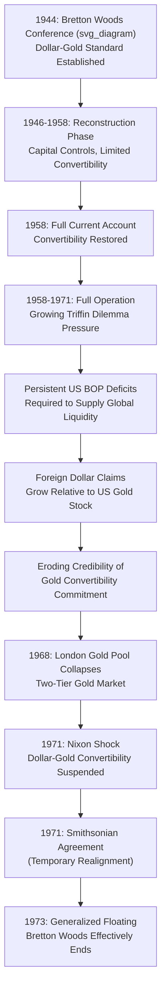

## The Bretton Woods System

### Overview

The Bretton Woods system, established at the 1944 United Nations Monetary and Financial Conference in Bretton Woods, New Hampshire, was the postwar international monetary order in operation from approximately 1946 to its effective collapse in 1971–1973. It was designed as an "adjustable peg" system in which member currencies were fixed to the US dollar, which was itself convertible to gold at a fixed price, combined with capital controls and a new international institution (the IMF) charged with overseeing the system and providing balance-of-payments financing — an explicit attempt to capture the exchange rate stability benefits of the classical gold standard while avoiding its rigid domestic policy subordination and the interwar system's demonstrated fragility.

### Design Principles and Institutional Architecture

**Key Points**

- **Dollar-gold convertibility**: the United States committed to convert dollars held by foreign central banks into gold at a fixed price of $35 per ounce, making the dollar the system's central reserve asset and effectively the anchor to which all other currencies were pegged (a "gold-exchange standard," since most countries held dollar reserves rather than gold directly).
- **Adjustable pegs**: member countries fixed their currencies to the dollar within narrow bands (typically ±1%), but — unlike the rigid classical gold standard — were permitted to adjust their official parity in cases of **"fundamental disequilibrium,"** subject to IMF consultation and approval for larger changes, explicitly designed to avoid the interwar experience of countries being forced into prolonged, costly defense of clearly misaligned parities.
- **Capital controls**: extensive restrictions on international capital movements were explicitly sanctioned and widely employed by member countries, reflecting the system architects' (particularly Keynes's) view that free capital mobility had contributed to interwar instability and needed to be constrained to make fixed exchange rates compatible with domestic monetary policy autonomy — an early, deliberate application of what would later be formalized as the trilemma logic.
- **The International Monetary Fund (IMF)**: established as the system's central institution, providing short-to-medium-term balance-of-payments financing to member countries facing temporary external deficits (reducing the need for immediately disruptive adjustment), monitoring exchange rate policies, and approving parity changes.
- **The International Bank for Reconstruction and Development (World Bank)**: established alongside the IMF at the same conference, focused on longer-term development and reconstruction financing rather than balance-of-payments support, representing a complementary rather than substitute institution within the broader Bretton Woods institutional architecture.

### The Keynes vs. White Plans

**Key Points**

- The system's design reflected a negotiated compromise between two principal competing proposals: the **Keynes Plan** (put forward by John Maynard Keynes, representing the UK) and the **White Plan** (put forward by Harry Dexter White, representing the US Treasury).
- **Keynes Plan**: proposed a more ambitious international clearing union with a new synthetic international reserve unit (the "bancor"), automatic and substantial overdraft facilities for deficit countries, and — notably — symmetric adjustment pressure explicitly placed on **surplus** as well as deficit countries (an attempt to address the interwar-era asymmetric adjustment burden problem directly).
- **White Plan**: proposed a smaller, more conservative fund with more limited resources and quota-based financing, reflecting the United States' position as the dominant postwar creditor nation with correspondingly less interest in an expansive, potentially inflationary international liquidity-creation mechanism, and less enthusiasm for automatic symmetric pressure on surplus countries.
- The final Bretton Woods agreement substantially reflected the White Plan's more conservative approach, given the US's dominant negotiating position as the world's overwhelming creditor and gold-reserve-holding nation at the 1944 conference, though it retained some Keynesian influence in the adjustable-peg mechanism and the general IMF-financing concept.

### Operation of the System: 1946–1958 (Reconstruction Phase)

**Key Points**

- The early postwar years were characterized by widespread continued use of capital controls, limited currency convertibility (particularly for European currencies, given severe postwar reconstruction needs and dollar shortages), and substantial reliance on US assistance, notably the **Marshall Plan** (1948–1951), to help rebuild European productive capacity and reserves.
- The **"dollar shortage"** was a defining feature of this period: war-devastated European and Asian economies faced severe shortages of dollars needed to purchase US goods for reconstruction, a problem the Marshall Plan and gradual European recovery were designed to address.
- Full current-account convertibility for major European currencies was generally not achieved until around 1958, marking the effective beginning of the system's fuller, more classically "Bretton Woods" operational phase.

### Operation of the System: 1958–1971 (Full Operation and Growing Strain)

**Key Points**

- With European and Japanese reconstruction substantially complete by the late 1950s and early 1960s, and current-account convertibility restored, the system entered a period sometimes regarded as its fullest and most successful operational phase, associated with strong global growth and relatively low inflation across much of the advanced industrial world.
- **Emerging strains** became increasingly apparent through the 1960s, driven by a combination of factors described below, gradually eroding confidence in the system's sustainability.

### The Triffin Dilemma

**Core mechanism**: articulated by Belgian-American economist Robert Triffin in the late 1950s/early 1960s, identifying a fundamental structural contradiction at the heart of the dollar-based gold-exchange standard.

**Key Points**

- As global trade and financial activity grew, the world required a correspondingly growing stock of international reserves, which under the Bretton Woods system meant a growing stock of dollar reserves held by foreign central banks (since gold supply growth was far too slow and inelastic to meet growing global liquidity needs on its own).
- Providing this growing dollar reserve stock required the United States to run **persistent balance-of-payments deficits** (dollars flowing out to the rest of world to be held as reserves).
- However, as the stock of foreign-held dollar claims grew relative to the United States' fixed gold stock (at the $35/ounce parity), the credibility of the US commitment to dollar-gold convertibility necessarily eroded — foreign central banks could not simultaneously be reassured that all their accumulating dollar claims were fully backed by, and convertible into, a essentially fixed quantity of US gold.
- **Formal statement of the dilemma**: the system required the US to run deficits to supply adequate global liquidity, but those same deficits progressively undermined the fundamental credibility of the gold-convertibility commitment upon which the entire system's stability rested — a structural contradiction with no permanent internal resolution absent a fundamental system redesign.

### Growing Pressures and the Path to Collapse

**Key Points**

- Through the 1960s, cumulative US balance-of-payments deficits (partly driven by Vietnam War spending and Great Society domestic program expenditures, alongside ongoing foreign direct investment outflows) led to a substantial and growing gap between total foreign-held dollar claims and the US gold stock, progressively validating Triffin's warning.
- The **London Gold Pool** (1961–1968), a coordinated effort by major central banks to stabilize the market price of gold near the official $35/ounce parity through joint intervention, represented an attempt to manage mounting pressure on the system, but ultimately collapsed in 1968 amid unsustainable gold-market pressure, leading to the establishment of a **two-tier gold market** (an official settlement price maintained between central banks, separate from a freely floating private market price).
- **Growing US inflation** in the late 1960s (partly attributed to expansionary fiscal policy without commensurate monetary tightening) further undermined confidence in the dollar's value and increased incentives for foreign central banks to convert dollar holdings into gold while the fixed $35 conversion rate remained available.
- **Speculative pressure and central bank dollar conversions**: as confidence eroded, several countries (notably France under President Charles de Gaulle, who was notably critical of the dollar's "exorbitant privilege" within the system) began actively converting dollar reserves into gold, accelerating the drain on US gold reserves.

### The Nixon Shock and System Collapse

**Key Points**

- On **August 15, 1971**, US President Richard Nixon unilaterally suspended the dollar's convertibility into gold — an event commonly termed the **"Nixon Shock"** — effectively ending the core mechanism of the Bretton Woods system, in a decision made without prior consultation with other major Bretton Woods participants.
- The **Smithsonian Agreement** (December 1971) represented an attempt to salvage a modified fixed-rate system, involving a formal devaluation of the dollar's gold parity (to $38/ounce) and realignment of other major currency parities, alongside wider permitted fluctuation bands (±2.25%), but proved unable to withstand continued market pressure.
- By **March 1973**, major currencies had transitioned to **generalized floating**, marking the definitive end of the Bretton Woods fixed exchange rate era, with the subsequent international monetary order operating on a more decentralized, largely market-determined floating-rate basis (formally acknowledged and ratified through the **Second Amendment to the IMF's Articles of Agreement**, effective 1978).

### Diagram: Bretton Woods Timeline and Collapse Mechanism

### Assessment and Legacy

**Key Points**

- The Bretton Woods system is generally credited in the historical and economic literature with supporting a period of strong global economic growth, expanding international trade, and relative price stability across much of its full-operation phase (roughly 1958–1971), often contrasted favorably with both the preceding interwar instability and, in some assessments, the greater exchange rate volatility of the subsequent floating era.
- The system's core structural weakness — the Triffin Dilemma's inherent liquidity-versus-confidence tension in relying on a national currency (rather than a genuinely neutral international reserve asset) as the primary global reserve instrument — is widely regarded as the fundamental cause of its ultimate collapse, distinguishing this failure mode from the classical gold standard's WWI-driven collapse or the interwar system's overvaluation/sterilization-driven fragility.
- The system's use of **capital controls** to reconcile fixed exchange rates with domestic monetary policy autonomy represents a historically significant, explicit real-world application of trilemma logic predating its later formal academic articulation, and is frequently cited as a key comparison point in modern debates about the costs and benefits of capital account liberalization.
- The **Special Drawing Right (SDR)**, created by the IMF in 1969 partly as an attempt to address the Triffin Dilemma by providing a supplementary, non-national international reserve asset, represents a direct institutional legacy of Bretton Woods-era liquidity concerns, though the SDR has never achieved the scale or centrality originally envisioned as a genuine alternative to the dollar's reserve currency role.
- The post-1973 floating-rate era's own subsequent volatility and periodic instability (documented extensively in later modules on exchange rate determination, overshooting, and currency crises) has periodically renewed academic and policy interest in evaluating whether elements of a more managed, Bretton-Woods-style system might offer advantages for certain groups of countries, though no comparable comprehensive multilateral fixed-rate system has been re-established at the global level since 1973.

### Related Topics

- The classical gold standard
- The interwar monetary experience
- Capital mobility and the monetary policy trilemma
- Triffin Dilemma and international reserve asset design
- Dollar dominance and international currency status
- IMF institutional history and evolving mandate
- Special Drawing Rights (SDR) and reserve asset diversification
- Fixed, floating, and managed exchange rate regimes