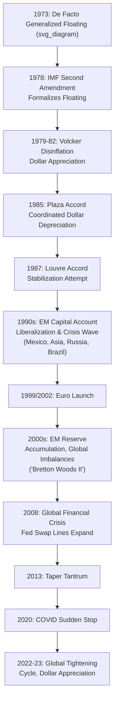

## The Post-Bretton Woods Floating Rate Era

### Overview

The post-Bretton Woods floating rate era spans from the definitive collapse of fixed dollar-gold parities in 1973 to the present, characterized by generalized floating among major currencies, formalized through the IMF's Second Amendment to its Articles of Agreement (1978), alongside a heterogeneous global landscape in which many countries continued to adopt various forms of pegged, managed, or intermediate regimes rather than pure floats. The era has been marked by repeated waves of financial liberalization, periodic currency crises, evolving international monetary cooperation frameworks, and ongoing debate about the relative merits of exchange rate flexibility versus stability under conditions of high global capital mobility.

### Formal Institutional Transition

**Key Points**

- The **Second Amendment to the IMF's Articles of Agreement**, negotiated through the mid-1970s and taking effect in **1978**, formally abandoned the par-value system that had defined Bretton Woods, explicitly permitting member countries to adopt exchange rate arrangements of their choosing — including free floating — subject only to general IMF surveillance obligations rather than a mandatory fixed-parity framework.
- This amendment also formally ended the dollar's fixed gold-convertibility link and altered gold's institutional role within the international monetary system, reducing it to one asset among several rather than the system's foundational anchor.
- The transition reflected a pragmatic institutional acknowledgment of the floating-rate reality that had already emerged de facto among major currencies since 1973, rather than a proactive redesign choice made independently of market developments.

### The 1970s: Initial Floating and Oil Shocks

**Key Points**

- The early floating era coincided with the **1973 and 1979 oil price shocks**, which generated substantial current account imbalances between oil-importing and oil-exporting economies, contributing to significant exchange rate volatility as markets adjusted to these large terms-of-trade shifts, and providing an early real-world test of floating exchange rates' shock-absorption properties under significant external stress.
- This period also saw elevated global inflation (partly oil-shock-driven, partly reflecting looser monetary policy in several major economies), complicating early assessments of floating-rate performance, since exchange rate volatility during this period reflected both the shock-absorption function economists expected of floating rates and broader macroeconomic instability not directly attributable to the regime change itself.

### The 1980s: Volatility, Coordination Attempts, and Disinflation

**Key Points**

- The early-to-mid 1980s saw substantial **dollar appreciation**, driven significantly by tight US monetary policy under Federal Reserve Chairman Paul Volcker's disinflationary campaign combined with expansionary fiscal policy under the Reagan administration, generating a large interest-rate-differential-driven capital inflow and dollar strengthening that created significant competitiveness pressure for other advanced economies, particularly Japan and European exporters.
- The **Plaza Accord (1985)**: a coordinated intervention agreement among the G5 countries (US, Japan, West Germany, France, UK) to engineer a deliberate, coordinated depreciation of the US dollar, representing a notable instance of active multilateral exchange rate policy coordination within the otherwise largely market-determined floating era.
- The **Louvre Accord (1987)**: a subsequent G7 coordination agreement aimed at stabilizing exchange rates following the substantial dollar depreciation that had occurred after Plaza, reflecting continued, though intermittent, appetite for coordinated exchange rate management even under the nominally "floating" post-Bretton-Woods framework.
- [Inference] These episodes are frequently cited as evidence that the post-Bretton-Woods era, while formally characterized by floating rates among major currencies, has never been a system of pure, uncoordinated market determination — periodic multilateral intervention and coordination efforts have remained a recurring feature, particularly among the largest, most systemically significant economies.

### The 1990s: Emerging Market Liberalization and Crisis Waves

**Key Points**

- The 1990s saw substantial **capital account liberalization** across many emerging market economies, encouraged partly by the prevailing international policy consensus of the period (sometimes associated with elements of the so-called "Washington Consensus") favoring financial market opening as a growth-promoting reform.
- This liberalization wave coincided with — and is widely considered in the literature to have contributed to — a series of severe emerging market currency and financial crises: the **1994 Mexican Peso (Tequila) Crisis**, the **1997–98 Asian Financial Crisis**, the **1998 Russian Financial Crisis**, and the **1999 Brazilian currency crisis**, each illustrating different combinations of the first-, second-, and third-generation crisis mechanisms discussed extensively elsewhere in this curriculum.
- These crises collectively motivated the influential **"bipolar view"** (see Fixed, Floating, and Managed Exchange Rate Regimes) advocating migration toward corner-solution regimes (hard pegs or free floats) for economies with open capital accounts, alongside broader reconsideration of the pace and sequencing of capital account liberalization.
- The **European Exchange Rate Mechanism (ERM) crisis of 1992** (including the UK's "Black Wednesday" exit) occurred within this same broader era, illustrating that even advanced-economy managed exchange rate arrangements remained vulnerable to speculative pressure under conditions of high capital mobility, directly motivating the eventual move toward full monetary union (the euro) among willing and qualifying EU members as an alternative to sustained intermediate-regime vulnerability.

### The 2000s: The Euro, Reserve Accumulation, and Global Imbalances

**Key Points**

- The **launch of the euro** (1999 for financial markets and accounting purposes, 2002 for physical circulation) represented the most significant institutional development of this period, creating the largest currency union since Bretton Woods and eliminating intra-eurozone exchange rate risk among founding and subsequently joining member states, while raising OCA-theory-related questions about the currency union's long-run viability given the bloc's heterogeneous economic structures.
- **Large-scale emerging market reserve accumulation**, particularly by China and other Asian economies following the 1997–98 crisis experience, reflected a widespread post-crisis shift toward self-insurance against future sudden stops (per the Greenspan-Guidotti-style logic discussed under Capital Mobility and Sudden Stops), contributing to substantial **global current account imbalances** — persistent US deficits financed substantially by persistent Asian (and later, oil-exporter) surpluses recycled into US financial assets.
- This period is frequently discussed under the framework of the **"Bretton Woods II"** hypothesis (Dooley, Folkerts-Landau, and Garber, 2003), which characterized the dollar-centered system of Asian export-led growth, currency management, and reserve accumulation as bearing meaningful structural resemblance to the original Bretton Woods arrangement, despite the formal absence of fixed parities or gold backing — a provocative, though contested, characterization of the effectively dollar-anchored behavior of a substantial share of the global economy even within the nominally "floating" era.

### The Global Financial Crisis and Its Aftermath (2008–Present)

**Key Points**

- The **2008 Global Financial Crisis** triggered severe global liquidity strains, prompting unprecedented central bank cooperation including the substantial expansion of **Federal Reserve dollar swap lines** with major central banks, illustrating the continued centrality of the dollar and of US monetary policy within the global financial system despite the formal absence of a Bretton-Woods-style fixed exchange rate architecture.
- Subsequent **unconventional monetary policies** (quantitative easing) by the Federal Reserve, European Central Bank, Bank of Japan, and Bank of England generated substantial cross-border spillovers (see Global Liquidity and International Policy Spillovers), motivating renewed academic and policy interest in the **Global Financial Cycle** concept (Rey, 2013) and prompting the IMF's development of the **Institutional View** on capital flow management (2012) and subsequent **Integrated Policy Framework**.
- The **2013 "Taper Tantrum"** illustrated the continued vulnerability of emerging markets to US monetary policy signals even under floating regimes, reinforcing "dilemma" (rather than pure trilemma) interpretations of the constraints facing floating-rate emerging economies in a financially globalized world.
- The **2020 COVID-19 shock** produced one of the most rapid, broad-based global capital flow reversals on record, again met with expanded Federal Reserve swap line activity and substantial IMF emergency financing, underscoring the persistent centrality of coordinated crisis-liquidity provision even within the formally decentralized floating-rate system.
- The **2022–2023 global monetary tightening cycle**, in response to post-pandemic inflation, generated broad dollar appreciation and renewed emerging market financial-condition tightening, illustrating the continued relevance of dollar-centered spillover dynamics roughly five decades into the floating-rate era.

### Diagram: Post-Bretton Woods Era Timeline

### Persistent Themes Across the Floating Era

**Key Points**

- **Heterogeneity of actual regimes**: despite the formal "floating era" label, the majority of IMF member countries have, at various points throughout this period, operated pegged, crawling, or managed regimes rather than free floats, consistent with the "fear of floating" phenomenon and the continued prevalence of intermediate regimes despite the bipolar view's earlier prescriptions.
- **Persistent dollar dominance**: despite the absence of any formal gold or fixed-parity anchor, the US dollar has remained the overwhelmingly dominant global reserve, invoicing, and funding currency throughout the floating era, a continuity that shapes global liquidity transmission, spillover dynamics, and crisis-response architecture (swap lines, dollar funding markets) discussed extensively elsewhere in this curriculum.
- **Recurring crisis-coordination need despite decentralized formal structure**: notwithstanding the absence of a centralized fixed-rate system, recurring severe episodes (1994, 1997–98, 2008, 2020) have consistently required substantial multilateral and bilateral coordination (IMF programs, central bank swap lines, G7/G20 coordination), suggesting that formal exchange rate flexibility has not eliminated the need for, or reality of, significant international monetary cooperation during periods of acute stress.
- [Inference] Whether the current dollar-centered, formally-floating-but-substantially-managed global system represents a stable long-run equilibrium or an evolving, potentially transitional arrangement (e.g., amid ongoing discussions of reserve currency diversification, digital currencies, or shifts in global economic weight) remains a subject of active, unsettled debate among international monetary economists.

### Related Topics

- The Bretton Woods system and its collapse
- Capital mobility and the monetary policy trilemma
- Currency crises and speculative attacks
- Global liquidity and international policy spillovers
- Fear of floating and exchange rate management
- Dollar dominance and international currency status
- Optimum currency area theory (euro launch context)
- Sudden stops and balance sheet effects