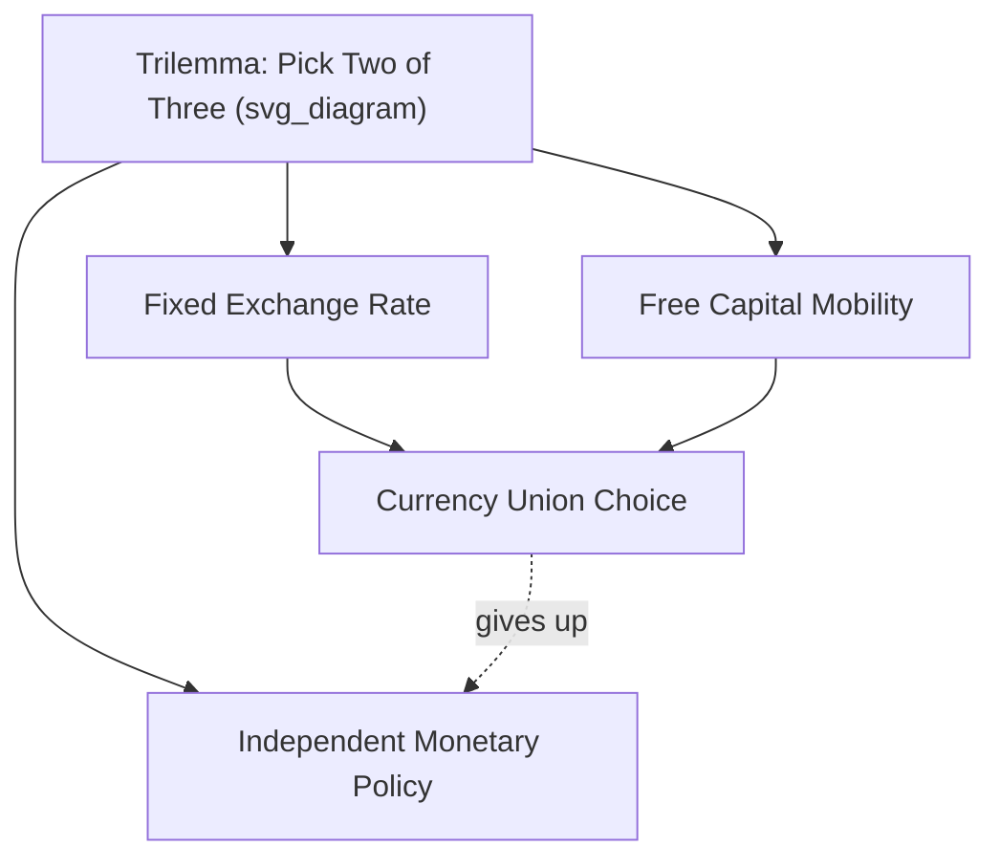

## Currency Unions and the Eurozone Experience

### Definition and Core Concept

A currency union is an arrangement in which two or more countries share a single currency, or irrevocably fix their exchange rates and cede independent monetary policy to a common authority. Members forfeit the ability to set their own interest rates and cannot devalue against fellow members. The Eurozone, launched in 1999 (notes/coins in 2002), is the largest and most studied modern example, currently comprising 20 of the 27 European Union member states.

Currency unions sit at the extreme end of exchange rate regime classifications, beyond fixed pegs and currency boards, because there is no longer a separate national currency to realign.

### Theoretical Foundation: Optimum Currency Area (OCA) Theory

The analytical framework for evaluating currency unions originates with Robert Mundell (1961), later extended by Ronald McKinnon (1963) and Peter Kenen (1969).

**Key Points**

- **Factor mobility**: Mundell argued that labor and capital mobility across regions can substitute for exchange rate adjustment. If a region suffers an asymmetric demand shock, workers can migrate to booming regions instead of relying on currency depreciation to restore competitiveness.
- **Openness/trade integration**: McKinnon showed that highly open economies with extensive intra-union trade benefit more from fixed rates, since exchange rate volatility disrupts a larger share of transactions and price levels are already closely linked.
- **Product diversification**: Kenen argued diversified economies are less exposed to asymmetric sector-specific shocks, so they need a national exchange rate tool less.
- **Fiscal transfers**: A federal fiscal mechanism can cushion regions hit by asymmetric shocks (as US federal transfers do for individual states), substituting for currency devaluation.
- **Similar business cycles (symmetry of shocks)**: If shocks hit all members similarly, a single monetary policy set for the "average" condition works reasonably well for everyone.

The OCA criteria collectively ask: how costly is it to give up an independent exchange rate and monetary policy? The higher the labor mobility, fiscal integration, trade openness, and shock symmetry, the lower that cost.

**[Inference]** Whether the Eurozone satisfies OCA criteria well enough to function optimally remains a subject of ongoing academic and policy debate; assessments differ depending on the metric and time period examined.

### Costs and Benefits of Joining a Currency Union

**Benefits**

- Elimination of transaction costs and exchange rate risk on intra-union trade and investment
- Enhanced price transparency, promoting competition across borders
- Credibility import: countries with historically weak monetary institutions can "borrow" the credibility of a strong central bank (a major motivation for peripheral Eurozone members joining)
- Deeper financial market integration and potentially lower borrowing costs
- Reduced speculative currency attacks on individual member currencies

**Costs**

- Loss of independent monetary policy: a single interest rate must fit all members, even when their business cycles diverge
- Loss of the nominal exchange rate as an adjustment tool; competitiveness must be restored via internal devaluation (wage and price deflation) instead of currency depreciation
- Loss of seigniorage revenue independence
- Fiscal policy becomes the primary national stabilization tool, but is often constrained by supranational rules
- Asymmetric shocks are harder to absorb without labor mobility or fiscal transfers

### The Eurozone's Institutional Architecture

**European Central Bank (ECB)**

- Sole issuer of the euro; sets the single monetary policy for all member states
- Primary mandate: price stability, defined operationally as inflation of 2% over the medium term (symmetric target since the 2021 strategy review)
- Governed by the Governing Council, combining the Executive Board with national central bank governors
- Operates through the Eurosystem, the network of national central banks implementing ECB policy

**Stability and Growth Pact (SGP)**

- Fiscal rules constraining member states: government deficit ceiling of 3% of GDP and public debt ceiling of 60% of GDP
- Intended to prevent fiscal free-riding, where individual governments might otherwise borrow excessively, expecting the union (or other members) to absorb the consequences
- Reformed multiple times (2005, 2011 "Six-Pack," 2013 "Two-Pack," and a 2024 revision) after enforcement proved weak and pro-cyclical during crises

**Banking Union** (post-2012, built in response to the sovereign-bank "doom loop")

- Single Supervisory Mechanism (SSM): centralizes bank supervision under the ECB for significant institutions
- Single Resolution Mechanism (SRM): centralizes bank resolution and failure management
- European Deposit Insurance Scheme (EDIS): the third pillar, still incomplete as of the mid-2020s, reflecting continued political disagreement over risk-sharing

### The Convergence Criteria (Maastricht Criteria)

To join the euro, an EU member state must satisfy:

| Criterion | Threshold |
| --- | --- |
| Price stability | Inflation within 1.5 percentage points of the three best-performing EU member states |
| Government deficit | Below 3% of GDP |
| Government debt | Below 60% of GDP (or sufficiently declining) |
| Exchange rate stability | Two years in ERM II without severe tensions, without devaluing against the euro |
| Long-term interest rates | Within 2 percentage points of the three best-performing member states |

**[Unverified]** Enforcement of these criteria has been criticized as inconsistent, since several founding members (including Belgium and Italy) had debt ratios well above 60% at entry, and some post-adoption fiscal outcomes diverged substantially from pre-entry projections.

### The Eurozone Sovereign Debt Crisis (2009–2012): A Case Study in OCA Failure

**Mechanics of the crisis**

1. Following euro adoption, peripheral countries (Greece, Ireland, Portugal, Spain, Italy — the "GIIPS") experienced convergence of sovereign borrowing costs toward German levels, fueling credit booms.
2. Capital flowed from core surplus countries (Germany, Netherlands) to periphery deficit countries, financing consumption and construction booms rather than productivity-enhancing investment in several cases.
3. The 2008 global financial crisis exposed underlying imbalances: Greece's fiscal deficits, Ireland's and Spain's banking/property bubbles, and competitiveness losses from a decade of relative wage growth in the periphery.
4. Because periphery countries could not devalue, adjustment required "internal devaluation": cutting nominal wages and prices to restore competitiveness, which is politically and socially costly and can be self-defeating under high debt (debt-deflation dynamics).
5. Bank-sovereign feedback loops (the "doom loop") emerged: weak banks required government bailouts, weakening sovereign finances, which weakened bank balance sheets holding sovereign debt.

**Policy responses**

- European Financial Stability Facility (EFSF) and later the permanent European Stability Mechanism (ESM): financial backstops providing conditional loans
- ECB's "Outright Monetary Transactions" (OMT) program, announced in 2012 following Mario Draghi's "whatever it takes" commitment, which calmed sovereign bond markets without ever being formally activated
- Troika-supervised (European Commission, ECB, IMF) adjustment programs for Greece, Ireland, Portugal, and Cyprus, involving fiscal austerity and structural reform conditionality

**[Inference]** The crisis is widely interpreted by economists as evidence that the Eurozone lacked sufficient OCA properties (limited labor mobility across language/cultural barriers, no significant fiscal transfer union, and divergent competitiveness trends) at the time of its founding, though views differ on the relative weight of monetary design flaws versus individual member fiscal mismanagement.

### The "Trilemma" and Currency Unions

The Mundell-Fleming trilemma holds that a country cannot simultaneously have: (1) a fixed exchange rate, (2) free capital mobility, and (3) independent monetary policy. A currency union resolves the trilemma by eliminating the exchange rate and national monetary policy entirely for participating members, achieving perfect fixity and full capital mobility at the cost of monetary sovereignty.

### Comparative Perspective: Other Currency Unions

- **CFA Franc Zone** (West African and Central African): pegged to the euro (formerly the French franc), backed historically by French Treasury guarantees; criticized for constraining monetary autonomy of developing economies while providing inflation credibility
- **Eastern Caribbean Currency Union (ECCU)**: small island economies sharing the Eastern Caribbean dollar, pegged to the US dollar, administered by the Eastern Caribbean Central Bank
- **US dollar as a de facto union across US states**: often cited as a benchmark OCA "success case" due to high labor mobility, a unified fiscal system with automatic transfers, and a single language/culture lowering mobility frictions
- **Historical unions that dissolved**: the Latin Monetary Union (1865–1927) and the Scandinavian Monetary Union (1873–1924) collapsed amid WWI-era fiscal divergence and lack of a supranational central authority — instructive as cautionary precedents

### Post-Crisis Reforms and Structural Debates

- **Fiscal capacity debate**: Proposals for a Eurozone-wide fiscal stabilization instrument (e.g., a common unemployment reinsurance scheme) remain politically contested between "risk-sharing" advocates (often periphery/France) and "risk-reduction-first" advocates (often Germany/Northern creditor states)
- **NextGenerationEU (2020)**: a landmark, one-off common EU borrowing facility (~€800 billion) to fund pandemic recovery, marking the first large-scale mutualized EU debt issuance — viewed by many economists as a step toward fiscal risk-sharing, though its legal basis was framed as temporary and exceptional
- **Capital Markets Union**: an ongoing initiative to deepen and integrate EU capital markets, intended to improve private-sector risk-sharing across borders as a substitute for public fiscal transfers
- **Completing Banking Union**: EDIS remains unresolved; debate continues over mutualizing deposit insurance versus first reducing legacy risks (non-performing loans, sovereign concentration in bank portfolios) in individual banking systems

### Worked Example: Asymmetric Shock Without Exchange Rate Adjustment

Consider a simplified two-country currency union (Core, Periphery) where Periphery experiences a negative demand shock (e.g., a construction bust) while Core does not.

- **Outside a currency union**: Periphery's central bank could cut interest rates and allow its currency to depreciate, boosting export competitiveness and cushioning output loss.
- **Inside the currency union**: The common central bank sets policy based on union-wide (weighted average) conditions. If Core is stable or overheating, the single interest rate may be too tight for Periphery's needs.
- Periphery's adjustment must instead occur through: (a) wage and price declines (internal devaluation), (b) labor outmigration to Core, or (c) fiscal transfers/borrowing.
- If labor mobility is low (language, housing, credential-recognition barriers) and no fiscal transfer mechanism exists, unemployment in Periphery becomes more persistent than it would under flexible exchange rates.

This stylized mechanism approximates what occurred in Spain and Greece during 2010–2013, where unemployment rates exceeded 25% and internal devaluation proceeded slowly and painfully.

### Mathematical Framing: Optimal Monetary Policy Under a Common Shock Distribution

For a two-region union with output gaps $y_1$ and $y_2$ and a single policy rate $i$, the common central bank effectively minimizes a union-wide loss function:

$$L = \omega_1 (y_1 - y_1^*)^2 + \omega_2 (y_2 - y_2^*)^2 + \lambda (\pi - \pi^*)^2$$

where $\omega_1$ and $\omega_2$ are output weights (often proportional to GDP share), $\pi$ is union-wide inflation, and $\pi^*$ is the inflation target. When shocks to $y_1$ and $y_2$ are negatively correlated or asymmetric in magnitude, no single value of $i$ can close both output gaps simultaneously — the source of the "one-size-fits-all" monetary policy problem frequently cited in Eurozone analysis.

**[Inference]** This is a stylized representation; actual ECB decision-making involves a broader set of indicators, staff macroeconomic projections, and Governing Council deliberation rather than a mechanical loss-minimization rule.

### Related Topics

- Optimum Currency Area theory (Mundell, McKinnon, Kenen) in depth
- The Mundell-Fleming trilemma and open-economy macroeconomic policy
- Fixed exchange rate regimes and currency boards
- The Bretton Woods system and its collapse (comparative fixed-rate history)
- Sovereign debt crises and debt sustainability analysis
- Target2 balances and Eurosystem payment settlement imbalances
- Internal devaluation versus external devaluation as adjustment mechanisms
- Fiscal federalism and risk-sharing mechanisms in monetary unions
- The European Stability Mechanism (ESM) governance and lending toolkit
- Brexit and the economics of currency union exit (theoretical "Grexit" scenarios)