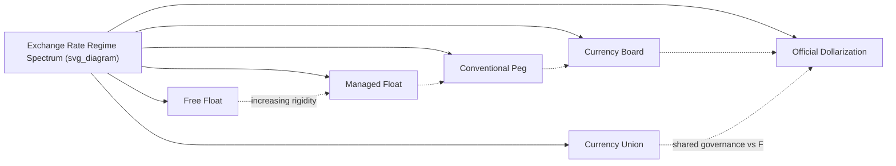

## Dollarization and Currency Boards

### Definition and Core Concepts

**Dollarization** refers to the use of a foreign currency (most commonly the US dollar, though the term generalizes to "euroization" or use of any external anchor currency) as legal tender within a country, either partially or in place of a domestic currency.

**Currency boards** are a monetary institution that issues domestic currency fully backed by, and freely convertible at a fixed rate into, a foreign reserve (anchor) currency, with the reserve currency typically held at or above 100% of the monetary base.

Both arrangements sit at the "hard peg" end of the exchange rate regime spectrum, alongside currency unions, and both involve substantial or total surrender of independent monetary policy in exchange for anchor-currency credibility.

### Taxonomy of Dollarization

**Key Points**

- **Official (full) dollarization**: The foreign currency becomes the sole legal tender; the domestic currency is abolished entirely. Examples: Ecuador (2000), El Salvador (2001), Panama (since 1904), Zimbabwe (2009, later reversed).
- **Semi-official (dual currency) dollarization**: The foreign currency is legal tender alongside a domestic currency, both circulating and accepted in official transactions.
- **Unofficial (de facto) dollarization**: The public voluntarily holds foreign currency-denominated assets, cash, or bank deposits for savings and transactions even though the domestic currency remains sole legal tender. Common in economies with a history of high inflation (e.g., Argentina, Cambodia, parts of the former Soviet Union).
- **Financial dollarization**: A narrower concept referring specifically to the share of bank deposits and loans denominated in foreign currency, which can be substantial even without official or semi-official dollarization.

### Mechanics of a Currency Board

A textbook currency board operates under strict rules:

1. **Full backing**: Domestic monetary base (notes, coins, and often bank reserves) must be backed at least 100% by foreign reserve assets (typically the anchor currency's government bonds or deposits).
2. **Fixed convertibility**: The currency board commits to converting domestic currency into the anchor currency at a fixed, legally specified rate, on demand, without limit.
3. **No discretionary monetary policy**: The board cannot act as lender of last resort in the conventional sense, cannot sterilize capital flows, and cannot finance government deficits by printing money (no monetization of fiscal deficits).
4. **Passive money supply determination**: The domestic money supply expands or contracts automatically based on balance-of-payments flows — a foreign currency inflow (e.g., from exports or capital inflows) mechanically increases the domestic monetary base, and an outflow contracts it.

**Historical and contemporary examples**

- Hong Kong Monetary Authority's Linked Exchange Rate System (since 1983, HKD pegged to USD)
- Bulgaria's currency board (1997–present, initially pegged to the Deutsche Mark, now to the euro)
- Estonia (1992–2011, pegged to the Deutsche Mark/euro, prior to adopting the euro outright)
- Argentina's Convertibility Plan (1991–2002) — a partial currency board that ultimately collapsed

### Currency Board vs. Conventional Fixed Peg vs. Full Dollarization

| Feature | Conventional Fixed Peg | Currency Board | Full Dollarization |
| --- | --- | --- | --- |
| Domestic currency exists | Yes | Yes | No |
| Backing requirement | Discretionary reserves | ~100%+ legally mandated | N/A (no domestic currency) |
| Lender of last resort capacity | Yes (central bank) | Very limited/none | None |
| Seigniorage retained domestically | Yes | Partial (interest on reserves) | None (accrues to anchor country) |
| Devaluation possible | Yes (policy choice) | Legally difficult, requires institutional change | No (impossible without reintroducing currency) |
| Credibility signal | Moderate | High | Highest |

### Theoretical Rationale

**Benefits**

- **Credibility and inflation control**: Eliminates the temptation for discretionary monetary financing of fiscal deficits, addressing time-inconsistency problems in monetary policy (the Kydland-Prescott/Barro-Gordon framework, where governments face an incentive to create surprise inflation, which rational agents anticipate, leading to an inflationary equilibrium with no output gain).
- **Elimination of currency risk on anchor-currency-denominated trade and debt**: Particularly valuable for small, open economies heavily trading with or borrowing from the anchor country.
- **Reduced transaction costs** on cross-border commerce with the anchor currency zone.
- **Import of low anchor-country interest rates**, potentially lowering borrowing costs (though this can also encourage excessive credit growth, as seen pre-2001 in Argentina).

**Costs**

- **Total loss of independent monetary policy**: No ability to set interest rates according to domestic cyclical conditions.
- **Loss of the exchange rate as a shock absorber**: Asymmetric shocks (relative to the anchor economy) must be absorbed through internal devaluation (wage/price adjustment) rather than nominal depreciation.
- **Loss of seigniorage revenue**: Under full dollarization, the government forgoes the profit historically earned from issuing currency (the difference between face value and production cost, and the implicit interest-free loan from currency holders to the state); this revenue effectively transfers to the anchor-currency issuer.
- **Vulnerable lender-of-last-resort function**: Since the central bank cannot freely create liquidity, banking crises must be managed via fiscal reserves, external credit lines, or IMF support, rather than domestic money creation.
- **Fiscal discipline substitutes for monetary discipline**: Without the option to inflate away debt, governments must run sustainable fiscal policy or face default risk directly.

### Case Study: Argentina's Convertibility Plan (1991–2002)

**Mechanics**: The Convertibility Law fixed the Argentine peso to the US dollar at 1:1, with the central bank required to hold dollar reserves covering the monetary base.

**Initial success**: Hyperinflation (which had reached extremely high annual rates in the late 1980s) was rapidly brought under control, and the peg delivered several years of price stability and renewed capital inflows.

**Breakdown mechanism**:

1. The peso became increasingly overvalued as the US dollar strengthened globally during the late 1990s, dragging Argentina's real exchange rate up with it despite weakening domestic fundamentals.
2. Argentina's trading partners (notably Brazil, which devalued the real in 1999) gained competitiveness, worsening Argentina's trade position.
3. Rigid domestic labor markets and prices made internal devaluation (wage/price cuts) slow and politically costly.
4. Fiscal deficits continued to accumulate, financed increasingly by external borrowing, raising sovereign default risk.
5. Capital flight accelerated as investors questioned the sustainability of the peg, forcing banking restrictions (the "corralito" deposit freeze in December 2001).
6. The government abandoned the peg in January 2002, resulting in a sharp devaluation, sovereign default, and severe economic contraction.

**[Inference]** The Argentine case is widely cited as demonstrating that a currency board (or hard peg) without accompanying fiscal discipline and labor market flexibility is not sufficient to guarantee macroeconomic stability; most economists attribute the collapse to a combination of fiscal profligacy, external competitiveness shocks, and the absence of an exit mechanism, though the relative weighting of these causes is debated.

### Case Study: Ecuador's Full Dollarization (2000–present)

- Adopted the US dollar as sole legal tender in 2000 following a severe banking and currency crisis (the sucre had lost roughly two-thirds of its value against the dollar in the preceding year).
- Successfully halted hyperinflation and stabilized the financial system in subsequent years.
- **[Inference]** Analysts generally note that Ecuador's dollarization removed exchange rate risk but left the economy exposed to external terms-of-trade shocks (Ecuador's oil-dependent economy) without a devaluation option, requiring fiscal buffers and, at times, external borrowing (including from China) to manage downturns, such as the 2015–2016 oil price collapse.
- Ecuador cannot conduct independent monetary policy, cannot act as lender of last resort in dollars (the Fed will not backstop Ecuador's banking system), and has periodically sought IMF support during balance-of-payments stress.

### Seigniorage and the Fiscal Cost of Dollarization

Seigniorage revenue $S$ can be approximated as:

$$S = \frac{\Delta M}{P} \approx \pi \cdot m + g \cdot m$$

where $\Delta M$ is the change in the monetary base, $P$ is the price level, $\pi$ is the inflation rate, $g$ is real money base growth from real GDP growth, and $m$ is the real money base as a share of GDP. Under full dollarization, this revenue stream (or the initial stock equivalent, sometimes called the "seigniorage transfer") shifts to the anchor country. Some proposals for dollarizing economies (e.g., early discussions around a potential US-Ecuador arrangement) included compensation mechanisms for this lost revenue, though these were not comprehensively implemented in most real-world cases.

### The "Impossible Trinity" Applied to Currency Boards and Dollarization

Currency boards and dollarization represent corner solutions to the Mundell-Fleming trilemma: they choose fixed exchange rates and free capital mobility, fully sacrificing independent monetary policy — the same trade-off structure as currency unions, but without the benefit of shared governance over the anchor currency's monetary policy (a dollarized country has zero voting influence over Federal Reserve decisions, unlike a Eurozone member's role on the ECB Governing Council).

### Exit Risks and the "Impossible to Reverse" Problem

- **Currency boards** retain a technical (if politically costly) exit option: the government can legislate a change to the convertibility rule, as Argentina did in 2002.
- **Full dollarization** is far harder to reverse because the domestic currency no longer exists; reintroducing one requires rebuilding an entire currency infrastructure, re-establishing public confidence, and often occurs only after severe economic distress (as briefly occurred with Zimbabwe's abandonment of the US dollar as primary tender and reintroduction of local currency instruments after 2009, with repeated subsequent currency instability).
- This asymmetry means dollarization functions as a stronger commitment device than a currency board, at the cost of even greater rigidity if circumstances change (e.g., discovery of natural resources shifting the optimal real exchange rate, or divergence from the anchor economy's business cycle).

### Currency Boards, Dollarization, and Banking Sector Stability

Because the central bank/monetary authority under either arrangement has limited or no capacity to create liquidity in a crisis, banking sector stability depends heavily on:

- **Precautionary liquidity buffers**: Banks and the currency board/government must hold larger liquid reserves than under a conventional monetary regime, since domestic lender-of-last-resort support is constrained.
- **External credit lines**: Some dollarized or currency-board economies negotiate contingent credit facilities with international institutions (IMF) or foreign banks to backstop liquidity.
- **Regulatory conservatism**: Higher capital and reserve requirements are often imposed on banks precisely because the safety net is thinner.

**[Unverified]** The adequacy of such buffers varies significantly by country and time period, and has been insufficient in several historical episodes (e.g., Argentina 2001, Bulgaria's pre-currency-board 1996–1997 banking crisis) to prevent systemic banking stress.

### Comparative Summary Table: Policy Trade-offs

| Dimension | Currency Board | Full Dollarization |
| --- | --- | --- |
| Credibility | High | Very high |
| Reversibility | Possible (costly) | Extremely difficult |
| Seigniorage retained | Partial | None |
| Governance voice over anchor policy | None | None |
| Requires legal/institutional currency infrastructure | Yes | No (currency abolished) |
| Typical adopter profile | Small open economies seeking rapid disinflation | Economies with prior hyperinflation or severe currency crisis |

### Related Topics

- Currency unions and the Eurozone experience (comparative hard-peg arrangement with shared governance)
- The Mundell-Fleming trilemma and open-economy policy trade-offs
- Time-inconsistency in monetary policy (Kydland-Prescott, Barro-Gordon models)
- Balance-of-payments crises and speculative attack models (first- and second-generation currency crisis models)
- Sovereign debt default and restructuring (Argentina 2001–2002 in depth)
- Financial dollarization and its implications for monetary policy transmission
- Lender-of-last-resort function and central bank independence
- Fixed versus flexible exchange rate regime choice for developing economies
- Seigniorage, inflation tax, and fiscal-monetary interactions
- Exit strategies from hard pegs and historical de-pegging episodes