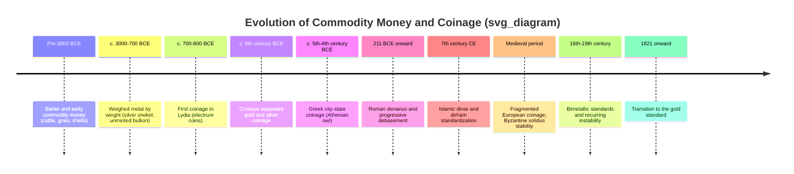

## History of Commodity Money and Coinage

### Definition and Core Concept

Commodity money is a medium of exchange whose value derives substantially from the value of the material it is made of, or from a good that itself has intrinsic use value (e.g., cattle, grain, salt, metals). This distinguishes it from fiat money, whose value rests on legal decree and public trust rather than intrinsic material worth, and from representative money (e.g., early banknotes), which is a claim convertible into a commodity.

Coinage refers specifically to the practice of minting standardized metal pieces, typically stamped with a mark of authenticating authority, to serve as a medium of exchange, unit of account, and store of value.

### The Functions of Money as an Analytical Lens

Commodity money historically emerged to satisfy the classical functions of money:

**Key Points**

- **Medium of exchange**: Reduces the inefficiency of barter, which requires a "double coincidence of wants" (each party must want what the other offers).
- **Unit of account**: Provides a common measure of value across heterogeneous goods.
- **Store of value**: Retains purchasing power over time, favoring durable commodities (metals) over perishable ones (grain, livestock).
- **Standard of deferred payment**: Facilitates credit and debt contracts denominated in a stable measure.

Goods best suited to become commodity money exhibit durability, divisibility, portability, uniformity/fungibility, and scarcity — properties that precious metals satisfy unusually well relative to alternatives.

### Pre-Coinage Commodity Money

**Key Points**

- **Cattle and livestock**: Used across many ancient pastoral societies (the Latin word "pecunia," meaning money, derives from "pecus," meaning cattle); illustrates a commodity money with intrinsic value but poor divisibility and portability.
- **Grain (barley, wheat)**: Used in Mesopotamia as both a medium of exchange and a unit of account; temple and palace institutions maintained grain-denominated accounting systems predating coined money by well over a millennium.
- **Cowrie shells**: Widely used across Africa, South Asia, and parts of China and the Pacific for centuries, valued for durability, portability, and difficulty of counterfeiting given their natural, non-reproducible origin.
- **Salt**: Used in parts of Africa and the Roman world (the term "salary" is popularly linked, though disputed among etymologists, to Roman soldier payments involving salt or a salt allowance).
- **Metal ingots and unminted metal by weight**: Bronze, copper, silver, and gold circulated as bullion, weighed at each transaction, prior to standardized coinage — used extensively in Mesopotamia and the ancient Near East, where silver by weight (the shekel) functioned as a unit of account and store of value for roughly two millennia before coinage existed.

**[Unverified]** Precise chronologies and the relative importance of different commodity monies vary by region and are subject to ongoing archaeological and historical revision; the summary above reflects generally accepted historical consensus rather than a single definitive timeline.

### The Invention of Coinage

**Lydia and the origin of coinage (c. 7th century BCE)**

- Coinage is conventionally credited to the Kingdom of Lydia (in present-day western Turkey), under kings including Alyattes and later Croesus, around the late 7th century BCE.
- Early Lydian coins were made of electrum, a naturally occurring gold-silver alloy, stamped with identifying marks (often a lion's head) to certify weight and purity.
- The key innovation was standardization and state (or authority) certification: rather than weighing metal at every transaction, a stamped coin of known weight and fineness allowed faster, lower-friction exchange, since the stamp substituted for individual verification.
- Croesus (mid-6th century BCE) is credited with refining the process by separating gold and silver into distinct pure-metal coinages, improving reliability of value.

**Independent and near-contemporaneous developments**

- Coinage or coin-like standardized metal money also emerged independently in ancient China (bronze spade and knife money, later round coins with square holes, associated with the Zhou dynasty and standardized further under the Qin dynasty, c. 3rd century BCE) and in India (punch-marked silver coins, roughly contemporaneous with or shortly after Lydian coinage).
- **[Unverified]** The degree of independence versus diffusion between these coinage traditions is debated among numismatic historians; the Lydian, Chinese, and Indian traditions are generally treated as separate developments given limited evidence of direct contact at the time of origin.

### Greek and Hellenistic Coinage

- Greek city-states rapidly adopted and adapted coinage following Lydian precedent, with Athens's silver "owl" tetradrachm (featuring Athena and an owl) becoming one of the most widely circulated and trusted trade coins of the ancient Mediterranean, backed by the rich silver deposits at Laurion.
- Coinage functioned as a tool of political identity and propaganda: city-states stamped coins with civic symbols, and later Hellenistic rulers (following Alexander the Great) stamped portraits of rulers, an innovation that persisted into Roman and later coinage traditions.
- The relative purity and consistent weight of Athenian coinage gave it a role akin to a reserve currency across much of the Mediterranean trade network.

### Roman Coinage and Debasement

Roman coinage evolved through several major denominations: the bronze as, the silver denarius (introduced c. 211 BCE), and later the gold aureus.

**Debasement dynamics**

- Roman emperors, facing recurring fiscal pressure (military expenditure, public works, and political payments), progressively reduced the silver content of the denarius while maintaining its nominal face value — a process known as debasement.
- By the mid-3rd century CE, the denarius's silver content had fallen dramatically from its original level (from roughly 90%+ purity at introduction to a small fraction of that by the Crisis of the Third Century), contributing to significant price inflation across the empire.
- Diocletian's Edict on Maximum Prices (301 CE) attempted to combat resulting inflation through price controls, which is widely regarded by economic historians as an ineffective response to a fundamentally monetary problem, since price ceilings do not address the underlying currency debasement.

**Economic principle: Gresham's Law**

Debasement illustrates Gresham's Law, often summarized as "bad money drives out good money": when two forms of money with the same face value but different intrinsic (metal) values circulate together, people hoard or export the more valuable (undebased) money and spend the less valuable (debased) money, causing the higher-quality currency to disappear from circulation.

$$\text{If } V_{\text{face}}(A) = V_{\text{face}}(B) \text{ but } V_{\text{intrinsic}}(A) > V_{\text{intrinsic}}(B), \text{ then } A \text{ is hoarded, } B \text{ circulates}$$

### Medieval and Early Modern Coinage

- Following the fall of the Western Roman Empire, coinage in much of Western Europe became fragmented, with numerous local mints and rulers issuing coins of varying quality — a period historians often describe as monetarily decentralized relative to the earlier Roman system.
- The Byzantine Empire's gold solidus (later called the bezant) maintained remarkable stability in gold content for centuries, functioning as a widely trusted international trade currency across the medieval Mediterranean and Near East.
- Islamic coinage (the gold dinar and silver dirham, following early Umayyad reforms under Caliph Abd al-Malik in the late 7th century CE) established a parallel, long-lasting standardized coinage tradition across the Islamic world.
- European commodity money experienced periodic recoinage and debasement cycles tied to sovereign fiscal needs, particularly during wars; England's "Great Debasement" under Henry VIII and Edward VI (1540s) is a well-documented case, prompting Elizabeth I's subsequent "Great Recoinage" (1560s) to restore currency credibility.

### The Bimetallic Standard and Its Instabilities

Many historical monetary systems operated on bimetallism, fixing a legal exchange ratio between gold and silver coins (e.g., 15:1 or 16:1 depending on the country and era).

**Key Points**

- Bimetallism required governments to set and periodically adjust the legal mint ratio between gold and silver.
- When the market ratio of gold to silver diverged from the legally fixed mint ratio, Gresham's Law dynamics caused the relatively undervalued metal (at the official rate) to be hoarded, melted down, or exported, while the overvalued metal flooded circulation — a recurring source of monetary instability in bimetallic systems across Europe and the United States through the 19th century.
- The US bimetallic controversy of the late 19th century (the "Free Silver" movement, epitomized by William Jennings Bryan's 1896 "Cross of Gold" speech) reflected political conflict between debtor interests favoring silver-based monetary expansion and creditor interests favoring the gold standard.

### Transition Toward the Gold Standard

- Britain formally adopted a gold standard in 1821 (following earlier de facto practice), becoming an influential model.
- Other major economies progressively followed through the latter half of the 19th century, driven partly by the instabilities of bimetallism and partly by Britain's dominant position in international trade and finance, which made sterling-gold convertibility an attractive anchor for trading partners.
- This transition marks the historical bridge from commodity-based coinage toward the classical gold standard era, and eventually toward the representative and fiat money systems that dominate the modern international monetary system.

### Numismatic Evidence as Economic History

Coin hoards, mint records, and metallurgical analysis (assay of metal content) serve as primary evidence for economic historians studying pre-modern monetary systems, since documentary records of prices and monetary policy are often sparse or absent for ancient and early medieval periods. Techniques such as die studies (tracking which dies produced which coins) allow historians to estimate mint output and infer economic activity levels.

**[Inference]** Quantitative estimates of ancient money supply and price levels derived from numismatic evidence carry meaningful uncertainty, since surviving coin hoards are not necessarily representative samples of total circulation, and hoarding behavior itself reflects economic conditions (e.g., hoards cluster around periods of conflict or instability) rather than random preservation.

### Related Topics

- The classical gold standard (1870s–1914) and international adjustment mechanisms
- Bimetallism and the US "Free Silver" monetary debates
- Gresham's Law and its modern applications (e.g., digital currency parallels)
- The transition from commodity money to representative money (goldsmith banking, banknotes)
- Fiat money and the abandonment of metallic backing (Bretton Woods collapse, 1971)
- Debasement and inflation in historical monetary systems
- Numismatics as a tool for economic history research
- Currency unions and currency boards (modern institutional parallels to historical standardization)
- The quantity theory of money applied to historical episodes of debasement